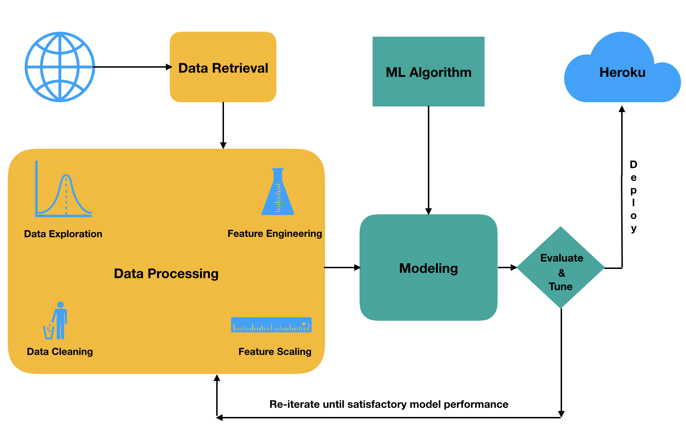
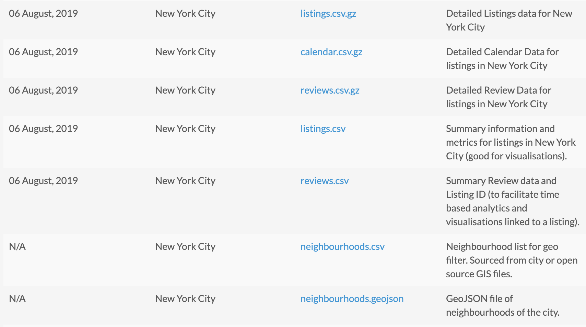

Analysis of New York City's Airbnb data
==============================
**Problem Statement:** There are about 50,000 Airbnb listings in New York City's five boroughs as of August 2019. Let's say you narrowed down your search to one or two neighborhoods based on your travel interests. The density of Airbnb listings in each neighborhood is so high that you will still end up with hundreds of listings to choose from. Instead of reading through each and every listing's description, amenities offered and various other features, **can we ask a machine learning algorithm to find patterns in the data and group similar listings into clusters?**

**Methodology:** A common process to find many solutions in Data Science is the Cross Industry Standard Process for Data Mining (CRISP-DM). It has six major phases: 
- Business Understanding - Develop a business understanding.
- Data Understanding - Develop a data understanding.
- Data Preparation - Prepare your data to be analyzed.
- Modeling - Model the data.
- Evaluation - Evaluate the results to answer your questions of interest. 
- Deploying - Deploy your model based on the results of your analysis.

I have employed this process to gather the data from Airbnb and deployed an interactive data dashboard to Heroku that will allow users to find similar airbnb listings.

**Business Understanding:** The goal of this phase is to gain clarity on what exactly we are trying to solve. Based on the problem statement, our main aim is to help users find airbnb listings quickly and more reliably. Thus, our business goals are: better user experience and increased trust in the results found. These goals translate to a series of questions/tasks: 
* ***Create a visualization showing the price distribution across neighborhoods:*** Doing so will allow users to narrow down the search based on price.
* ***Create a data dashboard that let's users pick a neighborhood and find similar airbnb listings:*** This will allow users to find similar locations with ease.
* ***Build an interactive map to show clusters of airbnb listings:*** This will allow users to pick listings not just based on similarity but also based on geographic location.

**Data Understanding:** In this phase, we need to gain an understanding of the data necessary to answer our questions and the data needed to build the applications we identified in the business understanding phase. In our case, we can acquire the data from Inside Airbnb website - which publishes Airbnb listings data for several cities. The dataset comprises of several csv files that each capture information about the listings. For my analysis, I have used the detailed listings which consists of 106 features for 48,884 airbnb listings.

Following along the CRISP-DM process, I have created a series of blog posts which explain in great detail (along with code) as to the steps taken to analyze and answer the questions of interest.

* New York City Airbnb Data Cleaning (https://shravan-kuchkula.github.io/nyc-airbnb-data-cleaning/) : Covers extraction of the dataset, cleaning the data, identifying and dealing with missing values.
* New York City Airbnb Feature Scaling (https://shravan-kuchkula.github.io/nyc-airbnb-data-preprocessing/) : Dealt with outliers, identified the correct Scaler to use.
* New York City Airbnb Feature Engineering (https://shravan-kuchkula.github.io/nyc-airbnb-feature-engineering/) : Created a binary bag-of-words representation of the amenities and other list-based columns, normalized and vectorized the text columns.
* New York City Airbnb Modeling: PCA (https://shravan-kuchkula.github.io/nyc-airbnb-pca/) : Used dimensionality reduction to reduce the features from 2100 to 50.
* New York City Airbnb Modeling: t-SNE visualization (https://shravan-kuchkula.github.io/nyc-airbnb-tsne-visual/) : Covers how we arrived at the above 3D scatter plot visualization using plotly express.
* New York City Airbnb Modeling: K-means clustering (https://shravan-kuchkula.github.io/nyc-airbnb-kmeans/): Find similar airbnb listings using K-means clustering. Used a folium map to display the clustering results for easy interactivity and to find similar listings based on location.
* Deploy the data dashboard app to Heroku: (https://shravan-kuchkula.github.io/nyc-airbnb-deploy-to-heroku/): Use Flask + Pandas + Plotly + Dash to deploy a data dashboard application to the cloud.

Project Organization
------------

    ├── LICENSE
    ├── Makefile           <- Makefile with commands like `make data` or `make train`
    ├── README.md          <- The top-level README for developers using this project.
    ├── data
    │   ├── external       <- Data from third party sources.
    │   ├── interim        <- Intermediate data that has been transformed.
    │   ├── processed      <- The final, canonical data sets for modeling.
    │   └── raw            <- The original, immutable data dump.
    │
    ├── docs               <- A default Sphinx project; see sphinx-doc.org for details
    │
    ├── models             <- Trained and serialized models, model predictions, or model summaries
    │
    ├── notebooks          <- Jupyter notebooks. Naming convention is a number (for ordering),
    │                         the creator's initials, and a short `-` delimited description, e.g.
    │                         `1.0-jqp-initial-data-exploration`.
    │
    ├── references         <- Data dictionaries, manuals, and all other explanatory materials.
    │
    ├── reports            <- Generated analysis as HTML, PDF, LaTeX, etc.
    │   └── figures        <- Generated graphics and figures to be used in reporting
    │
    ├── requirements.txt   <- The requirements file for reproducing the analysis environment, e.g.
    │                         generated with `pip freeze > requirements.txt`
    │
    ├── setup.py           <- makes project pip installable (pip install -e .) so src can be imported
    ├── src                <- Source code for use in this project.
    │   ├── __init__.py    <- Makes src a Python module
    │   │
    │   ├── data           <- Scripts to download or generate data
    │   │   └── make_dataset.py
    │   │
    │   ├── features       <- Scripts to turn raw data into features for modeling
    │   │   └── build_features.py
    │   │
    │   ├── models         <- Scripts to train models and then use trained models to make
    │   │   │                 predictions
    │   │   ├── predict_model.py
    │   │   └── train_model.py
    │   │
    │   └── visualization  <- Scripts to create exploratory and results oriented visualizations
    │       └── visualize.py
    │
    └── tox.ini            <- tox file with settings for running tox; see tox.testrun.org

--------

<small>Project based on the <a target="_blank" href="https://drivendata.github.io/cookiecutter-data-science/">cookiecutter data science project template</a>. #cookiecutterdatascience</small>

