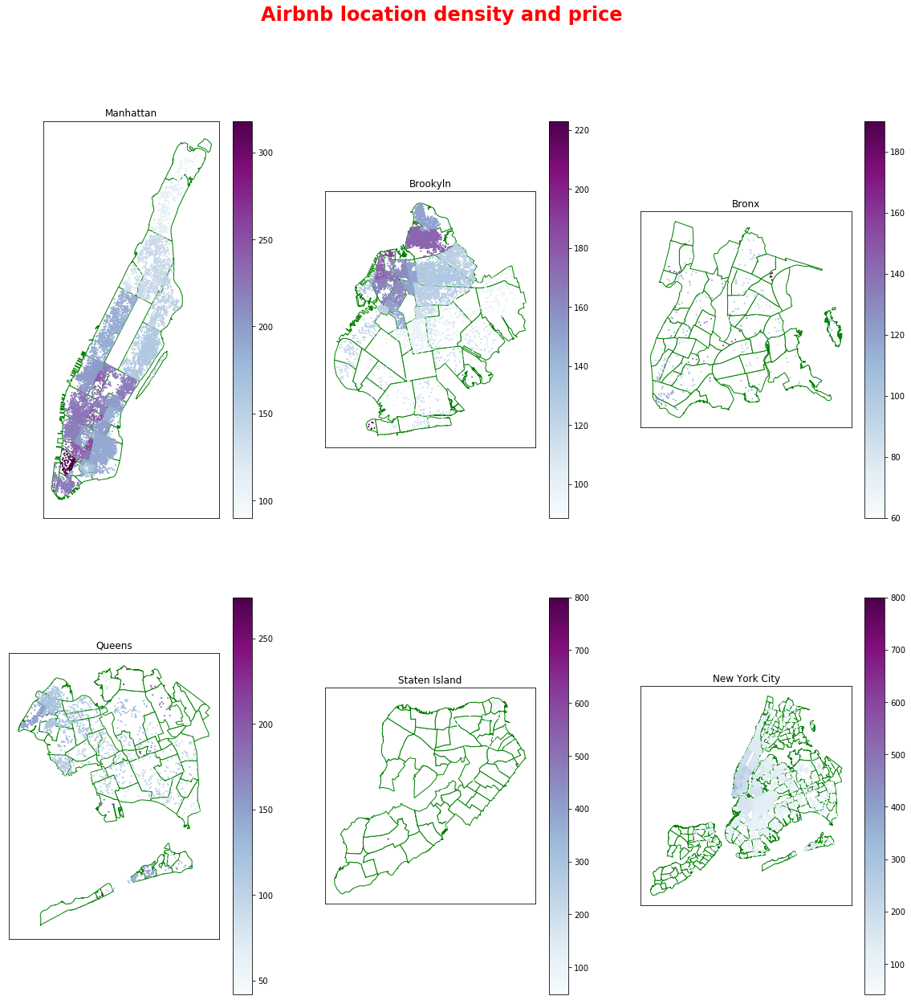
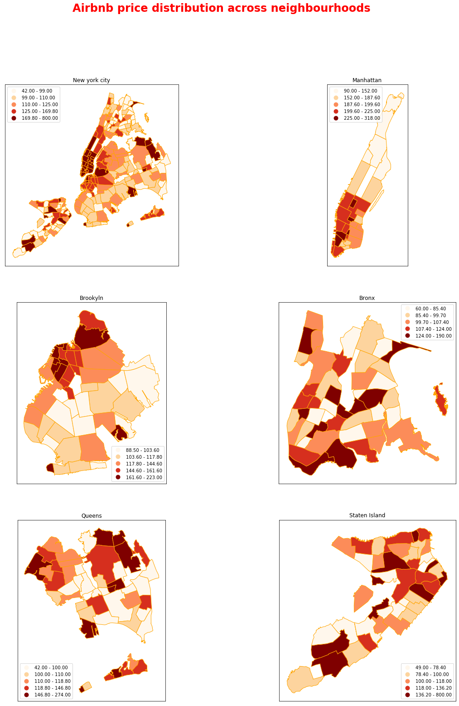

```python
import numpy as np
import pandas as pd
import matplotlib.pyplot as plt
import seaborn as sns
import bokeh
import os
import geopandas
pd.options.display.max_colwidth=200
%matplotlib inline
```

## Get the data


```python
# data directory
data_dir = "../data"
raw_data = os.path.join(data_dir, "raw")

# read in the data
df = pd.read_csv(os.path.join(raw_data, "summary_listings.csv"))
nbhoods = geopandas.read_file(os.path.join(raw_data, "neighbourhoods.geojson"))
subway = geopandas.read_file(os.path.join(raw_data, "subway.geojson"))

# use only roomtype: entire home/apt
nyc_df = df[df.room_type == 'Entire home/apt']

# construct a geodataframe
nyc_df = geopandas.GeoDataFrame(nyc_df, geometry=geopandas.points_from_xy(nyc_df.longitude, 
                                                                            nyc_df.latitude))

# filter 
cols = ['price', 'neighbourhood', 'neighbourhood_group', 'geometry']
nyc_df = nyc_df[cols]
```

Check the shape of each of the data frames. 
* **manhattan_df**: Contains the airbnb data for just Manhattan neighbourhoods with room type entire home/apt
* **manhattan_nbhoods**: Contains just the 32 Manhattan neighbourhoods.
* **subway**: Contains subway data for all 5 boroughs. So, we need to filter this to include on Manhattan subway stations. To do this we need to do some work, since the subway data is not broken down by neighbhourhoods.


```python
display(nyc_df.shape)
display(nbhoods.shape)
display(subway.shape)
```


    (25296, 4)


    (233, 3)


    (473, 6)


To obtain the neighbourhoods of subway stations, we need to perform what is known as a **spatial join**.


```python
subway.head()
```


<div>
<style scoped>
    .dataframe tbody tr th:only-of-type {
        vertical-align: middle;
    }

    .dataframe tbody tr th {
        vertical-align: top;
    }

    .dataframe thead th {
        text-align: right;
    }
</style>
<table border="1" class="dataframe">
  <thead>
    <tr style="text-align: right;">
      <th></th>
      <th>name</th>
      <th>url</th>
      <th>line</th>
      <th>objectid</th>
      <th>notes</th>
      <th>geometry</th>
    </tr>
  </thead>
  <tbody>
    <tr>
      <td>0</td>
      <td>Astor Pl</td>
      <td>http://web.mta.info/nyct/service/</td>
      <td>4-6-6 Express</td>
      <td>1</td>
      <td>4 nights, 6-all times, 6 Express-weekdays AM southbound, PM northbound</td>
      <td>POINT (-73.99106999861966 40.73005400028978)</td>
    </tr>
    <tr>
      <td>1</td>
      <td>Canal St</td>
      <td>http://web.mta.info/nyct/service/</td>
      <td>4-6-6 Express</td>
      <td>2</td>
      <td>4 nights, 6-all times, 6 Express-weekdays AM southbound, PM northbound</td>
      <td>POINT (-74.00019299927328 40.71880300107709)</td>
    </tr>
    <tr>
      <td>2</td>
      <td>50th St</td>
      <td>http://web.mta.info/nyct/service/</td>
      <td>1-2</td>
      <td>3</td>
      <td>1-all times, 2-nights</td>
      <td>POINT (-73.98384899986625 40.76172799961419)</td>
    </tr>
    <tr>
      <td>3</td>
      <td>Bergen St</td>
      <td>http://web.mta.info/nyct/service/</td>
      <td>2-3-4</td>
      <td>4</td>
      <td>4-nights, 3-all other times, 2-all times</td>
      <td>POINT (-73.97499915116808 40.68086213682956)</td>
    </tr>
    <tr>
      <td>4</td>
      <td>Pennsylvania Ave</td>
      <td>http://web.mta.info/nyct/service/</td>
      <td>3-4</td>
      <td>5</td>
      <td>4-nights, 3-all other times</td>
      <td>POINT (-73.89488591154061 40.66471445143568)</td>
    </tr>
  </tbody>
</table>
</div>


```python
nbhoods.head()
```


<div>
<style scoped>
    .dataframe tbody tr th:only-of-type {
        vertical-align: middle;
    }

    .dataframe tbody tr th {
        vertical-align: top;
    }

    .dataframe thead th {
        text-align: right;
    }
</style>
<table border="1" class="dataframe">
  <thead>
    <tr style="text-align: right;">
      <th></th>
      <th>neighbourhood</th>
      <th>neighbourhood_group</th>
      <th>geometry</th>
    </tr>
  </thead>
  <tbody>
    <tr>
      <td>0</td>
      <td>Bayswater</td>
      <td>Queens</td>
      <td>(POLYGON ((-73.76670799999999 40.614911, -73.768253 40.614878, -73.773977 40.616004, -73.77363099999999 40.616327, -73.76873500000001 40.620901, -73.767459 40.620511, -73.76697799999999 40.616919,...</td>
    </tr>
    <tr>
      <td>1</td>
      <td>Allerton</td>
      <td>Bronx</td>
      <td>(POLYGON ((-73.848597 40.87167, -73.845823 40.870239, -73.85455899999999 40.859954, -73.854665 40.859586, -73.85638899999999 40.857594, -73.868882 40.857223, -73.868318 40.857862, -73.869553999999...</td>
    </tr>
    <tr>
      <td>2</td>
      <td>City Island</td>
      <td>Bronx</td>
      <td>(POLYGON ((-73.782822 40.843919, -73.782572 40.843295, -73.782607 40.843286, -73.782785 40.843755, -73.783092 40.843685, -73.78287400000001 40.843124, -73.782901 40.843118, -73.78313300000001 40.8...</td>
    </tr>
    <tr>
      <td>3</td>
      <td>Ditmars Steinway</td>
      <td>Queens</td>
      <td>(POLYGON ((-73.90160299999999 40.76777, -73.90390600000001 40.76814, -73.904667 40.768545, -73.90560499999999 40.768717, -73.916607 40.770407, -73.91726199999999 40.770785, -73.92232300000001 40.7...</td>
    </tr>
    <tr>
      <td>4</td>
      <td>Ozone Park</td>
      <td>Queens</td>
      <td>(POLYGON ((-73.83754399999999 40.691364, -73.83108300000001 40.678151, -73.83087500000001 40.678109, -73.83094 40.67812, -73.83208 40.675261, -73.83305300000001 40.675412, -73.83375599999999 40.67...</td>
    </tr>
  </tbody>
</table>
</div>


Here, our goal is to find out whether each of the subway stations - represented by `Point()` objects, is contained within the neighbourhood - represented by `Polygon()` objects. One way to do this, is to extract the neighbourhood polygon for let's say "Battery Park City", and then, use the `within()` GeoSeries method to check whether the subway point is within the neighbourhood. This works fine, but what if we want to do this for each and every neighbourhood? 

This is where a **spatial join** comes handy. Since the neighbourhood column is part of `manhattan_nbhoods` dataframe, we need to combine/join both `manhattan_nbhoods and subway` datasets. **Joining on location rather than on a shared column is called a spatial join**. 


```python
nyc_subway = geopandas.sjoin(subway, 
                         nbhoods[['neighbourhood', 'geometry']],
                        op='within')
```


```python
nyc_subway.head()
```


<div>
<style scoped>
    .dataframe tbody tr th:only-of-type {
        vertical-align: middle;
    }

    .dataframe tbody tr th {
        vertical-align: top;
    }

    .dataframe thead th {
        text-align: right;
    }
</style>
<table border="1" class="dataframe">
  <thead>
    <tr style="text-align: right;">
      <th></th>
      <th>name</th>
      <th>url</th>
      <th>line</th>
      <th>objectid</th>
      <th>notes</th>
      <th>geometry</th>
      <th>index_right</th>
      <th>neighbourhood</th>
    </tr>
  </thead>
  <tbody>
    <tr>
      <td>0</td>
      <td>Astor Pl</td>
      <td>http://web.mta.info/nyct/service/</td>
      <td>4-6-6 Express</td>
      <td>1</td>
      <td>4 nights, 6-all times, 6 Express-weekdays AM southbound, PM northbound</td>
      <td>POINT (-73.99106999861966 40.73005400028978)</td>
      <td>87</td>
      <td>East Village</td>
    </tr>
    <tr>
      <td>145</td>
      <td>1st Ave</td>
      <td>http://web.mta.info/nyct/service/</td>
      <td>L</td>
      <td>146</td>
      <td>L-all times</td>
      <td>POINT (-73.98168087489128 40.73097497580066)</td>
      <td>87</td>
      <td>East Village</td>
    </tr>
    <tr>
      <td>370</td>
      <td>Lower East Side - 2nd Ave</td>
      <td>http://web.mta.info/nyct/service/</td>
      <td>F</td>
      <td>371</td>
      <td>F-all times</td>
      <td>POINT (-73.98993800003434 40.72340166574911)</td>
      <td>87</td>
      <td>East Village</td>
    </tr>
    <tr>
      <td>382</td>
      <td>3rd Ave</td>
      <td>http://web.mta.info/nyct/service/</td>
      <td>L</td>
      <td>383</td>
      <td>L-all times</td>
      <td>POINT (-73.98575000112093 40.73269099971662)</td>
      <td>87</td>
      <td>East Village</td>
    </tr>
    <tr>
      <td>383</td>
      <td>Union Sq - 14th St</td>
      <td>http://web.mta.info/nyct/service/</td>
      <td>L</td>
      <td>384</td>
      <td>L-all times</td>
      <td>POINT (-73.99066976901818 40.73476331217923)</td>
      <td>87</td>
      <td>East Village</td>
    </tr>
  </tbody>
</table>
</div>


```python
nyc_subway.shape
```


    (459, 8)


So, this seems right, we have **459** subway stations just in NYC. Astounding!

### Check the Coordinate Reference System of the geodataframe
Before I move further to plotting this data on the map and doing distance calculations, it is vital to ensure that all locations are expressed in a common CRS. Moreover, NYC uses a specific EPSG value of 2829 or 32117. 

Reference: https://spatialreference.org/ref/?search=New+york&srtext=Search


```python
print(nyc_df.crs)
print(nbhoods.crs)
print(subway.crs)
```

    None
    {'init': 'epsg:4326'}
    {'init': 'epsg:4326'}


The CRS attribute is missing for our airbnb dataset. We can set this easily by doing:


```python
nyc_df.crs = {'init': 'epsg:4326'}
```


```python
print(nyc_df.crs)
print(nbhoods.crs)
print(subway.crs)
```

    {'init': 'epsg:4326'}
    {'init': 'epsg:4326'}
    {'init': 'epsg:4326'}


```python
# To avoid SettingWithCopyWarning, store the result in a new dfs.
nyc_df_crs = nyc_df.to_crs(epsg=2829)
nbhoods_crs = nbhoods.to_crs(epsg=2829)
subway_crs = subway.to_crs(epsg=2829)
```


```python
print(nyc_df_crs.crs)
print(nbhoods_crs.crs)
print(subway_crs.crs)
```

    {'init': 'epsg:2829', 'no_defs': True}
    {'init': 'epsg:2829', 'no_defs': True}
    {'init': 'epsg:2829', 'no_defs': True}


### EDA: Calculate the median neighbourhood price


```python
nyc_df_crs_grouped = nyc_df_crs.groupby('neighbourhood')[['price']].median()

median_price_df = pd.merge(nyc_df_crs, nyc_df_crs_grouped, 
                           left_on='neighbourhood', right_index=True)
median_price_df.rename({'price_x': 'price', 
                        'price_y': 'median_neighbourhood_price'}, 
                       axis=1, inplace=True)

nyc_df_crs_grouped.sort_values(by='price', ascending=False)
```


<div>
<style scoped>
    .dataframe tbody tr th:only-of-type {
        vertical-align: middle;
    }

    .dataframe tbody tr th {
        vertical-align: top;
    }

    .dataframe thead th {
        text-align: right;
    }
</style>
<table border="1" class="dataframe">
  <thead>
    <tr style="text-align: right;">
      <th></th>
      <th>price</th>
    </tr>
    <tr>
      <th>neighbourhood</th>
      <th></th>
    </tr>
  </thead>
  <tbody>
    <tr>
      <td>Fort Wadsworth</td>
      <td>800.0</td>
    </tr>
    <tr>
      <td>Woodrow</td>
      <td>700.0</td>
    </tr>
    <tr>
      <td>Tribeca</td>
      <td>318.0</td>
    </tr>
    <tr>
      <td>Willowbrook</td>
      <td>299.0</td>
    </tr>
    <tr>
      <td>South Beach</td>
      <td>275.0</td>
    </tr>
    <tr>
      <td>...</td>
      <td>...</td>
    </tr>
    <tr>
      <td>Tremont</td>
      <td>68.0</td>
    </tr>
    <tr>
      <td>Soundview</td>
      <td>60.0</td>
    </tr>
    <tr>
      <td>New Dorp</td>
      <td>57.0</td>
    </tr>
    <tr>
      <td>Emerson Hill</td>
      <td>49.0</td>
    </tr>
    <tr>
      <td>Bellerose</td>
      <td>42.0</td>
    </tr>
  </tbody>
</table>
<p>215 rows × 1 columns</p>
</div>


### EDA: Plot the median neighbourhood price
Now let's overlay this on the map and color code it to visually see how the price differs by location.


```python
median_price_df.head()
```


<div>
<style scoped>
    .dataframe tbody tr th:only-of-type {
        vertical-align: middle;
    }

    .dataframe tbody tr th {
        vertical-align: top;
    }

    .dataframe thead th {
        text-align: right;
    }
</style>
<table border="1" class="dataframe">
  <thead>
    <tr style="text-align: right;">
      <th></th>
      <th>price</th>
      <th>neighbourhood</th>
      <th>neighbourhood_group</th>
      <th>geometry</th>
      <th>median_neighbourhood_price</th>
    </tr>
  </thead>
  <tbody>
    <tr>
      <td>0</td>
      <td>225</td>
      <td>Midtown</td>
      <td>Manhattan</td>
      <td>POINT (469524.6984892281 86930.35771388965)</td>
      <td>220.0</td>
    </tr>
    <tr>
      <td>229</td>
      <td>250</td>
      <td>Midtown</td>
      <td>Manhattan</td>
      <td>POINT (470677.7776314804 87551.5385397778)</td>
      <td>220.0</td>
    </tr>
    <tr>
      <td>241</td>
      <td>110</td>
      <td>Midtown</td>
      <td>Manhattan</td>
      <td>POINT (470761.827736628 87397.31060812931)</td>
      <td>220.0</td>
    </tr>
    <tr>
      <td>372</td>
      <td>139</td>
      <td>Midtown</td>
      <td>Manhattan</td>
      <td>POINT (469131.4848167276 85963.88072752411)</td>
      <td>220.0</td>
    </tr>
    <tr>
      <td>380</td>
      <td>145</td>
      <td>Midtown</td>
      <td>Manhattan</td>
      <td>POINT (470934.6724387425 87213.49589937051)</td>
      <td>220.0</td>
    </tr>
  </tbody>
</table>
</div>


```python
nbhoods_crs.head()
```


<div>
<style scoped>
    .dataframe tbody tr th:only-of-type {
        vertical-align: middle;
    }

    .dataframe tbody tr th {
        vertical-align: top;
    }

    .dataframe thead th {
        text-align: right;
    }
</style>
<table border="1" class="dataframe">
  <thead>
    <tr style="text-align: right;">
      <th></th>
      <th>neighbourhood</th>
      <th>neighbourhood_group</th>
      <th>geometry</th>
    </tr>
  </thead>
  <tbody>
    <tr>
      <td>0</td>
      <td>Bayswater</td>
      <td>Queens</td>
      <td>(POLYGON ((488351.0841146582 72091.23434415823, 488220.4427919586 72083.38265534681, 487732.0062449042 72192.94529184919, 487760.1428067125 72229.75321616138, 488158.2400119834 72750.99276728938, ...</td>
    </tr>
    <tr>
      <td>1</td>
      <td>Allerton</td>
      <td>Bronx</td>
      <td>(POLYGON ((480531.5653169187 100388.399222481, 480770.4052078897 100236.7819061674, 480069.5063578718 99071.49487716163, 480061.8426183849 99030.345140901, 479923.3648789927 98804.57727892668, 478...</td>
    </tr>
    <tr>
      <td>2</td>
      <td>City Island</td>
      <td>Bronx</td>
      <td>(POLYGON ((486175.5009672301 97481.69142680799, 486198.8040113274 97413.06250016346, 486195.883965528 97411.96848221295, 486179.2043723824 97463.57687489403, 486153.5597616356 97454.97409970534, 4...</td>
    </tr>
    <tr>
      <td>3</td>
      <td>Ditmars Steinway</td>
      <td>Queens</td>
      <td>(POLYGON ((476416.1213784565 88710.79794049644, 476220.4042462896 88745.94512906118, 476154.772902329 88788.96124791073, 476074.9873389237 88805.64435077185, 475140.3027628487 88965.02317688744, 4...</td>
    </tr>
    <tr>
      <td>4</td>
      <td>Ozone Park</td>
      <td>Queens</td>
      <td>(POLYGON ((482090.7222404248 80392.49858250844, 482682.896199414 78942.15743485499, 482700.6293241839 78938.04400384783, 482695.0951156875 78939.09344359365, 482608.650493801 78618.55249795975, 48...</td>
    </tr>
  </tbody>
</table>
</div>


Color by median_neighbourhood_price


```python
def plot_borough(borough_name, ax):
    
    if borough_name == "all":
        ax = nbhoods_crs.plot(ax=ax, 
                              figsize=(8,8), 
                              color='white', 
                              edgecolor='green')
    
        ax = median_price_df.plot(ax=ax, 
                                  markersize=1,
                                  legend=True,
                                  column='median_neighbourhood_price', 
                                  cmap='BuPu')
    else:
        
        ax = nbhoods_crs[nbhoods_crs.neighbourhood_group \
                         == borough_name].plot(ax=ax, figsize=(8,8), 
                                               color='white', 
                                               edgecolor='green'
                                              )
        ax = median_price_df[median_price_df.neighbourhood_group \
                             == borough_name].plot(ax=ax, 
                                                   markersize=1,
                                                   legend=True,
                                                   column='median_neighbourhood_price', 
                                                   cmap='BuPu'
                                                  )

    ax.axes.get_xaxis().set_visible(False)
    ax.axes.get_yaxis().set_visible(False)
    return ax
```


```python
fig, axes = plt.subplots(2, 3)
fig.set_size_inches(20, 20)
axes[0,0] = plot_borough("Manhattan", axes[0,0])
axes[0,0].set_title("Manhattan")
axes[0,1] = plot_borough("Brooklyn", axes[0,1])
axes[0,1].set_title("Brookyln")
axes[0,2] = plot_borough("Bronx", axes[0,2])
axes[0,2].set_title("Bronx")
axes[1,0] = plot_borough("Queens", axes[1,0])
axes[1,0].set_title("Queens")
axes[1,1] = plot_borough("Staten Island", axes[1,1])
axes[1,1].set_title("Staten Island")
axes[1,2] = plot_borough("all", axes[1,2])
axes[1,2].set_title("New York City")

plt.suptitle("Airbnb location density and price", 
             fontsize=24, fontweight='bold', color='red')
plt.show()
```





```python
cloropeth_price_df = pd.merge(nbhoods_crs, nyc_df_crs_grouped, 
                              left_on='neighbourhood', right_index=True)
```


```python
cloropeth_price_df.head()
```


<div>
<style scoped>
    .dataframe tbody tr th:only-of-type {
        vertical-align: middle;
    }

    .dataframe tbody tr th {
        vertical-align: top;
    }

    .dataframe thead th {
        text-align: right;
    }
</style>
<table border="1" class="dataframe">
  <thead>
    <tr style="text-align: right;">
      <th></th>
      <th>neighbourhood</th>
      <th>neighbourhood_group</th>
      <th>geometry</th>
      <th>price</th>
    </tr>
  </thead>
  <tbody>
    <tr>
      <td>0</td>
      <td>Bayswater</td>
      <td>Queens</td>
      <td>(POLYGON ((488351.0841146582 72091.23434415823, 488220.4427919586 72083.38265534681, 487732.0062449042 72192.94529184919, 487760.1428067125 72229.75321616138, 488158.2400119834 72750.99276728938, ...</td>
      <td>112.5</td>
    </tr>
    <tr>
      <td>22</td>
      <td>Bayswater</td>
      <td>Queens</td>
      <td>(POLYGON ((488494.9165870835 71946.53524287442, 488499.3946967966 71936.33953856048, 488489.0994079471 71892.76284004004, 488494.3769011298 71825.89387942158, 488506.6787823386 71809.50077693186, ...</td>
      <td>112.5</td>
    </tr>
    <tr>
      <td>1</td>
      <td>Allerton</td>
      <td>Bronx</td>
      <td>(POLYGON ((480531.5653169187 100388.399222481, 480770.4052078897 100236.7819061674, 480069.5063578718 99071.49487716163, 480061.8426183849 99030.345140901, 479923.3648789927 98804.57727892668, 478...</td>
      <td>100.0</td>
    </tr>
    <tr>
      <td>2</td>
      <td>City Island</td>
      <td>Bronx</td>
      <td>(POLYGON ((486175.5009672301 97481.69142680799, 486198.8040113274 97413.06250016346, 486195.883965528 97411.96848221295, 486179.2043723824 97463.57687489403, 486153.5597616356 97454.97409970534, 4...</td>
      <td>110.0</td>
    </tr>
    <tr>
      <td>44</td>
      <td>City Island</td>
      <td>Bronx</td>
      <td>(POLYGON ((485971.8018503094 99231.32903837867, 485962.508488977 99170.88498706152, 485938.0451526552 99146.64431320957, 485922.2536500815 99131.01928571734, 485916.4573934741 99148.62228885386, 4...</td>
      <td>110.0</td>
    </tr>
  </tbody>
</table>
</div>


```python
def plot_coloropeth_borough(borough_name, ax, legend_pos):
    
    if borough_name == "all":
        ax = cloropeth_price_df.plot(ax=ax, 
                                     figsize=(15,15), 
                                     column='price', 
                                     cmap='OrRd', 
                                     scheme='quantiles',
                                     edgecolor='orange', 
                                     legend=True, 
                                     legend_kwds = legend_pos
                                    )
    else:
        ax = cloropeth_price_df[cloropeth_price_df.neighbourhood_group \
                                == borough_name].plot(ax=ax, 
                                                      figsize=(10,10), 
                                                      column='price', 
                                                      cmap='OrRd', 
                                                      scheme='quantiles',
                                                      edgecolor='orange', 
                                                      legend=True, 
                                                      legend_kwds = legend_pos
                                                     )

    ax.axes.get_xaxis().set_visible(False)
    ax.axes.get_yaxis().set_visible(False)
    return ax
```


```python
legend_pos = {
    "all": {'loc':'upper left'},
    "Manhattan": {'loc':'upper left'},
    "Brooklyn": {'loc':'lower right'},
    "Bronx": {'loc':'upper right'},
    "Queens": {'loc':'lower left'},
    "Staten Island": {'loc':'lower right'}
}
```


```python
fig, axes = plt.subplots(3, 2)
fig.set_size_inches(20, 25)
axes[0,0] = plot_coloropeth_borough("all", axes[0,0], legend_pos["all"])
axes[0,0].set_title("New york city")
axes[0,1] = plot_coloropeth_borough("Manhattan", axes[0,1], legend_pos["Manhattan"])
axes[0,1].set_title("Manhattan")
axes[1,0] = plot_coloropeth_borough("Brooklyn", axes[1,0], legend_pos["Brooklyn"])
axes[1,0].set_title("Brookyln")
axes[1,1] = plot_coloropeth_borough("Bronx", axes[1,1], legend_pos["Bronx"])
axes[1,1].set_title("Bronx")
axes[2,0] = plot_coloropeth_borough("Queens", axes[2,0], legend_pos["Queens"])
axes[2,0].set_title("Queens")
axes[2,1] = plot_coloropeth_borough("Staten Island", axes[2,1], legend_pos["Staten Island"])
axes[2,1].set_title("Staten Island")

plt.suptitle("Airbnb price distribution across neighbourhoods", 
             fontsize=24, fontweight='bold', color='red')
plt.show()
```





## Extra
Folium is a python package, that leverages the Leaflet.js library for creating and styling interactive maps.

Time Square: (long, lat) (73.9845,40.7590)


```python
subway_crs[subway_crs.name.str.contains("Penn")]
```


<div>
<style scoped>
    .dataframe tbody tr th:only-of-type {
        vertical-align: middle;
    }

    .dataframe tbody tr th {
        vertical-align: top;
    }

    .dataframe thead th {
        text-align: right;
    }
</style>
<table border="1" class="dataframe">
  <thead>
    <tr style="text-align: right;">
      <th></th>
      <th>name</th>
      <th>url</th>
      <th>line</th>
      <th>objectid</th>
      <th>notes</th>
      <th>geometry</th>
    </tr>
  </thead>
  <tbody>
    <tr>
      <td>4</td>
      <td>Pennsylvania Ave</td>
      <td>http://web.mta.info/nyct/service/</td>
      <td>3-4</td>
      <td>5</td>
      <td>4-nights, 3-all other times</td>
      <td>POINT (477333.8792094641 77282.82739148545)</td>
    </tr>
    <tr>
      <td>357</td>
      <td>34th St - Penn Station</td>
      <td>http://web.mta.info/nyct/service/</td>
      <td>1-2-3</td>
      <td>358</td>
      <td>1,2,3-all times</td>
      <td>POINT (468919.9299578869 86551.53359587549)</td>
    </tr>
    <tr>
      <td>436</td>
      <td>34th St - Penn Station</td>
      <td>http://web.mta.info/nyct/service/</td>
      <td>A-C-E</td>
      <td>437</td>
      <td>A,E-all times, C-all times exc nights</td>
      <td>POINT (468716.5249249027 86758.27757672803)</td>
    </tr>
  </tbody>
</table>
</div>


```python
subway[subway.name.str.contains("Penn")]
```


<div>
<style scoped>
    .dataframe tbody tr th:only-of-type {
        vertical-align: middle;
    }

    .dataframe tbody tr th {
        vertical-align: top;
    }

    .dataframe thead th {
        text-align: right;
    }
</style>
<table border="1" class="dataframe">
  <thead>
    <tr style="text-align: right;">
      <th></th>
      <th>name</th>
      <th>url</th>
      <th>line</th>
      <th>objectid</th>
      <th>notes</th>
      <th>geometry</th>
    </tr>
  </thead>
  <tbody>
    <tr>
      <td>4</td>
      <td>Pennsylvania Ave</td>
      <td>http://web.mta.info/nyct/service/</td>
      <td>3-4</td>
      <td>5</td>
      <td>4-nights, 3-all other times</td>
      <td>POINT (-73.89488591154061 40.66471445143568)</td>
    </tr>
    <tr>
      <td>357</td>
      <td>34th St - Penn Station</td>
      <td>http://web.mta.info/nyct/service/</td>
      <td>1-2-3</td>
      <td>358</td>
      <td>1,2,3-all times</td>
      <td>POINT (-73.99105699913983 40.75037300003949)</td>
    </tr>
    <tr>
      <td>436</td>
      <td>34th St - Penn Station</td>
      <td>http://web.mta.info/nyct/service/</td>
      <td>A-C-E</td>
      <td>437</td>
      <td>A,E-all times, C-all times exc nights</td>
      <td>POINT (-73.99339099970578 40.75228700077589)</td>
    </tr>
  </tbody>
</table>
</div>


```python
import folium
```


```python
#m = folium.Map(location=[45.5236, -122.6750])
m = folium.Map(location=[40.7503, -73.9910], zoom_start=12)
```


```python
display(m)
```


<div style="width:100%;"><div style="position:relative;width:100%;height:0;padding-bottom:60%;"><iframe src="data:text/html;charset=utf-8;base64,PCFET0NUWVBFIGh0bWw+CjxoZWFkPiAgICAKICAgIDxtZXRhIGh0dHAtZXF1aXY9ImNvbnRlbnQtdHlwZSIgY29udGVudD0idGV4dC9odG1sOyBjaGFyc2V0PVVURi04IiAvPgogICAgCiAgICAgICAgPHNjcmlwdD4KICAgICAgICAgICAgTF9OT19UT1VDSCA9IGZhbHNlOwogICAgICAgICAgICBMX0RJU0FCTEVfM0QgPSBmYWxzZTsKICAgICAgICA8L3NjcmlwdD4KICAgIAogICAgPHNjcmlwdCBzcmM9Imh0dHBzOi8vY2RuLmpzZGVsaXZyLm5ldC9ucG0vbGVhZmxldEAxLjUuMS9kaXN0L2xlYWZsZXQuanMiPjwvc2NyaXB0PgogICAgPHNjcmlwdCBzcmM9Imh0dHBzOi8vY29kZS5qcXVlcnkuY29tL2pxdWVyeS0xLjEyLjQubWluLmpzIj48L3NjcmlwdD4KICAgIDxzY3JpcHQgc3JjPSJodHRwczovL21heGNkbi5ib290c3RyYXBjZG4uY29tL2Jvb3RzdHJhcC8zLjIuMC9qcy9ib290c3RyYXAubWluLmpzIj48L3NjcmlwdD4KICAgIDxzY3JpcHQgc3JjPSJodHRwczovL2NkbmpzLmNsb3VkZmxhcmUuY29tL2FqYXgvbGlicy9MZWFmbGV0LmF3ZXNvbWUtbWFya2Vycy8yLjAuMi9sZWFmbGV0LmF3ZXNvbWUtbWFya2Vycy5qcyI+PC9zY3JpcHQ+CiAgICA8bGluayByZWw9InN0eWxlc2hlZXQiIGhyZWY9Imh0dHBzOi8vY2RuLmpzZGVsaXZyLm5ldC9ucG0vbGVhZmxldEAxLjUuMS9kaXN0L2xlYWZsZXQuY3NzIi8+CiAgICA8bGluayByZWw9InN0eWxlc2hlZXQiIGhyZWY9Imh0dHBzOi8vbWF4Y2RuLmJvb3RzdHJhcGNkbi5jb20vYm9vdHN0cmFwLzMuMi4wL2Nzcy9ib290c3RyYXAubWluLmNzcyIvPgogICAgPGxpbmsgcmVsPSJzdHlsZXNoZWV0IiBocmVmPSJodHRwczovL21heGNkbi5ib290c3RyYXBjZG4uY29tL2Jvb3RzdHJhcC8zLjIuMC9jc3MvYm9vdHN0cmFwLXRoZW1lLm1pbi5jc3MiLz4KICAgIDxsaW5rIHJlbD0ic3R5bGVzaGVldCIgaHJlZj0iaHR0cHM6Ly9tYXhjZG4uYm9vdHN0cmFwY2RuLmNvbS9mb250LWF3ZXNvbWUvNC42LjMvY3NzL2ZvbnQtYXdlc29tZS5taW4uY3NzIi8+CiAgICA8bGluayByZWw9InN0eWxlc2hlZXQiIGhyZWY9Imh0dHBzOi8vY2RuanMuY2xvdWRmbGFyZS5jb20vYWpheC9saWJzL0xlYWZsZXQuYXdlc29tZS1tYXJrZXJzLzIuMC4yL2xlYWZsZXQuYXdlc29tZS1tYXJrZXJzLmNzcyIvPgogICAgPGxpbmsgcmVsPSJzdHlsZXNoZWV0IiBocmVmPSJodHRwczovL3Jhd2Nkbi5naXRoYWNrLmNvbS9weXRob24tdmlzdWFsaXphdGlvbi9mb2xpdW0vbWFzdGVyL2ZvbGl1bS90ZW1wbGF0ZXMvbGVhZmxldC5hd2Vzb21lLnJvdGF0ZS5jc3MiLz4KICAgIDxzdHlsZT5odG1sLCBib2R5IHt3aWR0aDogMTAwJTtoZWlnaHQ6IDEwMCU7bWFyZ2luOiAwO3BhZGRpbmc6IDA7fTwvc3R5bGU+CiAgICA8c3R5bGU+I21hcCB7cG9zaXRpb246YWJzb2x1dGU7dG9wOjA7Ym90dG9tOjA7cmlnaHQ6MDtsZWZ0OjA7fTwvc3R5bGU+CiAgICAKICAgICAgICAgICAgPG1ldGEgbmFtZT0idmlld3BvcnQiIGNvbnRlbnQ9IndpZHRoPWRldmljZS13aWR0aCwKICAgICAgICAgICAgICAgIGluaXRpYWwtc2NhbGU9MS4wLCBtYXhpbXVtLXNjYWxlPTEuMCwgdXNlci1zY2FsYWJsZT1ubyIgLz4KICAgICAgICAgICAgPHN0eWxlPgogICAgICAgICAgICAgICAgI21hcF80OWMwYjM1NTY4YjA0YTNiODZjNmY2YTU3N2U4ZTUxMiB7CiAgICAgICAgICAgICAgICAgICAgcG9zaXRpb246IHJlbGF0aXZlOwogICAgICAgICAgICAgICAgICAgIHdpZHRoOiAxMDAuMCU7CiAgICAgICAgICAgICAgICAgICAgaGVpZ2h0OiAxMDAuMCU7CiAgICAgICAgICAgICAgICAgICAgbGVmdDogMC4wJTsKICAgICAgICAgICAgICAgICAgICB0b3A6IDAuMCU7CiAgICAgICAgICAgICAgICB9CiAgICAgICAgICAgIDwvc3R5bGU+CiAgICAgICAgCjwvaGVhZD4KPGJvZHk+ICAgIAogICAgCiAgICAgICAgICAgIDxkaXYgY2xhc3M9ImZvbGl1bS1tYXAiIGlkPSJtYXBfNDljMGIzNTU2OGIwNGEzYjg2YzZmNmE1NzdlOGU1MTIiID48L2Rpdj4KICAgICAgICAKPC9ib2R5Pgo8c2NyaXB0PiAgICAKICAgIAogICAgICAgICAgICB2YXIgbWFwXzQ5YzBiMzU1NjhiMDRhM2I4NmM2ZjZhNTc3ZThlNTEyID0gTC5tYXAoCiAgICAgICAgICAgICAgICAibWFwXzQ5YzBiMzU1NjhiMDRhM2I4NmM2ZjZhNTc3ZThlNTEyIiwKICAgICAgICAgICAgICAgIHsKICAgICAgICAgICAgICAgICAgICBjZW50ZXI6IFs0MC43NTAzLCAtNzMuOTkxXSwKICAgICAgICAgICAgICAgICAgICBjcnM6IEwuQ1JTLkVQU0czODU3LAogICAgICAgICAgICAgICAgICAgIHpvb206IDEyLAogICAgICAgICAgICAgICAgICAgIHpvb21Db250cm9sOiB0cnVlLAogICAgICAgICAgICAgICAgICAgIHByZWZlckNhbnZhczogZmFsc2UsCiAgICAgICAgICAgICAgICB9CiAgICAgICAgICAgICk7CgogICAgICAgICAgICAKCiAgICAgICAgCiAgICAKICAgICAgICAgICAgdmFyIHRpbGVfbGF5ZXJfNTFiZWNiN2JjYjcyNDYzNTkxZWI4ZGEwZWFhMTMyMjYgPSBMLnRpbGVMYXllcigKICAgICAgICAgICAgICAgICJodHRwczovL3tzfS50aWxlLm9wZW5zdHJlZXRtYXAub3JnL3t6fS97eH0ve3l9LnBuZyIsCiAgICAgICAgICAgICAgICB7ImF0dHJpYnV0aW9uIjogIkRhdGEgYnkgXHUwMDI2Y29weTsgXHUwMDNjYSBocmVmPVwiaHR0cDovL29wZW5zdHJlZXRtYXAub3JnXCJcdTAwM2VPcGVuU3RyZWV0TWFwXHUwMDNjL2FcdTAwM2UsIHVuZGVyIFx1MDAzY2EgaHJlZj1cImh0dHA6Ly93d3cub3BlbnN0cmVldG1hcC5vcmcvY29weXJpZ2h0XCJcdTAwM2VPRGJMXHUwMDNjL2FcdTAwM2UuIiwgImRldGVjdFJldGluYSI6IGZhbHNlLCAibWF4TmF0aXZlWm9vbSI6IDE4LCAibWF4Wm9vbSI6IDE4LCAibWluWm9vbSI6IDAsICJub1dyYXAiOiBmYWxzZSwgIm9wYWNpdHkiOiAxLCAic3ViZG9tYWlucyI6ICJhYmMiLCAidG1zIjogZmFsc2V9CiAgICAgICAgICAgICkuYWRkVG8obWFwXzQ5YzBiMzU1NjhiMDRhM2I4NmM2ZjZhNTc3ZThlNTEyKTsKICAgICAgICAKPC9zY3JpcHQ+" style="position:absolute;width:100%;height:100%;left:0;top:0;border:none !important;" allowfullscreen webkitallowfullscreen mozallowfullscreen></iframe></div></div>


```python
nyc_subway.head()
```


<div>
<style scoped>
    .dataframe tbody tr th:only-of-type {
        vertical-align: middle;
    }

    .dataframe tbody tr th {
        vertical-align: top;
    }

    .dataframe thead th {
        text-align: right;
    }
</style>
<table border="1" class="dataframe">
  <thead>
    <tr style="text-align: right;">
      <th></th>
      <th>name</th>
      <th>url</th>
      <th>line</th>
      <th>objectid</th>
      <th>notes</th>
      <th>geometry</th>
      <th>index_right</th>
      <th>neighbourhood</th>
    </tr>
  </thead>
  <tbody>
    <tr>
      <td>0</td>
      <td>Astor Pl</td>
      <td>http://web.mta.info/nyct/service/</td>
      <td>4-6-6 Express</td>
      <td>1</td>
      <td>4 nights, 6-all times, 6 Express-weekdays AM southbound, PM northbound</td>
      <td>POINT (-73.99106999861966 40.73005400028978)</td>
      <td>87</td>
      <td>East Village</td>
    </tr>
    <tr>
      <td>145</td>
      <td>1st Ave</td>
      <td>http://web.mta.info/nyct/service/</td>
      <td>L</td>
      <td>146</td>
      <td>L-all times</td>
      <td>POINT (-73.98168087489128 40.73097497580066)</td>
      <td>87</td>
      <td>East Village</td>
    </tr>
    <tr>
      <td>370</td>
      <td>Lower East Side - 2nd Ave</td>
      <td>http://web.mta.info/nyct/service/</td>
      <td>F</td>
      <td>371</td>
      <td>F-all times</td>
      <td>POINT (-73.98993800003434 40.72340166574911)</td>
      <td>87</td>
      <td>East Village</td>
    </tr>
    <tr>
      <td>382</td>
      <td>3rd Ave</td>
      <td>http://web.mta.info/nyct/service/</td>
      <td>L</td>
      <td>383</td>
      <td>L-all times</td>
      <td>POINT (-73.98575000112093 40.73269099971662)</td>
      <td>87</td>
      <td>East Village</td>
    </tr>
    <tr>
      <td>383</td>
      <td>Union Sq - 14th St</td>
      <td>http://web.mta.info/nyct/service/</td>
      <td>L</td>
      <td>384</td>
      <td>L-all times</td>
      <td>POINT (-73.99066976901818 40.73476331217923)</td>
      <td>87</td>
      <td>East Village</td>
    </tr>
  </tbody>
</table>
</div>


```python
chelsea_subway_stations = nyc_subway[nyc_subway.neighbourhood == 'Chelsea'].geometry
```


```python
chelsea = nbhoods[nbhoods.neighbourhood == 'Chelsea'].geometry
```


```python
folium.GeoJson(chelsea).add_to(m)
display(m)
```


<div style="width:100%;"><div style="position:relative;width:100%;height:0;padding-bottom:60%;"><iframe src="data:text/html;charset=utf-8;base64,PCFET0NUWVBFIGh0bWw+CjxoZWFkPiAgICAKICAgIDxtZXRhIGh0dHAtZXF1aXY9ImNvbnRlbnQtdHlwZSIgY29udGVudD0idGV4dC9odG1sOyBjaGFyc2V0PVVURi04IiAvPgogICAgCiAgICAgICAgPHNjcmlwdD4KICAgICAgICAgICAgTF9OT19UT1VDSCA9IGZhbHNlOwogICAgICAgICAgICBMX0RJU0FCTEVfM0QgPSBmYWxzZTsKICAgICAgICA8L3NjcmlwdD4KICAgIAogICAgPHNjcmlwdCBzcmM9Imh0dHBzOi8vY2RuLmpzZGVsaXZyLm5ldC9ucG0vbGVhZmxldEAxLjUuMS9kaXN0L2xlYWZsZXQuanMiPjwvc2NyaXB0PgogICAgPHNjcmlwdCBzcmM9Imh0dHBzOi8vY29kZS5qcXVlcnkuY29tL2pxdWVyeS0xLjEyLjQubWluLmpzIj48L3NjcmlwdD4KICAgIDxzY3JpcHQgc3JjPSJodHRwczovL21heGNkbi5ib290c3RyYXBjZG4uY29tL2Jvb3RzdHJhcC8zLjIuMC9qcy9ib290c3RyYXAubWluLmpzIj48L3NjcmlwdD4KICAgIDxzY3JpcHQgc3JjPSJodHRwczovL2NkbmpzLmNsb3VkZmxhcmUuY29tL2FqYXgvbGlicy9MZWFmbGV0LmF3ZXNvbWUtbWFya2Vycy8yLjAuMi9sZWFmbGV0LmF3ZXNvbWUtbWFya2Vycy5qcyI+PC9zY3JpcHQ+CiAgICA8bGluayByZWw9InN0eWxlc2hlZXQiIGhyZWY9Imh0dHBzOi8vY2RuLmpzZGVsaXZyLm5ldC9ucG0vbGVhZmxldEAxLjUuMS9kaXN0L2xlYWZsZXQuY3NzIi8+CiAgICA8bGluayByZWw9InN0eWxlc2hlZXQiIGhyZWY9Imh0dHBzOi8vbWF4Y2RuLmJvb3RzdHJhcGNkbi5jb20vYm9vdHN0cmFwLzMuMi4wL2Nzcy9ib290c3RyYXAubWluLmNzcyIvPgogICAgPGxpbmsgcmVsPSJzdHlsZXNoZWV0IiBocmVmPSJodHRwczovL21heGNkbi5ib290c3RyYXBjZG4uY29tL2Jvb3RzdHJhcC8zLjIuMC9jc3MvYm9vdHN0cmFwLXRoZW1lLm1pbi5jc3MiLz4KICAgIDxsaW5rIHJlbD0ic3R5bGVzaGVldCIgaHJlZj0iaHR0cHM6Ly9tYXhjZG4uYm9vdHN0cmFwY2RuLmNvbS9mb250LWF3ZXNvbWUvNC42LjMvY3NzL2ZvbnQtYXdlc29tZS5taW4uY3NzIi8+CiAgICA8bGluayByZWw9InN0eWxlc2hlZXQiIGhyZWY9Imh0dHBzOi8vY2RuanMuY2xvdWRmbGFyZS5jb20vYWpheC9saWJzL0xlYWZsZXQuYXdlc29tZS1tYXJrZXJzLzIuMC4yL2xlYWZsZXQuYXdlc29tZS1tYXJrZXJzLmNzcyIvPgogICAgPGxpbmsgcmVsPSJzdHlsZXNoZWV0IiBocmVmPSJodHRwczovL3Jhd2Nkbi5naXRoYWNrLmNvbS9weXRob24tdmlzdWFsaXphdGlvbi9mb2xpdW0vbWFzdGVyL2ZvbGl1bS90ZW1wbGF0ZXMvbGVhZmxldC5hd2Vzb21lLnJvdGF0ZS5jc3MiLz4KICAgIDxzdHlsZT5odG1sLCBib2R5IHt3aWR0aDogMTAwJTtoZWlnaHQ6IDEwMCU7bWFyZ2luOiAwO3BhZGRpbmc6IDA7fTwvc3R5bGU+CiAgICA8c3R5bGU+I21hcCB7cG9zaXRpb246YWJzb2x1dGU7dG9wOjA7Ym90dG9tOjA7cmlnaHQ6MDtsZWZ0OjA7fTwvc3R5bGU+CiAgICAKICAgICAgICAgICAgPG1ldGEgbmFtZT0idmlld3BvcnQiIGNvbnRlbnQ9IndpZHRoPWRldmljZS13aWR0aCwKICAgICAgICAgICAgICAgIGluaXRpYWwtc2NhbGU9MS4wLCBtYXhpbXVtLXNjYWxlPTEuMCwgdXNlci1zY2FsYWJsZT1ubyIgLz4KICAgICAgICAgICAgPHN0eWxlPgogICAgICAgICAgICAgICAgI21hcF80OWMwYjM1NTY4YjA0YTNiODZjNmY2YTU3N2U4ZTUxMiB7CiAgICAgICAgICAgICAgICAgICAgcG9zaXRpb246IHJlbGF0aXZlOwogICAgICAgICAgICAgICAgICAgIHdpZHRoOiAxMDAuMCU7CiAgICAgICAgICAgICAgICAgICAgaGVpZ2h0OiAxMDAuMCU7CiAgICAgICAgICAgICAgICAgICAgbGVmdDogMC4wJTsKICAgICAgICAgICAgICAgICAgICB0b3A6IDAuMCU7CiAgICAgICAgICAgICAgICB9CiAgICAgICAgICAgIDwvc3R5bGU+CiAgICAgICAgCjwvaGVhZD4KPGJvZHk+ICAgIAogICAgCiAgICAgICAgICAgIDxkaXYgY2xhc3M9ImZvbGl1bS1tYXAiIGlkPSJtYXBfNDljMGIzNTU2OGIwNGEzYjg2YzZmNmE1NzdlOGU1MTIiID48L2Rpdj4KICAgICAgICAKPC9ib2R5Pgo8c2NyaXB0PiAgICAKICAgIAogICAgICAgICAgICB2YXIgbWFwXzQ5YzBiMzU1NjhiMDRhM2I4NmM2ZjZhNTc3ZThlNTEyID0gTC5tYXAoCiAgICAgICAgICAgICAgICAibWFwXzQ5YzBiMzU1NjhiMDRhM2I4NmM2ZjZhNTc3ZThlNTEyIiwKICAgICAgICAgICAgICAgIHsKICAgICAgICAgICAgICAgICAgICBjZW50ZXI6IFs0MC43NTAzLCAtNzMuOTkxXSwKICAgICAgICAgICAgICAgICAgICBjcnM6IEwuQ1JTLkVQU0czODU3LAogICAgICAgICAgICAgICAgICAgIHpvb206IDEyLAogICAgICAgICAgICAgICAgICAgIHpvb21Db250cm9sOiB0cnVlLAogICAgICAgICAgICAgICAgICAgIHByZWZlckNhbnZhczogZmFsc2UsCiAgICAgICAgICAgICAgICB9CiAgICAgICAgICAgICk7CgogICAgICAgICAgICAKCiAgICAgICAgCiAgICAKICAgICAgICAgICAgdmFyIHRpbGVfbGF5ZXJfNTFiZWNiN2JjYjcyNDYzNTkxZWI4ZGEwZWFhMTMyMjYgPSBMLnRpbGVMYXllcigKICAgICAgICAgICAgICAgICJodHRwczovL3tzfS50aWxlLm9wZW5zdHJlZXRtYXAub3JnL3t6fS97eH0ve3l9LnBuZyIsCiAgICAgICAgICAgICAgICB7ImF0dHJpYnV0aW9uIjogIkRhdGEgYnkgXHUwMDI2Y29weTsgXHUwMDNjYSBocmVmPVwiaHR0cDovL29wZW5zdHJlZXRtYXAub3JnXCJcdTAwM2VPcGVuU3RyZWV0TWFwXHUwMDNjL2FcdTAwM2UsIHVuZGVyIFx1MDAzY2EgaHJlZj1cImh0dHA6Ly93d3cub3BlbnN0cmVldG1hcC5vcmcvY29weXJpZ2h0XCJcdTAwM2VPRGJMXHUwMDNjL2FcdTAwM2UuIiwgImRldGVjdFJldGluYSI6IGZhbHNlLCAibWF4TmF0aXZlWm9vbSI6IDE4LCAibWF4Wm9vbSI6IDE4LCAibWluWm9vbSI6IDAsICJub1dyYXAiOiBmYWxzZSwgIm9wYWNpdHkiOiAxLCAic3ViZG9tYWlucyI6ICJhYmMiLCAidG1zIjogZmFsc2V9CiAgICAgICAgICAgICkuYWRkVG8obWFwXzQ5YzBiMzU1NjhiMDRhM2I4NmM2ZjZhNTc3ZThlNTEyKTsKICAgICAgICAKICAgIAogICAgICAgIGZ1bmN0aW9uIGdlb19qc29uX2IxZTM5NzFhNzUyMDQ4MzBiZmRmZGY2YjlhZGNjOTM4X29uRWFjaEZlYXR1cmUoZmVhdHVyZSwgbGF5ZXIpIHsKICAgICAgICAgICAgbGF5ZXIub24oewogICAgICAgICAgICAgICAgY2xpY2s6IGZ1bmN0aW9uKGUpIHsKICAgICAgICAgICAgICAgICAgICBtYXBfNDljMGIzNTU2OGIwNGEzYjg2YzZmNmE1NzdlOGU1MTIuZml0Qm91bmRzKGUudGFyZ2V0LmdldEJvdW5kcygpKTsKICAgICAgICAgICAgICAgIH0KICAgICAgICAgICAgfSk7CiAgICAgICAgfTsKICAgICAgICB2YXIgZ2VvX2pzb25fYjFlMzk3MWE3NTIwNDgzMGJmZGZkZjZiOWFkY2M5MzggPSBMLmdlb0pzb24obnVsbCwgewogICAgICAgICAgICAgICAgb25FYWNoRmVhdHVyZTogZ2VvX2pzb25fYjFlMzk3MWE3NTIwNDgzMGJmZGZkZjZiOWFkY2M5Mzhfb25FYWNoRmVhdHVyZSwKICAgICAgICAgICAgCiAgICAgICAgfSkuYWRkVG8obWFwXzQ5YzBiMzU1NjhiMDRhM2I4NmM2ZjZhNTc3ZThlNTEyKTsKICAgICAgICAgICAgZ2VvX2pzb25fYjFlMzk3MWE3NTIwNDgzMGJmZGZkZjZiOWFkY2M5MzguYWRkRGF0YSh7ImJib3giOiBbLTc0LjAxMjE0OCwgNDAuNzM1MjQ1LCAtNzMuOTg3OTMzLCA0MC43NTcxMThdLCAiZmVhdHVyZXMiOiBbeyJiYm94IjogWy03NC4wMTIxNDgsIDQwLjczNTI0NSwgLTczLjk4NzkzMywgNDAuNzU3MTE4XSwgImdlb21ldHJ5IjogeyJjb29yZGluYXRlcyI6IFtbW1stNzMuOTkzNDY0LCA0MC43NTIxOV0sIFstNzMuOTg3OTM3LCA0MC43NDk4NTVdLCBbLTczLjk4NzkzMywgNDAuNzQ5ODUzXSwgWy03My45ODc5NzMsIDQwLjc0OTQ2N10sIFstNzMuOTkxMzU2LCA0MC43NDQ3NjNdLCBbLTczLjk5NDIxMSwgNDAuNzQxMDEzXSwgWy03My45ODk3NzcsIDQwLjczOTE2OV0sIFstNzMuOTkwMzcxLCA0MC43MzcwOThdLCBbLTczLjk5MTcyNSwgNDAuNzM1MjQ1XSwgWy03My45OTY3OTcsIDQwLjczNzM2NF0sIFstNzQuMDA4ODEsIDQwLjc0MjM3OF0sIFstNzQuMDA5MTYxLCA0MC43NDI1MDldLCBbLTc0LjAwOTA5MiwgNDAuNzQyODg2XSwgWy03NC4wMDkyNCwgNDAuNzQyOV0sIFstNzQuMDA5NjIsIDQwLjc0Mjk1MV0sIFstNzQuMDA5NjIsIDQwLjc0Mjk1Ml0sIFstNzQuMDA5NTY4LCA0MC43NDMyNThdLCBbLTc0LjAwOTU4NSwgNDAuNzQzMjY0XSwgWy03NC4wMTIxMTksIDQwLjc0MzUxN10sIFstNzQuMDEyMTM3LCA0MC43NDM1MzJdLCBbLTc0LjAxMjE0OCwgNDAuNzQzNTU5XSwgWy03NC4wMTIwOSwgNDAuNzQzODk4XSwgWy03NC4wMTIwNjksIDQwLjc0MzkyMl0sIFstNzQuMDEyMDIxLCA0MC43NDM5NF0sIFstNzQuMDA5NTEyLCA0MC43NDM2NzZdLCBbLTc0LjAwOTQ4OSwgNDAuNzQzNjk2XSwgWy03NC4wMDk0MzgsIDQwLjc0Mzk3MV0sIFstNzQuMDA5Mzk0LCA0MC43NDM5NjldLCBbLTc0LjAwODksIDQwLjc0MzkxOF0sIFstNzQuMDA4NzMsIDQwLjc0NDg4Ml0sIFstNzQuMDA5MTA1LCA0MC43NDQ5MzFdLCBbLTc0LjAwOTYxMiwgNDAuNzQ0OTk4XSwgWy03NC4wMDk1NTgsIDQwLjc0NTI4OV0sIFstNzQuMDA5OTE3LCA0MC43NDUzMjddLCBbLTc0LjAwOTkzNCwgNDAuNzQ1MzE3XSwgWy03NC4wMDk5OTgsIDQwLjc0NDk1NV0sIFstNzQuMDA5OTg3LCA0MC43NDQ5NDRdLCBbLTc0LjAwOTg2OSwgNDAuNzQ0OTM0XSwgWy03NC4wMDk4NzIsIDQwLjc0NDkxN10sIFstNzQuMDEwMTY4LCA0MC43NDQ5NDJdLCBbLTc0LjAxMDE2NSwgNDAuNzQ0OTY0XSwgWy03NC4wMTAwNTQsIDQwLjc0NDk1NF0sIFstNzQuMDEwMDM4LCA0MC43NDQ5NjNdLCBbLTc0LjAwOTk3NCwgNDAuNzQ1MzIzXSwgWy03NC4wMDk5OTEsIDQwLjc0NTMzN10sIFstNzQuMDEwNDY5LCA0MC43NDUzODddLCBbLTc0LjAxMDQ4OCwgNDAuNzQ1Mzc2XSwgWy03NC4wMTA1NSwgNDAuNzQ1MDEzXSwgWy03NC4wMTA1MzIsIDQwLjc0NTAwM10sIFstNzQuMDEwNDE3LCA0MC43NDQ5OTRdLCBbLTc0LjAxMDQxOSwgNDAuNzQ0OTc3XSwgWy03NC4wMTA3NjQsIDQwLjc0NTAwNV0sIFstNzQuMDEwNzYyLCA0MC43NDUwMjRdLCBbLTc0LjAxMDYwNiwgNDAuNzQ1MDExXSwgWy03NC4wMTA1ODYsIDQwLjc0NTAyXSwgWy03NC4wMTA1MzEsIDQwLjc0NTM4Ml0sIFstNzQuMDEwNTQ1LCA0MC43NDUzOTJdLCBbLTc0LjAxMTEwNCwgNDAuNzQ1NDQ4XSwgWy03NC4wMTExMTYsIDQwLjc0NTQzNl0sIFstNzQuMDExMTcyLCA0MC43NDUwNzhdLCBbLTc0LjAxMTE1MywgNDAuNzQ1MDY5XSwgWy03NC4wMTEwNDMsIDQwLjc0NTA2MV0sIFstNzQuMDExMDQ1LCA0MC43NDUwNDZdLCBbLTc0LjAxMTM4OCwgNDAuNzQ1MDczXSwgWy03NC4wMTEzODYsIDQwLjc0NTA4OF0sIFstNzQuMDExMjMsIDQwLjc0NTA3Nl0sIFstNzQuMDExMTU0LCA0MC43NDU0NDZdLCBbLTc0LjAxMTE2NywgNDAuNzQ1NDZdLCBbLTc0LjAxMTc0LCA0MC43NDU1Ml0sIFstNzQuMDExNzk1LCA0MC43NDUxNTVdLCBbLTc0LjAxMTc4MywgNDAuNzQ1MTM1XSwgWy03NC4wMTE2NjksIDQwLjc0NTEyN10sIFstNzQuMDExNjcxLCA0MC43NDUxMTRdLCBbLTc0LjAxMTgzNiwgNDAuNzQ1MTI2XSwgWy03NC4wMTE3NjYsIDQwLjc0NTU3OF0sIFstNzQuMDExNzgzLCA0MC43NDU2MDJdLCBbLTc0LjAxMTcxOSwgNDAuNzQ1OTRdLCBbLTc0LjAxMTcxMSwgNDAuNzQ1OTYxXSwgWy03NC4wMTE2NzksIDQwLjc0NTk3OV0sIFstNzQuMDExNjM1LCA0MC43NDU5NzhdLCBbLTc0LjAxMDU1NSwgNDAuNzQ1ODcxXSwgWy03NC4wMTA1NTEsIDQwLjc0NTkwM10sIFstNzQuMDEwMTI4LCA0MC43NDU4NTddLCBbLTc0LjAxMDEyOCwgNDAuNzQ1ODQyXSwgWy03NC4wMDk5NDcsIDQwLjc0NTgxN10sIFstNzQuMDA5OTQ4LCA0MC43NDU4XSwgWy03NC4wMDk0NjQsIDQwLjc0NTc1XSwgWy03NC4wMDkzNjYsIDQwLjc0NjMzN10sIFstNzQuMDExNTI4LCA0MC43NDY1NzVdLCBbLTc0LjAxMTU2MiwgNDAuNzQ2NTg3XSwgWy03NC4wMTE1ODUsIDQwLjc0NjYwOV0sIFstNzQuMDExNTgyLCA0MC43NDY2MzZdLCBbLTc0LjAxMTUyNSwgNDAuNzQ2OTczXSwgWy03NC4wMTE0NzksIDQwLjc0Njk4NV0sIFstNzQuMDExNDc2LCA0MC43NDY5OTddLCBbLTc0LjAwOTI0MywgNDAuNzQ2NzYzXSwgWy03NC4wMDkxMzcsIDQwLjc0NzM2XSwgWy03NC4wMDk1NiwgNDAuNzQ3NDAzXSwgWy03NC4wMDk1NSwgNDAuNzQ3MzcxXSwgWy03NC4wMDk1NTIsIDQwLjc0NzMzOV0sIFstNzQuMDA5OTY0LCA0MC43NDczNzhdLCBbLTc0LjAwOTk1OCwgNDAuNzQ3NDEyXSwgWy03NC4wMDk5MDIsIDQwLjc0NzQzOF0sIFstNzQuMDExMzU3LCA0MC43NDc1OTJdLCBbLTc0LjAxMTM5NSwgNDAuNzQ3NjExXSwgWy03NC4wMTE0MDcsIDQwLjc0NzYzMV0sIFstNzQuMDExNDA3LCA0MC43NDc2MzFdLCBbLTc0LjAxMTM0NywgNDAuNzQ3OTc2XSwgWy03NC4wMTEzMzIsIDQwLjc0ODAwMV0sIFstNzQuMDExMzA0LCA0MC43NDgwMTVdLCBbLTc0LjAxMTI2NiwgNDAuNzQ4MDE0XSwgWy03NC4wMDkwNTgsIDQwLjc0Nzc4Nl0sIFstNzQuMDA4OTQ2LCA0MC43NDg0MTJdLCBbLTc0LjAwODk3OSwgNDAuNzQ4NDEzXSwgWy03NC4wMDg5NzksIDQwLjc0ODRdLCBbLTc0LjAwOTA3MSwgNDAuNzQ4NDFdLCBbLTc0LjAwOTA3NCwgNDAuNzQ4Mzk1XSwgWy03NC4wMDk0MTUsIDQwLjc0ODQzXSwgWy03NC4wMDk0MTYsIDQwLjc0ODQzN10sIFstNzQuMDA5NTIzLCA0MC43NDg0NDhdLCBbLTc0LjAwOTUxOSwgNDAuNzQ4NDc0XSwgWy03NC4wMTExNjcsIDQwLjc0ODY0NV0sIFstNzQuMDExMTk1LCA0MC43NDg2NTddLCBbLTc0LjAxMTIxNiwgNDAuNzQ4Njc4XSwgWy03NC4wMTEyMTYsIDQwLjc0ODY5N10sIFstNzQuMDExMTQ5LCA0MC43NDkwMjZdLCBbLTc0LjAxMTEzMywgNDAuNzQ5MDQyXSwgWy03NC4wMTExMDksIDQwLjc0OTA1XSwgWy03NC4wMTEwNzgsIDQwLjc0OTA1Ml0sIFstNzQuMDA5OTk0LCA0MC43NDg5MzddLCBbLTc0LjAwOTk0OCwgNDAuNzQ4OTMyXSwgWy03NC4wMDk1NiwgNDAuNzQ5OTM1XSwgWy03NC4wMDk3MjMsIDQwLjc0OTk3Ml0sIFstNzQuMDA5NzI4LCA0MC43NDk5NjRdLCBbLTc0LjAxMDE5MiwgNDAuNzUwMTA5XSwgWy03NC4wMTA4MDgsIDQwLjc1MDMxOV0sIFstNzQuMDEwNzU3LCA0MC43NTA0MTFdLCBbLTc0LjAwOTY4MywgNDAuNzUwMDYzXSwgWy03NC4wMDk2OTQsIDQwLjc1MDA0NF0sIFstNzQuMDA5NTQyLCA0MC43NTAwMDFdLCBbLTc0LjAwOTUxOCwgNDAuNzUwMTA3XSwgWy03NC4wMDkyNTMsIDQwLjc0OTk4NV0sIFstNzQuMDA5MTE5LCA0MC43NTAzMzJdLCBbLTc0LjAxMDY3NCwgNDAuNzUxMDcyXSwgWy03NC4wMTA1OTEsIDQwLjc1MTMyM10sIFstNzQuMDA5MDAxLCA0MC43NTA2NDhdLCBbLTc0LjAwODczNSwgNDAuNzUxMzQ5XSwgWy03NC4wMDg3MzEsIDQwLjc1MTQ2Nl0sIFstNzQuMDA4NjY3LCA0MC43NTE2MjhdLCBbLTc0LjAwODUzMywgNDAuNzUxODg0XSwgWy03NC4wMDg3NiwgNDAuNzUxOTQ4XSwgWy03NC4wMDkwNzgsIDQwLjc1MjA2OV0sIFstNzQuMDEwMjE3LCA0MC43NTI1NDhdLCBbLTc0LjAxMDEyNSwgNDAuNzUyNjY5XSwgWy03NC4wMDg5OTcsIDQwLjc1MjE4OV0sIFstNzQuMDA4OTE1LCA0MC43NTIxNjRdLCBbLTc0LjAwODU5MSwgNDAuNzUyMDI4XSwgWy03NC4wMDg1ODEsIDQwLjc1MjA0NF0sIFstNzQuMDA5MzQxLCA0MC43NTIzNTZdLCBbLTc0LjAwOTMyOCwgNDAuNzUyMzc0XSwgWy03NC4wMDg0NzksIDQwLjc1MjAxOV0sIFstNzQuMDA4NDI2LCA0MC43NTIxNThdLCBbLTc0LjAwOTk5MSwgNDAuNzUyODE2XSwgWy03NC4wMDk5MiwgNDAuNzUyOTEyXSwgWy03NC4wMDk5NzEsIDQwLjc1MjkzNF0sIFstNzQuMDA5OTE5LCA0MC43NTMwMDRdLCBbLTc0LjAwOTc4OSwgNDAuNzUyOTQ4XSwgWy03NC4wMDk4ODgsIDQwLjc1MjgxNF0sIFstNzQuMDA5ODM5LCA0MC43NTI3OTVdLCBbLTc0LjAwOTgzMSwgNDAuNzUyODAzXSwgWy03NC4wMDg4MywgNDAuNzUyMzhdLCBbLTc0LjAwODgzNiwgNDAuNzUyMzcyXSwgWy03NC4wMDg3OTIsIDQwLjc1MjM1Ml0sIFstNzQuMDA4Njg4LCA0MC43NTI0OTRdLCBbLTc0LjAwODM1NCwgNDAuNzUyMzUxXSwgWy03NC4wMDc4MTEsIDQwLjc1Mzc3OV0sIFstNzQuMDA3NzYxLCA0MC43NTM5MV0sIFstNzQuMDA3NjIsIDQwLjc1NDI4MV0sIFstNzQuMDA3NzQ1LCA0MC43NTQzMzddLCBbLTc0LjAwNzU5NywgNDAuNzU0NTNdLCBbLTc0LjAwNzQ3MiwgNDAuNzU0NDc3XSwgWy03NC4wMDcyODUsIDQwLjc1NDczNl0sIFstNzQuMDA3NDE0LCA0MC43NTQ3ODldLCBbLTc0LjAwNzI3MiwgNDAuNzU0OTg2XSwgWy03NC4wMDcxNDUsIDQwLjc1NDkzMl0sIFstNzQuMDA2Mzk0LCA0MC43NTU5NzJdLCBbLTc0LjAwNTU2NywgNDAuNzU3MTE4XSwgWy03NC4wMDQ5MjcsIDQwLjc1NzAyM10sIFstNzMuOTkzNDY0LCA0MC43NTIxOV1dXV0sICJ0eXBlIjogIk11bHRpUG9seWdvbiJ9LCAiaWQiOiAiNTIiLCAicHJvcGVydGllcyI6IHt9LCAidHlwZSI6ICJGZWF0dXJlIn1dLCAidHlwZSI6ICJGZWF0dXJlQ29sbGVjdGlvbiJ9KTsKICAgICAgICAKICAgIAogICAgICAgIGZ1bmN0aW9uIGdlb19qc29uX2ZiM2Q0MDE4Nzk1YzQ3ZTNhYmUzM2RhZGZkYWEyOTQ2X29uRWFjaEZlYXR1cmUoZmVhdHVyZSwgbGF5ZXIpIHsKICAgICAgICAgICAgbGF5ZXIub24oewogICAgICAgICAgICAgICAgY2xpY2s6IGZ1bmN0aW9uKGUpIHsKICAgICAgICAgICAgICAgICAgICBtYXBfNDljMGIzNTU2OGIwNGEzYjg2YzZmNmE1NzdlOGU1MTIuZml0Qm91bmRzKGUudGFyZ2V0LmdldEJvdW5kcygpKTsKICAgICAgICAgICAgICAgIH0KICAgICAgICAgICAgfSk7CiAgICAgICAgfTsKICAgICAgICB2YXIgZ2VvX2pzb25fZmIzZDQwMTg3OTVjNDdlM2FiZTMzZGFkZmRhYTI5NDYgPSBMLmdlb0pzb24obnVsbCwgewogICAgICAgICAgICAgICAgb25FYWNoRmVhdHVyZTogZ2VvX2pzb25fZmIzZDQwMTg3OTVjNDdlM2FiZTMzZGFkZmRhYTI5NDZfb25FYWNoRmVhdHVyZSwKICAgICAgICAgICAgCiAgICAgICAgfSkuYWRkVG8obWFwXzQ5YzBiMzU1NjhiMDRhM2I4NmM2ZjZhNTc3ZThlNTEyKTsKICAgICAgICAgICAgZ2VvX2pzb25fZmIzZDQwMTg3OTVjNDdlM2FiZTMzZGFkZmRhYTI5NDYuYWRkRGF0YSh7ImJib3giOiBbLTc0LjAxMjE0OCwgNDAuNzM1MjQ1LCAtNzMuOTg3OTMzLCA0MC43NTcxMThdLCAiZmVhdHVyZXMiOiBbeyJiYm94IjogWy03NC4wMTIxNDgsIDQwLjczNTI0NSwgLTczLjk4NzkzMywgNDAuNzU3MTE4XSwgImdlb21ldHJ5IjogeyJjb29yZGluYXRlcyI6IFtbW1stNzMuOTkzNDY0LCA0MC43NTIxOV0sIFstNzMuOTg3OTM3LCA0MC43NDk4NTVdLCBbLTczLjk4NzkzMywgNDAuNzQ5ODUzXSwgWy03My45ODc5NzMsIDQwLjc0OTQ2N10sIFstNzMuOTkxMzU2LCA0MC43NDQ3NjNdLCBbLTczLjk5NDIxMSwgNDAuNzQxMDEzXSwgWy03My45ODk3NzcsIDQwLjczOTE2OV0sIFstNzMuOTkwMzcxLCA0MC43MzcwOThdLCBbLTczLjk5MTcyNSwgNDAuNzM1MjQ1XSwgWy03My45OTY3OTcsIDQwLjczNzM2NF0sIFstNzQuMDA4ODEsIDQwLjc0MjM3OF0sIFstNzQuMDA5MTYxLCA0MC43NDI1MDldLCBbLTc0LjAwOTA5MiwgNDAuNzQyODg2XSwgWy03NC4wMDkyNCwgNDAuNzQyOV0sIFstNzQuMDA5NjIsIDQwLjc0Mjk1MV0sIFstNzQuMDA5NjIsIDQwLjc0Mjk1Ml0sIFstNzQuMDA5NTY4LCA0MC43NDMyNThdLCBbLTc0LjAwOTU4NSwgNDAuNzQzMjY0XSwgWy03NC4wMTIxMTksIDQwLjc0MzUxN10sIFstNzQuMDEyMTM3LCA0MC43NDM1MzJdLCBbLTc0LjAxMjE0OCwgNDAuNzQzNTU5XSwgWy03NC4wMTIwOSwgNDAuNzQzODk4XSwgWy03NC4wMTIwNjksIDQwLjc0MzkyMl0sIFstNzQuMDEyMDIxLCA0MC43NDM5NF0sIFstNzQuMDA5NTEyLCA0MC43NDM2NzZdLCBbLTc0LjAwOTQ4OSwgNDAuNzQzNjk2XSwgWy03NC4wMDk0MzgsIDQwLjc0Mzk3MV0sIFstNzQuMDA5Mzk0LCA0MC43NDM5NjldLCBbLTc0LjAwODksIDQwLjc0MzkxOF0sIFstNzQuMDA4NzMsIDQwLjc0NDg4Ml0sIFstNzQuMDA5MTA1LCA0MC43NDQ5MzFdLCBbLTc0LjAwOTYxMiwgNDAuNzQ0OTk4XSwgWy03NC4wMDk1NTgsIDQwLjc0NTI4OV0sIFstNzQuMDA5OTE3LCA0MC43NDUzMjddLCBbLTc0LjAwOTkzNCwgNDAuNzQ1MzE3XSwgWy03NC4wMDk5OTgsIDQwLjc0NDk1NV0sIFstNzQuMDA5OTg3LCA0MC43NDQ5NDRdLCBbLTc0LjAwOTg2OSwgNDAuNzQ0OTM0XSwgWy03NC4wMDk4NzIsIDQwLjc0NDkxN10sIFstNzQuMDEwMTY4LCA0MC43NDQ5NDJdLCBbLTc0LjAxMDE2NSwgNDAuNzQ0OTY0XSwgWy03NC4wMTAwNTQsIDQwLjc0NDk1NF0sIFstNzQuMDEwMDM4LCA0MC43NDQ5NjNdLCBbLTc0LjAwOTk3NCwgNDAuNzQ1MzIzXSwgWy03NC4wMDk5OTEsIDQwLjc0NTMzN10sIFstNzQuMDEwNDY5LCA0MC43NDUzODddLCBbLTc0LjAxMDQ4OCwgNDAuNzQ1Mzc2XSwgWy03NC4wMTA1NSwgNDAuNzQ1MDEzXSwgWy03NC4wMTA1MzIsIDQwLjc0NTAwM10sIFstNzQuMDEwNDE3LCA0MC43NDQ5OTRdLCBbLTc0LjAxMDQxOSwgNDAuNzQ0OTc3XSwgWy03NC4wMTA3NjQsIDQwLjc0NTAwNV0sIFstNzQuMDEwNzYyLCA0MC43NDUwMjRdLCBbLTc0LjAxMDYwNiwgNDAuNzQ1MDExXSwgWy03NC4wMTA1ODYsIDQwLjc0NTAyXSwgWy03NC4wMTA1MzEsIDQwLjc0NTM4Ml0sIFstNzQuMDEwNTQ1LCA0MC43NDUzOTJdLCBbLTc0LjAxMTEwNCwgNDAuNzQ1NDQ4XSwgWy03NC4wMTExMTYsIDQwLjc0NTQzNl0sIFstNzQuMDExMTcyLCA0MC43NDUwNzhdLCBbLTc0LjAxMTE1MywgNDAuNzQ1MDY5XSwgWy03NC4wMTEwNDMsIDQwLjc0NTA2MV0sIFstNzQuMDExMDQ1LCA0MC43NDUwNDZdLCBbLTc0LjAxMTM4OCwgNDAuNzQ1MDczXSwgWy03NC4wMTEzODYsIDQwLjc0NTA4OF0sIFstNzQuMDExMjMsIDQwLjc0NTA3Nl0sIFstNzQuMDExMTU0LCA0MC43NDU0NDZdLCBbLTc0LjAxMTE2NywgNDAuNzQ1NDZdLCBbLTc0LjAxMTc0LCA0MC43NDU1Ml0sIFstNzQuMDExNzk1LCA0MC43NDUxNTVdLCBbLTc0LjAxMTc4MywgNDAuNzQ1MTM1XSwgWy03NC4wMTE2NjksIDQwLjc0NTEyN10sIFstNzQuMDExNjcxLCA0MC43NDUxMTRdLCBbLTc0LjAxMTgzNiwgNDAuNzQ1MTI2XSwgWy03NC4wMTE3NjYsIDQwLjc0NTU3OF0sIFstNzQuMDExNzgzLCA0MC43NDU2MDJdLCBbLTc0LjAxMTcxOSwgNDAuNzQ1OTRdLCBbLTc0LjAxMTcxMSwgNDAuNzQ1OTYxXSwgWy03NC4wMTE2NzksIDQwLjc0NTk3OV0sIFstNzQuMDExNjM1LCA0MC43NDU5NzhdLCBbLTc0LjAxMDU1NSwgNDAuNzQ1ODcxXSwgWy03NC4wMTA1NTEsIDQwLjc0NTkwM10sIFstNzQuMDEwMTI4LCA0MC43NDU4NTddLCBbLTc0LjAxMDEyOCwgNDAuNzQ1ODQyXSwgWy03NC4wMDk5NDcsIDQwLjc0NTgxN10sIFstNzQuMDA5OTQ4LCA0MC43NDU4XSwgWy03NC4wMDk0NjQsIDQwLjc0NTc1XSwgWy03NC4wMDkzNjYsIDQwLjc0NjMzN10sIFstNzQuMDExNTI4LCA0MC43NDY1NzVdLCBbLTc0LjAxMTU2MiwgNDAuNzQ2NTg3XSwgWy03NC4wMTE1ODUsIDQwLjc0NjYwOV0sIFstNzQuMDExNTgyLCA0MC43NDY2MzZdLCBbLTc0LjAxMTUyNSwgNDAuNzQ2OTczXSwgWy03NC4wMTE0NzksIDQwLjc0Njk4NV0sIFstNzQuMDExNDc2LCA0MC43NDY5OTddLCBbLTc0LjAwOTI0MywgNDAuNzQ2NzYzXSwgWy03NC4wMDkxMzcsIDQwLjc0NzM2XSwgWy03NC4wMDk1NiwgNDAuNzQ3NDAzXSwgWy03NC4wMDk1NSwgNDAuNzQ3MzcxXSwgWy03NC4wMDk1NTIsIDQwLjc0NzMzOV0sIFstNzQuMDA5OTY0LCA0MC43NDczNzhdLCBbLTc0LjAwOTk1OCwgNDAuNzQ3NDEyXSwgWy03NC4wMDk5MDIsIDQwLjc0NzQzOF0sIFstNzQuMDExMzU3LCA0MC43NDc1OTJdLCBbLTc0LjAxMTM5NSwgNDAuNzQ3NjExXSwgWy03NC4wMTE0MDcsIDQwLjc0NzYzMV0sIFstNzQuMDExNDA3LCA0MC43NDc2MzFdLCBbLTc0LjAxMTM0NywgNDAuNzQ3OTc2XSwgWy03NC4wMTEzMzIsIDQwLjc0ODAwMV0sIFstNzQuMDExMzA0LCA0MC43NDgwMTVdLCBbLTc0LjAxMTI2NiwgNDAuNzQ4MDE0XSwgWy03NC4wMDkwNTgsIDQwLjc0Nzc4Nl0sIFstNzQuMDA4OTQ2LCA0MC43NDg0MTJdLCBbLTc0LjAwODk3OSwgNDAuNzQ4NDEzXSwgWy03NC4wMDg5NzksIDQwLjc0ODRdLCBbLTc0LjAwOTA3MSwgNDAuNzQ4NDFdLCBbLTc0LjAwOTA3NCwgNDAuNzQ4Mzk1XSwgWy03NC4wMDk0MTUsIDQwLjc0ODQzXSwgWy03NC4wMDk0MTYsIDQwLjc0ODQzN10sIFstNzQuMDA5NTIzLCA0MC43NDg0NDhdLCBbLTc0LjAwOTUxOSwgNDAuNzQ4NDc0XSwgWy03NC4wMTExNjcsIDQwLjc0ODY0NV0sIFstNzQuMDExMTk1LCA0MC43NDg2NTddLCBbLTc0LjAxMTIxNiwgNDAuNzQ4Njc4XSwgWy03NC4wMTEyMTYsIDQwLjc0ODY5N10sIFstNzQuMDExMTQ5LCA0MC43NDkwMjZdLCBbLTc0LjAxMTEzMywgNDAuNzQ5MDQyXSwgWy03NC4wMTExMDksIDQwLjc0OTA1XSwgWy03NC4wMTEwNzgsIDQwLjc0OTA1Ml0sIFstNzQuMDA5OTk0LCA0MC43NDg5MzddLCBbLTc0LjAwOTk0OCwgNDAuNzQ4OTMyXSwgWy03NC4wMDk1NiwgNDAuNzQ5OTM1XSwgWy03NC4wMDk3MjMsIDQwLjc0OTk3Ml0sIFstNzQuMDA5NzI4LCA0MC43NDk5NjRdLCBbLTc0LjAxMDE5MiwgNDAuNzUwMTA5XSwgWy03NC4wMTA4MDgsIDQwLjc1MDMxOV0sIFstNzQuMDEwNzU3LCA0MC43NTA0MTFdLCBbLTc0LjAwOTY4MywgNDAuNzUwMDYzXSwgWy03NC4wMDk2OTQsIDQwLjc1MDA0NF0sIFstNzQuMDA5NTQyLCA0MC43NTAwMDFdLCBbLTc0LjAwOTUxOCwgNDAuNzUwMTA3XSwgWy03NC4wMDkyNTMsIDQwLjc0OTk4NV0sIFstNzQuMDA5MTE5LCA0MC43NTAzMzJdLCBbLTc0LjAxMDY3NCwgNDAuNzUxMDcyXSwgWy03NC4wMTA1OTEsIDQwLjc1MTMyM10sIFstNzQuMDA5MDAxLCA0MC43NTA2NDhdLCBbLTc0LjAwODczNSwgNDAuNzUxMzQ5XSwgWy03NC4wMDg3MzEsIDQwLjc1MTQ2Nl0sIFstNzQuMDA4NjY3LCA0MC43NTE2MjhdLCBbLTc0LjAwODUzMywgNDAuNzUxODg0XSwgWy03NC4wMDg3NiwgNDAuNzUxOTQ4XSwgWy03NC4wMDkwNzgsIDQwLjc1MjA2OV0sIFstNzQuMDEwMjE3LCA0MC43NTI1NDhdLCBbLTc0LjAxMDEyNSwgNDAuNzUyNjY5XSwgWy03NC4wMDg5OTcsIDQwLjc1MjE4OV0sIFstNzQuMDA4OTE1LCA0MC43NTIxNjRdLCBbLTc0LjAwODU5MSwgNDAuNzUyMDI4XSwgWy03NC4wMDg1ODEsIDQwLjc1MjA0NF0sIFstNzQuMDA5MzQxLCA0MC43NTIzNTZdLCBbLTc0LjAwOTMyOCwgNDAuNzUyMzc0XSwgWy03NC4wMDg0NzksIDQwLjc1MjAxOV0sIFstNzQuMDA4NDI2LCA0MC43NTIxNThdLCBbLTc0LjAwOTk5MSwgNDAuNzUyODE2XSwgWy03NC4wMDk5MiwgNDAuNzUyOTEyXSwgWy03NC4wMDk5NzEsIDQwLjc1MjkzNF0sIFstNzQuMDA5OTE5LCA0MC43NTMwMDRdLCBbLTc0LjAwOTc4OSwgNDAuNzUyOTQ4XSwgWy03NC4wMDk4ODgsIDQwLjc1MjgxNF0sIFstNzQuMDA5ODM5LCA0MC43NTI3OTVdLCBbLTc0LjAwOTgzMSwgNDAuNzUyODAzXSwgWy03NC4wMDg4MywgNDAuNzUyMzhdLCBbLTc0LjAwODgzNiwgNDAuNzUyMzcyXSwgWy03NC4wMDg3OTIsIDQwLjc1MjM1Ml0sIFstNzQuMDA4Njg4LCA0MC43NTI0OTRdLCBbLTc0LjAwODM1NCwgNDAuNzUyMzUxXSwgWy03NC4wMDc4MTEsIDQwLjc1Mzc3OV0sIFstNzQuMDA3NzYxLCA0MC43NTM5MV0sIFstNzQuMDA3NjIsIDQwLjc1NDI4MV0sIFstNzQuMDA3NzQ1LCA0MC43NTQzMzddLCBbLTc0LjAwNzU5NywgNDAuNzU0NTNdLCBbLTc0LjAwNzQ3MiwgNDAuNzU0NDc3XSwgWy03NC4wMDcyODUsIDQwLjc1NDczNl0sIFstNzQuMDA3NDE0LCA0MC43NTQ3ODldLCBbLTc0LjAwNzI3MiwgNDAuNzU0OTg2XSwgWy03NC4wMDcxNDUsIDQwLjc1NDkzMl0sIFstNzQuMDA2Mzk0LCA0MC43NTU5NzJdLCBbLTc0LjAwNTU2NywgNDAuNzU3MTE4XSwgWy03NC4wMDQ5MjcsIDQwLjc1NzAyM10sIFstNzMuOTkzNDY0LCA0MC43NTIxOV1dXV0sICJ0eXBlIjogIk11bHRpUG9seWdvbiJ9LCAiaWQiOiAiNTIiLCAicHJvcGVydGllcyI6IHt9LCAidHlwZSI6ICJGZWF0dXJlIn1dLCAidHlwZSI6ICJGZWF0dXJlQ29sbGVjdGlvbiJ9KTsKICAgICAgICAKPC9zY3JpcHQ+" style="position:absolute;width:100%;height:100%;left:0;top:0;border:none !important;" allowfullscreen webkitallowfullscreen mozallowfullscreen></iframe></div></div>


```python
folium.GeoJson(chelsea_subway_stations).add_to(m)
folium.GeoJson(chelsea).add_to(m)
display(m)
```


<div style="width:100%;"><div style="position:relative;width:100%;height:0;padding-bottom:60%;"><iframe src="data:text/html;charset=utf-8;base64,PCFET0NUWVBFIGh0bWw+CjxoZWFkPiAgICAKICAgIDxtZXRhIGh0dHAtZXF1aXY9ImNvbnRlbnQtdHlwZSIgY29udGVudD0idGV4dC9odG1sOyBjaGFyc2V0PVVURi04IiAvPgogICAgCiAgICAgICAgPHNjcmlwdD4KICAgICAgICAgICAgTF9OT19UT1VDSCA9IGZhbHNlOwogICAgICAgICAgICBMX0RJU0FCTEVfM0QgPSBmYWxzZTsKICAgICAgICA8L3NjcmlwdD4KICAgIAogICAgPHNjcmlwdCBzcmM9Imh0dHBzOi8vY2RuLmpzZGVsaXZyLm5ldC9ucG0vbGVhZmxldEAxLjUuMS9kaXN0L2xlYWZsZXQuanMiPjwvc2NyaXB0PgogICAgPHNjcmlwdCBzcmM9Imh0dHBzOi8vY29kZS5qcXVlcnkuY29tL2pxdWVyeS0xLjEyLjQubWluLmpzIj48L3NjcmlwdD4KICAgIDxzY3JpcHQgc3JjPSJodHRwczovL21heGNkbi5ib290c3RyYXBjZG4uY29tL2Jvb3RzdHJhcC8zLjIuMC9qcy9ib290c3RyYXAubWluLmpzIj48L3NjcmlwdD4KICAgIDxzY3JpcHQgc3JjPSJodHRwczovL2NkbmpzLmNsb3VkZmxhcmUuY29tL2FqYXgvbGlicy9MZWFmbGV0LmF3ZXNvbWUtbWFya2Vycy8yLjAuMi9sZWFmbGV0LmF3ZXNvbWUtbWFya2Vycy5qcyI+PC9zY3JpcHQ+CiAgICA8bGluayByZWw9InN0eWxlc2hlZXQiIGhyZWY9Imh0dHBzOi8vY2RuLmpzZGVsaXZyLm5ldC9ucG0vbGVhZmxldEAxLjUuMS9kaXN0L2xlYWZsZXQuY3NzIi8+CiAgICA8bGluayByZWw9InN0eWxlc2hlZXQiIGhyZWY9Imh0dHBzOi8vbWF4Y2RuLmJvb3RzdHJhcGNkbi5jb20vYm9vdHN0cmFwLzMuMi4wL2Nzcy9ib290c3RyYXAubWluLmNzcyIvPgogICAgPGxpbmsgcmVsPSJzdHlsZXNoZWV0IiBocmVmPSJodHRwczovL21heGNkbi5ib290c3RyYXBjZG4uY29tL2Jvb3RzdHJhcC8zLjIuMC9jc3MvYm9vdHN0cmFwLXRoZW1lLm1pbi5jc3MiLz4KICAgIDxsaW5rIHJlbD0ic3R5bGVzaGVldCIgaHJlZj0iaHR0cHM6Ly9tYXhjZG4uYm9vdHN0cmFwY2RuLmNvbS9mb250LWF3ZXNvbWUvNC42LjMvY3NzL2ZvbnQtYXdlc29tZS5taW4uY3NzIi8+CiAgICA8bGluayByZWw9InN0eWxlc2hlZXQiIGhyZWY9Imh0dHBzOi8vY2RuanMuY2xvdWRmbGFyZS5jb20vYWpheC9saWJzL0xlYWZsZXQuYXdlc29tZS1tYXJrZXJzLzIuMC4yL2xlYWZsZXQuYXdlc29tZS1tYXJrZXJzLmNzcyIvPgogICAgPGxpbmsgcmVsPSJzdHlsZXNoZWV0IiBocmVmPSJodHRwczovL3Jhd2Nkbi5naXRoYWNrLmNvbS9weXRob24tdmlzdWFsaXphdGlvbi9mb2xpdW0vbWFzdGVyL2ZvbGl1bS90ZW1wbGF0ZXMvbGVhZmxldC5hd2Vzb21lLnJvdGF0ZS5jc3MiLz4KICAgIDxzdHlsZT5odG1sLCBib2R5IHt3aWR0aDogMTAwJTtoZWlnaHQ6IDEwMCU7bWFyZ2luOiAwO3BhZGRpbmc6IDA7fTwvc3R5bGU+CiAgICA8c3R5bGU+I21hcCB7cG9zaXRpb246YWJzb2x1dGU7dG9wOjA7Ym90dG9tOjA7cmlnaHQ6MDtsZWZ0OjA7fTwvc3R5bGU+CiAgICAKICAgICAgICAgICAgPG1ldGEgbmFtZT0idmlld3BvcnQiIGNvbnRlbnQ9IndpZHRoPWRldmljZS13aWR0aCwKICAgICAgICAgICAgICAgIGluaXRpYWwtc2NhbGU9MS4wLCBtYXhpbXVtLXNjYWxlPTEuMCwgdXNlci1zY2FsYWJsZT1ubyIgLz4KICAgICAgICAgICAgPHN0eWxlPgogICAgICAgICAgICAgICAgI21hcF80OWMwYjM1NTY4YjA0YTNiODZjNmY2YTU3N2U4ZTUxMiB7CiAgICAgICAgICAgICAgICAgICAgcG9zaXRpb246IHJlbGF0aXZlOwogICAgICAgICAgICAgICAgICAgIHdpZHRoOiAxMDAuMCU7CiAgICAgICAgICAgICAgICAgICAgaGVpZ2h0OiAxMDAuMCU7CiAgICAgICAgICAgICAgICAgICAgbGVmdDogMC4wJTsKICAgICAgICAgICAgICAgICAgICB0b3A6IDAuMCU7CiAgICAgICAgICAgICAgICB9CiAgICAgICAgICAgIDwvc3R5bGU+CiAgICAgICAgCjwvaGVhZD4KPGJvZHk+ICAgIAogICAgCiAgICAgICAgICAgIDxkaXYgY2xhc3M9ImZvbGl1bS1tYXAiIGlkPSJtYXBfNDljMGIzNTU2OGIwNGEzYjg2YzZmNmE1NzdlOGU1MTIiID48L2Rpdj4KICAgICAgICAKPC9ib2R5Pgo8c2NyaXB0PiAgICAKICAgIAogICAgICAgICAgICB2YXIgbWFwXzQ5YzBiMzU1NjhiMDRhM2I4NmM2ZjZhNTc3ZThlNTEyID0gTC5tYXAoCiAgICAgICAgICAgICAgICAibWFwXzQ5YzBiMzU1NjhiMDRhM2I4NmM2ZjZhNTc3ZThlNTEyIiwKICAgICAgICAgICAgICAgIHsKICAgICAgICAgICAgICAgICAgICBjZW50ZXI6IFs0MC43NTAzLCAtNzMuOTkxXSwKICAgICAgICAgICAgICAgICAgICBjcnM6IEwuQ1JTLkVQU0czODU3LAogICAgICAgICAgICAgICAgICAgIHpvb206IDEyLAogICAgICAgICAgICAgICAgICAgIHpvb21Db250cm9sOiB0cnVlLAogICAgICAgICAgICAgICAgICAgIHByZWZlckNhbnZhczogZmFsc2UsCiAgICAgICAgICAgICAgICB9CiAgICAgICAgICAgICk7CgogICAgICAgICAgICAKCiAgICAgICAgCiAgICAKICAgICAgICAgICAgdmFyIHRpbGVfbGF5ZXJfNTFiZWNiN2JjYjcyNDYzNTkxZWI4ZGEwZWFhMTMyMjYgPSBMLnRpbGVMYXllcigKICAgICAgICAgICAgICAgICJodHRwczovL3tzfS50aWxlLm9wZW5zdHJlZXRtYXAub3JnL3t6fS97eH0ve3l9LnBuZyIsCiAgICAgICAgICAgICAgICB7ImF0dHJpYnV0aW9uIjogIkRhdGEgYnkgXHUwMDI2Y29weTsgXHUwMDNjYSBocmVmPVwiaHR0cDovL29wZW5zdHJlZXRtYXAub3JnXCJcdTAwM2VPcGVuU3RyZWV0TWFwXHUwMDNjL2FcdTAwM2UsIHVuZGVyIFx1MDAzY2EgaHJlZj1cImh0dHA6Ly93d3cub3BlbnN0cmVldG1hcC5vcmcvY29weXJpZ2h0XCJcdTAwM2VPRGJMXHUwMDNjL2FcdTAwM2UuIiwgImRldGVjdFJldGluYSI6IGZhbHNlLCAibWF4TmF0aXZlWm9vbSI6IDE4LCAibWF4Wm9vbSI6IDE4LCAibWluWm9vbSI6IDAsICJub1dyYXAiOiBmYWxzZSwgIm9wYWNpdHkiOiAxLCAic3ViZG9tYWlucyI6ICJhYmMiLCAidG1zIjogZmFsc2V9CiAgICAgICAgICAgICkuYWRkVG8obWFwXzQ5YzBiMzU1NjhiMDRhM2I4NmM2ZjZhNTc3ZThlNTEyKTsKICAgICAgICAKICAgIAogICAgICAgIGZ1bmN0aW9uIGdlb19qc29uX2IxZTM5NzFhNzUyMDQ4MzBiZmRmZGY2YjlhZGNjOTM4X29uRWFjaEZlYXR1cmUoZmVhdHVyZSwgbGF5ZXIpIHsKICAgICAgICAgICAgbGF5ZXIub24oewogICAgICAgICAgICAgICAgY2xpY2s6IGZ1bmN0aW9uKGUpIHsKICAgICAgICAgICAgICAgICAgICBtYXBfNDljMGIzNTU2OGIwNGEzYjg2YzZmNmE1NzdlOGU1MTIuZml0Qm91bmRzKGUudGFyZ2V0LmdldEJvdW5kcygpKTsKICAgICAgICAgICAgICAgIH0KICAgICAgICAgICAgfSk7CiAgICAgICAgfTsKICAgICAgICB2YXIgZ2VvX2pzb25fYjFlMzk3MWE3NTIwNDgzMGJmZGZkZjZiOWFkY2M5MzggPSBMLmdlb0pzb24obnVsbCwgewogICAgICAgICAgICAgICAgb25FYWNoRmVhdHVyZTogZ2VvX2pzb25fYjFlMzk3MWE3NTIwNDgzMGJmZGZkZjZiOWFkY2M5Mzhfb25FYWNoRmVhdHVyZSwKICAgICAgICAgICAgCiAgICAgICAgfSkuYWRkVG8obWFwXzQ5YzBiMzU1NjhiMDRhM2I4NmM2ZjZhNTc3ZThlNTEyKTsKICAgICAgICAgICAgZ2VvX2pzb25fYjFlMzk3MWE3NTIwNDgzMGJmZGZkZjZiOWFkY2M5MzguYWRkRGF0YSh7ImJib3giOiBbLTc0LjAxMjE0OCwgNDAuNzM1MjQ1LCAtNzMuOTg3OTMzLCA0MC43NTcxMThdLCAiZmVhdHVyZXMiOiBbeyJiYm94IjogWy03NC4wMTIxNDgsIDQwLjczNTI0NSwgLTczLjk4NzkzMywgNDAuNzU3MTE4XSwgImdlb21ldHJ5IjogeyJjb29yZGluYXRlcyI6IFtbW1stNzMuOTkzNDY0LCA0MC43NTIxOV0sIFstNzMuOTg3OTM3LCA0MC43NDk4NTVdLCBbLTczLjk4NzkzMywgNDAuNzQ5ODUzXSwgWy03My45ODc5NzMsIDQwLjc0OTQ2N10sIFstNzMuOTkxMzU2LCA0MC43NDQ3NjNdLCBbLTczLjk5NDIxMSwgNDAuNzQxMDEzXSwgWy03My45ODk3NzcsIDQwLjczOTE2OV0sIFstNzMuOTkwMzcxLCA0MC43MzcwOThdLCBbLTczLjk5MTcyNSwgNDAuNzM1MjQ1XSwgWy03My45OTY3OTcsIDQwLjczNzM2NF0sIFstNzQuMDA4ODEsIDQwLjc0MjM3OF0sIFstNzQuMDA5MTYxLCA0MC43NDI1MDldLCBbLTc0LjAwOTA5MiwgNDAuNzQyODg2XSwgWy03NC4wMDkyNCwgNDAuNzQyOV0sIFstNzQuMDA5NjIsIDQwLjc0Mjk1MV0sIFstNzQuMDA5NjIsIDQwLjc0Mjk1Ml0sIFstNzQuMDA5NTY4LCA0MC43NDMyNThdLCBbLTc0LjAwOTU4NSwgNDAuNzQzMjY0XSwgWy03NC4wMTIxMTksIDQwLjc0MzUxN10sIFstNzQuMDEyMTM3LCA0MC43NDM1MzJdLCBbLTc0LjAxMjE0OCwgNDAuNzQzNTU5XSwgWy03NC4wMTIwOSwgNDAuNzQzODk4XSwgWy03NC4wMTIwNjksIDQwLjc0MzkyMl0sIFstNzQuMDEyMDIxLCA0MC43NDM5NF0sIFstNzQuMDA5NTEyLCA0MC43NDM2NzZdLCBbLTc0LjAwOTQ4OSwgNDAuNzQzNjk2XSwgWy03NC4wMDk0MzgsIDQwLjc0Mzk3MV0sIFstNzQuMDA5Mzk0LCA0MC43NDM5NjldLCBbLTc0LjAwODksIDQwLjc0MzkxOF0sIFstNzQuMDA4NzMsIDQwLjc0NDg4Ml0sIFstNzQuMDA5MTA1LCA0MC43NDQ5MzFdLCBbLTc0LjAwOTYxMiwgNDAuNzQ0OTk4XSwgWy03NC4wMDk1NTgsIDQwLjc0NTI4OV0sIFstNzQuMDA5OTE3LCA0MC43NDUzMjddLCBbLTc0LjAwOTkzNCwgNDAuNzQ1MzE3XSwgWy03NC4wMDk5OTgsIDQwLjc0NDk1NV0sIFstNzQuMDA5OTg3LCA0MC43NDQ5NDRdLCBbLTc0LjAwOTg2OSwgNDAuNzQ0OTM0XSwgWy03NC4wMDk4NzIsIDQwLjc0NDkxN10sIFstNzQuMDEwMTY4LCA0MC43NDQ5NDJdLCBbLTc0LjAxMDE2NSwgNDAuNzQ0OTY0XSwgWy03NC4wMTAwNTQsIDQwLjc0NDk1NF0sIFstNzQuMDEwMDM4LCA0MC43NDQ5NjNdLCBbLTc0LjAwOTk3NCwgNDAuNzQ1MzIzXSwgWy03NC4wMDk5OTEsIDQwLjc0NTMzN10sIFstNzQuMDEwNDY5LCA0MC43NDUzODddLCBbLTc0LjAxMDQ4OCwgNDAuNzQ1Mzc2XSwgWy03NC4wMTA1NSwgNDAuNzQ1MDEzXSwgWy03NC4wMTA1MzIsIDQwLjc0NTAwM10sIFstNzQuMDEwNDE3LCA0MC43NDQ5OTRdLCBbLTc0LjAxMDQxOSwgNDAuNzQ0OTc3XSwgWy03NC4wMTA3NjQsIDQwLjc0NTAwNV0sIFstNzQuMDEwNzYyLCA0MC43NDUwMjRdLCBbLTc0LjAxMDYwNiwgNDAuNzQ1MDExXSwgWy03NC4wMTA1ODYsIDQwLjc0NTAyXSwgWy03NC4wMTA1MzEsIDQwLjc0NTM4Ml0sIFstNzQuMDEwNTQ1LCA0MC43NDUzOTJdLCBbLTc0LjAxMTEwNCwgNDAuNzQ1NDQ4XSwgWy03NC4wMTExMTYsIDQwLjc0NTQzNl0sIFstNzQuMDExMTcyLCA0MC43NDUwNzhdLCBbLTc0LjAxMTE1MywgNDAuNzQ1MDY5XSwgWy03NC4wMTEwNDMsIDQwLjc0NTA2MV0sIFstNzQuMDExMDQ1LCA0MC43NDUwNDZdLCBbLTc0LjAxMTM4OCwgNDAuNzQ1MDczXSwgWy03NC4wMTEzODYsIDQwLjc0NTA4OF0sIFstNzQuMDExMjMsIDQwLjc0NTA3Nl0sIFstNzQuMDExMTU0LCA0MC43NDU0NDZdLCBbLTc0LjAxMTE2NywgNDAuNzQ1NDZdLCBbLTc0LjAxMTc0LCA0MC43NDU1Ml0sIFstNzQuMDExNzk1LCA0MC43NDUxNTVdLCBbLTc0LjAxMTc4MywgNDAuNzQ1MTM1XSwgWy03NC4wMTE2NjksIDQwLjc0NTEyN10sIFstNzQuMDExNjcxLCA0MC43NDUxMTRdLCBbLTc0LjAxMTgzNiwgNDAuNzQ1MTI2XSwgWy03NC4wMTE3NjYsIDQwLjc0NTU3OF0sIFstNzQuMDExNzgzLCA0MC43NDU2MDJdLCBbLTc0LjAxMTcxOSwgNDAuNzQ1OTRdLCBbLTc0LjAxMTcxMSwgNDAuNzQ1OTYxXSwgWy03NC4wMTE2NzksIDQwLjc0NTk3OV0sIFstNzQuMDExNjM1LCA0MC43NDU5NzhdLCBbLTc0LjAxMDU1NSwgNDAuNzQ1ODcxXSwgWy03NC4wMTA1NTEsIDQwLjc0NTkwM10sIFstNzQuMDEwMTI4LCA0MC43NDU4NTddLCBbLTc0LjAxMDEyOCwgNDAuNzQ1ODQyXSwgWy03NC4wMDk5NDcsIDQwLjc0NTgxN10sIFstNzQuMDA5OTQ4LCA0MC43NDU4XSwgWy03NC4wMDk0NjQsIDQwLjc0NTc1XSwgWy03NC4wMDkzNjYsIDQwLjc0NjMzN10sIFstNzQuMDExNTI4LCA0MC43NDY1NzVdLCBbLTc0LjAxMTU2MiwgNDAuNzQ2NTg3XSwgWy03NC4wMTE1ODUsIDQwLjc0NjYwOV0sIFstNzQuMDExNTgyLCA0MC43NDY2MzZdLCBbLTc0LjAxMTUyNSwgNDAuNzQ2OTczXSwgWy03NC4wMTE0NzksIDQwLjc0Njk4NV0sIFstNzQuMDExNDc2LCA0MC43NDY5OTddLCBbLTc0LjAwOTI0MywgNDAuNzQ2NzYzXSwgWy03NC4wMDkxMzcsIDQwLjc0NzM2XSwgWy03NC4wMDk1NiwgNDAuNzQ3NDAzXSwgWy03NC4wMDk1NSwgNDAuNzQ3MzcxXSwgWy03NC4wMDk1NTIsIDQwLjc0NzMzOV0sIFstNzQuMDA5OTY0LCA0MC43NDczNzhdLCBbLTc0LjAwOTk1OCwgNDAuNzQ3NDEyXSwgWy03NC4wMDk5MDIsIDQwLjc0NzQzOF0sIFstNzQuMDExMzU3LCA0MC43NDc1OTJdLCBbLTc0LjAxMTM5NSwgNDAuNzQ3NjExXSwgWy03NC4wMTE0MDcsIDQwLjc0NzYzMV0sIFstNzQuMDExNDA3LCA0MC43NDc2MzFdLCBbLTc0LjAxMTM0NywgNDAuNzQ3OTc2XSwgWy03NC4wMTEzMzIsIDQwLjc0ODAwMV0sIFstNzQuMDExMzA0LCA0MC43NDgwMTVdLCBbLTc0LjAxMTI2NiwgNDAuNzQ4MDE0XSwgWy03NC4wMDkwNTgsIDQwLjc0Nzc4Nl0sIFstNzQuMDA4OTQ2LCA0MC43NDg0MTJdLCBbLTc0LjAwODk3OSwgNDAuNzQ4NDEzXSwgWy03NC4wMDg5NzksIDQwLjc0ODRdLCBbLTc0LjAwOTA3MSwgNDAuNzQ4NDFdLCBbLTc0LjAwOTA3NCwgNDAuNzQ4Mzk1XSwgWy03NC4wMDk0MTUsIDQwLjc0ODQzXSwgWy03NC4wMDk0MTYsIDQwLjc0ODQzN10sIFstNzQuMDA5NTIzLCA0MC43NDg0NDhdLCBbLTc0LjAwOTUxOSwgNDAuNzQ4NDc0XSwgWy03NC4wMTExNjcsIDQwLjc0ODY0NV0sIFstNzQuMDExMTk1LCA0MC43NDg2NTddLCBbLTc0LjAxMTIxNiwgNDAuNzQ4Njc4XSwgWy03NC4wMTEyMTYsIDQwLjc0ODY5N10sIFstNzQuMDExMTQ5LCA0MC43NDkwMjZdLCBbLTc0LjAxMTEzMywgNDAuNzQ5MDQyXSwgWy03NC4wMTExMDksIDQwLjc0OTA1XSwgWy03NC4wMTEwNzgsIDQwLjc0OTA1Ml0sIFstNzQuMDA5OTk0LCA0MC43NDg5MzddLCBbLTc0LjAwOTk0OCwgNDAuNzQ4OTMyXSwgWy03NC4wMDk1NiwgNDAuNzQ5OTM1XSwgWy03NC4wMDk3MjMsIDQwLjc0OTk3Ml0sIFstNzQuMDA5NzI4LCA0MC43NDk5NjRdLCBbLTc0LjAxMDE5MiwgNDAuNzUwMTA5XSwgWy03NC4wMTA4MDgsIDQwLjc1MDMxOV0sIFstNzQuMDEwNzU3LCA0MC43NTA0MTFdLCBbLTc0LjAwOTY4MywgNDAuNzUwMDYzXSwgWy03NC4wMDk2OTQsIDQwLjc1MDA0NF0sIFstNzQuMDA5NTQyLCA0MC43NTAwMDFdLCBbLTc0LjAwOTUxOCwgNDAuNzUwMTA3XSwgWy03NC4wMDkyNTMsIDQwLjc0OTk4NV0sIFstNzQuMDA5MTE5LCA0MC43NTAzMzJdLCBbLTc0LjAxMDY3NCwgNDAuNzUxMDcyXSwgWy03NC4wMTA1OTEsIDQwLjc1MTMyM10sIFstNzQuMDA5MDAxLCA0MC43NTA2NDhdLCBbLTc0LjAwODczNSwgNDAuNzUxMzQ5XSwgWy03NC4wMDg3MzEsIDQwLjc1MTQ2Nl0sIFstNzQuMDA4NjY3LCA0MC43NTE2MjhdLCBbLTc0LjAwODUzMywgNDAuNzUxODg0XSwgWy03NC4wMDg3NiwgNDAuNzUxOTQ4XSwgWy03NC4wMDkwNzgsIDQwLjc1MjA2OV0sIFstNzQuMDEwMjE3LCA0MC43NTI1NDhdLCBbLTc0LjAxMDEyNSwgNDAuNzUyNjY5XSwgWy03NC4wMDg5OTcsIDQwLjc1MjE4OV0sIFstNzQuMDA4OTE1LCA0MC43NTIxNjRdLCBbLTc0LjAwODU5MSwgNDAuNzUyMDI4XSwgWy03NC4wMDg1ODEsIDQwLjc1MjA0NF0sIFstNzQuMDA5MzQxLCA0MC43NTIzNTZdLCBbLTc0LjAwOTMyOCwgNDAuNzUyMzc0XSwgWy03NC4wMDg0NzksIDQwLjc1MjAxOV0sIFstNzQuMDA4NDI2LCA0MC43NTIxNThdLCBbLTc0LjAwOTk5MSwgNDAuNzUyODE2XSwgWy03NC4wMDk5MiwgNDAuNzUyOTEyXSwgWy03NC4wMDk5NzEsIDQwLjc1MjkzNF0sIFstNzQuMDA5OTE5LCA0MC43NTMwMDRdLCBbLTc0LjAwOTc4OSwgNDAuNzUyOTQ4XSwgWy03NC4wMDk4ODgsIDQwLjc1MjgxNF0sIFstNzQuMDA5ODM5LCA0MC43NTI3OTVdLCBbLTc0LjAwOTgzMSwgNDAuNzUyODAzXSwgWy03NC4wMDg4MywgNDAuNzUyMzhdLCBbLTc0LjAwODgzNiwgNDAuNzUyMzcyXSwgWy03NC4wMDg3OTIsIDQwLjc1MjM1Ml0sIFstNzQuMDA4Njg4LCA0MC43NTI0OTRdLCBbLTc0LjAwODM1NCwgNDAuNzUyMzUxXSwgWy03NC4wMDc4MTEsIDQwLjc1Mzc3OV0sIFstNzQuMDA3NzYxLCA0MC43NTM5MV0sIFstNzQuMDA3NjIsIDQwLjc1NDI4MV0sIFstNzQuMDA3NzQ1LCA0MC43NTQzMzddLCBbLTc0LjAwNzU5NywgNDAuNzU0NTNdLCBbLTc0LjAwNzQ3MiwgNDAuNzU0NDc3XSwgWy03NC4wMDcyODUsIDQwLjc1NDczNl0sIFstNzQuMDA3NDE0LCA0MC43NTQ3ODldLCBbLTc0LjAwNzI3MiwgNDAuNzU0OTg2XSwgWy03NC4wMDcxNDUsIDQwLjc1NDkzMl0sIFstNzQuMDA2Mzk0LCA0MC43NTU5NzJdLCBbLTc0LjAwNTU2NywgNDAuNzU3MTE4XSwgWy03NC4wMDQ5MjcsIDQwLjc1NzAyM10sIFstNzMuOTkzNDY0LCA0MC43NTIxOV1dXV0sICJ0eXBlIjogIk11bHRpUG9seWdvbiJ9LCAiaWQiOiAiNTIiLCAicHJvcGVydGllcyI6IHt9LCAidHlwZSI6ICJGZWF0dXJlIn1dLCAidHlwZSI6ICJGZWF0dXJlQ29sbGVjdGlvbiJ9KTsKICAgICAgICAKICAgIAogICAgICAgIGZ1bmN0aW9uIGdlb19qc29uX2ZiM2Q0MDE4Nzk1YzQ3ZTNhYmUzM2RhZGZkYWEyOTQ2X29uRWFjaEZlYXR1cmUoZmVhdHVyZSwgbGF5ZXIpIHsKICAgICAgICAgICAgbGF5ZXIub24oewogICAgICAgICAgICAgICAgY2xpY2s6IGZ1bmN0aW9uKGUpIHsKICAgICAgICAgICAgICAgICAgICBtYXBfNDljMGIzNTU2OGIwNGEzYjg2YzZmNmE1NzdlOGU1MTIuZml0Qm91bmRzKGUudGFyZ2V0LmdldEJvdW5kcygpKTsKICAgICAgICAgICAgICAgIH0KICAgICAgICAgICAgfSk7CiAgICAgICAgfTsKICAgICAgICB2YXIgZ2VvX2pzb25fZmIzZDQwMTg3OTVjNDdlM2FiZTMzZGFkZmRhYTI5NDYgPSBMLmdlb0pzb24obnVsbCwgewogICAgICAgICAgICAgICAgb25FYWNoRmVhdHVyZTogZ2VvX2pzb25fZmIzZDQwMTg3OTVjNDdlM2FiZTMzZGFkZmRhYTI5NDZfb25FYWNoRmVhdHVyZSwKICAgICAgICAgICAgCiAgICAgICAgfSkuYWRkVG8obWFwXzQ5YzBiMzU1NjhiMDRhM2I4NmM2ZjZhNTc3ZThlNTEyKTsKICAgICAgICAgICAgZ2VvX2pzb25fZmIzZDQwMTg3OTVjNDdlM2FiZTMzZGFkZmRhYTI5NDYuYWRkRGF0YSh7ImJib3giOiBbLTc0LjAxMjE0OCwgNDAuNzM1MjQ1LCAtNzMuOTg3OTMzLCA0MC43NTcxMThdLCAiZmVhdHVyZXMiOiBbeyJiYm94IjogWy03NC4wMTIxNDgsIDQwLjczNTI0NSwgLTczLjk4NzkzMywgNDAuNzU3MTE4XSwgImdlb21ldHJ5IjogeyJjb29yZGluYXRlcyI6IFtbW1stNzMuOTkzNDY0LCA0MC43NTIxOV0sIFstNzMuOTg3OTM3LCA0MC43NDk4NTVdLCBbLTczLjk4NzkzMywgNDAuNzQ5ODUzXSwgWy03My45ODc5NzMsIDQwLjc0OTQ2N10sIFstNzMuOTkxMzU2LCA0MC43NDQ3NjNdLCBbLTczLjk5NDIxMSwgNDAuNzQxMDEzXSwgWy03My45ODk3NzcsIDQwLjczOTE2OV0sIFstNzMuOTkwMzcxLCA0MC43MzcwOThdLCBbLTczLjk5MTcyNSwgNDAuNzM1MjQ1XSwgWy03My45OTY3OTcsIDQwLjczNzM2NF0sIFstNzQuMDA4ODEsIDQwLjc0MjM3OF0sIFstNzQuMDA5MTYxLCA0MC43NDI1MDldLCBbLTc0LjAwOTA5MiwgNDAuNzQyODg2XSwgWy03NC4wMDkyNCwgNDAuNzQyOV0sIFstNzQuMDA5NjIsIDQwLjc0Mjk1MV0sIFstNzQuMDA5NjIsIDQwLjc0Mjk1Ml0sIFstNzQuMDA5NTY4LCA0MC43NDMyNThdLCBbLTc0LjAwOTU4NSwgNDAuNzQzMjY0XSwgWy03NC4wMTIxMTksIDQwLjc0MzUxN10sIFstNzQuMDEyMTM3LCA0MC43NDM1MzJdLCBbLTc0LjAxMjE0OCwgNDAuNzQzNTU5XSwgWy03NC4wMTIwOSwgNDAuNzQzODk4XSwgWy03NC4wMTIwNjksIDQwLjc0MzkyMl0sIFstNzQuMDEyMDIxLCA0MC43NDM5NF0sIFstNzQuMDA5NTEyLCA0MC43NDM2NzZdLCBbLTc0LjAwOTQ4OSwgNDAuNzQzNjk2XSwgWy03NC4wMDk0MzgsIDQwLjc0Mzk3MV0sIFstNzQuMDA5Mzk0LCA0MC43NDM5NjldLCBbLTc0LjAwODksIDQwLjc0MzkxOF0sIFstNzQuMDA4NzMsIDQwLjc0NDg4Ml0sIFstNzQuMDA5MTA1LCA0MC43NDQ5MzFdLCBbLTc0LjAwOTYxMiwgNDAuNzQ0OTk4XSwgWy03NC4wMDk1NTgsIDQwLjc0NTI4OV0sIFstNzQuMDA5OTE3LCA0MC43NDUzMjddLCBbLTc0LjAwOTkzNCwgNDAuNzQ1MzE3XSwgWy03NC4wMDk5OTgsIDQwLjc0NDk1NV0sIFstNzQuMDA5OTg3LCA0MC43NDQ5NDRdLCBbLTc0LjAwOTg2OSwgNDAuNzQ0OTM0XSwgWy03NC4wMDk4NzIsIDQwLjc0NDkxN10sIFstNzQuMDEwMTY4LCA0MC43NDQ5NDJdLCBbLTc0LjAxMDE2NSwgNDAuNzQ0OTY0XSwgWy03NC4wMTAwNTQsIDQwLjc0NDk1NF0sIFstNzQuMDEwMDM4LCA0MC43NDQ5NjNdLCBbLTc0LjAwOTk3NCwgNDAuNzQ1MzIzXSwgWy03NC4wMDk5OTEsIDQwLjc0NTMzN10sIFstNzQuMDEwNDY5LCA0MC43NDUzODddLCBbLTc0LjAxMDQ4OCwgNDAuNzQ1Mzc2XSwgWy03NC4wMTA1NSwgNDAuNzQ1MDEzXSwgWy03NC4wMTA1MzIsIDQwLjc0NTAwM10sIFstNzQuMDEwNDE3LCA0MC43NDQ5OTRdLCBbLTc0LjAxMDQxOSwgNDAuNzQ0OTc3XSwgWy03NC4wMTA3NjQsIDQwLjc0NTAwNV0sIFstNzQuMDEwNzYyLCA0MC43NDUwMjRdLCBbLTc0LjAxMDYwNiwgNDAuNzQ1MDExXSwgWy03NC4wMTA1ODYsIDQwLjc0NTAyXSwgWy03NC4wMTA1MzEsIDQwLjc0NTM4Ml0sIFstNzQuMDEwNTQ1LCA0MC43NDUzOTJdLCBbLTc0LjAxMTEwNCwgNDAuNzQ1NDQ4XSwgWy03NC4wMTExMTYsIDQwLjc0NTQzNl0sIFstNzQuMDExMTcyLCA0MC43NDUwNzhdLCBbLTc0LjAxMTE1MywgNDAuNzQ1MDY5XSwgWy03NC4wMTEwNDMsIDQwLjc0NTA2MV0sIFstNzQuMDExMDQ1LCA0MC43NDUwNDZdLCBbLTc0LjAxMTM4OCwgNDAuNzQ1MDczXSwgWy03NC4wMTEzODYsIDQwLjc0NTA4OF0sIFstNzQuMDExMjMsIDQwLjc0NTA3Nl0sIFstNzQuMDExMTU0LCA0MC43NDU0NDZdLCBbLTc0LjAxMTE2NywgNDAuNzQ1NDZdLCBbLTc0LjAxMTc0LCA0MC43NDU1Ml0sIFstNzQuMDExNzk1LCA0MC43NDUxNTVdLCBbLTc0LjAxMTc4MywgNDAuNzQ1MTM1XSwgWy03NC4wMTE2NjksIDQwLjc0NTEyN10sIFstNzQuMDExNjcxLCA0MC43NDUxMTRdLCBbLTc0LjAxMTgzNiwgNDAuNzQ1MTI2XSwgWy03NC4wMTE3NjYsIDQwLjc0NTU3OF0sIFstNzQuMDExNzgzLCA0MC43NDU2MDJdLCBbLTc0LjAxMTcxOSwgNDAuNzQ1OTRdLCBbLTc0LjAxMTcxMSwgNDAuNzQ1OTYxXSwgWy03NC4wMTE2NzksIDQwLjc0NTk3OV0sIFstNzQuMDExNjM1LCA0MC43NDU5NzhdLCBbLTc0LjAxMDU1NSwgNDAuNzQ1ODcxXSwgWy03NC4wMTA1NTEsIDQwLjc0NTkwM10sIFstNzQuMDEwMTI4LCA0MC43NDU4NTddLCBbLTc0LjAxMDEyOCwgNDAuNzQ1ODQyXSwgWy03NC4wMDk5NDcsIDQwLjc0NTgxN10sIFstNzQuMDA5OTQ4LCA0MC43NDU4XSwgWy03NC4wMDk0NjQsIDQwLjc0NTc1XSwgWy03NC4wMDkzNjYsIDQwLjc0NjMzN10sIFstNzQuMDExNTI4LCA0MC43NDY1NzVdLCBbLTc0LjAxMTU2MiwgNDAuNzQ2NTg3XSwgWy03NC4wMTE1ODUsIDQwLjc0NjYwOV0sIFstNzQuMDExNTgyLCA0MC43NDY2MzZdLCBbLTc0LjAxMTUyNSwgNDAuNzQ2OTczXSwgWy03NC4wMTE0NzksIDQwLjc0Njk4NV0sIFstNzQuMDExNDc2LCA0MC43NDY5OTddLCBbLTc0LjAwOTI0MywgNDAuNzQ2NzYzXSwgWy03NC4wMDkxMzcsIDQwLjc0NzM2XSwgWy03NC4wMDk1NiwgNDAuNzQ3NDAzXSwgWy03NC4wMDk1NSwgNDAuNzQ3MzcxXSwgWy03NC4wMDk1NTIsIDQwLjc0NzMzOV0sIFstNzQuMDA5OTY0LCA0MC43NDczNzhdLCBbLTc0LjAwOTk1OCwgNDAuNzQ3NDEyXSwgWy03NC4wMDk5MDIsIDQwLjc0NzQzOF0sIFstNzQuMDExMzU3LCA0MC43NDc1OTJdLCBbLTc0LjAxMTM5NSwgNDAuNzQ3NjExXSwgWy03NC4wMTE0MDcsIDQwLjc0NzYzMV0sIFstNzQuMDExNDA3LCA0MC43NDc2MzFdLCBbLTc0LjAxMTM0NywgNDAuNzQ3OTc2XSwgWy03NC4wMTEzMzIsIDQwLjc0ODAwMV0sIFstNzQuMDExMzA0LCA0MC43NDgwMTVdLCBbLTc0LjAxMTI2NiwgNDAuNzQ4MDE0XSwgWy03NC4wMDkwNTgsIDQwLjc0Nzc4Nl0sIFstNzQuMDA4OTQ2LCA0MC43NDg0MTJdLCBbLTc0LjAwODk3OSwgNDAuNzQ4NDEzXSwgWy03NC4wMDg5NzksIDQwLjc0ODRdLCBbLTc0LjAwOTA3MSwgNDAuNzQ4NDFdLCBbLTc0LjAwOTA3NCwgNDAuNzQ4Mzk1XSwgWy03NC4wMDk0MTUsIDQwLjc0ODQzXSwgWy03NC4wMDk0MTYsIDQwLjc0ODQzN10sIFstNzQuMDA5NTIzLCA0MC43NDg0NDhdLCBbLTc0LjAwOTUxOSwgNDAuNzQ4NDc0XSwgWy03NC4wMTExNjcsIDQwLjc0ODY0NV0sIFstNzQuMDExMTk1LCA0MC43NDg2NTddLCBbLTc0LjAxMTIxNiwgNDAuNzQ4Njc4XSwgWy03NC4wMTEyMTYsIDQwLjc0ODY5N10sIFstNzQuMDExMTQ5LCA0MC43NDkwMjZdLCBbLTc0LjAxMTEzMywgNDAuNzQ5MDQyXSwgWy03NC4wMTExMDksIDQwLjc0OTA1XSwgWy03NC4wMTEwNzgsIDQwLjc0OTA1Ml0sIFstNzQuMDA5OTk0LCA0MC43NDg5MzddLCBbLTc0LjAwOTk0OCwgNDAuNzQ4OTMyXSwgWy03NC4wMDk1NiwgNDAuNzQ5OTM1XSwgWy03NC4wMDk3MjMsIDQwLjc0OTk3Ml0sIFstNzQuMDA5NzI4LCA0MC43NDk5NjRdLCBbLTc0LjAxMDE5MiwgNDAuNzUwMTA5XSwgWy03NC4wMTA4MDgsIDQwLjc1MDMxOV0sIFstNzQuMDEwNzU3LCA0MC43NTA0MTFdLCBbLTc0LjAwOTY4MywgNDAuNzUwMDYzXSwgWy03NC4wMDk2OTQsIDQwLjc1MDA0NF0sIFstNzQuMDA5NTQyLCA0MC43NTAwMDFdLCBbLTc0LjAwOTUxOCwgNDAuNzUwMTA3XSwgWy03NC4wMDkyNTMsIDQwLjc0OTk4NV0sIFstNzQuMDA5MTE5LCA0MC43NTAzMzJdLCBbLTc0LjAxMDY3NCwgNDAuNzUxMDcyXSwgWy03NC4wMTA1OTEsIDQwLjc1MTMyM10sIFstNzQuMDA5MDAxLCA0MC43NTA2NDhdLCBbLTc0LjAwODczNSwgNDAuNzUxMzQ5XSwgWy03NC4wMDg3MzEsIDQwLjc1MTQ2Nl0sIFstNzQuMDA4NjY3LCA0MC43NTE2MjhdLCBbLTc0LjAwODUzMywgNDAuNzUxODg0XSwgWy03NC4wMDg3NiwgNDAuNzUxOTQ4XSwgWy03NC4wMDkwNzgsIDQwLjc1MjA2OV0sIFstNzQuMDEwMjE3LCA0MC43NTI1NDhdLCBbLTc0LjAxMDEyNSwgNDAuNzUyNjY5XSwgWy03NC4wMDg5OTcsIDQwLjc1MjE4OV0sIFstNzQuMDA4OTE1LCA0MC43NTIxNjRdLCBbLTc0LjAwODU5MSwgNDAuNzUyMDI4XSwgWy03NC4wMDg1ODEsIDQwLjc1MjA0NF0sIFstNzQuMDA5MzQxLCA0MC43NTIzNTZdLCBbLTc0LjAwOTMyOCwgNDAuNzUyMzc0XSwgWy03NC4wMDg0NzksIDQwLjc1MjAxOV0sIFstNzQuMDA4NDI2LCA0MC43NTIxNThdLCBbLTc0LjAwOTk5MSwgNDAuNzUyODE2XSwgWy03NC4wMDk5MiwgNDAuNzUyOTEyXSwgWy03NC4wMDk5NzEsIDQwLjc1MjkzNF0sIFstNzQuMDA5OTE5LCA0MC43NTMwMDRdLCBbLTc0LjAwOTc4OSwgNDAuNzUyOTQ4XSwgWy03NC4wMDk4ODgsIDQwLjc1MjgxNF0sIFstNzQuMDA5ODM5LCA0MC43NTI3OTVdLCBbLTc0LjAwOTgzMSwgNDAuNzUyODAzXSwgWy03NC4wMDg4MywgNDAuNzUyMzhdLCBbLTc0LjAwODgzNiwgNDAuNzUyMzcyXSwgWy03NC4wMDg3OTIsIDQwLjc1MjM1Ml0sIFstNzQuMDA4Njg4LCA0MC43NTI0OTRdLCBbLTc0LjAwODM1NCwgNDAuNzUyMzUxXSwgWy03NC4wMDc4MTEsIDQwLjc1Mzc3OV0sIFstNzQuMDA3NzYxLCA0MC43NTM5MV0sIFstNzQuMDA3NjIsIDQwLjc1NDI4MV0sIFstNzQuMDA3NzQ1LCA0MC43NTQzMzddLCBbLTc0LjAwNzU5NywgNDAuNzU0NTNdLCBbLTc0LjAwNzQ3MiwgNDAuNzU0NDc3XSwgWy03NC4wMDcyODUsIDQwLjc1NDczNl0sIFstNzQuMDA3NDE0LCA0MC43NTQ3ODldLCBbLTc0LjAwNzI3MiwgNDAuNzU0OTg2XSwgWy03NC4wMDcxNDUsIDQwLjc1NDkzMl0sIFstNzQuMDA2Mzk0LCA0MC43NTU5NzJdLCBbLTc0LjAwNTU2NywgNDAuNzU3MTE4XSwgWy03NC4wMDQ5MjcsIDQwLjc1NzAyM10sIFstNzMuOTkzNDY0LCA0MC43NTIxOV1dXV0sICJ0eXBlIjogIk11bHRpUG9seWdvbiJ9LCAiaWQiOiAiNTIiLCAicHJvcGVydGllcyI6IHt9LCAidHlwZSI6ICJGZWF0dXJlIn1dLCAidHlwZSI6ICJGZWF0dXJlQ29sbGVjdGlvbiJ9KTsKICAgICAgICAKICAgIAogICAgICAgIGZ1bmN0aW9uIGdlb19qc29uX2M2ODZkNjVhOGM5MzQ2YWE5YTU1ZWZkMGE5OGRiNzk0X29uRWFjaEZlYXR1cmUoZmVhdHVyZSwgbGF5ZXIpIHsKICAgICAgICAgICAgbGF5ZXIub24oewogICAgICAgICAgICAgICAgY2xpY2s6IGZ1bmN0aW9uKGUpIHsKICAgICAgICAgICAgICAgICAgICBtYXBfNDljMGIzNTU2OGIwNGEzYjg2YzZmNmE1NzdlOGU1MTIuZml0Qm91bmRzKGUudGFyZ2V0LmdldEJvdW5kcygpKTsKICAgICAgICAgICAgICAgIH0KICAgICAgICAgICAgfSk7CiAgICAgICAgfTsKICAgICAgICB2YXIgZ2VvX2pzb25fYzY4NmQ2NWE4YzkzNDZhYTlhNTVlZmQwYTk4ZGI3OTQgPSBMLmdlb0pzb24obnVsbCwgewogICAgICAgICAgICAgICAgb25FYWNoRmVhdHVyZTogZ2VvX2pzb25fYzY4NmQ2NWE4YzkzNDZhYTlhNTVlZmQwYTk4ZGI3OTRfb25FYWNoRmVhdHVyZSwKICAgICAgICAgICAgCiAgICAgICAgfSkuYWRkVG8obWFwXzQ5YzBiMzU1NjhiMDRhM2I4NmM2ZjZhNTc3ZThlNTEyKTsKICAgICAgICAgICAgZ2VvX2pzb25fYzY4NmQ2NWE4YzkzNDZhYTlhNTVlZmQwYTk4ZGI3OTQuYWRkRGF0YSh7ImJib3giOiBbLTc0LjAwMjE5NzA5NDQyMjA2LCA0MC43MzgyMjc5OTk2OTUxNSwgLTczLjk5MTA1Njk5OTEzOTgzLCA0MC43NTU0NDYzNTk2MTU5Nl0sICJmZWF0dXJlcyI6IFt7ImJib3giOiBbLTczLjk5NTY1NzAwMTY0ODcsIDQwLjc0NDA4MDk5OTg5NzUxLCAtNzMuOTk1NjU3MDAxNjQ4NywgNDAuNzQ0MDgwOTk5ODk3NTFdLCAiZ2VvbWV0cnkiOiB7ImNvb3JkaW5hdGVzIjogWy03My45OTU2NTcwMDE2NDg3LCA0MC43NDQwODA5OTk4OTc1MV0sICJ0eXBlIjogIlBvaW50In0sICJpZCI6ICI5NSIsICJwcm9wZXJ0aWVzIjoge30sICJ0eXBlIjogIkZlYXR1cmUifSwgeyJiYm94IjogWy03My45OTMzNjUwMDEzNDMyNCwgNDAuNzQ3MjE0OTk5MTgyMTksIC03My45OTMzNjUwMDEzNDMyNCwgNDAuNzQ3MjE0OTk5MTgyMTldLCAiZ2VvbWV0cnkiOiB7ImNvb3JkaW5hdGVzIjogWy03My45OTMzNjUwMDEzNDMyNCwgNDAuNzQ3MjE0OTk5MTgyMTldLCAidHlwZSI6ICJQb2ludCJ9LCAiaWQiOiAiMTk4IiwgInByb3BlcnRpZXMiOiB7fSwgInR5cGUiOiAiRmVhdHVyZSJ9LCB7ImJib3giOiBbLTczLjk5Nzg3MTAwMDYwNDA2LCA0MC43NDEwMzk5OTk4MDIxMDUsIC03My45OTc4NzEwMDA2MDQwNiwgNDAuNzQxMDM5OTk5ODAyMTA1XSwgImdlb21ldHJ5IjogeyJjb29yZGluYXRlcyI6IFstNzMuOTk3ODcxMDAwNjA0MDYsIDQwLjc0MTAzOTk5OTgwMjEwNV0sICJ0eXBlIjogIlBvaW50In0sICJpZCI6ICIyMDIiLCAicHJvcGVydGllcyI6IHt9LCAidHlwZSI6ICJGZWF0dXJlIn0sIHsiYmJveCI6IFstNzMuOTkxMDU2OTk5MTM5ODMsIDQwLjc1MDM3MzAwMDAzOTQ5LCAtNzMuOTkxMDU2OTk5MTM5ODMsIDQwLjc1MDM3MzAwMDAzOTQ5XSwgImdlb21ldHJ5IjogeyJjb29yZGluYXRlcyI6IFstNzMuOTkxMDU2OTk5MTM5ODMsIDQwLjc1MDM3MzAwMDAzOTQ5XSwgInR5cGUiOiAiUG9pbnQifSwgImlkIjogIjM1NyIsICJwcm9wZXJ0aWVzIjoge30sICJ0eXBlIjogIkZlYXR1cmUifSwgeyJiYm94IjogWy03My45OTI3NjUwMDQ3MTM4OSwgNDAuNzQyOTU0MzE3ODI2MDA1LCAtNzMuOTkyNzY1MDA0NzEzODksIDQwLjc0Mjk1NDMxNzgyNjAwNV0sICJnZW9tZXRyeSI6IHsiY29vcmRpbmF0ZXMiOiBbLTczLjk5Mjc2NTAwNDcxMzg5LCA0MC43NDI5NTQzMTc4MjYwMDVdLCAidHlwZSI6ICJQb2ludCJ9LCAiaWQiOiAiMzY0IiwgInByb3BlcnRpZXMiOiB7fSwgInR5cGUiOiAiRmVhdHVyZSJ9LCB7ImJib3giOiBbLTczLjk5ODA0MTAwMTE3MjAxLCA0MC43NDU5MDU5OTkzOTk5NSwgLTczLjk5ODA0MTAwMTE3MjAxLCA0MC43NDU5MDU5OTkzOTk5NV0sICJnZW9tZXRyeSI6IHsiY29vcmRpbmF0ZXMiOiBbLTczLjk5ODA0MTAwMTE3MjAxLCA0MC43NDU5MDU5OTkzOTk5NV0sICJ0eXBlIjogIlBvaW50In0sICJpZCI6ICI0MzUiLCAicHJvcGVydGllcyI6IHt9LCAidHlwZSI6ICJGZWF0dXJlIn0sIHsiYmJveCI6IFstNzMuOTk2MjA4OTk5MjEzNTUsIDQwLjczODIyNzk5OTY5NTE1LCAtNzMuOTk2MjA4OTk5MjEzNTUsIDQwLjczODIyNzk5OTY5NTE1XSwgImdlb21ldHJ5IjogeyJjb29yZGluYXRlcyI6IFstNzMuOTk2MjA4OTk5MjEzNTUsIDQwLjczODIyNzk5OTY5NTE1XSwgInR5cGUiOiAiUG9pbnQifSwgImlkIjogIjQ0MCIsICJwcm9wZXJ0aWVzIjoge30sICJ0eXBlIjogIkZlYXR1cmUifSwgeyJiYm94IjogWy03NC4wMDE2ODk5OTkzNzAyNywgNDAuNzQwODkzMDAwMTkzMjk2LCAtNzQuMDAxNjg5OTk5MzcwMjcsIDQwLjc0MDg5MzAwMDE5MzI5Nl0sICJnZW9tZXRyeSI6IHsiY29vcmRpbmF0ZXMiOiBbLTc0LjAwMTY4OTk5OTM3MDI3LCA0MC43NDA4OTMwMDAxOTMyOTZdLCAidHlwZSI6ICJQb2ludCJ9LCAiaWQiOiAiNDQzIiwgInByb3BlcnRpZXMiOiB7fSwgInR5cGUiOiAiRmVhdHVyZSJ9LCB7ImJib3giOiBbLTc0LjAwMjE5NzA5NDQyMjA2LCA0MC43NTU0NDYzNTk2MTU5NiwgLTc0LjAwMjE5NzA5NDQyMjA2LCA0MC43NTU0NDYzNTk2MTU5Nl0sICJnZW9tZXRyeSI6IHsiY29vcmRpbmF0ZXMiOiBbLTc0LjAwMjE5NzA5NDQyMjA2LCA0MC43NTU0NDYzNTk2MTU5Nl0sICJ0eXBlIjogIlBvaW50In0sICJpZCI6ICI0NjkiLCAicHJvcGVydGllcyI6IHt9LCAidHlwZSI6ICJGZWF0dXJlIn1dLCAidHlwZSI6ICJGZWF0dXJlQ29sbGVjdGlvbiJ9KTsKICAgICAgICAKICAgIAogICAgICAgIGZ1bmN0aW9uIGdlb19qc29uX2I2YmQ5ZGNhNGQ4NzRlOTRiMjcyZTk5YzJkMGUzMTcwX29uRWFjaEZlYXR1cmUoZmVhdHVyZSwgbGF5ZXIpIHsKICAgICAgICAgICAgbGF5ZXIub24oewogICAgICAgICAgICAgICAgY2xpY2s6IGZ1bmN0aW9uKGUpIHsKICAgICAgICAgICAgICAgICAgICBtYXBfNDljMGIzNTU2OGIwNGEzYjg2YzZmNmE1NzdlOGU1MTIuZml0Qm91bmRzKGUudGFyZ2V0LmdldEJvdW5kcygpKTsKICAgICAgICAgICAgICAgIH0KICAgICAgICAgICAgfSk7CiAgICAgICAgfTsKICAgICAgICB2YXIgZ2VvX2pzb25fYjZiZDlkY2E0ZDg3NGU5NGIyNzJlOTljMmQwZTMxNzAgPSBMLmdlb0pzb24obnVsbCwgewogICAgICAgICAgICAgICAgb25FYWNoRmVhdHVyZTogZ2VvX2pzb25fYjZiZDlkY2E0ZDg3NGU5NGIyNzJlOTljMmQwZTMxNzBfb25FYWNoRmVhdHVyZSwKICAgICAgICAgICAgCiAgICAgICAgfSkuYWRkVG8obWFwXzQ5YzBiMzU1NjhiMDRhM2I4NmM2ZjZhNTc3ZThlNTEyKTsKICAgICAgICAgICAgZ2VvX2pzb25fYjZiZDlkY2E0ZDg3NGU5NGIyNzJlOTljMmQwZTMxNzAuYWRkRGF0YSh7ImJib3giOiBbLTc0LjAxMjE0OCwgNDAuNzM1MjQ1LCAtNzMuOTg3OTMzLCA0MC43NTcxMThdLCAiZmVhdHVyZXMiOiBbeyJiYm94IjogWy03NC4wMTIxNDgsIDQwLjczNTI0NSwgLTczLjk4NzkzMywgNDAuNzU3MTE4XSwgImdlb21ldHJ5IjogeyJjb29yZGluYXRlcyI6IFtbW1stNzMuOTkzNDY0LCA0MC43NTIxOV0sIFstNzMuOTg3OTM3LCA0MC43NDk4NTVdLCBbLTczLjk4NzkzMywgNDAuNzQ5ODUzXSwgWy03My45ODc5NzMsIDQwLjc0OTQ2N10sIFstNzMuOTkxMzU2LCA0MC43NDQ3NjNdLCBbLTczLjk5NDIxMSwgNDAuNzQxMDEzXSwgWy03My45ODk3NzcsIDQwLjczOTE2OV0sIFstNzMuOTkwMzcxLCA0MC43MzcwOThdLCBbLTczLjk5MTcyNSwgNDAuNzM1MjQ1XSwgWy03My45OTY3OTcsIDQwLjczNzM2NF0sIFstNzQuMDA4ODEsIDQwLjc0MjM3OF0sIFstNzQuMDA5MTYxLCA0MC43NDI1MDldLCBbLTc0LjAwOTA5MiwgNDAuNzQyODg2XSwgWy03NC4wMDkyNCwgNDAuNzQyOV0sIFstNzQuMDA5NjIsIDQwLjc0Mjk1MV0sIFstNzQuMDA5NjIsIDQwLjc0Mjk1Ml0sIFstNzQuMDA5NTY4LCA0MC43NDMyNThdLCBbLTc0LjAwOTU4NSwgNDAuNzQzMjY0XSwgWy03NC4wMTIxMTksIDQwLjc0MzUxN10sIFstNzQuMDEyMTM3LCA0MC43NDM1MzJdLCBbLTc0LjAxMjE0OCwgNDAuNzQzNTU5XSwgWy03NC4wMTIwOSwgNDAuNzQzODk4XSwgWy03NC4wMTIwNjksIDQwLjc0MzkyMl0sIFstNzQuMDEyMDIxLCA0MC43NDM5NF0sIFstNzQuMDA5NTEyLCA0MC43NDM2NzZdLCBbLTc0LjAwOTQ4OSwgNDAuNzQzNjk2XSwgWy03NC4wMDk0MzgsIDQwLjc0Mzk3MV0sIFstNzQuMDA5Mzk0LCA0MC43NDM5NjldLCBbLTc0LjAwODksIDQwLjc0MzkxOF0sIFstNzQuMDA4NzMsIDQwLjc0NDg4Ml0sIFstNzQuMDA5MTA1LCA0MC43NDQ5MzFdLCBbLTc0LjAwOTYxMiwgNDAuNzQ0OTk4XSwgWy03NC4wMDk1NTgsIDQwLjc0NTI4OV0sIFstNzQuMDA5OTE3LCA0MC43NDUzMjddLCBbLTc0LjAwOTkzNCwgNDAuNzQ1MzE3XSwgWy03NC4wMDk5OTgsIDQwLjc0NDk1NV0sIFstNzQuMDA5OTg3LCA0MC43NDQ5NDRdLCBbLTc0LjAwOTg2OSwgNDAuNzQ0OTM0XSwgWy03NC4wMDk4NzIsIDQwLjc0NDkxN10sIFstNzQuMDEwMTY4LCA0MC43NDQ5NDJdLCBbLTc0LjAxMDE2NSwgNDAuNzQ0OTY0XSwgWy03NC4wMTAwNTQsIDQwLjc0NDk1NF0sIFstNzQuMDEwMDM4LCA0MC43NDQ5NjNdLCBbLTc0LjAwOTk3NCwgNDAuNzQ1MzIzXSwgWy03NC4wMDk5OTEsIDQwLjc0NTMzN10sIFstNzQuMDEwNDY5LCA0MC43NDUzODddLCBbLTc0LjAxMDQ4OCwgNDAuNzQ1Mzc2XSwgWy03NC4wMTA1NSwgNDAuNzQ1MDEzXSwgWy03NC4wMTA1MzIsIDQwLjc0NTAwM10sIFstNzQuMDEwNDE3LCA0MC43NDQ5OTRdLCBbLTc0LjAxMDQxOSwgNDAuNzQ0OTc3XSwgWy03NC4wMTA3NjQsIDQwLjc0NTAwNV0sIFstNzQuMDEwNzYyLCA0MC43NDUwMjRdLCBbLTc0LjAxMDYwNiwgNDAuNzQ1MDExXSwgWy03NC4wMTA1ODYsIDQwLjc0NTAyXSwgWy03NC4wMTA1MzEsIDQwLjc0NTM4Ml0sIFstNzQuMDEwNTQ1LCA0MC43NDUzOTJdLCBbLTc0LjAxMTEwNCwgNDAuNzQ1NDQ4XSwgWy03NC4wMTExMTYsIDQwLjc0NTQzNl0sIFstNzQuMDExMTcyLCA0MC43NDUwNzhdLCBbLTc0LjAxMTE1MywgNDAuNzQ1MDY5XSwgWy03NC4wMTEwNDMsIDQwLjc0NTA2MV0sIFstNzQuMDExMDQ1LCA0MC43NDUwNDZdLCBbLTc0LjAxMTM4OCwgNDAuNzQ1MDczXSwgWy03NC4wMTEzODYsIDQwLjc0NTA4OF0sIFstNzQuMDExMjMsIDQwLjc0NTA3Nl0sIFstNzQuMDExMTU0LCA0MC43NDU0NDZdLCBbLTc0LjAxMTE2NywgNDAuNzQ1NDZdLCBbLTc0LjAxMTc0LCA0MC43NDU1Ml0sIFstNzQuMDExNzk1LCA0MC43NDUxNTVdLCBbLTc0LjAxMTc4MywgNDAuNzQ1MTM1XSwgWy03NC4wMTE2NjksIDQwLjc0NTEyN10sIFstNzQuMDExNjcxLCA0MC43NDUxMTRdLCBbLTc0LjAxMTgzNiwgNDAuNzQ1MTI2XSwgWy03NC4wMTE3NjYsIDQwLjc0NTU3OF0sIFstNzQuMDExNzgzLCA0MC43NDU2MDJdLCBbLTc0LjAxMTcxOSwgNDAuNzQ1OTRdLCBbLTc0LjAxMTcxMSwgNDAuNzQ1OTYxXSwgWy03NC4wMTE2NzksIDQwLjc0NTk3OV0sIFstNzQuMDExNjM1LCA0MC43NDU5NzhdLCBbLTc0LjAxMDU1NSwgNDAuNzQ1ODcxXSwgWy03NC4wMTA1NTEsIDQwLjc0NTkwM10sIFstNzQuMDEwMTI4LCA0MC43NDU4NTddLCBbLTc0LjAxMDEyOCwgNDAuNzQ1ODQyXSwgWy03NC4wMDk5NDcsIDQwLjc0NTgxN10sIFstNzQuMDA5OTQ4LCA0MC43NDU4XSwgWy03NC4wMDk0NjQsIDQwLjc0NTc1XSwgWy03NC4wMDkzNjYsIDQwLjc0NjMzN10sIFstNzQuMDExNTI4LCA0MC43NDY1NzVdLCBbLTc0LjAxMTU2MiwgNDAuNzQ2NTg3XSwgWy03NC4wMTE1ODUsIDQwLjc0NjYwOV0sIFstNzQuMDExNTgyLCA0MC43NDY2MzZdLCBbLTc0LjAxMTUyNSwgNDAuNzQ2OTczXSwgWy03NC4wMTE0NzksIDQwLjc0Njk4NV0sIFstNzQuMDExNDc2LCA0MC43NDY5OTddLCBbLTc0LjAwOTI0MywgNDAuNzQ2NzYzXSwgWy03NC4wMDkxMzcsIDQwLjc0NzM2XSwgWy03NC4wMDk1NiwgNDAuNzQ3NDAzXSwgWy03NC4wMDk1NSwgNDAuNzQ3MzcxXSwgWy03NC4wMDk1NTIsIDQwLjc0NzMzOV0sIFstNzQuMDA5OTY0LCA0MC43NDczNzhdLCBbLTc0LjAwOTk1OCwgNDAuNzQ3NDEyXSwgWy03NC4wMDk5MDIsIDQwLjc0NzQzOF0sIFstNzQuMDExMzU3LCA0MC43NDc1OTJdLCBbLTc0LjAxMTM5NSwgNDAuNzQ3NjExXSwgWy03NC4wMTE0MDcsIDQwLjc0NzYzMV0sIFstNzQuMDExNDA3LCA0MC43NDc2MzFdLCBbLTc0LjAxMTM0NywgNDAuNzQ3OTc2XSwgWy03NC4wMTEzMzIsIDQwLjc0ODAwMV0sIFstNzQuMDExMzA0LCA0MC43NDgwMTVdLCBbLTc0LjAxMTI2NiwgNDAuNzQ4MDE0XSwgWy03NC4wMDkwNTgsIDQwLjc0Nzc4Nl0sIFstNzQuMDA4OTQ2LCA0MC43NDg0MTJdLCBbLTc0LjAwODk3OSwgNDAuNzQ4NDEzXSwgWy03NC4wMDg5NzksIDQwLjc0ODRdLCBbLTc0LjAwOTA3MSwgNDAuNzQ4NDFdLCBbLTc0LjAwOTA3NCwgNDAuNzQ4Mzk1XSwgWy03NC4wMDk0MTUsIDQwLjc0ODQzXSwgWy03NC4wMDk0MTYsIDQwLjc0ODQzN10sIFstNzQuMDA5NTIzLCA0MC43NDg0NDhdLCBbLTc0LjAwOTUxOSwgNDAuNzQ4NDc0XSwgWy03NC4wMTExNjcsIDQwLjc0ODY0NV0sIFstNzQuMDExMTk1LCA0MC43NDg2NTddLCBbLTc0LjAxMTIxNiwgNDAuNzQ4Njc4XSwgWy03NC4wMTEyMTYsIDQwLjc0ODY5N10sIFstNzQuMDExMTQ5LCA0MC43NDkwMjZdLCBbLTc0LjAxMTEzMywgNDAuNzQ5MDQyXSwgWy03NC4wMTExMDksIDQwLjc0OTA1XSwgWy03NC4wMTEwNzgsIDQwLjc0OTA1Ml0sIFstNzQuMDA5OTk0LCA0MC43NDg5MzddLCBbLTc0LjAwOTk0OCwgNDAuNzQ4OTMyXSwgWy03NC4wMDk1NiwgNDAuNzQ5OTM1XSwgWy03NC4wMDk3MjMsIDQwLjc0OTk3Ml0sIFstNzQuMDA5NzI4LCA0MC43NDk5NjRdLCBbLTc0LjAxMDE5MiwgNDAuNzUwMTA5XSwgWy03NC4wMTA4MDgsIDQwLjc1MDMxOV0sIFstNzQuMDEwNzU3LCA0MC43NTA0MTFdLCBbLTc0LjAwOTY4MywgNDAuNzUwMDYzXSwgWy03NC4wMDk2OTQsIDQwLjc1MDA0NF0sIFstNzQuMDA5NTQyLCA0MC43NTAwMDFdLCBbLTc0LjAwOTUxOCwgNDAuNzUwMTA3XSwgWy03NC4wMDkyNTMsIDQwLjc0OTk4NV0sIFstNzQuMDA5MTE5LCA0MC43NTAzMzJdLCBbLTc0LjAxMDY3NCwgNDAuNzUxMDcyXSwgWy03NC4wMTA1OTEsIDQwLjc1MTMyM10sIFstNzQuMDA5MDAxLCA0MC43NTA2NDhdLCBbLTc0LjAwODczNSwgNDAuNzUxMzQ5XSwgWy03NC4wMDg3MzEsIDQwLjc1MTQ2Nl0sIFstNzQuMDA4NjY3LCA0MC43NTE2MjhdLCBbLTc0LjAwODUzMywgNDAuNzUxODg0XSwgWy03NC4wMDg3NiwgNDAuNzUxOTQ4XSwgWy03NC4wMDkwNzgsIDQwLjc1MjA2OV0sIFstNzQuMDEwMjE3LCA0MC43NTI1NDhdLCBbLTc0LjAxMDEyNSwgNDAuNzUyNjY5XSwgWy03NC4wMDg5OTcsIDQwLjc1MjE4OV0sIFstNzQuMDA4OTE1LCA0MC43NTIxNjRdLCBbLTc0LjAwODU5MSwgNDAuNzUyMDI4XSwgWy03NC4wMDg1ODEsIDQwLjc1MjA0NF0sIFstNzQuMDA5MzQxLCA0MC43NTIzNTZdLCBbLTc0LjAwOTMyOCwgNDAuNzUyMzc0XSwgWy03NC4wMDg0NzksIDQwLjc1MjAxOV0sIFstNzQuMDA4NDI2LCA0MC43NTIxNThdLCBbLTc0LjAwOTk5MSwgNDAuNzUyODE2XSwgWy03NC4wMDk5MiwgNDAuNzUyOTEyXSwgWy03NC4wMDk5NzEsIDQwLjc1MjkzNF0sIFstNzQuMDA5OTE5LCA0MC43NTMwMDRdLCBbLTc0LjAwOTc4OSwgNDAuNzUyOTQ4XSwgWy03NC4wMDk4ODgsIDQwLjc1MjgxNF0sIFstNzQuMDA5ODM5LCA0MC43NTI3OTVdLCBbLTc0LjAwOTgzMSwgNDAuNzUyODAzXSwgWy03NC4wMDg4MywgNDAuNzUyMzhdLCBbLTc0LjAwODgzNiwgNDAuNzUyMzcyXSwgWy03NC4wMDg3OTIsIDQwLjc1MjM1Ml0sIFstNzQuMDA4Njg4LCA0MC43NTI0OTRdLCBbLTc0LjAwODM1NCwgNDAuNzUyMzUxXSwgWy03NC4wMDc4MTEsIDQwLjc1Mzc3OV0sIFstNzQuMDA3NzYxLCA0MC43NTM5MV0sIFstNzQuMDA3NjIsIDQwLjc1NDI4MV0sIFstNzQuMDA3NzQ1LCA0MC43NTQzMzddLCBbLTc0LjAwNzU5NywgNDAuNzU0NTNdLCBbLTc0LjAwNzQ3MiwgNDAuNzU0NDc3XSwgWy03NC4wMDcyODUsIDQwLjc1NDczNl0sIFstNzQuMDA3NDE0LCA0MC43NTQ3ODldLCBbLTc0LjAwNzI3MiwgNDAuNzU0OTg2XSwgWy03NC4wMDcxNDUsIDQwLjc1NDkzMl0sIFstNzQuMDA2Mzk0LCA0MC43NTU5NzJdLCBbLTc0LjAwNTU2NywgNDAuNzU3MTE4XSwgWy03NC4wMDQ5MjcsIDQwLjc1NzAyM10sIFstNzMuOTkzNDY0LCA0MC43NTIxOV1dXV0sICJ0eXBlIjogIk11bHRpUG9seWdvbiJ9LCAiaWQiOiAiNTIiLCAicHJvcGVydGllcyI6IHt9LCAidHlwZSI6ICJGZWF0dXJlIn1dLCAidHlwZSI6ICJGZWF0dXJlQ29sbGVjdGlvbiJ9KTsKICAgICAgICAKPC9zY3JpcHQ+" style="position:absolute;width:100%;height:100%;left:0;top:0;border:none !important;" allowfullscreen webkitallowfullscreen mozallowfullscreen></iframe></div></div>

