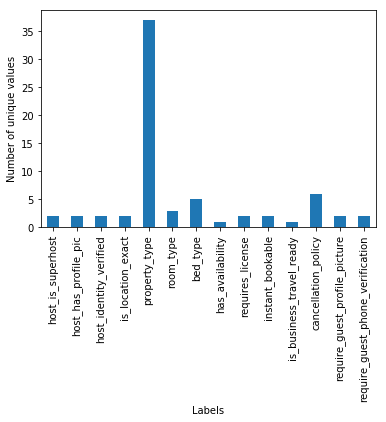
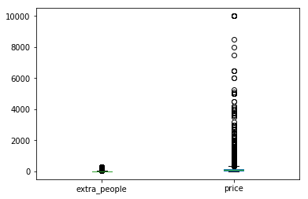

## Cleaning NYC Airbnb detailed listings dataset
The goal of this notebook is to clean the raw airbnb dataset which resides on S3 in `s3://skuchkula-sagemaker-airbnb/` location. The original dataset can be found here: [Inside Airbnb](http://insideairbnb.com/get-the-data.html). I used the New York City datasets for the month of August 2019. 

> Note: I have used a SageMaker notebook instance, but you could easily do this on your local environment.


```python
# Import the necessary packages
# data managing and display libs
import pandas as pd
import numpy as np
import os
import io

import matplotlib.pyplot as plt
import matplotlib
%matplotlib inline 

# sagemaker libraries
import boto3
import sagemaker
```

## Get data from S3
Due to the size of the dataset, I had to store them in S3 as github woudln't allow large files. Using `boto3` package we can directly read the dataset from S3 instead of bringing it locally. This is logic is captured in the function `get_data_frame`, which takes the bucket-name and file-name inside the bucket and returns a pandas dataframe.


```python
# boto3 client to get S3 data
s3_client = boto3.client('s3')
bucket_name='skuchkula-sagemaker-airbnb'
```

List the files inside `s3://skuchkula-sagemaker-airbnb/`


```python
# get a list of objects in the bucket
obj_list=s3_client.list_objects(Bucket=bucket_name)

# print object(s)in S3 bucket
files=[]
for contents in obj_list['Contents']:
    files.append(contents['Key'])
    
print(files)
```

    ['detailed_listings.csv', 'summary_listings.csv']


We will be using the `detailed_listings.csv` file instead of `summary_listings.csv`. The summary dataset is mainly useful for data visualization, whereas, the detailed listings dataset contains much more information about each listing, that we can use to build a machine learning model.


```python
detailed_listings=files[0]
```


```python
def get_data_frame(bucket_name, file_name):
    '''
        Takes the location of the dataset on S3 and returns a dataframe.
        arguments:
            bucket_name: the name of the bucket
            file_name: the key inside the bucket
    '''
    # get an S3 object by passing in the bucket and file name
    data_object = s3_client.get_object(Bucket=bucket_name, Key=file_name)
    
    # information is in the "Body" of the object
    data_body = data_object["Body"].read()
    
    # read in bytes data
    data_stream = io.BytesIO(data_body)
    
    # create a dataframe
    df = pd.read_csv(data_stream, header=0, delimiter=",", low_memory=False)
    
    return df
```


```python
df_detailed_listings = get_data_frame(bucket_name, detailed_listings)
```


```python
df_detailed_listings.head()
```


<div>
<style scoped>
    .dataframe tbody tr th:only-of-type {
        vertical-align: middle;
    }

    .dataframe tbody tr th {
        vertical-align: top;
    }

    .dataframe thead th {
        text-align: right;
    }
</style>
<table border="1" class="dataframe">
  <thead>
    <tr style="text-align: right;">
      <th></th>
      <th>id</th>
      <th>listing_url</th>
      <th>scrape_id</th>
      <th>last_scraped</th>
      <th>name</th>
      <th>summary</th>
      <th>space</th>
      <th>description</th>
      <th>experiences_offered</th>
      <th>neighborhood_overview</th>
      <th>...</th>
      <th>instant_bookable</th>
      <th>is_business_travel_ready</th>
      <th>cancellation_policy</th>
      <th>require_guest_profile_picture</th>
      <th>require_guest_phone_verification</th>
      <th>calculated_host_listings_count</th>
      <th>calculated_host_listings_count_entire_homes</th>
      <th>calculated_host_listings_count_private_rooms</th>
      <th>calculated_host_listings_count_shared_rooms</th>
      <th>reviews_per_month</th>
    </tr>
  </thead>
  <tbody>
    <tr>
      <th>0</th>
      <td>2595</td>
      <td>https://www.airbnb.com/rooms/2595</td>
      <td>20190806030549</td>
      <td>2019-08-07</td>
      <td>Skylit Midtown Castle</td>
      <td>Find your romantic getaway to this beautiful, ...</td>
      <td>- Spacious (500+ft²), immaculate and nicely fu...</td>
      <td>Find your romantic getaway to this beautiful, ...</td>
      <td>none</td>
      <td>Centrally located in the heart of Manhattan ju...</td>
      <td>...</td>
      <td>f</td>
      <td>f</td>
      <td>strict_14_with_grace_period</td>
      <td>t</td>
      <td>t</td>
      <td>2</td>
      <td>1</td>
      <td>0</td>
      <td>1</td>
      <td>0.39</td>
    </tr>
    <tr>
      <th>1</th>
      <td>3647</td>
      <td>https://www.airbnb.com/rooms/3647</td>
      <td>20190806030549</td>
      <td>2019-08-06</td>
      <td>THE VILLAGE OF HARLEM....NEW YORK !</td>
      <td>NaN</td>
      <td>WELCOME TO OUR INTERNATIONAL URBAN COMMUNITY T...</td>
      <td>WELCOME TO OUR INTERNATIONAL URBAN COMMUNITY T...</td>
      <td>none</td>
      <td>NaN</td>
      <td>...</td>
      <td>f</td>
      <td>f</td>
      <td>strict_14_with_grace_period</td>
      <td>t</td>
      <td>t</td>
      <td>1</td>
      <td>0</td>
      <td>1</td>
      <td>0</td>
      <td>NaN</td>
    </tr>
    <tr>
      <th>2</th>
      <td>3831</td>
      <td>https://www.airbnb.com/rooms/3831</td>
      <td>20190806030549</td>
      <td>2019-08-06</td>
      <td>Cozy Entire Floor of Brownstone</td>
      <td>Urban retreat: enjoy 500 s.f. floor in 1899 br...</td>
      <td>Greetings!      We own a double-duplex brownst...</td>
      <td>Urban retreat: enjoy 500 s.f. floor in 1899 br...</td>
      <td>none</td>
      <td>Just the right mix of urban center and local n...</td>
      <td>...</td>
      <td>f</td>
      <td>f</td>
      <td>moderate</td>
      <td>f</td>
      <td>f</td>
      <td>1</td>
      <td>1</td>
      <td>0</td>
      <td>0</td>
      <td>4.64</td>
    </tr>
    <tr>
      <th>3</th>
      <td>5022</td>
      <td>https://www.airbnb.com/rooms/5022</td>
      <td>20190806030549</td>
      <td>2019-08-06</td>
      <td>Entire Apt: Spacious Studio/Loft by central park</td>
      <td>NaN</td>
      <td>Loft apartment with high ceiling and wood floo...</td>
      <td>Loft apartment with high ceiling and wood floo...</td>
      <td>none</td>
      <td>NaN</td>
      <td>...</td>
      <td>f</td>
      <td>f</td>
      <td>strict_14_with_grace_period</td>
      <td>t</td>
      <td>t</td>
      <td>1</td>
      <td>1</td>
      <td>0</td>
      <td>0</td>
      <td>0.10</td>
    </tr>
    <tr>
      <th>4</th>
      <td>5099</td>
      <td>https://www.airbnb.com/rooms/5099</td>
      <td>20190806030549</td>
      <td>2019-08-06</td>
      <td>Large Cozy 1 BR Apartment In Midtown East</td>
      <td>My large 1 bedroom apartment is true New York ...</td>
      <td>I have a large 1 bedroom apartment centrally l...</td>
      <td>My large 1 bedroom apartment is true New York ...</td>
      <td>none</td>
      <td>My neighborhood in Midtown East is called Murr...</td>
      <td>...</td>
      <td>f</td>
      <td>f</td>
      <td>strict_14_with_grace_period</td>
      <td>t</td>
      <td>t</td>
      <td>1</td>
      <td>1</td>
      <td>0</td>
      <td>0</td>
      <td>0.60</td>
    </tr>
  </tbody>
</table>
<p>5 rows × 106 columns</p>
</div>


The Detailed listings contains about 106 different features for each of the Airbnb locations. We need to do some EDA to check if we can trim down some features.


```python
print("Detailed Listings row, cols: ", df_detailed_listings.shape)
```

    Detailed Listings row, cols:  (48864, 106)


```python
# check how the data types are distributed.
# pandas does its best to interpret the datatype while reading in
# however it is our duty to check if the datatype makes sense
df_detailed_listings.dtypes.value_counts()
```


    object     63
    float64    22
    int64      21
    dtype: int64


There are about **48,864** airbnb listings and each of these listing has associated with it **106 features** describing all aspects of the airbnb listing. However, some of these features might be having missing values, whereas some of them might not be relevant to Machine Learning. The data cleaning step will investigate and tackle these problems.

## Data Cleaning
The focus of this notebook is on cleaning the data and storing the cleaned version back into S3.  The strategy employed for cleaning the data is as follows:
- Drop columns that are not relevant to the problem. Example: URL, host picture etc.
- Find missing values for each column.
- Drop columns which have more than 20% missing data. Make a note of the columns.
- Convert columns to their correct data type.
- Subset the dataset based on certain criterion. Ex: property_type = Apartment/House/Townhouse/Condo
- One-hot-encode the categorical variables.


```python
# Set the display properties so that we can inspect the data
pd.set_option("display.max_columns", 100)
pd.set_option("display.max_rows", 100)
```

When working with a dataset which contains many different types of columns, it is best to break them down by type and inspect the cleanliness of each type. We will start with Object types.

### Drop columns
#### Drop irrelevant Object types
Using `select_dtypes` we can filter out the desired type of columns.


```python
df_detailed_listings.select_dtypes(include=['object']).columns
```


    Index(['listing_url', 'last_scraped', 'name', 'summary', 'space',
           'description', 'experiences_offered', 'neighborhood_overview', 'notes',
           'transit', 'access', 'interaction', 'house_rules', 'picture_url',
           'host_url', 'host_name', 'host_since', 'host_location', 'host_about',
           'host_response_time', 'host_response_rate', 'host_is_superhost',
           'host_thumbnail_url', 'host_picture_url', 'host_neighbourhood',
           'host_verifications', 'host_has_profile_pic', 'host_identity_verified',
           'street', 'neighbourhood', 'neighbourhood_cleansed',
           'neighbourhood_group_cleansed', 'city', 'state', 'zipcode', 'market',
           'smart_location', 'country_code', 'country', 'is_location_exact',
           'property_type', 'room_type', 'bed_type', 'amenities', 'price',
           'weekly_price', 'monthly_price', 'security_deposit', 'cleaning_fee',
           'extra_people', 'calendar_updated', 'has_availability',
           'calendar_last_scraped', 'first_review', 'last_review',
           'requires_license', 'license', 'jurisdiction_names', 'instant_bookable',
           'is_business_travel_ready', 'cancellation_policy',
           'require_guest_profile_picture', 'require_guest_phone_verification'],
          dtype='object')


By inspecting some values of object types, it becomes evident that some columns are just not that useful for our analysis. Example, the urls, last_scraped etc. Shown below are a list of columns that we can safely drop without much loss of information needed for our analysis. I have also displayed the head of the object columns to get a sense of why we can drop these columns.


```python
drop_object_cols = ['listing_url',
             'last_scraped',
             'experiences_offered',
             'picture_url',
             'host_url',
             'host_name',
             'host_since',
             'host_location',
             'host_about',
             'host_thumbnail_url',
             'host_picture_url',
             'host_neighbourhood',
             'street',
             'neighbourhood',
             'city',
             'state',
             'zipcode',
             'market',
             'smart_location',
             'country_code',
             'country',
             'calendar_updated',
             'calendar_last_scraped',
             'first_review',
             'last_review' 
            ]
```


```python
df_detailed_listings.select_dtypes(include=['object']).head()
```


<div>
<style scoped>
    .dataframe tbody tr th:only-of-type {
        vertical-align: middle;
    }

    .dataframe tbody tr th {
        vertical-align: top;
    }

    .dataframe thead th {
        text-align: right;
    }
</style>
<table border="1" class="dataframe">
  <thead>
    <tr style="text-align: right;">
      <th></th>
      <th>listing_url</th>
      <th>last_scraped</th>
      <th>name</th>
      <th>summary</th>
      <th>space</th>
      <th>description</th>
      <th>experiences_offered</th>
      <th>neighborhood_overview</th>
      <th>notes</th>
      <th>transit</th>
      <th>access</th>
      <th>interaction</th>
      <th>house_rules</th>
      <th>picture_url</th>
      <th>host_url</th>
      <th>host_name</th>
      <th>host_since</th>
      <th>host_location</th>
      <th>host_about</th>
      <th>host_response_time</th>
      <th>host_response_rate</th>
      <th>host_is_superhost</th>
      <th>host_thumbnail_url</th>
      <th>host_picture_url</th>
      <th>host_neighbourhood</th>
      <th>host_verifications</th>
      <th>host_has_profile_pic</th>
      <th>host_identity_verified</th>
      <th>street</th>
      <th>neighbourhood</th>
      <th>neighbourhood_cleansed</th>
      <th>neighbourhood_group_cleansed</th>
      <th>city</th>
      <th>state</th>
      <th>zipcode</th>
      <th>market</th>
      <th>smart_location</th>
      <th>country_code</th>
      <th>country</th>
      <th>is_location_exact</th>
      <th>property_type</th>
      <th>room_type</th>
      <th>bed_type</th>
      <th>amenities</th>
      <th>price</th>
      <th>weekly_price</th>
      <th>monthly_price</th>
      <th>security_deposit</th>
      <th>cleaning_fee</th>
      <th>extra_people</th>
      <th>calendar_updated</th>
      <th>has_availability</th>
      <th>calendar_last_scraped</th>
      <th>first_review</th>
      <th>last_review</th>
      <th>requires_license</th>
      <th>license</th>
      <th>jurisdiction_names</th>
      <th>instant_bookable</th>
      <th>is_business_travel_ready</th>
      <th>cancellation_policy</th>
      <th>require_guest_profile_picture</th>
      <th>require_guest_phone_verification</th>
    </tr>
  </thead>
  <tbody>
    <tr>
      <th>0</th>
      <td>https://www.airbnb.com/rooms/2595</td>
      <td>2019-08-07</td>
      <td>Skylit Midtown Castle</td>
      <td>Find your romantic getaway to this beautiful, ...</td>
      <td>- Spacious (500+ft²), immaculate and nicely fu...</td>
      <td>Find your romantic getaway to this beautiful, ...</td>
      <td>none</td>
      <td>Centrally located in the heart of Manhattan ju...</td>
      <td>NaN</td>
      <td>Apartment is located on 37th Street between 5t...</td>
      <td>Guests have full access to the kitchen, bathro...</td>
      <td>I am a Sound Therapy Practitioner and Kundalin...</td>
      <td>Make yourself at home, respect the space and t...</td>
      <td>https://a0.muscache.com/im/pictures/f0813a11-4...</td>
      <td>https://www.airbnb.com/users/show/2845</td>
      <td>Jennifer</td>
      <td>2008-09-09</td>
      <td>New York, New York, United States</td>
      <td>A New Yorker since 2000! My passion is creatin...</td>
      <td>within a few hours</td>
      <td>90%</td>
      <td>f</td>
      <td>https://a0.muscache.com/im/users/2845/profile_...</td>
      <td>https://a0.muscache.com/im/users/2845/profile_...</td>
      <td>Midtown</td>
      <td>['email', 'phone', 'reviews', 'kba', 'work_ema...</td>
      <td>t</td>
      <td>t</td>
      <td>New York, NY, United States</td>
      <td>Midtown</td>
      <td>Midtown</td>
      <td>Manhattan</td>
      <td>New York</td>
      <td>NY</td>
      <td>10018</td>
      <td>New York</td>
      <td>New York, NY</td>
      <td>US</td>
      <td>United States</td>
      <td>f</td>
      <td>Apartment</td>
      <td>Entire home/apt</td>
      <td>Real Bed</td>
      <td>{TV,Wifi,"Air conditioning",Kitchen,"Paid park...</td>
      <td>$225.00</td>
      <td>$1,995.00</td>
      <td>NaN</td>
      <td>$350.00</td>
      <td>$100.00</td>
      <td>$0.00</td>
      <td>a week ago</td>
      <td>t</td>
      <td>2019-08-07</td>
      <td>2009-11-21</td>
      <td>2019-07-14</td>
      <td>f</td>
      <td>NaN</td>
      <td>NaN</td>
      <td>f</td>
      <td>f</td>
      <td>strict_14_with_grace_period</td>
      <td>t</td>
      <td>t</td>
    </tr>
    <tr>
      <th>1</th>
      <td>https://www.airbnb.com/rooms/3647</td>
      <td>2019-08-06</td>
      <td>THE VILLAGE OF HARLEM....NEW YORK !</td>
      <td>NaN</td>
      <td>WELCOME TO OUR INTERNATIONAL URBAN COMMUNITY T...</td>
      <td>WELCOME TO OUR INTERNATIONAL URBAN COMMUNITY T...</td>
      <td>none</td>
      <td>NaN</td>
      <td>NaN</td>
      <td>NaN</td>
      <td>NaN</td>
      <td>NaN</td>
      <td>Upon arrival please have a legibile copy of yo...</td>
      <td>https://a0.muscache.com/im/pictures/838341/9b3...</td>
      <td>https://www.airbnb.com/users/show/4632</td>
      <td>Elisabeth</td>
      <td>2008-11-25</td>
      <td>New York, New York, United States</td>
      <td>Make Up Artist National/ (Website hidden by Ai...</td>
      <td>within a day</td>
      <td>100%</td>
      <td>f</td>
      <td>https://a0.muscache.com/im/users/4632/profile_...</td>
      <td>https://a0.muscache.com/im/users/4632/profile_...</td>
      <td>Harlem</td>
      <td>['email', 'phone', 'google', 'reviews', 'jumio...</td>
      <td>t</td>
      <td>t</td>
      <td>New York, NY, United States</td>
      <td>Harlem</td>
      <td>Harlem</td>
      <td>Manhattan</td>
      <td>New York</td>
      <td>NY</td>
      <td>10027</td>
      <td>New York</td>
      <td>New York, NY</td>
      <td>US</td>
      <td>United States</td>
      <td>t</td>
      <td>Apartment</td>
      <td>Private room</td>
      <td>Pull-out Sofa</td>
      <td>{"Cable TV",Internet,Wifi,"Air conditioning",K...</td>
      <td>$150.00</td>
      <td>NaN</td>
      <td>NaN</td>
      <td>$200.00</td>
      <td>$75.00</td>
      <td>$20.00</td>
      <td>35 months ago</td>
      <td>t</td>
      <td>2019-08-06</td>
      <td>NaN</td>
      <td>NaN</td>
      <td>f</td>
      <td>NaN</td>
      <td>NaN</td>
      <td>f</td>
      <td>f</td>
      <td>strict_14_with_grace_period</td>
      <td>t</td>
      <td>t</td>
    </tr>
    <tr>
      <th>2</th>
      <td>https://www.airbnb.com/rooms/3831</td>
      <td>2019-08-06</td>
      <td>Cozy Entire Floor of Brownstone</td>
      <td>Urban retreat: enjoy 500 s.f. floor in 1899 br...</td>
      <td>Greetings!      We own a double-duplex brownst...</td>
      <td>Urban retreat: enjoy 500 s.f. floor in 1899 br...</td>
      <td>none</td>
      <td>Just the right mix of urban center and local n...</td>
      <td>NaN</td>
      <td>B52 bus for a 10-minute ride to downtown Brook...</td>
      <td>You will have exclusive use of and access to: ...</td>
      <td>We'll be around, but since you have the top fl...</td>
      <td>Smoking - outside please; pets allowed but ple...</td>
      <td>https://a0.muscache.com/im/pictures/e49999c2-9...</td>
      <td>https://www.airbnb.com/users/show/4869</td>
      <td>LisaRoxanne</td>
      <td>2008-12-07</td>
      <td>New York, New York, United States</td>
      <td>Laid-back bi-coastal actor/professor/attorney.</td>
      <td>within an hour</td>
      <td>90%</td>
      <td>f</td>
      <td>https://a0.muscache.com/im/users/4869/profile_...</td>
      <td>https://a0.muscache.com/im/users/4869/profile_...</td>
      <td>Clinton Hill</td>
      <td>['email', 'phone', 'reviews', 'kba']</td>
      <td>t</td>
      <td>t</td>
      <td>Brooklyn, NY, United States</td>
      <td>Brooklyn</td>
      <td>Clinton Hill</td>
      <td>Brooklyn</td>
      <td>Brooklyn</td>
      <td>NY</td>
      <td>11238</td>
      <td>New York</td>
      <td>Brooklyn, NY</td>
      <td>US</td>
      <td>United States</td>
      <td>t</td>
      <td>Guest suite</td>
      <td>Entire home/apt</td>
      <td>Real Bed</td>
      <td>{TV,"Cable TV",Internet,Wifi,"Air conditioning...</td>
      <td>$89.00</td>
      <td>$575.00</td>
      <td>$2,100.00</td>
      <td>$500.00</td>
      <td>NaN</td>
      <td>$0.00</td>
      <td>today</td>
      <td>t</td>
      <td>2019-08-06</td>
      <td>2014-09-30</td>
      <td>2019-07-26</td>
      <td>f</td>
      <td>NaN</td>
      <td>NaN</td>
      <td>f</td>
      <td>f</td>
      <td>moderate</td>
      <td>f</td>
      <td>f</td>
    </tr>
    <tr>
      <th>3</th>
      <td>https://www.airbnb.com/rooms/5022</td>
      <td>2019-08-06</td>
      <td>Entire Apt: Spacious Studio/Loft by central park</td>
      <td>NaN</td>
      <td>Loft apartment with high ceiling and wood floo...</td>
      <td>Loft apartment with high ceiling and wood floo...</td>
      <td>none</td>
      <td>NaN</td>
      <td>NaN</td>
      <td>NaN</td>
      <td>NaN</td>
      <td>NaN</td>
      <td>Please be considerate when staying in the apar...</td>
      <td>https://a0.muscache.com/im/pictures/feb453bd-f...</td>
      <td>https://www.airbnb.com/users/show/7192</td>
      <td>Laura</td>
      <td>2009-01-29</td>
      <td>Miami, Florida, United States</td>
      <td>I have been a NYer for almost 10 years. I came...</td>
      <td>NaN</td>
      <td>NaN</td>
      <td>f</td>
      <td>https://a0.muscache.com/im/users/7192/profile_...</td>
      <td>https://a0.muscache.com/im/users/7192/profile_...</td>
      <td>East Harlem</td>
      <td>['email', 'phone', 'facebook', 'reviews', 'kba']</td>
      <td>t</td>
      <td>t</td>
      <td>New York, NY, United States</td>
      <td>East Harlem</td>
      <td>East Harlem</td>
      <td>Manhattan</td>
      <td>New York</td>
      <td>NY</td>
      <td>10029</td>
      <td>New York</td>
      <td>New York, NY</td>
      <td>US</td>
      <td>United States</td>
      <td>t</td>
      <td>Apartment</td>
      <td>Entire home/apt</td>
      <td>Real Bed</td>
      <td>{Internet,Wifi,"Air conditioning",Kitchen,Elev...</td>
      <td>$80.00</td>
      <td>$600.00</td>
      <td>$1,600.00</td>
      <td>$100.00</td>
      <td>$80.00</td>
      <td>$20.00</td>
      <td>4 months ago</td>
      <td>t</td>
      <td>2019-08-06</td>
      <td>2012-03-20</td>
      <td>2018-11-19</td>
      <td>f</td>
      <td>NaN</td>
      <td>NaN</td>
      <td>f</td>
      <td>f</td>
      <td>strict_14_with_grace_period</td>
      <td>t</td>
      <td>t</td>
    </tr>
    <tr>
      <th>4</th>
      <td>https://www.airbnb.com/rooms/5099</td>
      <td>2019-08-06</td>
      <td>Large Cozy 1 BR Apartment In Midtown East</td>
      <td>My large 1 bedroom apartment is true New York ...</td>
      <td>I have a large 1 bedroom apartment centrally l...</td>
      <td>My large 1 bedroom apartment is true New York ...</td>
      <td>none</td>
      <td>My neighborhood in Midtown East is called Murr...</td>
      <td>Read My Full Listing For All Information. New ...</td>
      <td>From the apartment is a 10 minute walk to Gran...</td>
      <td>I will meet you upon arrival.</td>
      <td>I usually check in with guests via text or ema...</td>
      <td>• Check-in time is 2PM. • Check-out time is 12...</td>
      <td>https://a0.muscache.com/im/pictures/be2fdcf6-e...</td>
      <td>https://www.airbnb.com/users/show/7322</td>
      <td>Chris</td>
      <td>2009-02-02</td>
      <td>New York, New York, United States</td>
      <td>I'm an artist, writer, traveler, and a native ...</td>
      <td>within a few hours</td>
      <td>90%</td>
      <td>f</td>
      <td>https://a0.muscache.com/im/pictures/user/26745...</td>
      <td>https://a0.muscache.com/im/pictures/user/26745...</td>
      <td>Flatiron District</td>
      <td>['email', 'phone', 'reviews', 'jumio', 'govern...</td>
      <td>t</td>
      <td>f</td>
      <td>New York, NY, United States</td>
      <td>Midtown East</td>
      <td>Murray Hill</td>
      <td>Manhattan</td>
      <td>New York</td>
      <td>NY</td>
      <td>10016</td>
      <td>New York</td>
      <td>New York, NY</td>
      <td>US</td>
      <td>United States</td>
      <td>f</td>
      <td>Apartment</td>
      <td>Entire home/apt</td>
      <td>Real Bed</td>
      <td>{TV,"Cable TV",Internet,Wifi,Kitchen,"Buzzer/w...</td>
      <td>$200.00</td>
      <td>NaN</td>
      <td>NaN</td>
      <td>$300.00</td>
      <td>$125.00</td>
      <td>$100.00</td>
      <td>4 days ago</td>
      <td>t</td>
      <td>2019-08-06</td>
      <td>2009-04-20</td>
      <td>2019-07-21</td>
      <td>f</td>
      <td>NaN</td>
      <td>NaN</td>
      <td>f</td>
      <td>f</td>
      <td>strict_14_with_grace_period</td>
      <td>t</td>
      <td>t</td>
    </tr>
  </tbody>
</table>
</div>


#### Drop irrelevant float64 types


```python
df_detailed_listings.select_dtypes(include=['float64']).columns
```


    Index(['thumbnail_url', 'medium_url', 'xl_picture_url', 'host_acceptance_rate',
           'host_listings_count', 'host_total_listings_count', 'latitude',
           'longitude', 'bathrooms', 'bedrooms', 'beds', 'square_feet',
           'minimum_nights_avg_ntm', 'maximum_nights_avg_ntm',
           'review_scores_rating', 'review_scores_accuracy',
           'review_scores_cleanliness', 'review_scores_checkin',
           'review_scores_communication', 'review_scores_location',
           'review_scores_value', 'reviews_per_month'],
          dtype='object')


```python
df_detailed_listings.select_dtypes(include=['float64']).head()
```


<div>
<style scoped>
    .dataframe tbody tr th:only-of-type {
        vertical-align: middle;
    }

    .dataframe tbody tr th {
        vertical-align: top;
    }

    .dataframe thead th {
        text-align: right;
    }
</style>
<table border="1" class="dataframe">
  <thead>
    <tr style="text-align: right;">
      <th></th>
      <th>thumbnail_url</th>
      <th>medium_url</th>
      <th>xl_picture_url</th>
      <th>host_acceptance_rate</th>
      <th>host_listings_count</th>
      <th>host_total_listings_count</th>
      <th>latitude</th>
      <th>longitude</th>
      <th>bathrooms</th>
      <th>bedrooms</th>
      <th>beds</th>
      <th>square_feet</th>
      <th>minimum_nights_avg_ntm</th>
      <th>maximum_nights_avg_ntm</th>
      <th>review_scores_rating</th>
      <th>review_scores_accuracy</th>
      <th>review_scores_cleanliness</th>
      <th>review_scores_checkin</th>
      <th>review_scores_communication</th>
      <th>review_scores_location</th>
      <th>review_scores_value</th>
      <th>reviews_per_month</th>
    </tr>
  </thead>
  <tbody>
    <tr>
      <th>0</th>
      <td>NaN</td>
      <td>NaN</td>
      <td>NaN</td>
      <td>NaN</td>
      <td>5.0</td>
      <td>5.0</td>
      <td>40.75362</td>
      <td>-73.98377</td>
      <td>1.0</td>
      <td>0.0</td>
      <td>1.0</td>
      <td>NaN</td>
      <td>1.0</td>
      <td>1125.0</td>
      <td>95.0</td>
      <td>10.0</td>
      <td>9.0</td>
      <td>10.0</td>
      <td>10.0</td>
      <td>10.0</td>
      <td>9.0</td>
      <td>0.39</td>
    </tr>
    <tr>
      <th>1</th>
      <td>NaN</td>
      <td>NaN</td>
      <td>NaN</td>
      <td>NaN</td>
      <td>1.0</td>
      <td>1.0</td>
      <td>40.80902</td>
      <td>-73.94190</td>
      <td>1.0</td>
      <td>1.0</td>
      <td>1.0</td>
      <td>NaN</td>
      <td>3.0</td>
      <td>7.0</td>
      <td>NaN</td>
      <td>NaN</td>
      <td>NaN</td>
      <td>NaN</td>
      <td>NaN</td>
      <td>NaN</td>
      <td>NaN</td>
      <td>NaN</td>
    </tr>
    <tr>
      <th>2</th>
      <td>NaN</td>
      <td>NaN</td>
      <td>NaN</td>
      <td>NaN</td>
      <td>1.0</td>
      <td>1.0</td>
      <td>40.68514</td>
      <td>-73.95976</td>
      <td>1.0</td>
      <td>1.0</td>
      <td>4.0</td>
      <td>500.0</td>
      <td>1.0</td>
      <td>730.0</td>
      <td>90.0</td>
      <td>10.0</td>
      <td>9.0</td>
      <td>10.0</td>
      <td>9.0</td>
      <td>10.0</td>
      <td>9.0</td>
      <td>4.64</td>
    </tr>
    <tr>
      <th>3</th>
      <td>NaN</td>
      <td>NaN</td>
      <td>NaN</td>
      <td>NaN</td>
      <td>1.0</td>
      <td>1.0</td>
      <td>40.79851</td>
      <td>-73.94399</td>
      <td>1.0</td>
      <td>NaN</td>
      <td>1.0</td>
      <td>NaN</td>
      <td>10.0</td>
      <td>120.0</td>
      <td>93.0</td>
      <td>10.0</td>
      <td>9.0</td>
      <td>10.0</td>
      <td>10.0</td>
      <td>9.0</td>
      <td>10.0</td>
      <td>0.10</td>
    </tr>
    <tr>
      <th>4</th>
      <td>NaN</td>
      <td>NaN</td>
      <td>NaN</td>
      <td>NaN</td>
      <td>1.0</td>
      <td>1.0</td>
      <td>40.74767</td>
      <td>-73.97500</td>
      <td>1.0</td>
      <td>1.0</td>
      <td>1.0</td>
      <td>NaN</td>
      <td>3.0</td>
      <td>21.0</td>
      <td>89.0</td>
      <td>10.0</td>
      <td>9.0</td>
      <td>10.0</td>
      <td>10.0</td>
      <td>9.0</td>
      <td>9.0</td>
      <td>0.60</td>
    </tr>
  </tbody>
</table>
</div>


```python
drop_float_cols = ['thumbnail_url',
                   'medium_url',
                   'xl_picture_url',
                   'minimum_nights_avg_ntm',
                   'maximum_nights_avg_ntm'
                  ]
```

#### Drop irrelevant int64 types


```python
df_detailed_listings.select_dtypes(include=['int64']).columns
```


    Index(['id', 'scrape_id', 'host_id', 'accommodates', 'guests_included',
           'minimum_nights', 'maximum_nights', 'minimum_minimum_nights',
           'maximum_minimum_nights', 'minimum_maximum_nights',
           'maximum_maximum_nights', 'availability_30', 'availability_60',
           'availability_90', 'availability_365', 'number_of_reviews',
           'number_of_reviews_ltm', 'calculated_host_listings_count',
           'calculated_host_listings_count_entire_homes',
           'calculated_host_listings_count_private_rooms',
           'calculated_host_listings_count_shared_rooms'],
          dtype='object')


```python
df_detailed_listings.select_dtypes(include=['int64']).head()
```


<div>
<style scoped>
    .dataframe tbody tr th:only-of-type {
        vertical-align: middle;
    }

    .dataframe tbody tr th {
        vertical-align: top;
    }

    .dataframe thead th {
        text-align: right;
    }
</style>
<table border="1" class="dataframe">
  <thead>
    <tr style="text-align: right;">
      <th></th>
      <th>id</th>
      <th>scrape_id</th>
      <th>host_id</th>
      <th>accommodates</th>
      <th>guests_included</th>
      <th>minimum_nights</th>
      <th>maximum_nights</th>
      <th>minimum_minimum_nights</th>
      <th>maximum_minimum_nights</th>
      <th>minimum_maximum_nights</th>
      <th>maximum_maximum_nights</th>
      <th>availability_30</th>
      <th>availability_60</th>
      <th>availability_90</th>
      <th>availability_365</th>
      <th>number_of_reviews</th>
      <th>number_of_reviews_ltm</th>
      <th>calculated_host_listings_count</th>
      <th>calculated_host_listings_count_entire_homes</th>
      <th>calculated_host_listings_count_private_rooms</th>
      <th>calculated_host_listings_count_shared_rooms</th>
    </tr>
  </thead>
  <tbody>
    <tr>
      <th>0</th>
      <td>2595</td>
      <td>20190806030549</td>
      <td>2845</td>
      <td>2</td>
      <td>2</td>
      <td>1</td>
      <td>1125</td>
      <td>1</td>
      <td>1</td>
      <td>1125</td>
      <td>1125</td>
      <td>13</td>
      <td>17</td>
      <td>31</td>
      <td>288</td>
      <td>46</td>
      <td>12</td>
      <td>2</td>
      <td>1</td>
      <td>0</td>
      <td>1</td>
    </tr>
    <tr>
      <th>1</th>
      <td>3647</td>
      <td>20190806030549</td>
      <td>4632</td>
      <td>2</td>
      <td>2</td>
      <td>3</td>
      <td>7</td>
      <td>3</td>
      <td>3</td>
      <td>7</td>
      <td>7</td>
      <td>30</td>
      <td>60</td>
      <td>90</td>
      <td>365</td>
      <td>0</td>
      <td>0</td>
      <td>1</td>
      <td>0</td>
      <td>1</td>
      <td>0</td>
    </tr>
    <tr>
      <th>2</th>
      <td>3831</td>
      <td>20190806030549</td>
      <td>4869</td>
      <td>3</td>
      <td>1</td>
      <td>1</td>
      <td>730</td>
      <td>1</td>
      <td>1</td>
      <td>730</td>
      <td>730</td>
      <td>0</td>
      <td>1</td>
      <td>4</td>
      <td>212</td>
      <td>274</td>
      <td>70</td>
      <td>1</td>
      <td>1</td>
      <td>0</td>
      <td>0</td>
    </tr>
    <tr>
      <th>3</th>
      <td>5022</td>
      <td>20190806030549</td>
      <td>7192</td>
      <td>1</td>
      <td>1</td>
      <td>10</td>
      <td>120</td>
      <td>10</td>
      <td>10</td>
      <td>120</td>
      <td>120</td>
      <td>0</td>
      <td>0</td>
      <td>0</td>
      <td>0</td>
      <td>9</td>
      <td>2</td>
      <td>1</td>
      <td>1</td>
      <td>0</td>
      <td>0</td>
    </tr>
    <tr>
      <th>4</th>
      <td>5099</td>
      <td>20190806030549</td>
      <td>7322</td>
      <td>2</td>
      <td>2</td>
      <td>3</td>
      <td>21</td>
      <td>3</td>
      <td>3</td>
      <td>21</td>
      <td>21</td>
      <td>24</td>
      <td>33</td>
      <td>63</td>
      <td>127</td>
      <td>75</td>
      <td>10</td>
      <td>1</td>
      <td>1</td>
      <td>0</td>
      <td>0</td>
    </tr>
  </tbody>
</table>
</div>


```python
drop_int_cols = ['scrape_id',
                 'host_id',
                 'minimum_minimum_nights',
                 'maximum_minimum_nights',
                 'minimum_maximum_nights',
                 'maximum_maximum_nights'
                ]
```


```python
# combine all the columns and drop them
drop_cols = drop_object_cols + drop_float_cols + drop_int_cols
print("Shape of the dataset before dropping: ", df_detailed_listings.shape)
print("Dropping {} columns".format(len(drop_cols)))
df_dl_clean_df = df_detailed_listings.drop(columns=drop_cols)
print("Shape of the dataset after dropping: ", df_dl_clean_df.shape)
```

    Shape of the dataset before dropping:  (48864, 106)
    Dropping 36 columns
    Shape of the dataset after dropping:  (48864, 70)


### Missing Value Statistics
An important step in data cleaning is identifying columns with missing values. Let's first calculate the missing value statistics.


```python
def missing_statistics(df):
    '''
        Calculates missing value statistics for a given dataframe and 
        returns a dataframe containing number of missing values per column
        and the percentage of values missing per column.
        arguments:
            df: the dataframe for which missing values need to be calculated.
    '''
    missing_stats = df.isnull().sum().to_frame()
    missing_stats.columns = ['num_missing']
    missing_stats['pct_missing'] = np.round(100 * (missing_stats['num_missing'] / df.shape[0]))
    missing_stats.sort_values(by='num_missing', ascending=False, inplace=True)
    
    return missing_stats
```


```python
num_missing = missing_statistics(df_dl_clean_df)
num_missing
```


<div>
<style scoped>
    .dataframe tbody tr th:only-of-type {
        vertical-align: middle;
    }

    .dataframe tbody tr th {
        vertical-align: top;
    }

    .dataframe thead th {
        text-align: right;
    }
</style>
<table border="1" class="dataframe">
  <thead>
    <tr style="text-align: right;">
      <th></th>
      <th>num_missing</th>
      <th>pct_missing</th>
    </tr>
  </thead>
  <tbody>
    <tr>
      <th>host_acceptance_rate</th>
      <td>48864</td>
      <td>100.0</td>
    </tr>
    <tr>
      <th>jurisdiction_names</th>
      <td>48853</td>
      <td>100.0</td>
    </tr>
    <tr>
      <th>license</th>
      <td>48842</td>
      <td>100.0</td>
    </tr>
    <tr>
      <th>square_feet</th>
      <td>48469</td>
      <td>99.0</td>
    </tr>
    <tr>
      <th>monthly_price</th>
      <td>43715</td>
      <td>89.0</td>
    </tr>
    <tr>
      <th>weekly_price</th>
      <td>42964</td>
      <td>88.0</td>
    </tr>
    <tr>
      <th>notes</th>
      <td>28692</td>
      <td>59.0</td>
    </tr>
    <tr>
      <th>access</th>
      <td>21916</td>
      <td>45.0</td>
    </tr>
    <tr>
      <th>interaction</th>
      <td>19947</td>
      <td>41.0</td>
    </tr>
    <tr>
      <th>house_rules</th>
      <td>18912</td>
      <td>39.0</td>
    </tr>
    <tr>
      <th>neighborhood_overview</th>
      <td>17297</td>
      <td>35.0</td>
    </tr>
    <tr>
      <th>security_deposit</th>
      <td>17290</td>
      <td>35.0</td>
    </tr>
    <tr>
      <th>transit</th>
      <td>16975</td>
      <td>35.0</td>
    </tr>
    <tr>
      <th>host_response_rate</th>
      <td>16582</td>
      <td>34.0</td>
    </tr>
    <tr>
      <th>host_response_time</th>
      <td>16582</td>
      <td>34.0</td>
    </tr>
    <tr>
      <th>space</th>
      <td>13985</td>
      <td>29.0</td>
    </tr>
    <tr>
      <th>review_scores_location</th>
      <td>11163</td>
      <td>23.0</td>
    </tr>
    <tr>
      <th>review_scores_value</th>
      <td>11161</td>
      <td>23.0</td>
    </tr>
    <tr>
      <th>review_scores_checkin</th>
      <td>11158</td>
      <td>23.0</td>
    </tr>
    <tr>
      <th>review_scores_accuracy</th>
      <td>11142</td>
      <td>23.0</td>
    </tr>
    <tr>
      <th>review_scores_communication</th>
      <td>11136</td>
      <td>23.0</td>
    </tr>
    <tr>
      <th>review_scores_cleanliness</th>
      <td>11126</td>
      <td>23.0</td>
    </tr>
    <tr>
      <th>review_scores_rating</th>
      <td>11104</td>
      <td>23.0</td>
    </tr>
    <tr>
      <th>cleaning_fee</th>
      <td>10584</td>
      <td>22.0</td>
    </tr>
    <tr>
      <th>reviews_per_month</th>
      <td>10131</td>
      <td>21.0</td>
    </tr>
    <tr>
      <th>summary</th>
      <td>2075</td>
      <td>4.0</td>
    </tr>
    <tr>
      <th>description</th>
      <td>843</td>
      <td>2.0</td>
    </tr>
    <tr>
      <th>bathrooms</th>
      <td>56</td>
      <td>0.0</td>
    </tr>
    <tr>
      <th>beds</th>
      <td>42</td>
      <td>0.0</td>
    </tr>
    <tr>
      <th>bedrooms</th>
      <td>27</td>
      <td>0.0</td>
    </tr>
    <tr>
      <th>host_identity_verified</th>
      <td>18</td>
      <td>0.0</td>
    </tr>
    <tr>
      <th>host_has_profile_pic</th>
      <td>18</td>
      <td>0.0</td>
    </tr>
    <tr>
      <th>host_total_listings_count</th>
      <td>18</td>
      <td>0.0</td>
    </tr>
    <tr>
      <th>host_listings_count</th>
      <td>18</td>
      <td>0.0</td>
    </tr>
    <tr>
      <th>host_is_superhost</th>
      <td>18</td>
      <td>0.0</td>
    </tr>
    <tr>
      <th>name</th>
      <td>16</td>
      <td>0.0</td>
    </tr>
    <tr>
      <th>cancellation_policy</th>
      <td>1</td>
      <td>0.0</td>
    </tr>
    <tr>
      <th>neighbourhood_cleansed</th>
      <td>0</td>
      <td>0.0</td>
    </tr>
    <tr>
      <th>is_business_travel_ready</th>
      <td>0</td>
      <td>0.0</td>
    </tr>
    <tr>
      <th>instant_bookable</th>
      <td>0</td>
      <td>0.0</td>
    </tr>
    <tr>
      <th>require_guest_profile_picture</th>
      <td>0</td>
      <td>0.0</td>
    </tr>
    <tr>
      <th>require_guest_phone_verification</th>
      <td>0</td>
      <td>0.0</td>
    </tr>
    <tr>
      <th>requires_license</th>
      <td>0</td>
      <td>0.0</td>
    </tr>
    <tr>
      <th>calculated_host_listings_count</th>
      <td>0</td>
      <td>0.0</td>
    </tr>
    <tr>
      <th>calculated_host_listings_count_entire_homes</th>
      <td>0</td>
      <td>0.0</td>
    </tr>
    <tr>
      <th>calculated_host_listings_count_private_rooms</th>
      <td>0</td>
      <td>0.0</td>
    </tr>
    <tr>
      <th>host_verifications</th>
      <td>0</td>
      <td>0.0</td>
    </tr>
    <tr>
      <th>calculated_host_listings_count_shared_rooms</th>
      <td>0</td>
      <td>0.0</td>
    </tr>
    <tr>
      <th>property_type</th>
      <td>0</td>
      <td>0.0</td>
    </tr>
    <tr>
      <th>availability_365</th>
      <td>0</td>
      <td>0.0</td>
    </tr>
    <tr>
      <th>number_of_reviews_ltm</th>
      <td>0</td>
      <td>0.0</td>
    </tr>
    <tr>
      <th>number_of_reviews</th>
      <td>0</td>
      <td>0.0</td>
    </tr>
    <tr>
      <th>accommodates</th>
      <td>0</td>
      <td>0.0</td>
    </tr>
    <tr>
      <th>bed_type</th>
      <td>0</td>
      <td>0.0</td>
    </tr>
    <tr>
      <th>amenities</th>
      <td>0</td>
      <td>0.0</td>
    </tr>
    <tr>
      <th>is_location_exact</th>
      <td>0</td>
      <td>0.0</td>
    </tr>
    <tr>
      <th>price</th>
      <td>0</td>
      <td>0.0</td>
    </tr>
    <tr>
      <th>longitude</th>
      <td>0</td>
      <td>0.0</td>
    </tr>
    <tr>
      <th>latitude</th>
      <td>0</td>
      <td>0.0</td>
    </tr>
    <tr>
      <th>neighbourhood_group_cleansed</th>
      <td>0</td>
      <td>0.0</td>
    </tr>
    <tr>
      <th>guests_included</th>
      <td>0</td>
      <td>0.0</td>
    </tr>
    <tr>
      <th>extra_people</th>
      <td>0</td>
      <td>0.0</td>
    </tr>
    <tr>
      <th>minimum_nights</th>
      <td>0</td>
      <td>0.0</td>
    </tr>
    <tr>
      <th>maximum_nights</th>
      <td>0</td>
      <td>0.0</td>
    </tr>
    <tr>
      <th>has_availability</th>
      <td>0</td>
      <td>0.0</td>
    </tr>
    <tr>
      <th>availability_30</th>
      <td>0</td>
      <td>0.0</td>
    </tr>
    <tr>
      <th>availability_60</th>
      <td>0</td>
      <td>0.0</td>
    </tr>
    <tr>
      <th>availability_90</th>
      <td>0</td>
      <td>0.0</td>
    </tr>
    <tr>
      <th>room_type</th>
      <td>0</td>
      <td>0.0</td>
    </tr>
    <tr>
      <th>id</th>
      <td>0</td>
      <td>0.0</td>
    </tr>
  </tbody>
</table>
</div>


As we can see in the table above, few columns have 100% missing data. We will be dropping these columns and upon close observation, it makes sense to drop the columns which have more than 20% missing data.


```python
cols_to_drop = list(num_missing[num_missing.pct_missing > 20].index)
cols_to_drop
```


    ['host_acceptance_rate',
     'jurisdiction_names',
     'license',
     'square_feet',
     'monthly_price',
     'weekly_price',
     'notes',
     'access',
     'interaction',
     'house_rules',
     'neighborhood_overview',
     'security_deposit',
     'transit',
     'host_response_rate',
     'host_response_time',
     'space',
     'review_scores_location',
     'review_scores_value',
     'review_scores_checkin',
     'review_scores_accuracy',
     'review_scores_communication',
     'review_scores_cleanliness',
     'review_scores_rating',
     'cleaning_fee',
     'reviews_per_month']


```python
df_dl_clean_df = df_dl_clean_df.drop(cols_to_drop, axis='columns')
print(df_dl_clean_df.shape)
```

    (48864, 45)


At this point, we have not fully dealt with missing values. But before we move forward with handling missing values, let's first validate that each of the variable is of the correct type, i.e, categorical and boolean type. Representing all string columns as **object type** is not an effective approach. We need to convert the object types to categorical or boolean if necessary. Another advantage of converting them from object to categorical/boolean is that we can make use of `pd.get_dummies()` to easily one-hot-encode the variables.

### Convert object types to categorical and boolean variables
Shown below is the head of all the object types in the dataset. By inspecting these variables, we can clearly see that some of these object types are actually categorical variables, some are boolean variables and some are text variables like *summary* and *description*. Our task is to identify categorical variables and separate them from text variables. Later, further down in the notebook, we will one-hot-encode all the categorical variables.


```python
df_dl_clean_df.select_dtypes(['object']).head()
```


<div>
<style scoped>
    .dataframe tbody tr th:only-of-type {
        vertical-align: middle;
    }

    .dataframe tbody tr th {
        vertical-align: top;
    }

    .dataframe thead th {
        text-align: right;
    }
</style>
<table border="1" class="dataframe">
  <thead>
    <tr style="text-align: right;">
      <th></th>
      <th>name</th>
      <th>summary</th>
      <th>description</th>
      <th>host_is_superhost</th>
      <th>host_verifications</th>
      <th>host_has_profile_pic</th>
      <th>host_identity_verified</th>
      <th>neighbourhood_cleansed</th>
      <th>neighbourhood_group_cleansed</th>
      <th>is_location_exact</th>
      <th>property_type</th>
      <th>room_type</th>
      <th>bed_type</th>
      <th>amenities</th>
      <th>price</th>
      <th>extra_people</th>
      <th>has_availability</th>
      <th>requires_license</th>
      <th>instant_bookable</th>
      <th>is_business_travel_ready</th>
      <th>cancellation_policy</th>
      <th>require_guest_profile_picture</th>
      <th>require_guest_phone_verification</th>
    </tr>
  </thead>
  <tbody>
    <tr>
      <th>0</th>
      <td>Skylit Midtown Castle</td>
      <td>Find your romantic getaway to this beautiful, ...</td>
      <td>Find your romantic getaway to this beautiful, ...</td>
      <td>f</td>
      <td>['email', 'phone', 'reviews', 'kba', 'work_ema...</td>
      <td>t</td>
      <td>t</td>
      <td>Midtown</td>
      <td>Manhattan</td>
      <td>f</td>
      <td>Apartment</td>
      <td>Entire home/apt</td>
      <td>Real Bed</td>
      <td>{TV,Wifi,"Air conditioning",Kitchen,"Paid park...</td>
      <td>$225.00</td>
      <td>$0.00</td>
      <td>t</td>
      <td>f</td>
      <td>f</td>
      <td>f</td>
      <td>strict_14_with_grace_period</td>
      <td>t</td>
      <td>t</td>
    </tr>
    <tr>
      <th>1</th>
      <td>THE VILLAGE OF HARLEM....NEW YORK !</td>
      <td>NaN</td>
      <td>WELCOME TO OUR INTERNATIONAL URBAN COMMUNITY T...</td>
      <td>f</td>
      <td>['email', 'phone', 'google', 'reviews', 'jumio...</td>
      <td>t</td>
      <td>t</td>
      <td>Harlem</td>
      <td>Manhattan</td>
      <td>t</td>
      <td>Apartment</td>
      <td>Private room</td>
      <td>Pull-out Sofa</td>
      <td>{"Cable TV",Internet,Wifi,"Air conditioning",K...</td>
      <td>$150.00</td>
      <td>$20.00</td>
      <td>t</td>
      <td>f</td>
      <td>f</td>
      <td>f</td>
      <td>strict_14_with_grace_period</td>
      <td>t</td>
      <td>t</td>
    </tr>
    <tr>
      <th>2</th>
      <td>Cozy Entire Floor of Brownstone</td>
      <td>Urban retreat: enjoy 500 s.f. floor in 1899 br...</td>
      <td>Urban retreat: enjoy 500 s.f. floor in 1899 br...</td>
      <td>f</td>
      <td>['email', 'phone', 'reviews', 'kba']</td>
      <td>t</td>
      <td>t</td>
      <td>Clinton Hill</td>
      <td>Brooklyn</td>
      <td>t</td>
      <td>Guest suite</td>
      <td>Entire home/apt</td>
      <td>Real Bed</td>
      <td>{TV,"Cable TV",Internet,Wifi,"Air conditioning...</td>
      <td>$89.00</td>
      <td>$0.00</td>
      <td>t</td>
      <td>f</td>
      <td>f</td>
      <td>f</td>
      <td>moderate</td>
      <td>f</td>
      <td>f</td>
    </tr>
    <tr>
      <th>3</th>
      <td>Entire Apt: Spacious Studio/Loft by central park</td>
      <td>NaN</td>
      <td>Loft apartment with high ceiling and wood floo...</td>
      <td>f</td>
      <td>['email', 'phone', 'facebook', 'reviews', 'kba']</td>
      <td>t</td>
      <td>t</td>
      <td>East Harlem</td>
      <td>Manhattan</td>
      <td>t</td>
      <td>Apartment</td>
      <td>Entire home/apt</td>
      <td>Real Bed</td>
      <td>{Internet,Wifi,"Air conditioning",Kitchen,Elev...</td>
      <td>$80.00</td>
      <td>$20.00</td>
      <td>t</td>
      <td>f</td>
      <td>f</td>
      <td>f</td>
      <td>strict_14_with_grace_period</td>
      <td>t</td>
      <td>t</td>
    </tr>
    <tr>
      <th>4</th>
      <td>Large Cozy 1 BR Apartment In Midtown East</td>
      <td>My large 1 bedroom apartment is true New York ...</td>
      <td>My large 1 bedroom apartment is true New York ...</td>
      <td>f</td>
      <td>['email', 'phone', 'reviews', 'jumio', 'govern...</td>
      <td>t</td>
      <td>f</td>
      <td>Murray Hill</td>
      <td>Manhattan</td>
      <td>f</td>
      <td>Apartment</td>
      <td>Entire home/apt</td>
      <td>Real Bed</td>
      <td>{TV,"Cable TV",Internet,Wifi,Kitchen,"Buzzer/w...</td>
      <td>$200.00</td>
      <td>$100.00</td>
      <td>t</td>
      <td>f</td>
      <td>f</td>
      <td>f</td>
      <td>strict_14_with_grace_period</td>
      <td>t</td>
      <td>t</td>
    </tr>
  </tbody>
</table>
</div>


```python
# collect all variables which need to be dummy encoded.
categorical_types = ['host_is_superhost',
                     'host_has_profile_pic',
                     'host_identity_verified',
                     'is_location_exact',
                     'property_type',
                     'room_type',
                     'bed_type',
                     'has_availability',
                     'requires_license',
                     'instant_bookable',
                     'is_business_travel_ready',
                     'cancellation_policy',
                     'require_guest_profile_picture',
                     'require_guest_phone_verification']
```


```python
df_dl_clean_df[categorical_types].dtypes
```


    host_is_superhost                   object
    host_has_profile_pic                object
    host_identity_verified              object
    is_location_exact                   object
    property_type                       object
    room_type                           object
    bed_type                            object
    has_availability                    object
    requires_license                    object
    instant_bookable                    object
    is_business_travel_ready            object
    cancellation_policy                 object
    require_guest_profile_picture       object
    require_guest_phone_verification    object
    dtype: object


As we can see, these columns are all of the type object. Representing them as categories is much more efficient. 


```python
df_dl_clean_df[categorical_types] = df_dl_clean_df[categorical_types].apply(lambda x: x.astype('category'), 
                                                                                axis='rows')
df_dl_clean_df[categorical_types].dtypes
```


    host_is_superhost                   category
    host_has_profile_pic                category
    host_identity_verified              category
    is_location_exact                   category
    property_type                       category
    room_type                           category
    bed_type                            category
    has_availability                    category
    requires_license                    category
    instant_bookable                    category
    is_business_travel_ready            category
    cancellation_policy                 category
    require_guest_profile_picture       category
    require_guest_phone_verification    category
    dtype: object


### Subset the dataset
#### Checking for unique values in each category
Let's check how many unique values each of these columns have. This can be achieved using the `pd.Series.nunique` method.


```python
# Calculate number of unique values for each label: num_unique_labels
num_unique_values = df_dl_clean_df[categorical_types].apply(pd.Series.nunique, axis='rows')
print(num_unique_values)

# Plot number of unique values for each label
num_unique_values.plot(kind='bar')
# Label the axes
plt.xlabel('Labels')
plt.ylabel('Number of unique values')

# Display the plot
plt.show()
```

    host_is_superhost                    2
    host_has_profile_pic                 2
    host_identity_verified               2
    is_location_exact                    2
    property_type                       37
    room_type                            3
    bed_type                             5
    has_availability                     1
    requires_license                     2
    instant_bookable                     2
    is_business_travel_ready             1
    cancellation_policy                  6
    require_guest_profile_picture        2
    require_guest_phone_verification     2
    dtype: int64





It appears there are far too many property types in this data. Let's check why that is. Looking at the below numbers, we can see that NYC has many peculiar properties, for instance, *Treehouse*, *boat*, *Earth house* etc. To stay focused, we will restrict our analysis to *Apartment*, *House*, *Townhouse* and *Condominium*.  


```python
df_dl_clean_df.property_type.value_counts()
```


    Apartment                 38605
    House                      3846
    Townhouse                  1659
    Condominium                1495
    Loft                       1412
    Serviced apartment          505
    Guest suite                 363
    Hotel                       227
    Boutique hotel              190
    Other                       118
    Bed and breakfast            88
    Resort                       72
    Hostel                       62
    Guesthouse                   56
    Bungalow                     38
    Villa                        28
    Tiny house                   19
    Aparthotel                   17
    Boat                         13
    Camper/RV                    10
    Cottage                       7
    Tent                          6
    Earth house                   4
    Cabin                         3
    Houseboat                     3
    Casa particular (Cuba)        2
    Farm stay                     2
    Cave                          2
    Bus                           2
    Barn                          2
    Yurt                          2
    Castle                        1
    Nature lodge                  1
    Lighthouse                    1
    Dome house                    1
    Timeshare                     1
    Treehouse                     1
    Name: property_type, dtype: int64


Since I am subsetting the dataset, I created a new one, so that we have a copy of the original dataset with all the property types.


```python
df_dl_clean_df.to_csv("detailed_listings_without_subset_partially_cleaned.csv", index=False)
```


```python
# Subset the data to include few property types
df_airbnb = df_dl_clean_df[df_dl_clean_df.property_type.isin(['Apartment', 'House', 'Townhouse', 'Condominium'])]
```


```python
# let pandas know that to use a copy instead of a view
df_airbnb = df_airbnb.copy()

# We need to remove unused categories since we are using type category,
# the removed categories are retained with count of 0.
# so, we need to explicitly remove the unused categories.
df_airbnb.loc[:, 'property_type'] = df_airbnb.loc[:,'property_type'].cat.remove_unused_categories()
```


```python
df_airbnb.property_type.value_counts()
```


    Apartment      38605
    House           3846
    Townhouse       1659
    Condominium     1495
    Name: property_type, dtype: int64


```python
df_airbnb.head()
```


<div>
<style scoped>
    .dataframe tbody tr th:only-of-type {
        vertical-align: middle;
    }

    .dataframe tbody tr th {
        vertical-align: top;
    }

    .dataframe thead th {
        text-align: right;
    }
</style>
<table border="1" class="dataframe">
  <thead>
    <tr style="text-align: right;">
      <th></th>
      <th>id</th>
      <th>name</th>
      <th>summary</th>
      <th>description</th>
      <th>host_is_superhost</th>
      <th>host_listings_count</th>
      <th>host_total_listings_count</th>
      <th>host_verifications</th>
      <th>host_has_profile_pic</th>
      <th>host_identity_verified</th>
      <th>neighbourhood_cleansed</th>
      <th>neighbourhood_group_cleansed</th>
      <th>latitude</th>
      <th>longitude</th>
      <th>is_location_exact</th>
      <th>property_type</th>
      <th>room_type</th>
      <th>accommodates</th>
      <th>bathrooms</th>
      <th>bedrooms</th>
      <th>beds</th>
      <th>bed_type</th>
      <th>amenities</th>
      <th>price</th>
      <th>guests_included</th>
      <th>extra_people</th>
      <th>minimum_nights</th>
      <th>maximum_nights</th>
      <th>has_availability</th>
      <th>availability_30</th>
      <th>availability_60</th>
      <th>availability_90</th>
      <th>availability_365</th>
      <th>number_of_reviews</th>
      <th>number_of_reviews_ltm</th>
      <th>requires_license</th>
      <th>instant_bookable</th>
      <th>is_business_travel_ready</th>
      <th>cancellation_policy</th>
      <th>require_guest_profile_picture</th>
      <th>require_guest_phone_verification</th>
      <th>calculated_host_listings_count</th>
      <th>calculated_host_listings_count_entire_homes</th>
      <th>calculated_host_listings_count_private_rooms</th>
      <th>calculated_host_listings_count_shared_rooms</th>
    </tr>
  </thead>
  <tbody>
    <tr>
      <th>0</th>
      <td>2595</td>
      <td>Skylit Midtown Castle</td>
      <td>Find your romantic getaway to this beautiful, ...</td>
      <td>Find your romantic getaway to this beautiful, ...</td>
      <td>f</td>
      <td>5.0</td>
      <td>5.0</td>
      <td>['email', 'phone', 'reviews', 'kba', 'work_ema...</td>
      <td>t</td>
      <td>t</td>
      <td>Midtown</td>
      <td>Manhattan</td>
      <td>40.75362</td>
      <td>-73.98377</td>
      <td>f</td>
      <td>Apartment</td>
      <td>Entire home/apt</td>
      <td>2</td>
      <td>1.0</td>
      <td>0.0</td>
      <td>1.0</td>
      <td>Real Bed</td>
      <td>{TV,Wifi,"Air conditioning",Kitchen,"Paid park...</td>
      <td>$225.00</td>
      <td>2</td>
      <td>$0.00</td>
      <td>1</td>
      <td>1125</td>
      <td>t</td>
      <td>13</td>
      <td>17</td>
      <td>31</td>
      <td>288</td>
      <td>46</td>
      <td>12</td>
      <td>f</td>
      <td>f</td>
      <td>f</td>
      <td>strict_14_with_grace_period</td>
      <td>t</td>
      <td>t</td>
      <td>2</td>
      <td>1</td>
      <td>0</td>
      <td>1</td>
    </tr>
    <tr>
      <th>1</th>
      <td>3647</td>
      <td>THE VILLAGE OF HARLEM....NEW YORK !</td>
      <td>NaN</td>
      <td>WELCOME TO OUR INTERNATIONAL URBAN COMMUNITY T...</td>
      <td>f</td>
      <td>1.0</td>
      <td>1.0</td>
      <td>['email', 'phone', 'google', 'reviews', 'jumio...</td>
      <td>t</td>
      <td>t</td>
      <td>Harlem</td>
      <td>Manhattan</td>
      <td>40.80902</td>
      <td>-73.94190</td>
      <td>t</td>
      <td>Apartment</td>
      <td>Private room</td>
      <td>2</td>
      <td>1.0</td>
      <td>1.0</td>
      <td>1.0</td>
      <td>Pull-out Sofa</td>
      <td>{"Cable TV",Internet,Wifi,"Air conditioning",K...</td>
      <td>$150.00</td>
      <td>2</td>
      <td>$20.00</td>
      <td>3</td>
      <td>7</td>
      <td>t</td>
      <td>30</td>
      <td>60</td>
      <td>90</td>
      <td>365</td>
      <td>0</td>
      <td>0</td>
      <td>f</td>
      <td>f</td>
      <td>f</td>
      <td>strict_14_with_grace_period</td>
      <td>t</td>
      <td>t</td>
      <td>1</td>
      <td>0</td>
      <td>1</td>
      <td>0</td>
    </tr>
    <tr>
      <th>3</th>
      <td>5022</td>
      <td>Entire Apt: Spacious Studio/Loft by central park</td>
      <td>NaN</td>
      <td>Loft apartment with high ceiling and wood floo...</td>
      <td>f</td>
      <td>1.0</td>
      <td>1.0</td>
      <td>['email', 'phone', 'facebook', 'reviews', 'kba']</td>
      <td>t</td>
      <td>t</td>
      <td>East Harlem</td>
      <td>Manhattan</td>
      <td>40.79851</td>
      <td>-73.94399</td>
      <td>t</td>
      <td>Apartment</td>
      <td>Entire home/apt</td>
      <td>1</td>
      <td>1.0</td>
      <td>NaN</td>
      <td>1.0</td>
      <td>Real Bed</td>
      <td>{Internet,Wifi,"Air conditioning",Kitchen,Elev...</td>
      <td>$80.00</td>
      <td>1</td>
      <td>$20.00</td>
      <td>10</td>
      <td>120</td>
      <td>t</td>
      <td>0</td>
      <td>0</td>
      <td>0</td>
      <td>0</td>
      <td>9</td>
      <td>2</td>
      <td>f</td>
      <td>f</td>
      <td>f</td>
      <td>strict_14_with_grace_period</td>
      <td>t</td>
      <td>t</td>
      <td>1</td>
      <td>1</td>
      <td>0</td>
      <td>0</td>
    </tr>
    <tr>
      <th>4</th>
      <td>5099</td>
      <td>Large Cozy 1 BR Apartment In Midtown East</td>
      <td>My large 1 bedroom apartment is true New York ...</td>
      <td>My large 1 bedroom apartment is true New York ...</td>
      <td>f</td>
      <td>1.0</td>
      <td>1.0</td>
      <td>['email', 'phone', 'reviews', 'jumio', 'govern...</td>
      <td>t</td>
      <td>f</td>
      <td>Murray Hill</td>
      <td>Manhattan</td>
      <td>40.74767</td>
      <td>-73.97500</td>
      <td>f</td>
      <td>Apartment</td>
      <td>Entire home/apt</td>
      <td>2</td>
      <td>1.0</td>
      <td>1.0</td>
      <td>1.0</td>
      <td>Real Bed</td>
      <td>{TV,"Cable TV",Internet,Wifi,Kitchen,"Buzzer/w...</td>
      <td>$200.00</td>
      <td>2</td>
      <td>$100.00</td>
      <td>3</td>
      <td>21</td>
      <td>t</td>
      <td>24</td>
      <td>33</td>
      <td>63</td>
      <td>127</td>
      <td>75</td>
      <td>10</td>
      <td>f</td>
      <td>f</td>
      <td>f</td>
      <td>strict_14_with_grace_period</td>
      <td>t</td>
      <td>t</td>
      <td>1</td>
      <td>1</td>
      <td>0</td>
      <td>0</td>
    </tr>
    <tr>
      <th>5</th>
      <td>5121</td>
      <td>BlissArtsSpace!</td>
      <td>NaN</td>
      <td>HELLO EVERYONE AND THANKS FOR VISITING BLISS A...</td>
      <td>f</td>
      <td>1.0</td>
      <td>1.0</td>
      <td>['email', 'phone', 'facebook', 'reviews', 'off...</td>
      <td>t</td>
      <td>f</td>
      <td>Bedford-Stuyvesant</td>
      <td>Brooklyn</td>
      <td>40.68688</td>
      <td>-73.95596</td>
      <td>f</td>
      <td>Apartment</td>
      <td>Private room</td>
      <td>2</td>
      <td>NaN</td>
      <td>1.0</td>
      <td>1.0</td>
      <td>Futon</td>
      <td>{Wifi,"Air conditioning",Kitchen,"Pets live on...</td>
      <td>$60.00</td>
      <td>1</td>
      <td>$30.00</td>
      <td>45</td>
      <td>730</td>
      <td>t</td>
      <td>0</td>
      <td>0</td>
      <td>0</td>
      <td>0</td>
      <td>49</td>
      <td>0</td>
      <td>f</td>
      <td>f</td>
      <td>f</td>
      <td>strict_14_with_grace_period</td>
      <td>f</td>
      <td>f</td>
      <td>1</td>
      <td>0</td>
      <td>1</td>
      <td>0</td>
    </tr>
  </tbody>
</table>
</div>


### Missing Value Statistics for the subset


```python
missing_df = missing_statistics(df_airbnb)
missing_df
```


<div>
<style scoped>
    .dataframe tbody tr th:only-of-type {
        vertical-align: middle;
    }

    .dataframe tbody tr th {
        vertical-align: top;
    }

    .dataframe thead th {
        text-align: right;
    }
</style>
<table border="1" class="dataframe">
  <thead>
    <tr style="text-align: right;">
      <th></th>
      <th>num_missing</th>
      <th>pct_missing</th>
    </tr>
  </thead>
  <tbody>
    <tr>
      <th>summary</th>
      <td>1938</td>
      <td>4.0</td>
    </tr>
    <tr>
      <th>description</th>
      <td>797</td>
      <td>2.0</td>
    </tr>
    <tr>
      <th>bathrooms</th>
      <td>55</td>
      <td>0.0</td>
    </tr>
    <tr>
      <th>beds</th>
      <td>38</td>
      <td>0.0</td>
    </tr>
    <tr>
      <th>bedrooms</th>
      <td>25</td>
      <td>0.0</td>
    </tr>
    <tr>
      <th>host_identity_verified</th>
      <td>17</td>
      <td>0.0</td>
    </tr>
    <tr>
      <th>host_has_profile_pic</th>
      <td>17</td>
      <td>0.0</td>
    </tr>
    <tr>
      <th>host_total_listings_count</th>
      <td>17</td>
      <td>0.0</td>
    </tr>
    <tr>
      <th>host_listings_count</th>
      <td>17</td>
      <td>0.0</td>
    </tr>
    <tr>
      <th>host_is_superhost</th>
      <td>17</td>
      <td>0.0</td>
    </tr>
    <tr>
      <th>name</th>
      <td>16</td>
      <td>0.0</td>
    </tr>
    <tr>
      <th>cancellation_policy</th>
      <td>1</td>
      <td>0.0</td>
    </tr>
    <tr>
      <th>availability_60</th>
      <td>0</td>
      <td>0.0</td>
    </tr>
    <tr>
      <th>availability_90</th>
      <td>0</td>
      <td>0.0</td>
    </tr>
    <tr>
      <th>availability_365</th>
      <td>0</td>
      <td>0.0</td>
    </tr>
    <tr>
      <th>number_of_reviews</th>
      <td>0</td>
      <td>0.0</td>
    </tr>
    <tr>
      <th>number_of_reviews_ltm</th>
      <td>0</td>
      <td>0.0</td>
    </tr>
    <tr>
      <th>id</th>
      <td>0</td>
      <td>0.0</td>
    </tr>
    <tr>
      <th>requires_license</th>
      <td>0</td>
      <td>0.0</td>
    </tr>
    <tr>
      <th>instant_bookable</th>
      <td>0</td>
      <td>0.0</td>
    </tr>
    <tr>
      <th>is_business_travel_ready</th>
      <td>0</td>
      <td>0.0</td>
    </tr>
    <tr>
      <th>has_availability</th>
      <td>0</td>
      <td>0.0</td>
    </tr>
    <tr>
      <th>require_guest_profile_picture</th>
      <td>0</td>
      <td>0.0</td>
    </tr>
    <tr>
      <th>require_guest_phone_verification</th>
      <td>0</td>
      <td>0.0</td>
    </tr>
    <tr>
      <th>calculated_host_listings_count</th>
      <td>0</td>
      <td>0.0</td>
    </tr>
    <tr>
      <th>calculated_host_listings_count_entire_homes</th>
      <td>0</td>
      <td>0.0</td>
    </tr>
    <tr>
      <th>calculated_host_listings_count_private_rooms</th>
      <td>0</td>
      <td>0.0</td>
    </tr>
    <tr>
      <th>availability_30</th>
      <td>0</td>
      <td>0.0</td>
    </tr>
    <tr>
      <th>amenities</th>
      <td>0</td>
      <td>0.0</td>
    </tr>
    <tr>
      <th>maximum_nights</th>
      <td>0</td>
      <td>0.0</td>
    </tr>
    <tr>
      <th>minimum_nights</th>
      <td>0</td>
      <td>0.0</td>
    </tr>
    <tr>
      <th>extra_people</th>
      <td>0</td>
      <td>0.0</td>
    </tr>
    <tr>
      <th>guests_included</th>
      <td>0</td>
      <td>0.0</td>
    </tr>
    <tr>
      <th>price</th>
      <td>0</td>
      <td>0.0</td>
    </tr>
    <tr>
      <th>bed_type</th>
      <td>0</td>
      <td>0.0</td>
    </tr>
    <tr>
      <th>accommodates</th>
      <td>0</td>
      <td>0.0</td>
    </tr>
    <tr>
      <th>room_type</th>
      <td>0</td>
      <td>0.0</td>
    </tr>
    <tr>
      <th>property_type</th>
      <td>0</td>
      <td>0.0</td>
    </tr>
    <tr>
      <th>is_location_exact</th>
      <td>0</td>
      <td>0.0</td>
    </tr>
    <tr>
      <th>longitude</th>
      <td>0</td>
      <td>0.0</td>
    </tr>
    <tr>
      <th>latitude</th>
      <td>0</td>
      <td>0.0</td>
    </tr>
    <tr>
      <th>neighbourhood_group_cleansed</th>
      <td>0</td>
      <td>0.0</td>
    </tr>
    <tr>
      <th>neighbourhood_cleansed</th>
      <td>0</td>
      <td>0.0</td>
    </tr>
    <tr>
      <th>host_verifications</th>
      <td>0</td>
      <td>0.0</td>
    </tr>
    <tr>
      <th>calculated_host_listings_count_shared_rooms</th>
      <td>0</td>
      <td>0.0</td>
    </tr>
  </tbody>
</table>
</div>


The missing values for columns starting with host seem to have a pattern. Since all these columns have 17 missing values, it could be possible that the data is missing purpose.


```python
# collect all the columns which have missing values
cols_missing_values = list(missing_df[missing_df.num_missing > 0].index)

df_airbnb_missing_values = df_airbnb[cols_missing_values]
df_airbnb_missing_values.info()
```

    <class 'pandas.core.frame.DataFrame'>
    Int64Index: 45605 entries, 0 to 48863
    Data columns (total 12 columns):
    summary                      43667 non-null object
    description                  44808 non-null object
    bathrooms                    45550 non-null float64
    beds                         45567 non-null float64
    bedrooms                     45580 non-null float64
    host_identity_verified       45588 non-null category
    host_has_profile_pic         45588 non-null category
    host_total_listings_count    45588 non-null float64
    host_listings_count          45588 non-null float64
    host_is_superhost            45588 non-null category
    name                         45589 non-null object
    cancellation_policy          45604 non-null category
    dtypes: category(4), float64(5), object(3)
    memory usage: 3.3+ MB


Check if the 17 missing values of host columns are are missing together.


```python
host_cols = list(df_airbnb_missing_values.columns[df_airbnb_missing_values.columns.str.contains('host')])
df_airbnb_missing_values[host_cols][df_airbnb_missing_values.host_identity_verified.isnull()]
```


<div>
<style scoped>
    .dataframe tbody tr th:only-of-type {
        vertical-align: middle;
    }

    .dataframe tbody tr th {
        vertical-align: top;
    }

    .dataframe thead th {
        text-align: right;
    }
</style>
<table border="1" class="dataframe">
  <thead>
    <tr style="text-align: right;">
      <th></th>
      <th>host_identity_verified</th>
      <th>host_has_profile_pic</th>
      <th>host_total_listings_count</th>
      <th>host_listings_count</th>
      <th>host_is_superhost</th>
    </tr>
  </thead>
  <tbody>
    <tr>
      <th>2451</th>
      <td>NaN</td>
      <td>NaN</td>
      <td>NaN</td>
      <td>NaN</td>
      <td>NaN</td>
    </tr>
    <tr>
      <th>2715</th>
      <td>NaN</td>
      <td>NaN</td>
      <td>NaN</td>
      <td>NaN</td>
      <td>NaN</td>
    </tr>
    <tr>
      <th>5962</th>
      <td>NaN</td>
      <td>NaN</td>
      <td>NaN</td>
      <td>NaN</td>
      <td>NaN</td>
    </tr>
    <tr>
      <th>6198</th>
      <td>NaN</td>
      <td>NaN</td>
      <td>NaN</td>
      <td>NaN</td>
      <td>NaN</td>
    </tr>
    <tr>
      <th>6454</th>
      <td>NaN</td>
      <td>NaN</td>
      <td>NaN</td>
      <td>NaN</td>
      <td>NaN</td>
    </tr>
    <tr>
      <th>8108</th>
      <td>NaN</td>
      <td>NaN</td>
      <td>NaN</td>
      <td>NaN</td>
      <td>NaN</td>
    </tr>
    <tr>
      <th>8974</th>
      <td>NaN</td>
      <td>NaN</td>
      <td>NaN</td>
      <td>NaN</td>
      <td>NaN</td>
    </tr>
    <tr>
      <th>9642</th>
      <td>NaN</td>
      <td>NaN</td>
      <td>NaN</td>
      <td>NaN</td>
      <td>NaN</td>
    </tr>
    <tr>
      <th>10692</th>
      <td>NaN</td>
      <td>NaN</td>
      <td>NaN</td>
      <td>NaN</td>
      <td>NaN</td>
    </tr>
    <tr>
      <th>14184</th>
      <td>NaN</td>
      <td>NaN</td>
      <td>NaN</td>
      <td>NaN</td>
      <td>NaN</td>
    </tr>
    <tr>
      <th>14207</th>
      <td>NaN</td>
      <td>NaN</td>
      <td>NaN</td>
      <td>NaN</td>
      <td>NaN</td>
    </tr>
    <tr>
      <th>14652</th>
      <td>NaN</td>
      <td>NaN</td>
      <td>NaN</td>
      <td>NaN</td>
      <td>NaN</td>
    </tr>
    <tr>
      <th>18835</th>
      <td>NaN</td>
      <td>NaN</td>
      <td>NaN</td>
      <td>NaN</td>
      <td>NaN</td>
    </tr>
    <tr>
      <th>23104</th>
      <td>NaN</td>
      <td>NaN</td>
      <td>NaN</td>
      <td>NaN</td>
      <td>NaN</td>
    </tr>
    <tr>
      <th>23119</th>
      <td>NaN</td>
      <td>NaN</td>
      <td>NaN</td>
      <td>NaN</td>
      <td>NaN</td>
    </tr>
    <tr>
      <th>26552</th>
      <td>NaN</td>
      <td>NaN</td>
      <td>NaN</td>
      <td>NaN</td>
      <td>NaN</td>
    </tr>
    <tr>
      <th>45837</th>
      <td>NaN</td>
      <td>NaN</td>
      <td>NaN</td>
      <td>NaN</td>
      <td>NaN</td>
    </tr>
  </tbody>
</table>
</div>


Yes, as suspected, these host columns have missing values for the same observations.

### Handling Missing Values
- For columns containing text, we will be replacing them with an empty string.
- For categorical columns, we will be replacing missing values with the mode.
- For continuous columns, we will be replacing the missing values with the median.

I will be using sklearn's `SimpleImputer` to replace the missing values.

**TEXT COLUMNS**:


```python
df_airbnb_clean = df_airbnb.copy(deep=True)
df_airbnb_clean.shape
```


    (45605, 45)


```python
# to avoid setcopywithwarning use .copy() - this will tell pandas use a copy and not a view.
df_airbnb_clean.loc[df_airbnb_clean.summary.isna().copy(), 'summary'] = ''
df_airbnb_clean.loc[df_airbnb_clean.description.isna().copy(), 'description'] = ''
df_airbnb_clean.loc[df_airbnb_clean.name.isna().copy(), 'name'] = ''
```

**CATEGORICAL COLUMNS**:


```python
from sklearn.impute import SimpleImputer
category_missing_cols = ['host_has_profile_pic', 'host_identity_verified', 
                         'host_is_superhost', 'cancellation_policy']

float_missing_cols = ['bathrooms', 'beds', 'bedrooms', 
                      'host_total_listings_count', 
                      'host_listings_count']
```

For validation purpose, lets first check the `float_missing_cols`. Example, check the bathrooms and bedrooms columns, you will notice there are some NaN values in there. If the missing value imputation is successful, then we should expect to see these NaN values replaced by their median values.


```python
# get all the observations for float_missing_cols which contain na. 
# we will use np.where to get the indices of these observations.
#index,_ = np.where(df_airbnb_clean[float_missing_cols].isna() == True)
#df_airbnb_clean.iloc[index, :]
# Store these indices, so that we can validate after imputation
#indexes = list(index)
#df_airbnb_clean.iloc[index, :]
```


```python
def replace_missing_values(cols, df):
    '''
        Takes a list of columns and a dataframe and imputes based on
        the column type. If it is object type, then most_frequent value
        is used for imputation. If it is a float/int type, then the median
        value is used for imputation.
        arguments:
            cols: list of columns
            df : dataframe containing these columns.
        returns:
            df: the imputed dataframe
    '''
    for col in cols:
        if type(df[col].dtype) is pd.core.dtypes.dtypes.CategoricalDtype:
            print("Imputing {} column with most frequent value".format(col))
            mode_imputer = SimpleImputer(strategy='most_frequent')
            df.loc[:, col] = mode_imputer.fit_transform(df[[col]])
        elif df[col].dtype == 'float64' or df[col].dtype == 'int64':
            print("Imputing {} column with median value".format(col))
            median_imputer = SimpleImputer(strategy='median')
            df.loc[:, col] = median_imputer.fit_transform(df[[col]])
        else:
            raise ValueError("Invalid column type")
    
    return df
```


```python
df_airbnb_clean = replace_missing_values(float_missing_cols, df_airbnb_clean)
df_airbnb_clean = replace_missing_values(category_missing_cols, df_airbnb_clean)
```

    Imputing bathrooms column with median value
    Imputing beds column with median value
    Imputing bedrooms column with median value
    Imputing host_total_listings_count column with median value
    Imputing host_listings_count column with median value
    Imputing host_has_profile_pic column with most frequent value
    Imputing host_identity_verified column with most frequent value
    Imputing host_is_superhost column with most frequent value
    Imputing cancellation_policy column with most frequent value


After imputation, we have successfully removed all the missing values.


```python
df_airbnb_clean.isna().sum()
```


    id                                              0
    name                                            0
    summary                                         0
    description                                     0
    host_is_superhost                               0
    host_listings_count                             0
    host_total_listings_count                       0
    host_verifications                              0
    host_has_profile_pic                            0
    host_identity_verified                          0
    neighbourhood_cleansed                          0
    neighbourhood_group_cleansed                    0
    latitude                                        0
    longitude                                       0
    is_location_exact                               0
    property_type                                   0
    room_type                                       0
    accommodates                                    0
    bathrooms                                       0
    bedrooms                                        0
    beds                                            0
    bed_type                                        0
    amenities                                       0
    price                                           0
    guests_included                                 0
    extra_people                                    0
    minimum_nights                                  0
    maximum_nights                                  0
    has_availability                                0
    availability_30                                 0
    availability_60                                 0
    availability_90                                 0
    availability_365                                0
    number_of_reviews                               0
    number_of_reviews_ltm                           0
    requires_license                                0
    instant_bookable                                0
    is_business_travel_ready                        0
    cancellation_policy                             0
    require_guest_profile_picture                   0
    require_guest_phone_verification                0
    calculated_host_listings_count                  0
    calculated_host_listings_count_entire_homes     0
    calculated_host_listings_count_private_rooms    0
    calculated_host_listings_count_shared_rooms     0
    dtype: int64


## Clean the columns
Some columns like `price` are represented as objects since we have a dollar sign. Before we proceed further with our analysis, we need to clean these columns. 

#### Cleaning price and extra_people


```python
import re
df_airbnb_clean['price'] = df_airbnb_clean.price.apply(lambda x:re.sub(r'[$,]', '', x)).astype('float')
df_airbnb_clean['extra_people'] = df_airbnb_clean.extra_people.apply(lambda x:re.sub(r'[$,]', '', x)).astype('float')
```


```python
df_airbnb_clean[['extra_people', 'price']].plot(kind='box')
```


    <matplotlib.axes._subplots.AxesSubplot at 0x7f246e3a9e10>





Price has quite many outliers, we will deal with outliers in the next stage.

### One-hot encode the categorical variables


```python
category_one_hot_encoding = pd.get_dummies(df_airbnb_clean[categorical_types])
```


```python
category_one_hot_encoding.head()
```


<div>
<style scoped>
    .dataframe tbody tr th:only-of-type {
        vertical-align: middle;
    }

    .dataframe tbody tr th {
        vertical-align: top;
    }

    .dataframe thead th {
        text-align: right;
    }
</style>
<table border="1" class="dataframe">
  <thead>
    <tr style="text-align: right;">
      <th></th>
      <th>host_is_superhost_f</th>
      <th>host_is_superhost_t</th>
      <th>host_has_profile_pic_f</th>
      <th>host_has_profile_pic_t</th>
      <th>host_identity_verified_f</th>
      <th>host_identity_verified_t</th>
      <th>is_location_exact_f</th>
      <th>is_location_exact_t</th>
      <th>property_type_Apartment</th>
      <th>property_type_Condominium</th>
      <th>property_type_House</th>
      <th>property_type_Townhouse</th>
      <th>room_type_Entire home/apt</th>
      <th>room_type_Private room</th>
      <th>room_type_Shared room</th>
      <th>bed_type_Airbed</th>
      <th>bed_type_Couch</th>
      <th>bed_type_Futon</th>
      <th>bed_type_Pull-out Sofa</th>
      <th>bed_type_Real Bed</th>
      <th>has_availability_t</th>
      <th>requires_license_f</th>
      <th>requires_license_t</th>
      <th>instant_bookable_f</th>
      <th>instant_bookable_t</th>
      <th>is_business_travel_ready_f</th>
      <th>cancellation_policy_flexible</th>
      <th>cancellation_policy_moderate</th>
      <th>cancellation_policy_strict</th>
      <th>cancellation_policy_strict_14_with_grace_period</th>
      <th>cancellation_policy_super_strict_30</th>
      <th>cancellation_policy_super_strict_60</th>
      <th>require_guest_profile_picture_f</th>
      <th>require_guest_profile_picture_t</th>
      <th>require_guest_phone_verification_f</th>
      <th>require_guest_phone_verification_t</th>
    </tr>
  </thead>
  <tbody>
    <tr>
      <th>0</th>
      <td>1</td>
      <td>0</td>
      <td>0</td>
      <td>1</td>
      <td>0</td>
      <td>1</td>
      <td>1</td>
      <td>0</td>
      <td>1</td>
      <td>0</td>
      <td>0</td>
      <td>0</td>
      <td>1</td>
      <td>0</td>
      <td>0</td>
      <td>0</td>
      <td>0</td>
      <td>0</td>
      <td>0</td>
      <td>1</td>
      <td>1</td>
      <td>1</td>
      <td>0</td>
      <td>1</td>
      <td>0</td>
      <td>1</td>
      <td>0</td>
      <td>0</td>
      <td>0</td>
      <td>1</td>
      <td>0</td>
      <td>0</td>
      <td>0</td>
      <td>1</td>
      <td>0</td>
      <td>1</td>
    </tr>
    <tr>
      <th>1</th>
      <td>1</td>
      <td>0</td>
      <td>0</td>
      <td>1</td>
      <td>0</td>
      <td>1</td>
      <td>0</td>
      <td>1</td>
      <td>1</td>
      <td>0</td>
      <td>0</td>
      <td>0</td>
      <td>0</td>
      <td>1</td>
      <td>0</td>
      <td>0</td>
      <td>0</td>
      <td>0</td>
      <td>1</td>
      <td>0</td>
      <td>1</td>
      <td>1</td>
      <td>0</td>
      <td>1</td>
      <td>0</td>
      <td>1</td>
      <td>0</td>
      <td>0</td>
      <td>0</td>
      <td>1</td>
      <td>0</td>
      <td>0</td>
      <td>0</td>
      <td>1</td>
      <td>0</td>
      <td>1</td>
    </tr>
    <tr>
      <th>3</th>
      <td>1</td>
      <td>0</td>
      <td>0</td>
      <td>1</td>
      <td>0</td>
      <td>1</td>
      <td>0</td>
      <td>1</td>
      <td>1</td>
      <td>0</td>
      <td>0</td>
      <td>0</td>
      <td>1</td>
      <td>0</td>
      <td>0</td>
      <td>0</td>
      <td>0</td>
      <td>0</td>
      <td>0</td>
      <td>1</td>
      <td>1</td>
      <td>1</td>
      <td>0</td>
      <td>1</td>
      <td>0</td>
      <td>1</td>
      <td>0</td>
      <td>0</td>
      <td>0</td>
      <td>1</td>
      <td>0</td>
      <td>0</td>
      <td>0</td>
      <td>1</td>
      <td>0</td>
      <td>1</td>
    </tr>
    <tr>
      <th>4</th>
      <td>1</td>
      <td>0</td>
      <td>0</td>
      <td>1</td>
      <td>1</td>
      <td>0</td>
      <td>1</td>
      <td>0</td>
      <td>1</td>
      <td>0</td>
      <td>0</td>
      <td>0</td>
      <td>1</td>
      <td>0</td>
      <td>0</td>
      <td>0</td>
      <td>0</td>
      <td>0</td>
      <td>0</td>
      <td>1</td>
      <td>1</td>
      <td>1</td>
      <td>0</td>
      <td>1</td>
      <td>0</td>
      <td>1</td>
      <td>0</td>
      <td>0</td>
      <td>0</td>
      <td>1</td>
      <td>0</td>
      <td>0</td>
      <td>0</td>
      <td>1</td>
      <td>0</td>
      <td>1</td>
    </tr>
    <tr>
      <th>5</th>
      <td>1</td>
      <td>0</td>
      <td>0</td>
      <td>1</td>
      <td>1</td>
      <td>0</td>
      <td>1</td>
      <td>0</td>
      <td>1</td>
      <td>0</td>
      <td>0</td>
      <td>0</td>
      <td>0</td>
      <td>1</td>
      <td>0</td>
      <td>0</td>
      <td>0</td>
      <td>1</td>
      <td>0</td>
      <td>0</td>
      <td>1</td>
      <td>1</td>
      <td>0</td>
      <td>1</td>
      <td>0</td>
      <td>1</td>
      <td>0</td>
      <td>0</td>
      <td>0</td>
      <td>1</td>
      <td>0</td>
      <td>0</td>
      <td>1</td>
      <td>0</td>
      <td>1</td>
      <td>0</td>
    </tr>
  </tbody>
</table>
</div>


```python
category_one_hot_encoding.shape
```


    (45605, 36)


```python
df_airbnb_clean.shape
```


    (45605, 45)


We need to merge these two and drop the categorical variables


```python
df_airbnb_clean = pd.concat([df_airbnb_clean, category_one_hot_encoding], 
                            axis='columns').drop(categorical_types, 
                                                 axis='columns')
df_airbnb_clean.shape
```


    (45605, 67)


```python
df_airbnb_clean.to_csv('airbnb_clean.csv', index=False)
```

## Upload the cleaned file to S3


```python
# upload the file to S3
s3_client.upload_file(Bucket=bucket_name, Filename='airbnb_clean.csv', Key='clean/airbnb_clean.csv')
```


```python
response = s3_client.list_objects(Bucket=bucket_name)

for file in response['Contents']:
    print(file['Key'])
```

    clean/airbnb_clean.csv
    detailed_listings.csv
    summary_listings.csv

