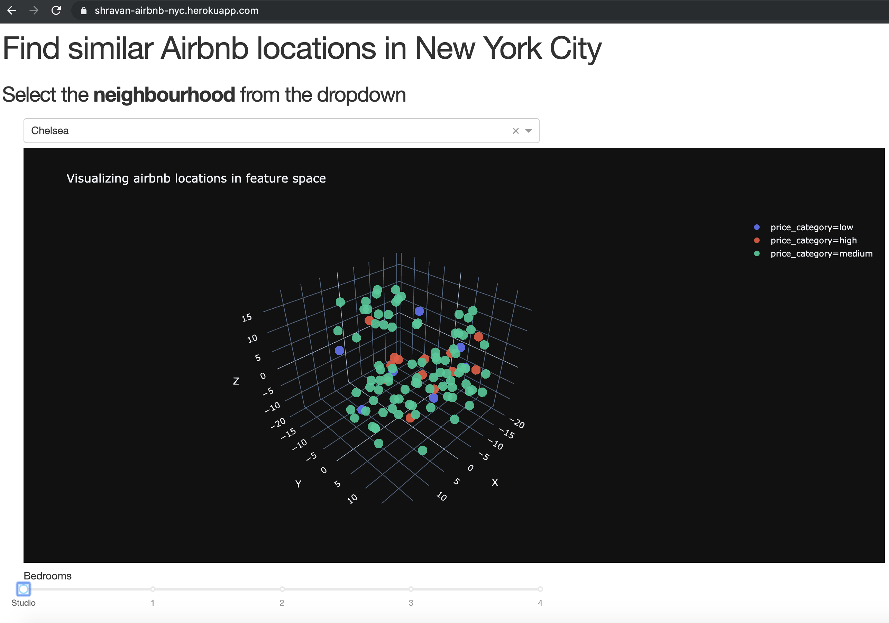

## Deploy a data dashboard to Heroku
Assuming that you are doing this from scratch, here is an outline of the tasks that you need to take for deploying a python Dash application to Heroku. Dash is framework built on top of Plotly, which lets you create interactive dashboards such as the one shown below. If you are comfortable working with Pandas and heard of Flask before, then creating this application is relatively easy.

> front_end(Dash + Plotly) <-> back_end(Flask + Pandas)



**Outline**:
1. Create a python virtual environment using venv
2. Install only the packages that are needed by your web application, freeze them into requirements.txt
3. Develop your data wrangling script and app.py
4. Launch the app locally and verify it works
5. Create a Procfile which tells Heroku what to do.
6. Install the Heroku CLI on your laptop
7. Create a Heroku account (its free)
8. Login to Heroku
9. Initialize a git repo, add the files, commit them. (Don't push yet!)
10. Create an application in Heroku from command line. (This will set your remotes)
11. Deploy the application by pushing the changes. 

Each of these steps along with their output is discussed below.

**Directory Structure**:
Here's a simple directory structure of my web app. I will explain how to create each of these files and what they are for.

```
web-app/
├── Procfile
├── app.py
├── data
│   └── tsne_final.csv
├── requirements.txt
└── wrangling_scripts
    ├── wrangling.py
```

### 1. Create a python virtual environment using venv
From your working directory, create a directory called `web-app` (can be anything), this will hold all the application files. From the same level as `web-app` create a virtual environment. See below for output:

> Note: Difference between Virtual Environment and Conda Environment Read here: https://gist.github.com/shravan-kuchkula/727e4732e544493949c19834f439a7c4 

Run the below command to create a new Virtual Environment. That will create a new python virtual environment.

```bash
(base) shravan-airbnb$ python3 -m venv airbnb-dash
(base) shravan-airbnb$ ls -rtl
total 0
drwxr-xr-x@ 6 shravan  staff  192 Oct 10 18:02 web-app
drwxr-xr-x  6 shravan  staff  192 Oct 10 18:19 airbnb-dash
```

**Activate the venv using** `source env-name/bin/activate`
```
(base) shravan-airbnb$ source airbnb-dash/bin/activate
(airbnb-dash) (base) shravan-airbnb$
```

### 2. Install only the packages needed by your webapp and freeze them
- flask and pandas are our backend
- plotly and dash are our frontend
- guincorn: "Green Unicorn" is a Python Web Server Gateway Interface HTTP server. 

```
cd web-app
pip install flask pandas plotly gunicorn dash==1.4.0 dash-daq==0.2.1
```

```
pip freeze > requirements.txt
```

### 3. Develop your data wrangling script and app.py
You may choose to do all your data wrangling withing the wrangling script or to keep things simple, you can do all your data processing steps ahead of time and save a copy of the cleaned dataset in the data directory. The choice largely depends on the visualization you are creating. 

Since I am creating a 3D scatter plot of the tsne visualization on static data as opposed to streaming data, I went ahead and calculated the tsne features ahead of time and stored the results in the file `tsne_final.csv`. 

Inside the `wrangling.py` script, I just read in the dataset and filter out the rows based on the neighborhood and bedrooms that I get from the front end.

```python
def data_wrangling(neighbourhood, bedrooms):
    df = pd.read_csv('data/tsne_final.csv')

    # filter the dataframe to show only data by neighborhood and bedrooms.
    df = df[(df.neighbourhood_cleansed == neighbourhood) & (df.bedrooms == bedrooms)]

    # get only required cols
    cols = ['TSNE1', 'TSNE2', 'TSNE3', 'name', 'price_category', 'price', 'minimum_nights', 'id', 'bedrooms']

    df = df[cols]

    return df
```

In the above function, all we are doing is reading the dataset and filtering the rows and columns based on what was passed from front-end.

The `app.py` encapsulates all the front-end logic. It essentially consists of 3 parts:

**part1:** Dash specific code to for deploying to Heroku

```python
app = dash.Dash(__name__, external_stylesheets=external_stylesheets)

# this is needed for the procfile to deploy to heroku
server = app.server

if __name__ == '__main__':
    app.run_server(debug=True)
```

**part2:** app.layout section

Dash apps are composed of two parts. The first part is the "layout" of the app and it describes what the application looks like. The second part describes the interactivity of the application.

For the layout section Dash provides Python classes for all of the visual components of the application. They are maintained as a set of components in the `dash_core_components` and the `dash_html_components` libraries.

```python
import dash
import dash_core_components as dcc
import dash_html_components as html
```

Read here for more: [dash](https://dash.plot.ly/getting-started)

**part3:** app.callback section
This part describes the interactivity of the application. It is very intuitively names Input and Output 

```python
from dash.dependencies import Input, Output
@app.callback(
    Output(component_id='3d-scatter-plot', component_property='figure'),
    [Input(component_id='dropdown', component_property='value'),
    Input(component_id='bedroom-slider', component_property='value')]
)
```

The id's here refer to the HTML elements defined in the layout section. Simply, we are saying that the output of this function should be displayed in the element with id **3d-scatter-plot** and the inputs to this function are from the elements **dropdown** and **bedroom-slider**. Within the function, we pass the inputs to the data wrangling function to get a filtered dataframe. Next, we use the `plotly.express` 3-D scatter plot to display the filtered data in 3-D plot. Lastly, we return the figure, which will be displayed inside the HTML element.

```python
@app.callback(
    Output(component_id='3d-scatter-plot', component_property='figure'),
    [Input(component_id='dropdown', component_property='value'),
    Input(component_id='bedroom-slider', component_property='value')]
)
def update_function(dropdown_input_value, slider_price):

    # filter the dataframe
    df = data_wrangling(dropdown_input_value, slider_price)

    # use that dataframe in the figure
    fig = px.scatter_3d(df, x='TSNE1', y='TSNE2', z='TSNE3', color='price_category',
                    hover_name='name', hover_data=['price', 'bedrooms', 'minimum_nights', 'id'],
                    template='plotly_dark', opacity=0.9, title='Visualizing airbnb locations in feature space',
                    labels={'TSNE1': 'X', 'TSNE2': 'Y', 'TSNE3':'Z'})

    return fig
```

### 4. Launch the app locally and verify it works
From `web-app` directory where you have the `app.py` script, run the following command to launch the Dash app locally.

```bash
$ python app.py
```
```bash
Running on http://127.0.0.1:8050/
Debugger PIN: 956-561-487
 * Serving Flask app "app" (lazy loading)
 * Environment: production
   WARNING: This is a development server. Do not use it in a production deployment.
   Use a production WSGI server instead.
 * Debug mode: on
Running on http://127.0.0.1:8050/
Debugger PIN: 315-003-195
```


### 5. Create a Procfile which tells Heroku what to do
You are telling to map your app to server. This is inside your app.py file that you defined in Step3 part1.
```
web gunicorn app:server
```

### 6 and 7.  Install Heroku cli  and create a heroku account
Just download it from Heroku website. It is simple installation. Create an account.

### 8. Run heroku login
This will launch a web page where you need to authenticate yourself.
```
heroku login
```

### 9. Initialize the git repo

Initialize a git repository, then add and commit.
```bash
/Users/shravan/projects/plotly-webapp/web_app
(airbnb-dash) (base) shravan-web_app$ git init
Initialized empty Git repository in /Users/shravan/projects/plotly-webapp/web_app/.git/
(airbnb-dash) (base) shravan-web_app$ git add .
(airbnb-dash) (base) shravan-web_app$ git commit -m 'initial commit for the heroku web app'
```

### 10. Create a heroku application

Run `heroku create <app-name>`. Here the app name must be unique globally.
```bash
(airbnb-dash) (base) shravan-web_app$ heroku create shravan-airbnb-nyc
Creating ⬢ shravan-airbnb-nyc... done
https://shravan-airbnb-nyc.herokuapp.com/ | https://git.heroku.com/shravan-airbnb-nyc.git
(airbnb-dash) (base) shravan-web-app$ git remote -v
heroku	https://git.heroku.com/shravan-airbnb-nyc.git (fetch)
heroku	https://git.heroku.com/shravan-airbnb-nyc.git (push)
```

### 11. Deploy the application

The deployment is as simple as running a `git push heroku master`. 

```
(airbnb-dash) (base) shravan-web-app$ git push heroku master
Enumerating objects: 5, done.
Counting objects: 100% (5/5), done.
Delta compression using up to 12 threads
Compressing objects: 100% (3/3), done.
Writing objects: 100% (3/3), 294 bytes | 294.00 KiB/s, done.
Total 3 (delta 2), reused 0 (delta 0)
remote: Compressing source files... done.
remote: Building source:
remote:
remote: -----> Python app detected
remote: -----> Installing requirements with pip
remote:
remote: -----> Discovering process types
remote:        Procfile declares types -> web
remote:
remote: -----> Compressing...
remote:        Done: 98.6M
remote: -----> Launching...
remote:        Released v13
remote:        https://shravan-airbnb-nyc.herokuapp.com/ deployed to Heroku
remote:
remote:
remote: Verifying deploy... done.
To https://git.heroku.com/shravan-airbnb-nyc.git
   c5f9235..104f2b0  master -> master
(airbnb-dash) (base) shravan-web-app$
```

## Conclusion
A lot of times when working with large datasets, visualization becomes a challenge. One way to tackle that is to create an interactive dashboard, wherein, we can filter out the data based on categories and investigate the relationships between variables. In my case, visualizing hundreds of airbnb listings in a scatter plot was making the visual a little difficult to read, thus I created this interactive dashboard.
