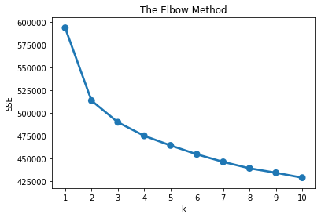
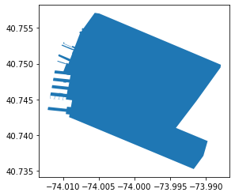

## K-means to find similar Airbnb listings in NYC
The objective of K-means is simply to group *similar* data points together and discover underlying patterns. To achieve this objective, K-means looks for a fixed number (k) of clusters in a dataset. A cluster refers to a collection of data points aggregated together because of certain similarities. You’ll define a target number k, which refers to the number of centroids you need in the dataset. This is how the algorithm works:
- It starts by selecting randomly allocated centriods, which are used as the beginning points of every cluster, and then performs iterative calculations to optimize the position of the centriods.
- This process continues until: 
    - The centroids have stabilized — there is no change in their values because the clustering has been successful.
    - The defined number of iterations has been achieved.

For accurate clustering results K-means expects the data to adhere to the following assumptions:
- Equal average values of variables
- Equal standard deviation of variables
- Symmetrical distribution of variables

It is our duty to ensure that these assumptions have been met during the pre-processing stage. We tackled these assumptions in the data pre-processing stage, so we are good to continue with our clustering task. 

The last thing we need before we get the clusters is to choose the number of clusters. The next section deals with methods for choosing the right number of clusters for our dataset.

## Deciding on the K-value
There are several methods for deciding the correct k-value:
- Visual Methods: elbow criteria
- Mathematical methods: silhouette coefficient
- Experimentation and interpretation

We will be using the elbow method to decide the value of K to use. The **elbow criterion method, plots the number of clusters against within-cluster sum-of-squared-errors (SSE)** - *which is the sum of squared distances from every data point to their cluster center.*  We then look at the chart to find where the decrease in SSE slows down and becomes somewhat marginal, that point looks like an elbow and suggests the point of diminishing returns by increasing the number of clusters. This point represents the optimal number of clusters from a sum-of-squared-errors perspective. However, we should choose several options around the elbow to test what makes the most sense. 

## Get the data
Let's begin our analysis by taking the output dataset of the PCA analysis, check here for the steps used to construct this dataset: [NYC Airbnb PCA analysis](https://shravan-kuchkula.github.io/nyc-airbnb-pca/#save-and-upload-to-s3)


```python
# import the necessary libraries
import seaborn as sns
import matplotlib.pyplot as plt
import pandas as pd

# get the data
data = pd.read_csv('../data/raw/airbnb_final.csv')
data.head()
```


<div>
<style scoped>
    .dataframe tbody tr th:only-of-type {
        vertical-align: middle;
    }

    .dataframe tbody tr th {
        vertical-align: top;
    }

    .dataframe thead th {
        text-align: right;
    }
</style>
<table border="1" class="dataframe">
  <thead>
    <tr style="text-align: right;">
      <th></th>
      <th>price_category</th>
      <th>name</th>
      <th>id</th>
      <th>price</th>
      <th>adjusted_price</th>
      <th>minimum_nights</th>
      <th>bedrooms</th>
      <th>bathrooms</th>
      <th>neighbourhood_group_cleansed</th>
      <th>neighbourhood_cleansed</th>
      <th>...</th>
      <th>40</th>
      <th>41</th>
      <th>42</th>
      <th>43</th>
      <th>44</th>
      <th>45</th>
      <th>46</th>
      <th>47</th>
      <th>48</th>
      <th>49</th>
    </tr>
  </thead>
  <tbody>
    <tr>
      <td>0</td>
      <td>high</td>
      <td>Skylit Midtown Castle</td>
      <td>2595</td>
      <td>225.0</td>
      <td>225.000000</td>
      <td>1</td>
      <td>0.0</td>
      <td>1.0</td>
      <td>Manhattan</td>
      <td>Midtown</td>
      <td>...</td>
      <td>0.576904</td>
      <td>0.466956</td>
      <td>0.331311</td>
      <td>0.261779</td>
      <td>-0.330193</td>
      <td>1.620287</td>
      <td>0.867739</td>
      <td>-0.798060</td>
      <td>-0.576860</td>
      <td>-0.254925</td>
    </tr>
    <tr>
      <td>1</td>
      <td>medium</td>
      <td>THE VILLAGE OF HARLEM....NEW YORK !</td>
      <td>3647</td>
      <td>150.0</td>
      <td>50.000000</td>
      <td>3</td>
      <td>1.0</td>
      <td>1.0</td>
      <td>Manhattan</td>
      <td>Harlem</td>
      <td>...</td>
      <td>-0.252328</td>
      <td>0.226731</td>
      <td>0.269839</td>
      <td>-0.211928</td>
      <td>0.147831</td>
      <td>1.354929</td>
      <td>0.801862</td>
      <td>-0.292820</td>
      <td>-0.804985</td>
      <td>-0.202175</td>
    </tr>
    <tr>
      <td>2</td>
      <td>low</td>
      <td>Entire Apt: Spacious Studio/Loft by central park</td>
      <td>5022</td>
      <td>80.0</td>
      <td>8.000000</td>
      <td>10</td>
      <td>1.0</td>
      <td>1.0</td>
      <td>Manhattan</td>
      <td>East Harlem</td>
      <td>...</td>
      <td>0.193168</td>
      <td>0.068044</td>
      <td>0.015844</td>
      <td>0.197295</td>
      <td>-0.167786</td>
      <td>1.117572</td>
      <td>0.749340</td>
      <td>0.109282</td>
      <td>-0.870940</td>
      <td>-0.278948</td>
    </tr>
    <tr>
      <td>3</td>
      <td>medium</td>
      <td>Large Cozy 1 BR Apartment In Midtown East</td>
      <td>5099</td>
      <td>200.0</td>
      <td>66.666667</td>
      <td>3</td>
      <td>1.0</td>
      <td>1.0</td>
      <td>Manhattan</td>
      <td>Murray Hill</td>
      <td>...</td>
      <td>0.416250</td>
      <td>-0.057388</td>
      <td>0.073780</td>
      <td>0.143102</td>
      <td>0.198163</td>
      <td>1.440193</td>
      <td>0.641507</td>
      <td>-0.021390</td>
      <td>-0.912154</td>
      <td>-0.285108</td>
    </tr>
    <tr>
      <td>4</td>
      <td>low</td>
      <td>BlissArtsSpace!</td>
      <td>5121</td>
      <td>60.0</td>
      <td>1.333333</td>
      <td>45</td>
      <td>1.0</td>
      <td>1.0</td>
      <td>Brooklyn</td>
      <td>Bedford-Stuyvesant</td>
      <td>...</td>
      <td>-0.214280</td>
      <td>-0.095810</td>
      <td>0.224063</td>
      <td>0.083689</td>
      <td>-0.192449</td>
      <td>0.410582</td>
      <td>0.017357</td>
      <td>0.246550</td>
      <td>0.796558</td>
      <td>0.307420</td>
    </tr>
  </tbody>
</table>
<p>5 rows × 60 columns</p>
</div>


We are interested only in the Principal Components data, starting from 10th column


```python
# gather all the PCA components
# rename the PC columns
pc_col_names = ["pc_" + item for item in list(data.columns[10:])]

# extract the 50 principal components
pc_data = data.iloc[:, 10:]

# rename the columns
pc_data.columns = pc_col_names
```

We are going to use the 50 principal components that we constructed in this post: [NYC Airbnb PCA](https://shravan-kuchkula.github.io/nyc-airbnb-pca/) .Displayed below is the shape and head of these components.


```python
pc_data.shape
```


    (45605, 50)


```python
pc_data.head()
```


<div>
<style scoped>
    .dataframe tbody tr th:only-of-type {
        vertical-align: middle;
    }

    .dataframe tbody tr th {
        vertical-align: top;
    }

    .dataframe thead th {
        text-align: right;
    }
</style>
<table border="1" class="dataframe">
  <thead>
    <tr style="text-align: right;">
      <th></th>
      <th>pc_0</th>
      <th>pc_1</th>
      <th>pc_2</th>
      <th>pc_3</th>
      <th>pc_4</th>
      <th>pc_5</th>
      <th>pc_6</th>
      <th>pc_7</th>
      <th>pc_8</th>
      <th>pc_9</th>
      <th>...</th>
      <th>pc_40</th>
      <th>pc_41</th>
      <th>pc_42</th>
      <th>pc_43</th>
      <th>pc_44</th>
      <th>pc_45</th>
      <th>pc_46</th>
      <th>pc_47</th>
      <th>pc_48</th>
      <th>pc_49</th>
    </tr>
  </thead>
  <tbody>
    <tr>
      <th>0</th>
      <td>2.658552</td>
      <td>-1.455526</td>
      <td>0.699093</td>
      <td>-0.553412</td>
      <td>-0.125384</td>
      <td>-0.654187</td>
      <td>-0.044713</td>
      <td>-0.001357</td>
      <td>0.108582</td>
      <td>1.333186</td>
      <td>...</td>
      <td>0.576904</td>
      <td>0.466956</td>
      <td>0.331311</td>
      <td>0.261779</td>
      <td>-0.330193</td>
      <td>1.620287</td>
      <td>0.867739</td>
      <td>-0.798060</td>
      <td>-0.576860</td>
      <td>-0.254925</td>
    </tr>
    <tr>
      <th>1</th>
      <td>-1.644174</td>
      <td>-0.715321</td>
      <td>1.097099</td>
      <td>0.893833</td>
      <td>0.399013</td>
      <td>-0.139751</td>
      <td>-1.183842</td>
      <td>-1.132572</td>
      <td>0.996817</td>
      <td>0.151908</td>
      <td>...</td>
      <td>-0.252328</td>
      <td>0.226731</td>
      <td>0.269839</td>
      <td>-0.211928</td>
      <td>0.147831</td>
      <td>1.354929</td>
      <td>0.801862</td>
      <td>-0.292820</td>
      <td>-0.804985</td>
      <td>-0.202175</td>
    </tr>
    <tr>
      <th>2</th>
      <td>-1.012114</td>
      <td>-1.718006</td>
      <td>-0.320889</td>
      <td>-0.356113</td>
      <td>0.113797</td>
      <td>0.392780</td>
      <td>-0.399569</td>
      <td>-0.819086</td>
      <td>-0.133456</td>
      <td>-0.200684</td>
      <td>...</td>
      <td>0.193168</td>
      <td>0.068044</td>
      <td>0.015844</td>
      <td>0.197295</td>
      <td>-0.167786</td>
      <td>1.117572</td>
      <td>0.749340</td>
      <td>0.109282</td>
      <td>-0.870940</td>
      <td>-0.278948</td>
    </tr>
    <tr>
      <th>3</th>
      <td>0.067402</td>
      <td>-0.520919</td>
      <td>-0.263865</td>
      <td>0.353879</td>
      <td>-0.907122</td>
      <td>-0.906052</td>
      <td>-1.158888</td>
      <td>-0.624668</td>
      <td>-0.071571</td>
      <td>0.780228</td>
      <td>...</td>
      <td>0.416250</td>
      <td>-0.057388</td>
      <td>0.073780</td>
      <td>0.143102</td>
      <td>0.198163</td>
      <td>1.440193</td>
      <td>0.641507</td>
      <td>-0.021390</td>
      <td>-0.912154</td>
      <td>-0.285108</td>
    </tr>
    <tr>
      <th>4</th>
      <td>-1.666907</td>
      <td>1.296202</td>
      <td>0.520533</td>
      <td>0.659033</td>
      <td>1.262238</td>
      <td>-0.516450</td>
      <td>-0.827510</td>
      <td>-0.678685</td>
      <td>0.010626</td>
      <td>0.180606</td>
      <td>...</td>
      <td>-0.214280</td>
      <td>-0.095810</td>
      <td>0.224063</td>
      <td>0.083689</td>
      <td>-0.192449</td>
      <td>0.410582</td>
      <td>0.017357</td>
      <td>0.246550</td>
      <td>0.796558</td>
      <td>0.307420</td>
    </tr>
  </tbody>
</table>
<p>5 rows × 50 columns</p>
</div>


### Fit K-means for K=1 to K=10 clusters and use Elbow Method


```python
# Fit Kmeans and calculate SSE for each k value
sse = {}
for k in range(1, 11):
    kmeans = KMeans(n_clusters=k, random_state=1)
    kmeans.fit(pc_data)
    sse[k] = kmeans.inertia_ # sum of squared distances to the closest cluster centers
```


```python
# plot SSE for each k
plt.title('The Elbow Method')
plt.xlabel('k')
plt.ylabel('SSE')
sns.pointplot(x=list(sse.keys()), y=list(sse.values()))
plt.show()
```





### Using K=3
Looking at the above Elbow plot, we can see that for K-values of 2 and 3, there is a sharp decrease in SSE. I chose the value of K=3 instead of K=2, since I broke down the airbnb listings into 3 price categories: high, medium, low, and I want to see if K-means clustering picked out the listings by grouping them as per their price range.


```python
kmeans = KMeans(n_clusters=3, random_state=1)
kmeans.fit(pc_data)
```


    KMeans(algorithm='auto', copy_x=True, init='k-means++', max_iter=300,
           n_clusters=3, n_init=10, n_jobs=None, precompute_distances='auto',
           random_state=1, tol=0.0001, verbose=0)


```python
# get the labels
cluster_labels = kmeans.labels_

# assign these clusters back into the dataframe
pc_data_k3 = pc_data.assign(cluster=cluster_labels)

# display the shape
pc_data_k3.shape
```


    (45605, 51)


```python
pc_data_k3.cluster.value_counts()
```


    2    16801
    0    14767
    1    14037
    Name: cluster, dtype: int64


## Combine cluster labels with the main dataset for visualization


```python
other_col_names = list(data.columns[:10])
other_col_names
```


    ['price_category',
     'name',
     'id',
     'price',
     'adjusted_price',
     'minimum_nights',
     'bedrooms',
     'bathrooms',
     'neighbourhood_group_cleansed',
     'neighbourhood_cleansed']


```python
k_means_visual = data[other_col_names]
k_means_visual.shape
```


    (45605, 10)


```python
k_means_visual = k_means_visual.assign(cluster=cluster_labels)
k_means_visual.head()
```


<div>
<style scoped>
    .dataframe tbody tr th:only-of-type {
        vertical-align: middle;
    }

    .dataframe tbody tr th {
        vertical-align: top;
    }

    .dataframe thead th {
        text-align: right;
    }
</style>
<table border="1" class="dataframe">
  <thead>
    <tr style="text-align: right;">
      <th></th>
      <th>price_category</th>
      <th>name</th>
      <th>id</th>
      <th>price</th>
      <th>adjusted_price</th>
      <th>minimum_nights</th>
      <th>bedrooms</th>
      <th>bathrooms</th>
      <th>neighbourhood_group_cleansed</th>
      <th>neighbourhood_cleansed</th>
      <th>cluster</th>
    </tr>
  </thead>
  <tbody>
    <tr>
      <th>0</th>
      <td>high</td>
      <td>Skylit Midtown Castle</td>
      <td>2595</td>
      <td>225.0</td>
      <td>225.000000</td>
      <td>1</td>
      <td>0.0</td>
      <td>1.0</td>
      <td>Manhattan</td>
      <td>Midtown</td>
      <td>1</td>
    </tr>
    <tr>
      <th>1</th>
      <td>medium</td>
      <td>THE VILLAGE OF HARLEM....NEW YORK !</td>
      <td>3647</td>
      <td>150.0</td>
      <td>50.000000</td>
      <td>3</td>
      <td>1.0</td>
      <td>1.0</td>
      <td>Manhattan</td>
      <td>Harlem</td>
      <td>2</td>
    </tr>
    <tr>
      <th>2</th>
      <td>low</td>
      <td>Entire Apt: Spacious Studio/Loft by central park</td>
      <td>5022</td>
      <td>80.0</td>
      <td>8.000000</td>
      <td>10</td>
      <td>1.0</td>
      <td>1.0</td>
      <td>Manhattan</td>
      <td>East Harlem</td>
      <td>2</td>
    </tr>
    <tr>
      <th>3</th>
      <td>medium</td>
      <td>Large Cozy 1 BR Apartment In Midtown East</td>
      <td>5099</td>
      <td>200.0</td>
      <td>66.666667</td>
      <td>3</td>
      <td>1.0</td>
      <td>1.0</td>
      <td>Manhattan</td>
      <td>Murray Hill</td>
      <td>2</td>
    </tr>
    <tr>
      <th>4</th>
      <td>low</td>
      <td>BlissArtsSpace!</td>
      <td>5121</td>
      <td>60.0</td>
      <td>1.333333</td>
      <td>45</td>
      <td>1.0</td>
      <td>1.0</td>
      <td>Brooklyn</td>
      <td>Bedford-Stuyvesant</td>
      <td>0</td>
    </tr>
  </tbody>
</table>
</div>


```python
k_means_visual.shape
```


    (45605, 11)


## Save and upload to S3


```python
k_means_visual.to_csv('k_means_visual.csv', index=False)
```


```python
import configparser
config = configparser.ConfigParser()
config.read_file(open('/Users/shravan/projects/interview-prep/credentials.cfg'))

KEY = config.get('AWS','KEY')
SECRET = config.get('AWS','SECRET')
```


```python
import boto3

# Generate the boto3 client for interacting with S3
s3 = boto3.client('s3', region_name='us-east-1', 
                        # Set up AWS credentials 
                        aws_access_key_id=KEY, 
                        aws_secret_access_key=SECRET)
```


```python
s3.upload_file(Bucket='skuchkula-sagemaker-airbnb',
              Filename='k_means_visual.csv',
              Key='feature/k_means_visual.csv')
```

## Visualize K-means clusters on a folium map
It is possible to visualize each of the airbnb listings on a map and color code them based on the cluster they are assigned. By using `geopandas` and `folium` we can project each of the listings onto the New York City map.

`folium` builds on the data wrangling strengths of the Python ecosystem and the mapping strengths of the leaflet.js library. Manipulate your data in Python, then visualize it in on a Leaflet map via folium. Read more about
[folium](https://python-visualization.github.io/folium/index.html)


```python
import numpy as np
import os
import geopandas
import folium
%matplotlib inline
```

In order to visualize the data on a map, we need the latitude and longitude information for each listing. This is available from the data cleaning blog [NYC Airbnb Data Cleaning](https://shravan-kuchkula.github.io/nyc-airbnb-data-cleaning/#upload-the-cleaned-file-to-s3), where the **upload-the-cleaned-file-to-s3** section contains the dataset with the same rows **45605** which was obtained after filtering out some property types. Let's load that dataset in.


```python
# read in the dataset
airbnb_clean = pd.read_csv('../data/raw/airbnb_clean.csv')
airbnb_clean.shape
```


    (45605, 67)


```python
# get only the latitude and longitude of each listing
airbnb_coord = airbnb_clean[['latitude', 'longitude']]

# concatenate the coordinates with k_means results 
k_means_map = pd.concat([k_means_visual, airbnb_coord], axis=1)
```

The `geojson` files encode the polygons representing a geographic entity. Example, a neighbourhood in NYC like Chelsea is represented as a polygon. To read in a **geojson** file, we will be using the `geopandas.read_file()`. 


```python
# data directory
data_dir = "../data"
raw_data = os.path.join(data_dir, "raw")

# read in the data
nbhoods = geopandas.read_file(os.path.join(raw_data, "neighbourhoods.geojson"))
subway = geopandas.read_file(os.path.join(raw_data, "subway.geojson"))
```

Since the k-means results dataframe is just a pandas dataframe, our first task in working with geopandas is to convert our pandas dataframe into a geopandas dataframe. To do this, simply pass the longitude and latitude values to the `points_from_xy()` method and assign that to the *geometry* argument while constructing the `GeoDataFrame()`.


```python
# construct a geodataframe
k_means_map_geo = geopandas.GeoDataFrame(k_means_map, geometry=geopandas.points_from_xy(k_means_map.longitude, 
                                                                            k_means_map.latitude))
```

The beauty of a geodataframe is that we can isolate a geographic location based on simple pandas dataframe like filtering. For example, if I wanted the polygon representing Chelsea, we can get that using:


```python
# get chelsea neighborhood
chelsea = nbhoods[nbhoods.neighbourhood == 'Chelsea'].geometry
ax=chelsea.plot()
```





Now that we have the polygon representing **Chelsea**, our next step is to get the co-ordinates of all the airbnb listings within chelsea. Again, since our dataframe is a geodataframe, we can simply use pandas filtering to isolate all the listings with this criteria: ***Get airbnb listings in Chelsea with 1 bedroom and which require minimum nights of 1 and that are below 150 dollars.*** . I've used this filtering to avoid over-crowding in my visualization.


```python
# get chelsea airbnb listings co-ordinates and their assigned clusters
chelsea_listings = k_means_map_geo[(k_means_map_geo.neighbourhood_cleansed == 'Chelsea') & 
                (k_means_map_geo.bedrooms == 1) & (k_means_map_geo.minimum_nights == 1) & 
               (k_means_map_geo.price < 150)]
```

Finally, we are ready to use the `folium.Map` and project our listings onto this map. The folium Map constructor takes an initial starting co-ordinate to center the map on. I chose a random location close to the center of Chelsea neighborhood. 

Next, we iterate over the dataframe and use the row values to assign each cluster a unique color. We then specify a popup string to be displayed when the user clicks on the marker. 

The marker itself, takes the **location**, **popup** and **icon** - the icon color is based on the K-means cluster number associated with the listing. 


```python
m = folium.Map(location=[40.74601, -73.99987], zoom_start=14.5)
folium.GeoJson(chelsea).add_to(m)

# Build markers and popups
for row in chelsea_listings.iterrows():
    row_values = row[1]
    center_point = row_values['geometry']
    location = [center_point.y, center_point.x]
    if row_values['cluster'] == 0:
        marker_color = 'lightred'
    elif row_values['cluster'] == 1:
        marker_color = 'cadetblue'
    else:
        marker_color = 'lightgreen'
    popup = ('NAME: ' + str(row_values['name']) + 
             '  ' + 'PRICE: $' + str(row_values['price']))
    marker = folium.Marker(location = location, popup = popup, icon=folium.Icon(color=marker_color, icon='home'))
    marker.add_to(m)

display(m)
```


<div style="width:100%;"><div style="position:relative;width:100%;height:0;padding-bottom:60%;"><iframe src="data:text/html;charset=utf-8;base64,PCFET0NUWVBFIGh0bWw+CjxoZWFkPiAgICAKICAgIDxtZXRhIGh0dHAtZXF1aXY9ImNvbnRlbnQtdHlwZSIgY29udGVudD0idGV4dC9odG1sOyBjaGFyc2V0PVVURi04IiAvPgogICAgCiAgICAgICAgPHNjcmlwdD4KICAgICAgICAgICAgTF9OT19UT1VDSCA9IGZhbHNlOwogICAgICAgICAgICBMX0RJU0FCTEVfM0QgPSBmYWxzZTsKICAgICAgICA8L3NjcmlwdD4KICAgIAogICAgPHNjcmlwdCBzcmM9Imh0dHBzOi8vY2RuLmpzZGVsaXZyLm5ldC9ucG0vbGVhZmxldEAxLjUuMS9kaXN0L2xlYWZsZXQuanMiPjwvc2NyaXB0PgogICAgPHNjcmlwdCBzcmM9Imh0dHBzOi8vY29kZS5qcXVlcnkuY29tL2pxdWVyeS0xLjEyLjQubWluLmpzIj48L3NjcmlwdD4KICAgIDxzY3JpcHQgc3JjPSJodHRwczovL21heGNkbi5ib290c3RyYXBjZG4uY29tL2Jvb3RzdHJhcC8zLjIuMC9qcy9ib290c3RyYXAubWluLmpzIj48L3NjcmlwdD4KICAgIDxzY3JpcHQgc3JjPSJodHRwczovL2NkbmpzLmNsb3VkZmxhcmUuY29tL2FqYXgvbGlicy9MZWFmbGV0LmF3ZXNvbWUtbWFya2Vycy8yLjAuMi9sZWFmbGV0LmF3ZXNvbWUtbWFya2Vycy5qcyI+PC9zY3JpcHQ+CiAgICA8bGluayByZWw9InN0eWxlc2hlZXQiIGhyZWY9Imh0dHBzOi8vY2RuLmpzZGVsaXZyLm5ldC9ucG0vbGVhZmxldEAxLjUuMS9kaXN0L2xlYWZsZXQuY3NzIi8+CiAgICA8bGluayByZWw9InN0eWxlc2hlZXQiIGhyZWY9Imh0dHBzOi8vbWF4Y2RuLmJvb3RzdHJhcGNkbi5jb20vYm9vdHN0cmFwLzMuMi4wL2Nzcy9ib290c3RyYXAubWluLmNzcyIvPgogICAgPGxpbmsgcmVsPSJzdHlsZXNoZWV0IiBocmVmPSJodHRwczovL21heGNkbi5ib290c3RyYXBjZG4uY29tL2Jvb3RzdHJhcC8zLjIuMC9jc3MvYm9vdHN0cmFwLXRoZW1lLm1pbi5jc3MiLz4KICAgIDxsaW5rIHJlbD0ic3R5bGVzaGVldCIgaHJlZj0iaHR0cHM6Ly9tYXhjZG4uYm9vdHN0cmFwY2RuLmNvbS9mb250LWF3ZXNvbWUvNC42LjMvY3NzL2ZvbnQtYXdlc29tZS5taW4uY3NzIi8+CiAgICA8bGluayByZWw9InN0eWxlc2hlZXQiIGhyZWY9Imh0dHBzOi8vY2RuanMuY2xvdWRmbGFyZS5jb20vYWpheC9saWJzL0xlYWZsZXQuYXdlc29tZS1tYXJrZXJzLzIuMC4yL2xlYWZsZXQuYXdlc29tZS1tYXJrZXJzLmNzcyIvPgogICAgPGxpbmsgcmVsPSJzdHlsZXNoZWV0IiBocmVmPSJodHRwczovL3Jhd2Nkbi5naXRoYWNrLmNvbS9weXRob24tdmlzdWFsaXphdGlvbi9mb2xpdW0vbWFzdGVyL2ZvbGl1bS90ZW1wbGF0ZXMvbGVhZmxldC5hd2Vzb21lLnJvdGF0ZS5jc3MiLz4KICAgIDxzdHlsZT5odG1sLCBib2R5IHt3aWR0aDogMTAwJTtoZWlnaHQ6IDEwMCU7bWFyZ2luOiAwO3BhZGRpbmc6IDA7fTwvc3R5bGU+CiAgICA8c3R5bGU+I21hcCB7cG9zaXRpb246YWJzb2x1dGU7dG9wOjA7Ym90dG9tOjA7cmlnaHQ6MDtsZWZ0OjA7fTwvc3R5bGU+CiAgICAKICAgICAgICAgICAgPG1ldGEgbmFtZT0idmlld3BvcnQiIGNvbnRlbnQ9IndpZHRoPWRldmljZS13aWR0aCwKICAgICAgICAgICAgICAgIGluaXRpYWwtc2NhbGU9MS4wLCBtYXhpbXVtLXNjYWxlPTEuMCwgdXNlci1zY2FsYWJsZT1ubyIgLz4KICAgICAgICAgICAgPHN0eWxlPgogICAgICAgICAgICAgICAgI21hcF84MWYyOWM0OTRlNjY0NTQ5YjdhMGIxYjEyYTVhMTRmNSB7CiAgICAgICAgICAgICAgICAgICAgcG9zaXRpb246IHJlbGF0aXZlOwogICAgICAgICAgICAgICAgICAgIHdpZHRoOiAxMDAuMCU7CiAgICAgICAgICAgICAgICAgICAgaGVpZ2h0OiAxMDAuMCU7CiAgICAgICAgICAgICAgICAgICAgbGVmdDogMC4wJTsKICAgICAgICAgICAgICAgICAgICB0b3A6IDAuMCU7CiAgICAgICAgICAgICAgICB9CiAgICAgICAgICAgIDwvc3R5bGU+CiAgICAgICAgCjwvaGVhZD4KPGJvZHk+ICAgIAogICAgCiAgICAgICAgICAgIDxkaXYgY2xhc3M9ImZvbGl1bS1tYXAiIGlkPSJtYXBfODFmMjljNDk0ZTY2NDU0OWI3YTBiMWIxMmE1YTE0ZjUiID48L2Rpdj4KICAgICAgICAKPC9ib2R5Pgo8c2NyaXB0PiAgICAKICAgIAogICAgICAgICAgICB2YXIgbWFwXzgxZjI5YzQ5NGU2NjQ1NDliN2EwYjFiMTJhNWExNGY1ID0gTC5tYXAoCiAgICAgICAgICAgICAgICAibWFwXzgxZjI5YzQ5NGU2NjQ1NDliN2EwYjFiMTJhNWExNGY1IiwKICAgICAgICAgICAgICAgIHsKICAgICAgICAgICAgICAgICAgICBjZW50ZXI6IFs0MC43NDYwMSwgLTczLjk5OTg3XSwKICAgICAgICAgICAgICAgICAgICBjcnM6IEwuQ1JTLkVQU0czODU3LAogICAgICAgICAgICAgICAgICAgIHpvb206IDE0LjUsCiAgICAgICAgICAgICAgICAgICAgem9vbUNvbnRyb2w6IHRydWUsCiAgICAgICAgICAgICAgICAgICAgcHJlZmVyQ2FudmFzOiBmYWxzZSwKICAgICAgICAgICAgICAgIH0KICAgICAgICAgICAgKTsKCiAgICAgICAgICAgIAoKICAgICAgICAKICAgIAogICAgICAgICAgICB2YXIgdGlsZV9sYXllcl8yNjcxNzhiN2I4ZjQ0NjJlYjI5NGRlODhlOTgzOTQ0NyA9IEwudGlsZUxheWVyKAogICAgICAgICAgICAgICAgImh0dHBzOi8ve3N9LnRpbGUub3BlbnN0cmVldG1hcC5vcmcve3p9L3t4fS97eX0ucG5nIiwKICAgICAgICAgICAgICAgIHsiYXR0cmlidXRpb24iOiAiRGF0YSBieSBcdTAwMjZjb3B5OyBcdTAwM2NhIGhyZWY9XCJodHRwOi8vb3BlbnN0cmVldG1hcC5vcmdcIlx1MDAzZU9wZW5TdHJlZXRNYXBcdTAwM2MvYVx1MDAzZSwgdW5kZXIgXHUwMDNjYSBocmVmPVwiaHR0cDovL3d3dy5vcGVuc3RyZWV0bWFwLm9yZy9jb3B5cmlnaHRcIlx1MDAzZU9EYkxcdTAwM2MvYVx1MDAzZS4iLCAiZGV0ZWN0UmV0aW5hIjogZmFsc2UsICJtYXhOYXRpdmVab29tIjogMTgsICJtYXhab29tIjogMTgsICJtaW5ab29tIjogMCwgIm5vV3JhcCI6IGZhbHNlLCAib3BhY2l0eSI6IDEsICJzdWJkb21haW5zIjogImFiYyIsICJ0bXMiOiBmYWxzZX0KICAgICAgICAgICAgKS5hZGRUbyhtYXBfODFmMjljNDk0ZTY2NDU0OWI3YTBiMWIxMmE1YTE0ZjUpOwogICAgICAgIAogICAgCiAgICAgICAgZnVuY3Rpb24gZ2VvX2pzb25fNmQ0OGQ4OWYxMWQ1NDk2MjgwY2QyOGI3N2E4YmIxNjJfb25FYWNoRmVhdHVyZShmZWF0dXJlLCBsYXllcikgewogICAgICAgICAgICBsYXllci5vbih7CiAgICAgICAgICAgICAgICBjbGljazogZnVuY3Rpb24oZSkgewogICAgICAgICAgICAgICAgICAgIG1hcF84MWYyOWM0OTRlNjY0NTQ5YjdhMGIxYjEyYTVhMTRmNS5maXRCb3VuZHMoZS50YXJnZXQuZ2V0Qm91bmRzKCkpOwogICAgICAgICAgICAgICAgfQogICAgICAgICAgICB9KTsKICAgICAgICB9OwogICAgICAgIHZhciBnZW9fanNvbl82ZDQ4ZDg5ZjExZDU0OTYyODBjZDI4Yjc3YThiYjE2MiA9IEwuZ2VvSnNvbihudWxsLCB7CiAgICAgICAgICAgICAgICBvbkVhY2hGZWF0dXJlOiBnZW9fanNvbl82ZDQ4ZDg5ZjExZDU0OTYyODBjZDI4Yjc3YThiYjE2Ml9vbkVhY2hGZWF0dXJlLAogICAgICAgICAgICAKICAgICAgICB9KS5hZGRUbyhtYXBfODFmMjljNDk0ZTY2NDU0OWI3YTBiMWIxMmE1YTE0ZjUpOwogICAgICAgICAgICBnZW9fanNvbl82ZDQ4ZDg5ZjExZDU0OTYyODBjZDI4Yjc3YThiYjE2Mi5hZGREYXRhKHsiYmJveCI6IFstNzQuMDEyMTQ4LCA0MC43MzUyNDUsIC03My45ODc5MzMsIDQwLjc1NzExOF0sICJmZWF0dXJlcyI6IFt7ImJib3giOiBbLTc0LjAxMjE0OCwgNDAuNzM1MjQ1LCAtNzMuOTg3OTMzLCA0MC43NTcxMThdLCAiZ2VvbWV0cnkiOiB7ImNvb3JkaW5hdGVzIjogW1tbWy03My45OTM0NjQsIDQwLjc1MjE5XSwgWy03My45ODc5MzcsIDQwLjc0OTg1NV0sIFstNzMuOTg3OTMzLCA0MC43NDk4NTNdLCBbLTczLjk4Nzk3MywgNDAuNzQ5NDY3XSwgWy03My45OTEzNTYsIDQwLjc0NDc2M10sIFstNzMuOTk0MjExLCA0MC43NDEwMTNdLCBbLTczLjk4OTc3NywgNDAuNzM5MTY5XSwgWy03My45OTAzNzEsIDQwLjczNzA5OF0sIFstNzMuOTkxNzI1LCA0MC43MzUyNDVdLCBbLTczLjk5Njc5NywgNDAuNzM3MzY0XSwgWy03NC4wMDg4MSwgNDAuNzQyMzc4XSwgWy03NC4wMDkxNjEsIDQwLjc0MjUwOV0sIFstNzQuMDA5MDkyLCA0MC43NDI4ODZdLCBbLTc0LjAwOTI0LCA0MC43NDI5XSwgWy03NC4wMDk2MiwgNDAuNzQyOTUxXSwgWy03NC4wMDk2MiwgNDAuNzQyOTUyXSwgWy03NC4wMDk1NjgsIDQwLjc0MzI1OF0sIFstNzQuMDA5NTg1LCA0MC43NDMyNjRdLCBbLTc0LjAxMjExOSwgNDAuNzQzNTE3XSwgWy03NC4wMTIxMzcsIDQwLjc0MzUzMl0sIFstNzQuMDEyMTQ4LCA0MC43NDM1NTldLCBbLTc0LjAxMjA5LCA0MC43NDM4OThdLCBbLTc0LjAxMjA2OSwgNDAuNzQzOTIyXSwgWy03NC4wMTIwMjEsIDQwLjc0Mzk0XSwgWy03NC4wMDk1MTIsIDQwLjc0MzY3Nl0sIFstNzQuMDA5NDg5LCA0MC43NDM2OTZdLCBbLTc0LjAwOTQzOCwgNDAuNzQzOTcxXSwgWy03NC4wMDkzOTQsIDQwLjc0Mzk2OV0sIFstNzQuMDA4OSwgNDAuNzQzOTE4XSwgWy03NC4wMDg3MywgNDAuNzQ0ODgyXSwgWy03NC4wMDkxMDUsIDQwLjc0NDkzMV0sIFstNzQuMDA5NjEyLCA0MC43NDQ5OThdLCBbLTc0LjAwOTU1OCwgNDAuNzQ1Mjg5XSwgWy03NC4wMDk5MTcsIDQwLjc0NTMyN10sIFstNzQuMDA5OTM0LCA0MC43NDUzMTddLCBbLTc0LjAwOTk5OCwgNDAuNzQ0OTU1XSwgWy03NC4wMDk5ODcsIDQwLjc0NDk0NF0sIFstNzQuMDA5ODY5LCA0MC43NDQ5MzRdLCBbLTc0LjAwOTg3MiwgNDAuNzQ0OTE3XSwgWy03NC4wMTAxNjgsIDQwLjc0NDk0Ml0sIFstNzQuMDEwMTY1LCA0MC43NDQ5NjRdLCBbLTc0LjAxMDA1NCwgNDAuNzQ0OTU0XSwgWy03NC4wMTAwMzgsIDQwLjc0NDk2M10sIFstNzQuMDA5OTc0LCA0MC43NDUzMjNdLCBbLTc0LjAwOTk5MSwgNDAuNzQ1MzM3XSwgWy03NC4wMTA0NjksIDQwLjc0NTM4N10sIFstNzQuMDEwNDg4LCA0MC43NDUzNzZdLCBbLTc0LjAxMDU1LCA0MC43NDUwMTNdLCBbLTc0LjAxMDUzMiwgNDAuNzQ1MDAzXSwgWy03NC4wMTA0MTcsIDQwLjc0NDk5NF0sIFstNzQuMDEwNDE5LCA0MC43NDQ5NzddLCBbLTc0LjAxMDc2NCwgNDAuNzQ1MDA1XSwgWy03NC4wMTA3NjIsIDQwLjc0NTAyNF0sIFstNzQuMDEwNjA2LCA0MC43NDUwMTFdLCBbLTc0LjAxMDU4NiwgNDAuNzQ1MDJdLCBbLTc0LjAxMDUzMSwgNDAuNzQ1MzgyXSwgWy03NC4wMTA1NDUsIDQwLjc0NTM5Ml0sIFstNzQuMDExMTA0LCA0MC43NDU0NDhdLCBbLTc0LjAxMTExNiwgNDAuNzQ1NDM2XSwgWy03NC4wMTExNzIsIDQwLjc0NTA3OF0sIFstNzQuMDExMTUzLCA0MC43NDUwNjldLCBbLTc0LjAxMTA0MywgNDAuNzQ1MDYxXSwgWy03NC4wMTEwNDUsIDQwLjc0NTA0Nl0sIFstNzQuMDExMzg4LCA0MC43NDUwNzNdLCBbLTc0LjAxMTM4NiwgNDAuNzQ1MDg4XSwgWy03NC4wMTEyMywgNDAuNzQ1MDc2XSwgWy03NC4wMTExNTQsIDQwLjc0NTQ0Nl0sIFstNzQuMDExMTY3LCA0MC43NDU0Nl0sIFstNzQuMDExNzQsIDQwLjc0NTUyXSwgWy03NC4wMTE3OTUsIDQwLjc0NTE1NV0sIFstNzQuMDExNzgzLCA0MC43NDUxMzVdLCBbLTc0LjAxMTY2OSwgNDAuNzQ1MTI3XSwgWy03NC4wMTE2NzEsIDQwLjc0NTExNF0sIFstNzQuMDExODM2LCA0MC43NDUxMjZdLCBbLTc0LjAxMTc2NiwgNDAuNzQ1NTc4XSwgWy03NC4wMTE3ODMsIDQwLjc0NTYwMl0sIFstNzQuMDExNzE5LCA0MC43NDU5NF0sIFstNzQuMDExNzExLCA0MC43NDU5NjFdLCBbLTc0LjAxMTY3OSwgNDAuNzQ1OTc5XSwgWy03NC4wMTE2MzUsIDQwLjc0NTk3OF0sIFstNzQuMDEwNTU1LCA0MC43NDU4NzFdLCBbLTc0LjAxMDU1MSwgNDAuNzQ1OTAzXSwgWy03NC4wMTAxMjgsIDQwLjc0NTg1N10sIFstNzQuMDEwMTI4LCA0MC43NDU4NDJdLCBbLTc0LjAwOTk0NywgNDAuNzQ1ODE3XSwgWy03NC4wMDk5NDgsIDQwLjc0NThdLCBbLTc0LjAwOTQ2NCwgNDAuNzQ1NzVdLCBbLTc0LjAwOTM2NiwgNDAuNzQ2MzM3XSwgWy03NC4wMTE1MjgsIDQwLjc0NjU3NV0sIFstNzQuMDExNTYyLCA0MC43NDY1ODddLCBbLTc0LjAxMTU4NSwgNDAuNzQ2NjA5XSwgWy03NC4wMTE1ODIsIDQwLjc0NjYzNl0sIFstNzQuMDExNTI1LCA0MC43NDY5NzNdLCBbLTc0LjAxMTQ3OSwgNDAuNzQ2OTg1XSwgWy03NC4wMTE0NzYsIDQwLjc0Njk5N10sIFstNzQuMDA5MjQzLCA0MC43NDY3NjNdLCBbLTc0LjAwOTEzNywgNDAuNzQ3MzZdLCBbLTc0LjAwOTU2LCA0MC43NDc0MDNdLCBbLTc0LjAwOTU1LCA0MC43NDczNzFdLCBbLTc0LjAwOTU1MiwgNDAuNzQ3MzM5XSwgWy03NC4wMDk5NjQsIDQwLjc0NzM3OF0sIFstNzQuMDA5OTU4LCA0MC43NDc0MTJdLCBbLTc0LjAwOTkwMiwgNDAuNzQ3NDM4XSwgWy03NC4wMTEzNTcsIDQwLjc0NzU5Ml0sIFstNzQuMDExMzk1LCA0MC43NDc2MTFdLCBbLTc0LjAxMTQwNywgNDAuNzQ3NjMxXSwgWy03NC4wMTE0MDcsIDQwLjc0NzYzMV0sIFstNzQuMDExMzQ3LCA0MC43NDc5NzZdLCBbLTc0LjAxMTMzMiwgNDAuNzQ4MDAxXSwgWy03NC4wMTEzMDQsIDQwLjc0ODAxNV0sIFstNzQuMDExMjY2LCA0MC43NDgwMTRdLCBbLTc0LjAwOTA1OCwgNDAuNzQ3Nzg2XSwgWy03NC4wMDg5NDYsIDQwLjc0ODQxMl0sIFstNzQuMDA4OTc5LCA0MC43NDg0MTNdLCBbLTc0LjAwODk3OSwgNDAuNzQ4NF0sIFstNzQuMDA5MDcxLCA0MC43NDg0MV0sIFstNzQuMDA5MDc0LCA0MC43NDgzOTVdLCBbLTc0LjAwOTQxNSwgNDAuNzQ4NDNdLCBbLTc0LjAwOTQxNiwgNDAuNzQ4NDM3XSwgWy03NC4wMDk1MjMsIDQwLjc0ODQ0OF0sIFstNzQuMDA5NTE5LCA0MC43NDg0NzRdLCBbLTc0LjAxMTE2NywgNDAuNzQ4NjQ1XSwgWy03NC4wMTExOTUsIDQwLjc0ODY1N10sIFstNzQuMDExMjE2LCA0MC43NDg2NzhdLCBbLTc0LjAxMTIxNiwgNDAuNzQ4Njk3XSwgWy03NC4wMTExNDksIDQwLjc0OTAyNl0sIFstNzQuMDExMTMzLCA0MC43NDkwNDJdLCBbLTc0LjAxMTEwOSwgNDAuNzQ5MDVdLCBbLTc0LjAxMTA3OCwgNDAuNzQ5MDUyXSwgWy03NC4wMDk5OTQsIDQwLjc0ODkzN10sIFstNzQuMDA5OTQ4LCA0MC43NDg5MzJdLCBbLTc0LjAwOTU2LCA0MC43NDk5MzVdLCBbLTc0LjAwOTcyMywgNDAuNzQ5OTcyXSwgWy03NC4wMDk3MjgsIDQwLjc0OTk2NF0sIFstNzQuMDEwMTkyLCA0MC43NTAxMDldLCBbLTc0LjAxMDgwOCwgNDAuNzUwMzE5XSwgWy03NC4wMTA3NTcsIDQwLjc1MDQxMV0sIFstNzQuMDA5NjgzLCA0MC43NTAwNjNdLCBbLTc0LjAwOTY5NCwgNDAuNzUwMDQ0XSwgWy03NC4wMDk1NDIsIDQwLjc1MDAwMV0sIFstNzQuMDA5NTE4LCA0MC43NTAxMDddLCBbLTc0LjAwOTI1MywgNDAuNzQ5OTg1XSwgWy03NC4wMDkxMTksIDQwLjc1MDMzMl0sIFstNzQuMDEwNjc0LCA0MC43NTEwNzJdLCBbLTc0LjAxMDU5MSwgNDAuNzUxMzIzXSwgWy03NC4wMDkwMDEsIDQwLjc1MDY0OF0sIFstNzQuMDA4NzM1LCA0MC43NTEzNDldLCBbLTc0LjAwODczMSwgNDAuNzUxNDY2XSwgWy03NC4wMDg2NjcsIDQwLjc1MTYyOF0sIFstNzQuMDA4NTMzLCA0MC43NTE4ODRdLCBbLTc0LjAwODc2LCA0MC43NTE5NDhdLCBbLTc0LjAwOTA3OCwgNDAuNzUyMDY5XSwgWy03NC4wMTAyMTcsIDQwLjc1MjU0OF0sIFstNzQuMDEwMTI1LCA0MC43NTI2NjldLCBbLTc0LjAwODk5NywgNDAuNzUyMTg5XSwgWy03NC4wMDg5MTUsIDQwLjc1MjE2NF0sIFstNzQuMDA4NTkxLCA0MC43NTIwMjhdLCBbLTc0LjAwODU4MSwgNDAuNzUyMDQ0XSwgWy03NC4wMDkzNDEsIDQwLjc1MjM1Nl0sIFstNzQuMDA5MzI4LCA0MC43NTIzNzRdLCBbLTc0LjAwODQ3OSwgNDAuNzUyMDE5XSwgWy03NC4wMDg0MjYsIDQwLjc1MjE1OF0sIFstNzQuMDA5OTkxLCA0MC43NTI4MTZdLCBbLTc0LjAwOTkyLCA0MC43NTI5MTJdLCBbLTc0LjAwOTk3MSwgNDAuNzUyOTM0XSwgWy03NC4wMDk5MTksIDQwLjc1MzAwNF0sIFstNzQuMDA5Nzg5LCA0MC43NTI5NDhdLCBbLTc0LjAwOTg4OCwgNDAuNzUyODE0XSwgWy03NC4wMDk4MzksIDQwLjc1Mjc5NV0sIFstNzQuMDA5ODMxLCA0MC43NTI4MDNdLCBbLTc0LjAwODgzLCA0MC43NTIzOF0sIFstNzQuMDA4ODM2LCA0MC43NTIzNzJdLCBbLTc0LjAwODc5MiwgNDAuNzUyMzUyXSwgWy03NC4wMDg2ODgsIDQwLjc1MjQ5NF0sIFstNzQuMDA4MzU0LCA0MC43NTIzNTFdLCBbLTc0LjAwNzgxMSwgNDAuNzUzNzc5XSwgWy03NC4wMDc3NjEsIDQwLjc1MzkxXSwgWy03NC4wMDc2MiwgNDAuNzU0MjgxXSwgWy03NC4wMDc3NDUsIDQwLjc1NDMzN10sIFstNzQuMDA3NTk3LCA0MC43NTQ1M10sIFstNzQuMDA3NDcyLCA0MC43NTQ0NzddLCBbLTc0LjAwNzI4NSwgNDAuNzU0NzM2XSwgWy03NC4wMDc0MTQsIDQwLjc1NDc4OV0sIFstNzQuMDA3MjcyLCA0MC43NTQ5ODZdLCBbLTc0LjAwNzE0NSwgNDAuNzU0OTMyXSwgWy03NC4wMDYzOTQsIDQwLjc1NTk3Ml0sIFstNzQuMDA1NTY3LCA0MC43NTcxMThdLCBbLTc0LjAwNDkyNywgNDAuNzU3MDIzXSwgWy03My45OTM0NjQsIDQwLjc1MjE5XV1dXSwgInR5cGUiOiAiTXVsdGlQb2x5Z29uIn0sICJpZCI6ICI1MiIsICJwcm9wZXJ0aWVzIjoge30sICJ0eXBlIjogIkZlYXR1cmUifV0sICJ0eXBlIjogIkZlYXR1cmVDb2xsZWN0aW9uIn0pOwogICAgICAgIAogICAgCiAgICAgICAgICAgIHZhciBtYXJrZXJfMmJiNDkzYTcyODA1NGRlYWExOGVkOWRmYTcyNTM1MGIgPSBMLm1hcmtlcigKICAgICAgICAgICAgICAgIFs0MC43NDE5MiwgLTczLjk5NTAxXSwKICAgICAgICAgICAgICAgIHt9CiAgICAgICAgICAgICkuYWRkVG8obWFwXzgxZjI5YzQ5NGU2NjQ1NDliN2EwYjFiMTJhNWExNGY1KTsKICAgICAgICAKICAgIAogICAgICAgICAgICB2YXIgaWNvbl9lYzg2ZDUyZTNhMTc0MWFlOWQ4ZmI0ZWYzYWJkOTYyOSA9IEwuQXdlc29tZU1hcmtlcnMuaWNvbigKICAgICAgICAgICAgICAgIHsiZXh0cmFDbGFzc2VzIjogImZhLXJvdGF0ZS0wIiwgImljb24iOiAiaG9tZSIsICJpY29uQ29sb3IiOiAid2hpdGUiLCAibWFya2VyQ29sb3IiOiAiY2FkZXRibHVlIiwgInByZWZpeCI6ICJnbHlwaGljb24ifQogICAgICAgICAgICApOwogICAgICAgICAgICBtYXJrZXJfMmJiNDkzYTcyODA1NGRlYWExOGVkOWRmYTcyNTM1MGIuc2V0SWNvbihpY29uX2VjODZkNTJlM2ExNzQxYWU5ZDhmYjRlZjNhYmQ5NjI5KTsKICAgICAgICAKICAgIAogICAgICAgIHZhciBwb3B1cF9mYzM1ZTc1YThkM2I0NDdkYWRjM2RlNjVjOTM2OTg1YiA9IEwucG9wdXAoeyJtYXhXaWR0aCI6ICIxMDAlIn0pOwoKICAgICAgICAKICAgICAgICAgICAgdmFyIGh0bWxfNWVmMTE1MDJmYzQ3NDRlOGFhMWZjOGMyMmIyYjI0ZmQgPSAkKGA8ZGl2IGlkPSJodG1sXzVlZjExNTAyZmM0NzQ0ZThhYTFmYzhjMjJiMmIyNGZkIiBzdHlsZT0id2lkdGg6IDEwMC4wJTsgaGVpZ2h0OiAxMDAuMCU7Ij5OQU1FOiBDaGVsc2VhIFBlcmZlY3QgIGJ5IERvdGksIGFuIEFJUkJOQiAgU3VwZXIgSG9zdCEgIFBSSUNFOiAkMTQwLjA8L2Rpdj5gKVswXTsKICAgICAgICAgICAgcG9wdXBfZmMzNWU3NWE4ZDNiNDQ3ZGFkYzNkZTY1YzkzNjk4NWIuc2V0Q29udGVudChodG1sXzVlZjExNTAyZmM0NzQ0ZThhYTFmYzhjMjJiMmIyNGZkKTsKICAgICAgICAKCiAgICAgICAgbWFya2VyXzJiYjQ5M2E3MjgwNTRkZWFhMThlZDlkZmE3MjUzNTBiLmJpbmRQb3B1cChwb3B1cF9mYzM1ZTc1YThkM2I0NDdkYWRjM2RlNjVjOTM2OTg1YikKICAgICAgICA7CgogICAgICAgIAogICAgCiAgICAKICAgICAgICAgICAgdmFyIG1hcmtlcl9mZDRjNDJhMTQxMGI0YjFhYjk3ZTViOTc2Mjk3MWYyNCA9IEwubWFya2VyKAogICAgICAgICAgICAgICAgWzQwLjc0ODU5LCAtNzMuOTk2NzFdLAogICAgICAgICAgICAgICAge30KICAgICAgICAgICAgKS5hZGRUbyhtYXBfODFmMjljNDk0ZTY2NDU0OWI3YTBiMWIxMmE1YTE0ZjUpOwogICAgICAgIAogICAgCiAgICAgICAgICAgIHZhciBpY29uX2NlZWU4OGUxNDc4OTQyMWM4OTdmMTQxOWYzYTI2N2M5ID0gTC5Bd2Vzb21lTWFya2Vycy5pY29uKAogICAgICAgICAgICAgICAgeyJleHRyYUNsYXNzZXMiOiAiZmEtcm90YXRlLTAiLCAiaWNvbiI6ICJob21lIiwgImljb25Db2xvciI6ICJ3aGl0ZSIsICJtYXJrZXJDb2xvciI6ICJjYWRldGJsdWUiLCAicHJlZml4IjogImdseXBoaWNvbiJ9CiAgICAgICAgICAgICk7CiAgICAgICAgICAgIG1hcmtlcl9mZDRjNDJhMTQxMGI0YjFhYjk3ZTViOTc2Mjk3MWYyNC5zZXRJY29uKGljb25fY2VlZTg4ZTE0Nzg5NDIxYzg5N2YxNDE5ZjNhMjY3YzkpOwogICAgICAgIAogICAgCiAgICAgICAgdmFyIHBvcHVwX2YzNmYwYjBlZTFiMjQ4NmI4ZWJmN2QzNjY1M2M3YTA3ID0gTC5wb3B1cCh7Im1heFdpZHRoIjogIjEwMCUifSk7CgogICAgICAgIAogICAgICAgICAgICB2YXIgaHRtbF83NmEwN2IzMjM1ZDg0ZTljYmM0YTQ4ZDZhZDU5NTM3YSA9ICQoYDxkaXYgaWQ9Imh0bWxfNzZhMDdiMzIzNWQ4NGU5Y2JjNGE0OGQ2YWQ1OTUzN2EiIHN0eWxlPSJ3aWR0aDogMTAwLjAlOyBoZWlnaHQ6IDEwMC4wJTsiPk5BTUU6IFByaW1lIExvY2F0aW9uIGluIE1hbmhhdHRhbiAgUFJJQ0U6ICQxMjMuMDwvZGl2PmApWzBdOwogICAgICAgICAgICBwb3B1cF9mMzZmMGIwZWUxYjI0ODZiOGViZjdkMzY2NTNjN2EwNy5zZXRDb250ZW50KGh0bWxfNzZhMDdiMzIzNWQ4NGU5Y2JjNGE0OGQ2YWQ1OTUzN2EpOwogICAgICAgIAoKICAgICAgICBtYXJrZXJfZmQ0YzQyYTE0MTBiNGIxYWI5N2U1Yjk3NjI5NzFmMjQuYmluZFBvcHVwKHBvcHVwX2YzNmYwYjBlZTFiMjQ4NmI4ZWJmN2QzNjY1M2M3YTA3KQogICAgICAgIDsKCiAgICAgICAgCiAgICAKICAgIAogICAgICAgICAgICB2YXIgbWFya2VyX2U5YjVmZDUzYzdmNDQ0NGE5MjExMmMxYjhiYjhjZjEzID0gTC5tYXJrZXIoCiAgICAgICAgICAgICAgICBbNDAuNzM5NDIsIC03NC4wMDAwOV0sCiAgICAgICAgICAgICAgICB7fQogICAgICAgICAgICApLmFkZFRvKG1hcF84MWYyOWM0OTRlNjY0NTQ5YjdhMGIxYjEyYTVhMTRmNSk7CiAgICAgICAgCiAgICAKICAgICAgICAgICAgdmFyIGljb25fY2Y3YTQ4ZjRmNTdmNDAxYWI2MjhmOTdmYWQ1YWFlNTQgPSBMLkF3ZXNvbWVNYXJrZXJzLmljb24oCiAgICAgICAgICAgICAgICB7ImV4dHJhQ2xhc3NlcyI6ICJmYS1yb3RhdGUtMCIsICJpY29uIjogImhvbWUiLCAiaWNvbkNvbG9yIjogIndoaXRlIiwgIm1hcmtlckNvbG9yIjogImxpZ2h0Z3JlZW4iLCAicHJlZml4IjogImdseXBoaWNvbiJ9CiAgICAgICAgICAgICk7CiAgICAgICAgICAgIG1hcmtlcl9lOWI1ZmQ1M2M3ZjQ0NDRhOTIxMTJjMWI4YmI4Y2YxMy5zZXRJY29uKGljb25fY2Y3YTQ4ZjRmNTdmNDAxYWI2MjhmOTdmYWQ1YWFlNTQpOwogICAgICAgIAogICAgCiAgICAgICAgdmFyIHBvcHVwXzQ2YjdmZDc1YTkxMDQwOTBhYmFmZTYxMjQ4MDgwZWUyID0gTC5wb3B1cCh7Im1heFdpZHRoIjogIjEwMCUifSk7CgogICAgICAgIAogICAgICAgICAgICB2YXIgaHRtbF9kMWMzMzkzNjFhY2U0N2MwYjEwZGFhNTRiZjE1ZTIxOSA9ICQoYDxkaXYgaWQ9Imh0bWxfZDFjMzM5MzYxYWNlNDdjMGIxMGRhYTU0YmYxNWUyMTkiIHN0eWxlPSJ3aWR0aDogMTAwLjAlOyBoZWlnaHQ6IDEwMC4wJTsiPk5BTUU6IEJlYXV0aWZ1bCBEb3dudG93biBNYW5oYXR0YW4gU2hhcmUgIFBSSUNFOiAkNTAuMDwvZGl2PmApWzBdOwogICAgICAgICAgICBwb3B1cF80NmI3ZmQ3NWE5MTA0MDkwYWJhZmU2MTI0ODA4MGVlMi5zZXRDb250ZW50KGh0bWxfZDFjMzM5MzYxYWNlNDdjMGIxMGRhYTU0YmYxNWUyMTkpOwogICAgICAgIAoKICAgICAgICBtYXJrZXJfZTliNWZkNTNjN2Y0NDQ0YTkyMTEyYzFiOGJiOGNmMTMuYmluZFBvcHVwKHBvcHVwXzQ2YjdmZDc1YTkxMDQwOTBhYmFmZTYxMjQ4MDgwZWUyKQogICAgICAgIDsKCiAgICAgICAgCiAgICAKICAgIAogICAgICAgICAgICB2YXIgbWFya2VyXzNlZTYzYzFlYzMyMzQzMzY5ODI0NmY4OWUyZmMxMzQwID0gTC5tYXJrZXIoCiAgICAgICAgICAgICAgICBbNDAuNzQwOTIsIC03NC4wMDAzNjk5OTk5OTk5OF0sCiAgICAgICAgICAgICAgICB7fQogICAgICAgICAgICApLmFkZFRvKG1hcF84MWYyOWM0OTRlNjY0NTQ5YjdhMGIxYjEyYTVhMTRmNSk7CiAgICAgICAgCiAgICAKICAgICAgICAgICAgdmFyIGljb25fMmMwZjYxOWU2NzU1NDNhMTgwNjc2YzRlYzlkYjE4YTQgPSBMLkF3ZXNvbWVNYXJrZXJzLmljb24oCiAgICAgICAgICAgICAgICB7ImV4dHJhQ2xhc3NlcyI6ICJmYS1yb3RhdGUtMCIsICJpY29uIjogImhvbWUiLCAiaWNvbkNvbG9yIjogIndoaXRlIiwgIm1hcmtlckNvbG9yIjogImxpZ2h0cmVkIiwgInByZWZpeCI6ICJnbHlwaGljb24ifQogICAgICAgICAgICApOwogICAgICAgICAgICBtYXJrZXJfM2VlNjNjMWVjMzIzNDMzNjk4MjQ2Zjg5ZTJmYzEzNDAuc2V0SWNvbihpY29uXzJjMGY2MTllNjc1NTQzYTE4MDY3NmM0ZWM5ZGIxOGE0KTsKICAgICAgICAKICAgIAogICAgICAgIHZhciBwb3B1cF9kMzBiYjgyODI1YTE0YTVjODYwMTg2OWE2MDg4MDI3NSA9IEwucG9wdXAoeyJtYXhXaWR0aCI6ICIxMDAlIn0pOwoKICAgICAgICAKICAgICAgICAgICAgdmFyIGh0bWxfODI1NWVkNTBlMjc2NDQ1ODljNGZkNTVkMTBmODBhZGUgPSAkKGA8ZGl2IGlkPSJodG1sXzgyNTVlZDUwZTI3NjQ0NTg5YzRmZDU1ZDEwZjgwYWRlIiBzdHlsZT0id2lkdGg6IDEwMC4wJTsgaGVpZ2h0OiAxMDAuMCU7Ij5OQU1FOiBTdW5ueSAmIENsZWFuIEFwdCwgSWRlYWwgTG9jYXRpb24gIFBSSUNFOiAkMTQwLjA8L2Rpdj5gKVswXTsKICAgICAgICAgICAgcG9wdXBfZDMwYmI4MjgyNWExNGE1Yzg2MDE4NjlhNjA4ODAyNzUuc2V0Q29udGVudChodG1sXzgyNTVlZDUwZTI3NjQ0NTg5YzRmZDU1ZDEwZjgwYWRlKTsKICAgICAgICAKCiAgICAgICAgbWFya2VyXzNlZTYzYzFlYzMyMzQzMzY5ODI0NmY4OWUyZmMxMzQwLmJpbmRQb3B1cChwb3B1cF9kMzBiYjgyODI1YTE0YTVjODYwMTg2OWE2MDg4MDI3NSkKICAgICAgICA7CgogICAgICAgIAogICAgCiAgICAKICAgICAgICAgICAgdmFyIG1hcmtlcl81ODQzNThlMTUxYjY0MDgzODIyMTU5Y2M4YWE3MTQ2MCA9IEwubWFya2VyKAogICAgICAgICAgICAgICAgWzQwLjc0NTczLCAtNzMuOTk3MTJdLAogICAgICAgICAgICAgICAge30KICAgICAgICAgICAgKS5hZGRUbyhtYXBfODFmMjljNDk0ZTY2NDU0OWI3YTBiMWIxMmE1YTE0ZjUpOwogICAgICAgIAogICAgCiAgICAgICAgICAgIHZhciBpY29uX2U4MGJkZjhlYjZkYjQwYmM4MTkxMmQzYjdkMWVmMWM5ID0gTC5Bd2Vzb21lTWFya2Vycy5pY29uKAogICAgICAgICAgICAgICAgeyJleHRyYUNsYXNzZXMiOiAiZmEtcm90YXRlLTAiLCAiaWNvbiI6ICJob21lIiwgImljb25Db2xvciI6ICJ3aGl0ZSIsICJtYXJrZXJDb2xvciI6ICJsaWdodGdyZWVuIiwgInByZWZpeCI6ICJnbHlwaGljb24ifQogICAgICAgICAgICApOwogICAgICAgICAgICBtYXJrZXJfNTg0MzU4ZTE1MWI2NDA4MzgyMjE1OWNjOGFhNzE0NjAuc2V0SWNvbihpY29uX2U4MGJkZjhlYjZkYjQwYmM4MTkxMmQzYjdkMWVmMWM5KTsKICAgICAgICAKICAgIAogICAgICAgIHZhciBwb3B1cF82MmY0YjYxYWQ0MTI0ODc4OGVhMGFlOTQ5NDE1MmQ5MyA9IEwucG9wdXAoeyJtYXhXaWR0aCI6ICIxMDAlIn0pOwoKICAgICAgICAKICAgICAgICAgICAgdmFyIGh0bWxfNjIzY2UyNjY5NzFjNGUzZmE4ZDkyNjdmODlkMTg4NTEgPSAkKGA8ZGl2IGlkPSJodG1sXzYyM2NlMjY2OTcxYzRlM2ZhOGQ5MjY3Zjg5ZDE4ODUxIiBzdHlsZT0id2lkdGg6IDEwMC4wJTsgaGVpZ2h0OiAxMDAuMCU7Ij5OQU1FOiBCZWRyb29tIGZvciB0d28gaW4gQ2hlbHNlYSAgUFJJQ0U6ICQ3MC4wPC9kaXY+YClbMF07CiAgICAgICAgICAgIHBvcHVwXzYyZjRiNjFhZDQxMjQ4Nzg4ZWEwYWU5NDk0MTUyZDkzLnNldENvbnRlbnQoaHRtbF82MjNjZTI2Njk3MWM0ZTNmYThkOTI2N2Y4OWQxODg1MSk7CiAgICAgICAgCgogICAgICAgIG1hcmtlcl81ODQzNThlMTUxYjY0MDgzODIyMTU5Y2M4YWE3MTQ2MC5iaW5kUG9wdXAocG9wdXBfNjJmNGI2MWFkNDEyNDg3ODhlYTBhZTk0OTQxNTJkOTMpCiAgICAgICAgOwoKICAgICAgICAKICAgIAogICAgCiAgICAgICAgICAgIHZhciBtYXJrZXJfNjA5N2JjZGI1YjBjNDE3ZDgwNGY2YTgyNTVlZDUwOWMgPSBMLm1hcmtlcigKICAgICAgICAgICAgICAgIFs0MC43NDY3NiwgLTc0LjAwMjM0XSwKICAgICAgICAgICAgICAgIHt9CiAgICAgICAgICAgICkuYWRkVG8obWFwXzgxZjI5YzQ5NGU2NjQ1NDliN2EwYjFiMTJhNWExNGY1KTsKICAgICAgICAKICAgIAogICAgICAgICAgICB2YXIgaWNvbl84ODQ4N2ZkZTkwMzQ0ZDQ1OTRkNzAyMzM2MmNmYjQ2NSA9IEwuQXdlc29tZU1hcmtlcnMuaWNvbigKICAgICAgICAgICAgICAgIHsiZXh0cmFDbGFzc2VzIjogImZhLXJvdGF0ZS0wIiwgImljb24iOiAiaG9tZSIsICJpY29uQ29sb3IiOiAid2hpdGUiLCAibWFya2VyQ29sb3IiOiAiY2FkZXRibHVlIiwgInByZWZpeCI6ICJnbHlwaGljb24ifQogICAgICAgICAgICApOwogICAgICAgICAgICBtYXJrZXJfNjA5N2JjZGI1YjBjNDE3ZDgwNGY2YTgyNTVlZDUwOWMuc2V0SWNvbihpY29uXzg4NDg3ZmRlOTAzNDRkNDU5NGQ3MDIzMzYyY2ZiNDY1KTsKICAgICAgICAKICAgIAogICAgICAgIHZhciBwb3B1cF9mOTc0ZWY2MGRmZmY0ZTVkYWMwYjA3YjcxMmQzOTkzNCA9IEwucG9wdXAoeyJtYXhXaWR0aCI6ICIxMDAlIn0pOwoKICAgICAgICAKICAgICAgICAgICAgdmFyIGh0bWxfZjg1ZDZhMDJkYzg2NGEyYWIxYmQ2NWNmZGYzNWM3ODAgPSAkKGA8ZGl2IGlkPSJodG1sX2Y4NWQ2YTAyZGM4NjRhMmFiMWJkNjVjZmRmMzVjNzgwIiBzdHlsZT0id2lkdGg6IDEwMC4wJTsgaGVpZ2h0OiAxMDAuMCU7Ij5OQU1FOiBUaGUgaGVhcnQgb2YgTWFuaGF0dGFuIC0gTllDICBQUklDRTogJDc1LjA8L2Rpdj5gKVswXTsKICAgICAgICAgICAgcG9wdXBfZjk3NGVmNjBkZmZmNGU1ZGFjMGIwN2I3MTJkMzk5MzQuc2V0Q29udGVudChodG1sX2Y4NWQ2YTAyZGM4NjRhMmFiMWJkNjVjZmRmMzVjNzgwKTsKICAgICAgICAKCiAgICAgICAgbWFya2VyXzYwOTdiY2RiNWIwYzQxN2Q4MDRmNmE4MjU1ZWQ1MDljLmJpbmRQb3B1cChwb3B1cF9mOTc0ZWY2MGRmZmY0ZTVkYWMwYjA3YjcxMmQzOTkzNCkKICAgICAgICA7CgogICAgICAgIAogICAgCiAgICAKICAgICAgICAgICAgdmFyIG1hcmtlcl8wNGFjOTQyMWY4YTI0OGY3OGYwZTliNThjZTZkMTJhYSA9IEwubWFya2VyKAogICAgICAgICAgICAgICAgWzQwLjc0NzE3LCAtNzMuOTkxNzkwMDAwMDAwMDJdLAogICAgICAgICAgICAgICAge30KICAgICAgICAgICAgKS5hZGRUbyhtYXBfODFmMjljNDk0ZTY2NDU0OWI3YTBiMWIxMmE1YTE0ZjUpOwogICAgICAgIAogICAgCiAgICAgICAgICAgIHZhciBpY29uXzBlYzdkODE1NTAzODQ3Y2I5YzEyYTdkYmNhYzc4YzRkID0gTC5Bd2Vzb21lTWFya2Vycy5pY29uKAogICAgICAgICAgICAgICAgeyJleHRyYUNsYXNzZXMiOiAiZmEtcm90YXRlLTAiLCAiaWNvbiI6ICJob21lIiwgImljb25Db2xvciI6ICJ3aGl0ZSIsICJtYXJrZXJDb2xvciI6ICJjYWRldGJsdWUiLCAicHJlZml4IjogImdseXBoaWNvbiJ9CiAgICAgICAgICAgICk7CiAgICAgICAgICAgIG1hcmtlcl8wNGFjOTQyMWY4YTI0OGY3OGYwZTliNThjZTZkMTJhYS5zZXRJY29uKGljb25fMGVjN2Q4MTU1MDM4NDdjYjljMTJhN2RiY2FjNzhjNGQpOwogICAgICAgIAogICAgCiAgICAgICAgdmFyIHBvcHVwXzFkNDk3YmE0YzA3YzQwYTJhYmY1YjhlZTkzYjhiMzMxID0gTC5wb3B1cCh7Im1heFdpZHRoIjogIjEwMCUifSk7CgogICAgICAgIAogICAgICAgICAgICB2YXIgaHRtbF82YTAyYjYzY2RlNmM0MDE4YjYyYzYyYTgzMmY4NjM1YSA9ICQoYDxkaXYgaWQ9Imh0bWxfNmEwMmI2M2NkZTZjNDAxOGI2MmM2MmE4MzJmODYzNWEiIHN0eWxlPSJ3aWR0aDogMTAwLjAlOyBoZWlnaHQ6IDEwMC4wJTsiPk5BTUU6IENvenkgTllDIEJlZHJvb20gaW4gdGhlIEJlc3QgTWFuaGF0dGFuIExvY2F0aW9uISAgUFJJQ0U6ICQxMDUuMDwvZGl2PmApWzBdOwogICAgICAgICAgICBwb3B1cF8xZDQ5N2JhNGMwN2M0MGEyYWJmNWI4ZWU5M2I4YjMzMS5zZXRDb250ZW50KGh0bWxfNmEwMmI2M2NkZTZjNDAxOGI2MmM2MmE4MzJmODYzNWEpOwogICAgICAgIAoKICAgICAgICBtYXJrZXJfMDRhYzk0MjFmOGEyNDhmNzhmMGU5YjU4Y2U2ZDEyYWEuYmluZFBvcHVwKHBvcHVwXzFkNDk3YmE0YzA3YzQwYTJhYmY1YjhlZTkzYjhiMzMxKQogICAgICAgIDsKCiAgICAgICAgCiAgICAKICAgIAogICAgICAgICAgICB2YXIgbWFya2VyX2UyYjA5NzlmYmFmZDRmYjY4ODc3MzZmMDJmNmY5MzI0ID0gTC5tYXJrZXIoCiAgICAgICAgICAgICAgICBbNDAuNzQ2NSwgLTczLjk5MV0sCiAgICAgICAgICAgICAgICB7fQogICAgICAgICAgICApLmFkZFRvKG1hcF84MWYyOWM0OTRlNjY0NTQ5YjdhMGIxYjEyYTVhMTRmNSk7CiAgICAgICAgCiAgICAKICAgICAgICAgICAgdmFyIGljb25fMGU1OTI2YTVhOTRlNDZjMWFmYWVhMmM4OGE1MWJjODEgPSBMLkF3ZXNvbWVNYXJrZXJzLmljb24oCiAgICAgICAgICAgICAgICB7ImV4dHJhQ2xhc3NlcyI6ICJmYS1yb3RhdGUtMCIsICJpY29uIjogImhvbWUiLCAiaWNvbkNvbG9yIjogIndoaXRlIiwgIm1hcmtlckNvbG9yIjogImxpZ2h0cmVkIiwgInByZWZpeCI6ICJnbHlwaGljb24ifQogICAgICAgICAgICApOwogICAgICAgICAgICBtYXJrZXJfZTJiMDk3OWZiYWZkNGZiNjg4NzczNmYwMmY2ZjkzMjQuc2V0SWNvbihpY29uXzBlNTkyNmE1YTk0ZTQ2YzFhZmFlYTJjODhhNTFiYzgxKTsKICAgICAgICAKICAgIAogICAgICAgIHZhciBwb3B1cF9iMjAxNWFiMmZjOWU0ZDg4OGViNWE4ODg4Mjg5NDBiYiA9IEwucG9wdXAoeyJtYXhXaWR0aCI6ICIxMDAlIn0pOwoKICAgICAgICAKICAgICAgICAgICAgdmFyIGh0bWxfMzliYmUzODFkODMzNDJkMGI2ZDNkMWQ0NzhiZDRjNDEgPSAkKGA8ZGl2IGlkPSJodG1sXzM5YmJlMzgxZDgzMzQyZDBiNmQzZDFkNDc4YmQ0YzQxIiBzdHlsZT0id2lkdGg6IDEwMC4wJTsgaGVpZ2h0OiAxMDAuMCU7Ij5OQU1FOiBDb3p5IHJvb20gaW4gQ2hlbHNlYSAgUFJJQ0U6ICQxMDAuMDwvZGl2PmApWzBdOwogICAgICAgICAgICBwb3B1cF9iMjAxNWFiMmZjOWU0ZDg4OGViNWE4ODg4Mjg5NDBiYi5zZXRDb250ZW50KGh0bWxfMzliYmUzODFkODMzNDJkMGI2ZDNkMWQ0NzhiZDRjNDEpOwogICAgICAgIAoKICAgICAgICBtYXJrZXJfZTJiMDk3OWZiYWZkNGZiNjg4NzczNmYwMmY2ZjkzMjQuYmluZFBvcHVwKHBvcHVwX2IyMDE1YWIyZmM5ZTRkODg4ZWI1YTg4ODgyODk0MGJiKQogICAgICAgIDsKCiAgICAgICAgCiAgICAKICAgIAogICAgICAgICAgICB2YXIgbWFya2VyX2ZjMTE1YzA4MjM3NDQ0ZTc5ZDdhNzdmNzIzZjZiZmRlID0gTC5tYXJrZXIoCiAgICAgICAgICAgICAgICBbNDAuNzQ3MzMsIC03My45OTAyMzAwMDAwMDAwM10sCiAgICAgICAgICAgICAgICB7fQogICAgICAgICAgICApLmFkZFRvKG1hcF84MWYyOWM0OTRlNjY0NTQ5YjdhMGIxYjEyYTVhMTRmNSk7CiAgICAgICAgCiAgICAKICAgICAgICAgICAgdmFyIGljb25fODdlOWE4ZDMyODhkNDRkZDk3YzYyNzQ1Y2Y2NGYwNWYgPSBMLkF3ZXNvbWVNYXJrZXJzLmljb24oCiAgICAgICAgICAgICAgICB7ImV4dHJhQ2xhc3NlcyI6ICJmYS1yb3RhdGUtMCIsICJpY29uIjogImhvbWUiLCAiaWNvbkNvbG9yIjogIndoaXRlIiwgIm1hcmtlckNvbG9yIjogImxpZ2h0cmVkIiwgInByZWZpeCI6ICJnbHlwaGljb24ifQogICAgICAgICAgICApOwogICAgICAgICAgICBtYXJrZXJfZmMxMTVjMDgyMzc0NDRlNzlkN2E3N2Y3MjNmNmJmZGUuc2V0SWNvbihpY29uXzg3ZTlhOGQzMjg4ZDQ0ZGQ5N2M2Mjc0NWNmNjRmMDVmKTsKICAgICAgICAKICAgIAogICAgICAgIHZhciBwb3B1cF8xMWM3YzliMzhhMmY0MGZkYjE3NGI5YjZkYWFjMDg4NiA9IEwucG9wdXAoeyJtYXhXaWR0aCI6ICIxMDAlIn0pOwoKICAgICAgICAKICAgICAgICAgICAgdmFyIGh0bWxfMDRlZTcyM2FmNGVmNDMwMDg0YWQ3MGYyNzJlYTViNDggPSAkKGA8ZGl2IGlkPSJodG1sXzA0ZWU3MjNhZjRlZjQzMDA4NGFkNzBmMjcyZWE1YjQ4IiBzdHlsZT0id2lkdGg6IDEwMC4wJTsgaGVpZ2h0OiAxMDAuMCU7Ij5OQU1FOiBBd2Vzb21lIExvY2F0aW9uIHdpdGggQmVzdCBDb21tdXRlICBQUklDRTogJDk5LjA8L2Rpdj5gKVswXTsKICAgICAgICAgICAgcG9wdXBfMTFjN2M5YjM4YTJmNDBmZGIxNzRiOWI2ZGFhYzA4ODYuc2V0Q29udGVudChodG1sXzA0ZWU3MjNhZjRlZjQzMDA4NGFkNzBmMjcyZWE1YjQ4KTsKICAgICAgICAKCiAgICAgICAgbWFya2VyX2ZjMTE1YzA4MjM3NDQ0ZTc5ZDdhNzdmNzIzZjZiZmRlLmJpbmRQb3B1cChwb3B1cF8xMWM3YzliMzhhMmY0MGZkYjE3NGI5YjZkYWFjMDg4NikKICAgICAgICA7CgogICAgICAgIAogICAgCiAgICAKICAgICAgICAgICAgdmFyIG1hcmtlcl8wMDczOTYyZTFhZTU0ZWYxODk3OGQwOTM0NDNhYTFhZiA9IEwubWFya2VyKAogICAgICAgICAgICAgICAgWzQwLjc0MDQyLCAtNzMuOTk3MTRdLAogICAgICAgICAgICAgICAge30KICAgICAgICAgICAgKS5hZGRUbyhtYXBfODFmMjljNDk0ZTY2NDU0OWI3YTBiMWIxMmE1YTE0ZjUpOwogICAgICAgIAogICAgCiAgICAgICAgICAgIHZhciBpY29uX2JhMDJlYzVhMjNlMTQyYzlhZmYyMzA2N2UxY2I5ZThmID0gTC5Bd2Vzb21lTWFya2Vycy5pY29uKAogICAgICAgICAgICAgICAgeyJleHRyYUNsYXNzZXMiOiAiZmEtcm90YXRlLTAiLCAiaWNvbiI6ICJob21lIiwgImljb25Db2xvciI6ICJ3aGl0ZSIsICJtYXJrZXJDb2xvciI6ICJsaWdodGdyZWVuIiwgInByZWZpeCI6ICJnbHlwaGljb24ifQogICAgICAgICAgICApOwogICAgICAgICAgICBtYXJrZXJfMDA3Mzk2MmUxYWU1NGVmMTg5NzhkMDkzNDQzYWExYWYuc2V0SWNvbihpY29uX2JhMDJlYzVhMjNlMTQyYzlhZmYyMzA2N2UxY2I5ZThmKTsKICAgICAgICAKICAgIAogICAgICAgIHZhciBwb3B1cF9hMDNhNzQ3ZTE5MWQ0MGNkOWQ5MjIwMDM0ZjkxMDhjNiA9IEwucG9wdXAoeyJtYXhXaWR0aCI6ICIxMDAlIn0pOwoKICAgICAgICAKICAgICAgICAgICAgdmFyIGh0bWxfYWZjMTZjMzQ0MGVkNDYzN2E4NWY5M2ZmNDM3M2Q5MTIgPSAkKGA8ZGl2IGlkPSJodG1sX2FmYzE2YzM0NDBlZDQ2MzdhODVmOTNmZjQzNzNkOTEyIiBzdHlsZT0id2lkdGg6IDEwMC4wJTsgaGVpZ2h0OiAxMDAuMCU7Ij5OQU1FOiBQcmltZSBsb2NhdGlvbiBDaGVsc2VhL0ZsYXRpcm9uIFJNICBQUklDRTogJDEwMC4wPC9kaXY+YClbMF07CiAgICAgICAgICAgIHBvcHVwX2EwM2E3NDdlMTkxZDQwY2Q5ZDkyMjAwMzRmOTEwOGM2LnNldENvbnRlbnQoaHRtbF9hZmMxNmMzNDQwZWQ0NjM3YTg1ZjkzZmY0MzczZDkxMik7CiAgICAgICAgCgogICAgICAgIG1hcmtlcl8wMDczOTYyZTFhZTU0ZWYxODk3OGQwOTM0NDNhYTFhZi5iaW5kUG9wdXAocG9wdXBfYTAzYTc0N2UxOTFkNDBjZDlkOTIyMDAzNGY5MTA4YzYpCiAgICAgICAgOwoKICAgICAgICAKICAgIAogICAgCiAgICAgICAgICAgIHZhciBtYXJrZXJfODM4NjU2Yjk4YjE3NDg2YzgzYzg0NGE4MzM4ODFiOTYgPSBMLm1hcmtlcigKICAgICAgICAgICAgICAgIFs0MC43NDE4OCwgLTczLjk5ODY1XSwKICAgICAgICAgICAgICAgIHt9CiAgICAgICAgICAgICkuYWRkVG8obWFwXzgxZjI5YzQ5NGU2NjQ1NDliN2EwYjFiMTJhNWExNGY1KTsKICAgICAgICAKICAgIAogICAgICAgICAgICB2YXIgaWNvbl9lYTRlOGI3M2E5OGI0MjA3OWM1M2M3NjJmNzVkZDI4NCA9IEwuQXdlc29tZU1hcmtlcnMuaWNvbigKICAgICAgICAgICAgICAgIHsiZXh0cmFDbGFzc2VzIjogImZhLXJvdGF0ZS0wIiwgImljb24iOiAiaG9tZSIsICJpY29uQ29sb3IiOiAid2hpdGUiLCAibWFya2VyQ29sb3IiOiAibGlnaHRyZWQiLCAicHJlZml4IjogImdseXBoaWNvbiJ9CiAgICAgICAgICAgICk7CiAgICAgICAgICAgIG1hcmtlcl84Mzg2NTZiOThiMTc0ODZjODNjODQ0YTgzMzg4MWI5Ni5zZXRJY29uKGljb25fZWE0ZThiNzNhOThiNDIwNzljNTNjNzYyZjc1ZGQyODQpOwogICAgICAgIAogICAgCiAgICAgICAgdmFyIHBvcHVwXzI0M2NjYjYyYTQzYzRmOGVhYmFkMDlkOGMzMzYxNWI2ID0gTC5wb3B1cCh7Im1heFdpZHRoIjogIjEwMCUifSk7CgogICAgICAgIAogICAgICAgICAgICB2YXIgaHRtbF8yZGQ5NmQ4YzU0ZWI0Mjc3YTZiZjgxOThhYmIwOWRlMSA9ICQoYDxkaXYgaWQ9Imh0bWxfMmRkOTZkOGM1NGViNDI3N2E2YmY4MTk4YWJiMDlkZTEiIHN0eWxlPSJ3aWR0aDogMTAwLjAlOyBoZWlnaHQ6IDEwMC4wJTsiPk5BTUU6IENoZWxzZWEgTllDIFNoYXJlZCBBcGFydG1lbnQgIFBSSUNFOiAkMTAwLjA8L2Rpdj5gKVswXTsKICAgICAgICAgICAgcG9wdXBfMjQzY2NiNjJhNDNjNGY4ZWFiYWQwOWQ4YzMzNjE1YjYuc2V0Q29udGVudChodG1sXzJkZDk2ZDhjNTRlYjQyNzdhNmJmODE5OGFiYjA5ZGUxKTsKICAgICAgICAKCiAgICAgICAgbWFya2VyXzgzODY1NmI5OGIxNzQ4NmM4M2M4NDRhODMzODgxYjk2LmJpbmRQb3B1cChwb3B1cF8yNDNjY2I2MmE0M2M0ZjhlYWJhZDA5ZDhjMzM2MTViNikKICAgICAgICA7CgogICAgICAgIAogICAgCiAgICAKICAgICAgICAgICAgdmFyIG1hcmtlcl9jNDRlZGNiMzFjZTE0NDY0OGRjM2Y1MDU4ZTJhNzdiZSA9IEwubWFya2VyKAogICAgICAgICAgICAgICAgWzQwLjc0NjAxLCAtNzMuOTk5ODddLAogICAgICAgICAgICAgICAge30KICAgICAgICAgICAgKS5hZGRUbyhtYXBfODFmMjljNDk0ZTY2NDU0OWI3YTBiMWIxMmE1YTE0ZjUpOwogICAgICAgIAogICAgCiAgICAgICAgICAgIHZhciBpY29uXzgyMzc3NmI1MmJhNDQyZDJiNGUwNjdkNGFkNTBlOTkyID0gTC5Bd2Vzb21lTWFya2Vycy5pY29uKAogICAgICAgICAgICAgICAgeyJleHRyYUNsYXNzZXMiOiAiZmEtcm90YXRlLTAiLCAiaWNvbiI6ICJob21lIiwgImljb25Db2xvciI6ICJ3aGl0ZSIsICJtYXJrZXJDb2xvciI6ICJsaWdodHJlZCIsICJwcmVmaXgiOiAiZ2x5cGhpY29uIn0KICAgICAgICAgICAgKTsKICAgICAgICAgICAgbWFya2VyX2M0NGVkY2IzMWNlMTQ0NjQ4ZGMzZjUwNThlMmE3N2JlLnNldEljb24oaWNvbl84MjM3NzZiNTJiYTQ0MmQyYjRlMDY3ZDRhZDUwZTk5Mik7CiAgICAgICAgCiAgICAKICAgICAgICB2YXIgcG9wdXBfYTNlYmU4NDY3YmJhNGY5YmE4Yzg5MmIzNjM4YTcxMDcgPSBMLnBvcHVwKHsibWF4V2lkdGgiOiAiMTAwJSJ9KTsKCiAgICAgICAgCiAgICAgICAgICAgIHZhciBodG1sX2Y1MTVmYzU2YjMyZjRlOWFhZDc3NDU2OGNmMTQ4NTgxID0gJChgPGRpdiBpZD0iaHRtbF9mNTE1ZmM1NmIzMmY0ZTlhYWQ3NzQ1NjhjZjE0ODU4MSIgc3R5bGU9IndpZHRoOiAxMDAuMCU7IGhlaWdodDogMTAwLjAlOyI+TkFNRTogUHJpbWUgTG9jYXRpb24gaW4gQ0hFTFNFQSAgUFJJQ0U6ICQ5OC4wPC9kaXY+YClbMF07CiAgICAgICAgICAgIHBvcHVwX2EzZWJlODQ2N2JiYTRmOWJhOGM4OTJiMzYzOGE3MTA3LnNldENvbnRlbnQoaHRtbF9mNTE1ZmM1NmIzMmY0ZTlhYWQ3NzQ1NjhjZjE0ODU4MSk7CiAgICAgICAgCgogICAgICAgIG1hcmtlcl9jNDRlZGNiMzFjZTE0NDY0OGRjM2Y1MDU4ZTJhNzdiZS5iaW5kUG9wdXAocG9wdXBfYTNlYmU4NDY3YmJhNGY5YmE4Yzg5MmIzNjM4YTcxMDcpCiAgICAgICAgOwoKICAgICAgICAKICAgIAogICAgCiAgICAgICAgICAgIHZhciBtYXJrZXJfZGYxZmEwOTNhM2IzNDZiOTg3ZDIyNDBhMzdiNWE0YTIgPSBMLm1hcmtlcigKICAgICAgICAgICAgICAgIFs0MC43NTE2OCwgLTczLjk5Mzc2XSwKICAgICAgICAgICAgICAgIHt9CiAgICAgICAgICAgICkuYWRkVG8obWFwXzgxZjI5YzQ5NGU2NjQ1NDliN2EwYjFiMTJhNWExNGY1KTsKICAgICAgICAKICAgIAogICAgICAgICAgICB2YXIgaWNvbl83NTFhYzBiYmQxOWM0ZDFiYWY2ZmZiZDEwZGUzNzczYSA9IEwuQXdlc29tZU1hcmtlcnMuaWNvbigKICAgICAgICAgICAgICAgIHsiZXh0cmFDbGFzc2VzIjogImZhLXJvdGF0ZS0wIiwgImljb24iOiAiaG9tZSIsICJpY29uQ29sb3IiOiAid2hpdGUiLCAibWFya2VyQ29sb3IiOiAibGlnaHRncmVlbiIsICJwcmVmaXgiOiAiZ2x5cGhpY29uIn0KICAgICAgICAgICAgKTsKICAgICAgICAgICAgbWFya2VyX2RmMWZhMDkzYTNiMzQ2Yjk4N2QyMjQwYTM3YjVhNGEyLnNldEljb24oaWNvbl83NTFhYzBiYmQxOWM0ZDFiYWY2ZmZiZDEwZGUzNzczYSk7CiAgICAgICAgCiAgICAKICAgICAgICB2YXIgcG9wdXBfMGJlMmIzZjg2Y2FhNGU0ZWFiZTcwMWNkYzg3NGU5OTYgPSBMLnBvcHVwKHsibWF4V2lkdGgiOiAiMTAwJSJ9KTsKCiAgICAgICAgCiAgICAgICAgICAgIHZhciBodG1sX2MxODgzNWZiOGM0ODQ3OGFhZDAyYjI0NjBjNzBhN2E3ID0gJChgPGRpdiBpZD0iaHRtbF9jMTg4MzVmYjhjNDg0NzhhYWQwMmIyNDYwYzcwYTdhNyIgc3R5bGU9IndpZHRoOiAxMDAuMCU7IGhlaWdodDogMTAwLjAlOyI+TkFNRTogTHV4dXJ5IEhpZ2gtUmlzZSBNYW5oYXR0YW4gQXB0ICBQUklDRTogJDgxLjA8L2Rpdj5gKVswXTsKICAgICAgICAgICAgcG9wdXBfMGJlMmIzZjg2Y2FhNGU0ZWFiZTcwMWNkYzg3NGU5OTYuc2V0Q29udGVudChodG1sX2MxODgzNWZiOGM0ODQ3OGFhZDAyYjI0NjBjNzBhN2E3KTsKICAgICAgICAKCiAgICAgICAgbWFya2VyX2RmMWZhMDkzYTNiMzQ2Yjk4N2QyMjQwYTM3YjVhNGEyLmJpbmRQb3B1cChwb3B1cF8wYmUyYjNmODZjYWE0ZTRlYWJlNzAxY2RjODc0ZTk5NikKICAgICAgICA7CgogICAgICAgIAogICAgCiAgICAKICAgICAgICAgICAgdmFyIG1hcmtlcl8zY2NmZmZkOTQ0ZmI0YTUxODg4YjhjYjU4NWYxYThmNCA9IEwubWFya2VyKAogICAgICAgICAgICAgICAgWzQwLjc0Mzk4LCAtNzMuOTk2NjRdLAogICAgICAgICAgICAgICAge30KICAgICAgICAgICAgKS5hZGRUbyhtYXBfODFmMjljNDk0ZTY2NDU0OWI3YTBiMWIxMmE1YTE0ZjUpOwogICAgICAgIAogICAgCiAgICAgICAgICAgIHZhciBpY29uXzM5NTEwMmFmZTg0MzQxNzliOTY0NmU0MTIxZmZkOGY3ID0gTC5Bd2Vzb21lTWFya2Vycy5pY29uKAogICAgICAgICAgICAgICAgeyJleHRyYUNsYXNzZXMiOiAiZmEtcm90YXRlLTAiLCAiaWNvbiI6ICJob21lIiwgImljb25Db2xvciI6ICJ3aGl0ZSIsICJtYXJrZXJDb2xvciI6ICJsaWdodHJlZCIsICJwcmVmaXgiOiAiZ2x5cGhpY29uIn0KICAgICAgICAgICAgKTsKICAgICAgICAgICAgbWFya2VyXzNjY2ZmZmQ5NDRmYjRhNTE4ODhiOGNiNTg1ZjFhOGY0LnNldEljb24oaWNvbl8zOTUxMDJhZmU4NDM0MTc5Yjk2NDZlNDEyMWZmZDhmNyk7CiAgICAgICAgCiAgICAKICAgICAgICB2YXIgcG9wdXBfNDBmOTlhMWZhMzUwNGUwMmI2ZTI5ODVkN2EwMTJjNWQgPSBMLnBvcHVwKHsibWF4V2lkdGgiOiAiMTAwJSJ9KTsKCiAgICAgICAgCiAgICAgICAgICAgIHZhciBodG1sXzRkNTI4Yjc3NjM4NTRkYjE5M2ZkMzFjYWFkOTRlMjU0ID0gJChgPGRpdiBpZD0iaHRtbF80ZDUyOGI3NzYzODU0ZGIxOTNmZDMxY2FhZDk0ZTI1NCIgc3R5bGU9IndpZHRoOiAxMDAuMCU7IGhlaWdodDogMTAwLjAlOyI+TkFNRTogRXh0cmEgQmVkIGluIGEgQ296eSAmIFN1bm55IFN0dWRpbyAgUFJJQ0U6ICQ0Ni4wPC9kaXY+YClbMF07CiAgICAgICAgICAgIHBvcHVwXzQwZjk5YTFmYTM1MDRlMDJiNmUyOTg1ZDdhMDEyYzVkLnNldENvbnRlbnQoaHRtbF80ZDUyOGI3NzYzODU0ZGIxOTNmZDMxY2FhZDk0ZTI1NCk7CiAgICAgICAgCgogICAgICAgIG1hcmtlcl8zY2NmZmZkOTQ0ZmI0YTUxODg4YjhjYjU4NWYxYThmNC5iaW5kUG9wdXAocG9wdXBfNDBmOTlhMWZhMzUwNGUwMmI2ZTI5ODVkN2EwMTJjNWQpCiAgICAgICAgOwoKICAgICAgICAKICAgIAogICAgCiAgICAgICAgICAgIHZhciBtYXJrZXJfZDRiYWNhZDM0Yjc5NDM2N2I1MmZhYjJkNDFlMTlmOTggPSBMLm1hcmtlcigKICAgICAgICAgICAgICAgIFs0MC43Mzg2LCAtNzMuOTk3NzVdLAogICAgICAgICAgICAgICAge30KICAgICAgICAgICAgKS5hZGRUbyhtYXBfODFmMjljNDk0ZTY2NDU0OWI3YTBiMWIxMmE1YTE0ZjUpOwogICAgICAgIAogICAgCiAgICAgICAgICAgIHZhciBpY29uX2EyMWUwMGQ0NDIxNTRkNTZhNjU1ZjQ2NGZmZGY2NTRlID0gTC5Bd2Vzb21lTWFya2Vycy5pY29uKAogICAgICAgICAgICAgICAgeyJleHRyYUNsYXNzZXMiOiAiZmEtcm90YXRlLTAiLCAiaWNvbiI6ICJob21lIiwgImljb25Db2xvciI6ICJ3aGl0ZSIsICJtYXJrZXJDb2xvciI6ICJsaWdodGdyZWVuIiwgInByZWZpeCI6ICJnbHlwaGljb24ifQogICAgICAgICAgICApOwogICAgICAgICAgICBtYXJrZXJfZDRiYWNhZDM0Yjc5NDM2N2I1MmZhYjJkNDFlMTlmOTguc2V0SWNvbihpY29uX2EyMWUwMGQ0NDIxNTRkNTZhNjU1ZjQ2NGZmZGY2NTRlKTsKICAgICAgICAKICAgIAogICAgICAgIHZhciBwb3B1cF9lNWMyOTk5NjY5Yjk0NTU0ODc1NjkzYzU5YzhlZmFiYiA9IEwucG9wdXAoeyJtYXhXaWR0aCI6ICIxMDAlIn0pOwoKICAgICAgICAKICAgICAgICAgICAgdmFyIGh0bWxfMjUxZTFjY2MwYjc1NGNmZDgwZjcwZmQ4OTEzODg4MzUgPSAkKGA8ZGl2IGlkPSJodG1sXzI1MWUxY2NjMGI3NTRjZmQ4MGY3MGZkODkxMzg4ODM1IiBzdHlsZT0id2lkdGg6IDEwMC4wJTsgaGVpZ2h0OiAxMDAuMCU7Ij5OQU1FOiBSb29tIGluIEh1Z2UgVW5pb24gU3EgUm9vZnRvcCBBcHQhICBQUklDRTogJDcwLjA8L2Rpdj5gKVswXTsKICAgICAgICAgICAgcG9wdXBfZTVjMjk5OTY2OWI5NDU1NDg3NTY5M2M1OWM4ZWZhYmIuc2V0Q29udGVudChodG1sXzI1MWUxY2NjMGI3NTRjZmQ4MGY3MGZkODkxMzg4ODM1KTsKICAgICAgICAKCiAgICAgICAgbWFya2VyX2Q0YmFjYWQzNGI3OTQzNjdiNTJmYWIyZDQxZTE5Zjk4LmJpbmRQb3B1cChwb3B1cF9lNWMyOTk5NjY5Yjk0NTU0ODc1NjkzYzU5YzhlZmFiYikKICAgICAgICA7CgogICAgICAgIAogICAgCiAgICAKICAgICAgICAgICAgdmFyIG1hcmtlcl8zYzJlYWY5ODRkMWY0YzZiYjk0MzQxNjg3YmRjMzhmYSA9IEwubWFya2VyKAogICAgICAgICAgICAgICAgWzQwLjc0NzIxLCAtNzMuOTg5NjhdLAogICAgICAgICAgICAgICAge30KICAgICAgICAgICAgKS5hZGRUbyhtYXBfODFmMjljNDk0ZTY2NDU0OWI3YTBiMWIxMmE1YTE0ZjUpOwogICAgICAgIAogICAgCiAgICAgICAgICAgIHZhciBpY29uX2Y1NmQ3NjI2NjgwZTRkYjE5OWVkODhhMjZkMjZiZjgzID0gTC5Bd2Vzb21lTWFya2Vycy5pY29uKAogICAgICAgICAgICAgICAgeyJleHRyYUNsYXNzZXMiOiAiZmEtcm90YXRlLTAiLCAiaWNvbiI6ICJob21lIiwgImljb25Db2xvciI6ICJ3aGl0ZSIsICJtYXJrZXJDb2xvciI6ICJsaWdodGdyZWVuIiwgInByZWZpeCI6ICJnbHlwaGljb24ifQogICAgICAgICAgICApOwogICAgICAgICAgICBtYXJrZXJfM2MyZWFmOTg0ZDFmNGM2YmI5NDM0MTY4N2JkYzM4ZmEuc2V0SWNvbihpY29uX2Y1NmQ3NjI2NjgwZTRkYjE5OWVkODhhMjZkMjZiZjgzKTsKICAgICAgICAKICAgIAogICAgICAgIHZhciBwb3B1cF9kMmFkNGQyNmVhZWU0NThlOWUxN2Y2NDczMTRmMmUyYiA9IEwucG9wdXAoeyJtYXhXaWR0aCI6ICIxMDAlIn0pOwoKICAgICAgICAKICAgICAgICAgICAgdmFyIGh0bWxfZTAzOGJiYWMzNDQwNGU1NTgyYTBiYTI4YzUzNjUzODQgPSAkKGA8ZGl2IGlkPSJodG1sX2UwMzhiYmFjMzQ0MDRlNTU4MmEwYmEyOGM1MzY1Mzg0IiBzdHlsZT0id2lkdGg6IDEwMC4wJTsgaGVpZ2h0OiAxMDAuMCU7Ij5OQU1FOiBDaGFtYnJlIGF1IGNvZXVyIGRlIE1hbmhhdHRhbiAgUFJJQ0U6ICQ2NS4wPC9kaXY+YClbMF07CiAgICAgICAgICAgIHBvcHVwX2QyYWQ0ZDI2ZWFlZTQ1OGU5ZTE3ZjY0NzMxNGYyZTJiLnNldENvbnRlbnQoaHRtbF9lMDM4YmJhYzM0NDA0ZTU1ODJhMGJhMjhjNTM2NTM4NCk7CiAgICAgICAgCgogICAgICAgIG1hcmtlcl8zYzJlYWY5ODRkMWY0YzZiYjk0MzQxNjg3YmRjMzhmYS5iaW5kUG9wdXAocG9wdXBfZDJhZDRkMjZlYWVlNDU4ZTllMTdmNjQ3MzE0ZjJlMmIpCiAgICAgICAgOwoKICAgICAgICAKICAgIAogICAgCiAgICAgICAgICAgIHZhciBtYXJrZXJfN2NmNjZjY2VhZTFhNDRmOTk2YjFlOTM5ODc0NjE3YmIgPSBMLm1hcmtlcigKICAgICAgICAgICAgICAgIFs0MC43NDU0OSwgLTczLjk5NDczXSwKICAgICAgICAgICAgICAgIHt9CiAgICAgICAgICAgICkuYWRkVG8obWFwXzgxZjI5YzQ5NGU2NjQ1NDliN2EwYjFiMTJhNWExNGY1KTsKICAgICAgICAKICAgIAogICAgICAgICAgICB2YXIgaWNvbl8yMDkyOTU4ODQ0YmI0ZDgyOThmNzEyNDU3NTAyNTYwNCA9IEwuQXdlc29tZU1hcmtlcnMuaWNvbigKICAgICAgICAgICAgICAgIHsiZXh0cmFDbGFzc2VzIjogImZhLXJvdGF0ZS0wIiwgImljb24iOiAiaG9tZSIsICJpY29uQ29sb3IiOiAid2hpdGUiLCAibWFya2VyQ29sb3IiOiAiY2FkZXRibHVlIiwgInByZWZpeCI6ICJnbHlwaGljb24ifQogICAgICAgICAgICApOwogICAgICAgICAgICBtYXJrZXJfN2NmNjZjY2VhZTFhNDRmOTk2YjFlOTM5ODc0NjE3YmIuc2V0SWNvbihpY29uXzIwOTI5NTg4NDRiYjRkODI5OGY3MTI0NTc1MDI1NjA0KTsKICAgICAgICAKICAgIAogICAgICAgIHZhciBwb3B1cF8zNTAyNTkwYWE0Y2U0YTUwYjdiOGY4ZmM1MTliM2FiZCA9IEwucG9wdXAoeyJtYXhXaWR0aCI6ICIxMDAlIn0pOwoKICAgICAgICAKICAgICAgICAgICAgdmFyIGh0bWxfMDQzOTc5YmY1ZThkNDQ0Y2FjMDFkNGIyNGMzNWU2YjEgPSAkKGA8ZGl2IGlkPSJodG1sXzA0Mzk3OWJmNWU4ZDQ0NGNhYzAxZDRiMjRjMzVlNmIxIiBzdHlsZT0id2lkdGg6IDEwMC4wJTsgaGVpZ2h0OiAxMDAuMCU7Ij5OQU1FOiBTbWFsbCBSb29tIERvdWJsZSBCZWQgYW5kIDI1IHggMTUgZnQgbGl2aW5ncm9vbSAgUFJJQ0U6ICQ4NC4wPC9kaXY+YClbMF07CiAgICAgICAgICAgIHBvcHVwXzM1MDI1OTBhYTRjZTRhNTBiN2I4ZjhmYzUxOWIzYWJkLnNldENvbnRlbnQoaHRtbF8wNDM5NzliZjVlOGQ0NDRjYWMwMWQ0YjI0YzM1ZTZiMSk7CiAgICAgICAgCgogICAgICAgIG1hcmtlcl83Y2Y2NmNjZWFlMWE0NGY5OTZiMWU5Mzk4NzQ2MTdiYi5iaW5kUG9wdXAocG9wdXBfMzUwMjU5MGFhNGNlNGE1MGI3YjhmOGZjNTE5YjNhYmQpCiAgICAgICAgOwoKICAgICAgICAKICAgIAogICAgCiAgICAgICAgICAgIHZhciBtYXJrZXJfZmIzZGEwYWFiOGQ1NDVhYWI4ZjQwMDUwNzI0NzQ0YjggPSBMLm1hcmtlcigKICAgICAgICAgICAgICAgIFs0MC43NDE2MSwgLTc0LjAwMTYxOTk5OTk5OTk3XSwKICAgICAgICAgICAgICAgIHt9CiAgICAgICAgICAgICkuYWRkVG8obWFwXzgxZjI5YzQ5NGU2NjQ1NDliN2EwYjFiMTJhNWExNGY1KTsKICAgICAgICAKICAgIAogICAgICAgICAgICB2YXIgaWNvbl9jNGM5ZDU5ZDY0MDY0YWNmYmMzYmE1YjYwMGI0NGQ2OCA9IEwuQXdlc29tZU1hcmtlcnMuaWNvbigKICAgICAgICAgICAgICAgIHsiZXh0cmFDbGFzc2VzIjogImZhLXJvdGF0ZS0wIiwgImljb24iOiAiaG9tZSIsICJpY29uQ29sb3IiOiAid2hpdGUiLCAibWFya2VyQ29sb3IiOiAibGlnaHRncmVlbiIsICJwcmVmaXgiOiAiZ2x5cGhpY29uIn0KICAgICAgICAgICAgKTsKICAgICAgICAgICAgbWFya2VyX2ZiM2RhMGFhYjhkNTQ1YWFiOGY0MDA1MDcyNDc0NGI4LnNldEljb24oaWNvbl9jNGM5ZDU5ZDY0MDY0YWNmYmMzYmE1YjYwMGI0NGQ2OCk7CiAgICAgICAgCiAgICAKICAgICAgICB2YXIgcG9wdXBfYjA5NzViNDlhMWIzNDcwMWIxNjk1OTIzMjdkNjY2YzYgPSBMLnBvcHVwKHsibWF4V2lkdGgiOiAiMTAwJSJ9KTsKCiAgICAgICAgCiAgICAgICAgICAgIHZhciBodG1sXzJiOTU1MDEyNmM5MzQyNGZiOWVhMjg4MzBmYzg5YmIzID0gJChgPGRpdiBpZD0iaHRtbF8yYjk1NTAxMjZjOTM0MjRmYjllYTI4ODMwZmM4OWJiMyIgc3R5bGU9IndpZHRoOiAxMDAuMCU7IGhlaWdodDogMTAwLjAlOyI+TkFNRTogQmVhdXRpZnVsIEFwYXJ0bWVudCBpbiBDaGVsc2VhICBQUklDRTogJDcwLjA8L2Rpdj5gKVswXTsKICAgICAgICAgICAgcG9wdXBfYjA5NzViNDlhMWIzNDcwMWIxNjk1OTIzMjdkNjY2YzYuc2V0Q29udGVudChodG1sXzJiOTU1MDEyNmM5MzQyNGZiOWVhMjg4MzBmYzg5YmIzKTsKICAgICAgICAKCiAgICAgICAgbWFya2VyX2ZiM2RhMGFhYjhkNTQ1YWFiOGY0MDA1MDcyNDc0NGI4LmJpbmRQb3B1cChwb3B1cF9iMDk3NWI0OWExYjM0NzAxYjE2OTU5MjMyN2Q2NjZjNikKICAgICAgICA7CgogICAgICAgIAogICAgCiAgICAKICAgICAgICAgICAgdmFyIG1hcmtlcl9mNTI2ZjMzOTU2ODY0OGIxYTlhOWMzZmUyM2ZlYjBkNCA9IEwubWFya2VyKAogICAgICAgICAgICAgICAgWzQwLjc0MTE4LCAtNzQuMDAwMTJdLAogICAgICAgICAgICAgICAge30KICAgICAgICAgICAgKS5hZGRUbyhtYXBfODFmMjljNDk0ZTY2NDU0OWI3YTBiMWIxMmE1YTE0ZjUpOwogICAgICAgIAogICAgCiAgICAgICAgICAgIHZhciBpY29uXzYxMjNlN2RmMzAxYzQ3OGY5ZTc0YjRmYmE3MTRlODE5ID0gTC5Bd2Vzb21lTWFya2Vycy5pY29uKAogICAgICAgICAgICAgICAgeyJleHRyYUNsYXNzZXMiOiAiZmEtcm90YXRlLTAiLCAiaWNvbiI6ICJob21lIiwgImljb25Db2xvciI6ICJ3aGl0ZSIsICJtYXJrZXJDb2xvciI6ICJsaWdodGdyZWVuIiwgInByZWZpeCI6ICJnbHlwaGljb24ifQogICAgICAgICAgICApOwogICAgICAgICAgICBtYXJrZXJfZjUyNmYzMzk1Njg2NDhiMWE5YTljM2ZlMjNmZWIwZDQuc2V0SWNvbihpY29uXzYxMjNlN2RmMzAxYzQ3OGY5ZTc0YjRmYmE3MTRlODE5KTsKICAgICAgICAKICAgIAogICAgICAgIHZhciBwb3B1cF8zZDM1Y2MyNjFjNzQ0YTNhOWIxNGQ1ZjllNjMxOGQzNSA9IEwucG9wdXAoeyJtYXhXaWR0aCI6ICIxMDAlIn0pOwoKICAgICAgICAKICAgICAgICAgICAgdmFyIGh0bWxfZGZmOWFlZDBlMWM2NDJhNjgzMmQ2M2Q5NjgwNGM1YWMgPSAkKGA8ZGl2IGlkPSJodG1sX2RmZjlhZWQwZTFjNjQyYTY4MzJkNjNkOTY4MDRjNWFjIiBzdHlsZT0id2lkdGg6IDEwMC4wJTsgaGVpZ2h0OiAxMDAuMCU7Ij5OQU1FOiBQcml2YXRlIGJlZHJvb20gbG9jYXRlZCBpbiB0aGUgaGVhcnQgb2YgQ2hlbHNlYSAgUFJJQ0U6ICQxMTAuMDwvZGl2PmApWzBdOwogICAgICAgICAgICBwb3B1cF8zZDM1Y2MyNjFjNzQ0YTNhOWIxNGQ1ZjllNjMxOGQzNS5zZXRDb250ZW50KGh0bWxfZGZmOWFlZDBlMWM2NDJhNjgzMmQ2M2Q5NjgwNGM1YWMpOwogICAgICAgIAoKICAgICAgICBtYXJrZXJfZjUyNmYzMzk1Njg2NDhiMWE5YTljM2ZlMjNmZWIwZDQuYmluZFBvcHVwKHBvcHVwXzNkMzVjYzI2MWM3NDRhM2E5YjE0ZDVmOWU2MzE4ZDM1KQogICAgICAgIDsKCiAgICAgICAgCiAgICAKICAgIAogICAgICAgICAgICB2YXIgbWFya2VyXzY3ZjkzNWM0MzZmZjQ4OTBiMjM2N2Y3OTdjZDNmMGFmID0gTC5tYXJrZXIoCiAgICAgICAgICAgICAgICBbNDAuNzQwNjYsIC03My45OTg5NV0sCiAgICAgICAgICAgICAgICB7fQogICAgICAgICAgICApLmFkZFRvKG1hcF84MWYyOWM0OTRlNjY0NTQ5YjdhMGIxYjEyYTVhMTRmNSk7CiAgICAgICAgCiAgICAKICAgICAgICAgICAgdmFyIGljb25fMjQ5NzRhM2UxZDIxNGNjNGE2MjA5ZDVkNWU3ODNiZjkgPSBMLkF3ZXNvbWVNYXJrZXJzLmljb24oCiAgICAgICAgICAgICAgICB7ImV4dHJhQ2xhc3NlcyI6ICJmYS1yb3RhdGUtMCIsICJpY29uIjogImhvbWUiLCAiaWNvbkNvbG9yIjogIndoaXRlIiwgIm1hcmtlckNvbG9yIjogImxpZ2h0Z3JlZW4iLCAicHJlZml4IjogImdseXBoaWNvbiJ9CiAgICAgICAgICAgICk7CiAgICAgICAgICAgIG1hcmtlcl82N2Y5MzVjNDM2ZmY0ODkwYjIzNjdmNzk3Y2QzZjBhZi5zZXRJY29uKGljb25fMjQ5NzRhM2UxZDIxNGNjNGE2MjA5ZDVkNWU3ODNiZjkpOwogICAgICAgIAogICAgCiAgICAgICAgdmFyIHBvcHVwXzJkNTAzM2EwM2MzYTQzZTFhNGM1NzI2N2EyOGIzYmU4ID0gTC5wb3B1cCh7Im1heFdpZHRoIjogIjEwMCUifSk7CgogICAgICAgIAogICAgICAgICAgICB2YXIgaHRtbF83YmIwYzU2NmViNjY0NzBhYjU3MWY0NmNjYWM1YmQ3OSA9ICQoYDxkaXYgaWQ9Imh0bWxfN2JiMGM1NjZlYjY2NDcwYWI1NzFmNDZjY2FjNWJkNzkiIHN0eWxlPSJ3aWR0aDogMTAwLjAlOyBoZWlnaHQ6IDEwMC4wJTsiPk5BTUU6IEdyZWF0IE1vZGVybiBTdHVkaW8gaW4gQ2hlbHNlYSEgIFBSSUNFOiAkNzUuMDwvZGl2PmApWzBdOwogICAgICAgICAgICBwb3B1cF8yZDUwMzNhMDNjM2E0M2UxYTRjNTcyNjdhMjhiM2JlOC5zZXRDb250ZW50KGh0bWxfN2JiMGM1NjZlYjY2NDcwYWI1NzFmNDZjY2FjNWJkNzkpOwogICAgICAgIAoKICAgICAgICBtYXJrZXJfNjdmOTM1YzQzNmZmNDg5MGIyMzY3Zjc5N2NkM2YwYWYuYmluZFBvcHVwKHBvcHVwXzJkNTAzM2EwM2MzYTQzZTFhNGM1NzI2N2EyOGIzYmU4KQogICAgICAgIDsKCiAgICAgICAgCiAgICAKICAgIAogICAgICAgICAgICB2YXIgbWFya2VyXzg5NmUyYWIxMDNiMjQxY2NhNDYyODI1YTUyMDJiNWE1ID0gTC5tYXJrZXIoCiAgICAgICAgICAgICAgICBbNDAuNzQ3MTEsIC03My45OTI4MDk5OTk5OTk5OF0sCiAgICAgICAgICAgICAgICB7fQogICAgICAgICAgICApLmFkZFRvKG1hcF84MWYyOWM0OTRlNjY0NTQ5YjdhMGIxYjEyYTVhMTRmNSk7CiAgICAgICAgCiAgICAKICAgICAgICAgICAgdmFyIGljb25fMDlkMjgxMWRjNmQ5NDAyMGI5YTQyNzQ4ODUxNjg4ZGUgPSBMLkF3ZXNvbWVNYXJrZXJzLmljb24oCiAgICAgICAgICAgICAgICB7ImV4dHJhQ2xhc3NlcyI6ICJmYS1yb3RhdGUtMCIsICJpY29uIjogImhvbWUiLCAiaWNvbkNvbG9yIjogIndoaXRlIiwgIm1hcmtlckNvbG9yIjogImNhZGV0Ymx1ZSIsICJwcmVmaXgiOiAiZ2x5cGhpY29uIn0KICAgICAgICAgICAgKTsKICAgICAgICAgICAgbWFya2VyXzg5NmUyYWIxMDNiMjQxY2NhNDYyODI1YTUyMDJiNWE1LnNldEljb24oaWNvbl8wOWQyODExZGM2ZDk0MDIwYjlhNDI3NDg4NTE2ODhkZSk7CiAgICAgICAgCiAgICAKICAgICAgICB2YXIgcG9wdXBfMTA2YTBmMzRmM2U1NGNiYWJjYTU0MGM5NjZkNjVlOTUgPSBMLnBvcHVwKHsibWF4V2lkdGgiOiAiMTAwJSJ9KTsKCiAgICAgICAgCiAgICAgICAgICAgIHZhciBodG1sX2Y0NjcwNzhkNDc4YTRiMjNiOWEzM2Y1ZWQ3NGIzNDY1ID0gJChgPGRpdiBpZD0iaHRtbF9mNDY3MDc4ZDQ3OGE0YjIzYjlhMzNmNWVkNzRiMzQ2NSIgc3R5bGU9IndpZHRoOiAxMDAuMCU7IGhlaWdodDogMTAwLjAlOyI+TkFNRTogUHJpdiBSbSB3LiBCaWcgTG9mdCAgTGl2aW5nIFJvb20gYWNyb3NzIGZyb20gRklUICBQUklDRTogJDEwMC4wPC9kaXY+YClbMF07CiAgICAgICAgICAgIHBvcHVwXzEwNmEwZjM0ZjNlNTRjYmFiY2E1NDBjOTY2ZDY1ZTk1LnNldENvbnRlbnQoaHRtbF9mNDY3MDc4ZDQ3OGE0YjIzYjlhMzNmNWVkNzRiMzQ2NSk7CiAgICAgICAgCgogICAgICAgIG1hcmtlcl84OTZlMmFiMTAzYjI0MWNjYTQ2MjgyNWE1MjAyYjVhNS5iaW5kUG9wdXAocG9wdXBfMTA2YTBmMzRmM2U1NGNiYWJjYTU0MGM5NjZkNjVlOTUpCiAgICAgICAgOwoKICAgICAgICAKICAgIAogICAgCiAgICAgICAgICAgIHZhciBtYXJrZXJfYjY2MjQ5ZmUwYjljNGZlMWFhMjIyYmM4YWY0OTFlMzIgPSBMLm1hcmtlcigKICAgICAgICAgICAgICAgIFs0MC43NDM2NiwgLTc0LjAwMDVdLAogICAgICAgICAgICAgICAge30KICAgICAgICAgICAgKS5hZGRUbyhtYXBfODFmMjljNDk0ZTY2NDU0OWI3YTBiMWIxMmE1YTE0ZjUpOwogICAgICAgIAogICAgCiAgICAgICAgICAgIHZhciBpY29uXzgxMGY1ZDQxMjc4YjRiN2E5ZTg1NjhmMWFlMTY0NDM5ID0gTC5Bd2Vzb21lTWFya2Vycy5pY29uKAogICAgICAgICAgICAgICAgeyJleHRyYUNsYXNzZXMiOiAiZmEtcm90YXRlLTAiLCAiaWNvbiI6ICJob21lIiwgImljb25Db2xvciI6ICJ3aGl0ZSIsICJtYXJrZXJDb2xvciI6ICJsaWdodGdyZWVuIiwgInByZWZpeCI6ICJnbHlwaGljb24ifQogICAgICAgICAgICApOwogICAgICAgICAgICBtYXJrZXJfYjY2MjQ5ZmUwYjljNGZlMWFhMjIyYmM4YWY0OTFlMzIuc2V0SWNvbihpY29uXzgxMGY1ZDQxMjc4YjRiN2E5ZTg1NjhmMWFlMTY0NDM5KTsKICAgICAgICAKICAgIAogICAgICAgIHZhciBwb3B1cF84NDI3Y2M1ZmQyMzk0Y2Y3YTFkNjg2MDU0MzM2YzI2ZSA9IEwucG9wdXAoeyJtYXhXaWR0aCI6ICIxMDAlIn0pOwoKICAgICAgICAKICAgICAgICAgICAgdmFyIGh0bWxfYmM2MDliYzg3OWFjNDNlYmFlNjc2MjQ5MjdmYzFjYjkgPSAkKGA8ZGl2IGlkPSJodG1sX2JjNjA5YmM4NzlhYzQzZWJhZTY3NjI0OTI3ZmMxY2I5IiBzdHlsZT0id2lkdGg6IDEwMC4wJTsgaGVpZ2h0OiAxMDAuMCU7Ij5OQU1FOiBDdXRlIEFwdCBpbiB0aGUgSGVhcnQgb2YgQ2hlbHNlYSAgUFJJQ0U6ICQ3MC4wPC9kaXY+YClbMF07CiAgICAgICAgICAgIHBvcHVwXzg0MjdjYzVmZDIzOTRjZjdhMWQ2ODYwNTQzMzZjMjZlLnNldENvbnRlbnQoaHRtbF9iYzYwOWJjODc5YWM0M2ViYWU2NzYyNDkyN2ZjMWNiOSk7CiAgICAgICAgCgogICAgICAgIG1hcmtlcl9iNjYyNDlmZTBiOWM0ZmUxYWEyMjJiYzhhZjQ5MWUzMi5iaW5kUG9wdXAocG9wdXBfODQyN2NjNWZkMjM5NGNmN2ExZDY4NjA1NDMzNmMyNmUpCiAgICAgICAgOwoKICAgICAgICAKICAgIAogICAgCiAgICAgICAgICAgIHZhciBtYXJrZXJfNWE3NmZmMzU2ODBjNGFkMGJhMzVmNzRiOGNhODExYjEgPSBMLm1hcmtlcigKICAgICAgICAgICAgICAgIFs0MC43NDQ2NSwgLTczLjk5ODgzXSwKICAgICAgICAgICAgICAgIHt9CiAgICAgICAgICAgICkuYWRkVG8obWFwXzgxZjI5YzQ5NGU2NjQ1NDliN2EwYjFiMTJhNWExNGY1KTsKICAgICAgICAKICAgIAogICAgICAgICAgICB2YXIgaWNvbl8zYzQxYzBlMDliODA0YjM0OGJhYjFmZThiYWRkZTQxZiA9IEwuQXdlc29tZU1hcmtlcnMuaWNvbigKICAgICAgICAgICAgICAgIHsiZXh0cmFDbGFzc2VzIjogImZhLXJvdGF0ZS0wIiwgImljb24iOiAiaG9tZSIsICJpY29uQ29sb3IiOiAid2hpdGUiLCAibWFya2VyQ29sb3IiOiAibGlnaHRyZWQiLCAicHJlZml4IjogImdseXBoaWNvbiJ9CiAgICAgICAgICAgICk7CiAgICAgICAgICAgIG1hcmtlcl81YTc2ZmYzNTY4MGM0YWQwYmEzNWY3NGI4Y2E4MTFiMS5zZXRJY29uKGljb25fM2M0MWMwZTA5YjgwNGIzNDhiYWIxZmU4YmFkZGU0MWYpOwogICAgICAgIAogICAgCiAgICAgICAgdmFyIHBvcHVwXzcyOGE0MTFmZjQ1YzQzOTlhMmE2NWIwZWYwNmI3YmY2ID0gTC5wb3B1cCh7Im1heFdpZHRoIjogIjEwMCUifSk7CgogICAgICAgIAogICAgICAgICAgICB2YXIgaHRtbF9mNDNmMTlkOTcyMTI0MTIxYTdiMmMxNzkxZmY1OTgzZiA9ICQoYDxkaXYgaWQ9Imh0bWxfZjQzZjE5ZDk3MjEyNDEyMWE3YjJjMTc5MWZmNTk4M2YiIHN0eWxlPSJ3aWR0aDogMTAwLjAlOyBoZWlnaHQ6IDEwMC4wJTsiPk5BTUU6IENvenkgUm9vbSBpbiBDaGVsc2VhICBQUklDRTogJDEyNS4wPC9kaXY+YClbMF07CiAgICAgICAgICAgIHBvcHVwXzcyOGE0MTFmZjQ1YzQzOTlhMmE2NWIwZWYwNmI3YmY2LnNldENvbnRlbnQoaHRtbF9mNDNmMTlkOTcyMTI0MTIxYTdiMmMxNzkxZmY1OTgzZik7CiAgICAgICAgCgogICAgICAgIG1hcmtlcl81YTc2ZmYzNTY4MGM0YWQwYmEzNWY3NGI4Y2E4MTFiMS5iaW5kUG9wdXAocG9wdXBfNzI4YTQxMWZmNDVjNDM5OWEyYTY1YjBlZjA2YjdiZjYpCiAgICAgICAgOwoKICAgICAgICAKICAgIAogICAgCiAgICAgICAgICAgIHZhciBtYXJrZXJfZWMxYTc2NWJiYzJkNDNhOWJiMzc3YWRkM2Y5MzcwMGEgPSBMLm1hcmtlcigKICAgICAgICAgICAgICAgIFs0MC43NDc2NywgLTczLjk5MDAzXSwKICAgICAgICAgICAgICAgIHt9CiAgICAgICAgICAgICkuYWRkVG8obWFwXzgxZjI5YzQ5NGU2NjQ1NDliN2EwYjFiMTJhNWExNGY1KTsKICAgICAgICAKICAgIAogICAgICAgICAgICB2YXIgaWNvbl82YWI3OTc1Njc1MmM0ZTRhOGRiYTU3ZDY4NjhlMmQ4ZCA9IEwuQXdlc29tZU1hcmtlcnMuaWNvbigKICAgICAgICAgICAgICAgIHsiZXh0cmFDbGFzc2VzIjogImZhLXJvdGF0ZS0wIiwgImljb24iOiAiaG9tZSIsICJpY29uQ29sb3IiOiAid2hpdGUiLCAibWFya2VyQ29sb3IiOiAibGlnaHRncmVlbiIsICJwcmVmaXgiOiAiZ2x5cGhpY29uIn0KICAgICAgICAgICAgKTsKICAgICAgICAgICAgbWFya2VyX2VjMWE3NjViYmMyZDQzYTliYjM3N2FkZDNmOTM3MDBhLnNldEljb24oaWNvbl82YWI3OTc1Njc1MmM0ZTRhOGRiYTU3ZDY4NjhlMmQ4ZCk7CiAgICAgICAgCiAgICAKICAgICAgICB2YXIgcG9wdXBfYzY4NGVkZDQxNTEwNDMwMjkwMDcwOTM3ODQ3OWI5ZjMgPSBMLnBvcHVwKHsibWF4V2lkdGgiOiAiMTAwJSJ9KTsKCiAgICAgICAgCiAgICAgICAgICAgIHZhciBodG1sXzg0ZTY1MThkODJlYTQwOTA4NTUyZmYyZjg5ZDMxMzlhID0gJChgPGRpdiBpZD0iaHRtbF84NGU2NTE4ZDgyZWE0MDkwODU1MmZmMmY4OWQzMTM5YSIgc3R5bGU9IndpZHRoOiAxMDAuMCU7IGhlaWdodDogMTAwLjAlOyI+TkFNRTogQ2xlYW4gJiBDb3p5IENsb3NlIHRvIE1hY3kncyAgUFJJQ0U6ICQ5MC4wPC9kaXY+YClbMF07CiAgICAgICAgICAgIHBvcHVwX2M2ODRlZGQ0MTUxMDQzMDI5MDA3MDkzNzg0NzliOWYzLnNldENvbnRlbnQoaHRtbF84NGU2NTE4ZDgyZWE0MDkwODU1MmZmMmY4OWQzMTM5YSk7CiAgICAgICAgCgogICAgICAgIG1hcmtlcl9lYzFhNzY1YmJjMmQ0M2E5YmIzNzdhZGQzZjkzNzAwYS5iaW5kUG9wdXAocG9wdXBfYzY4NGVkZDQxNTEwNDMwMjkwMDcwOTM3ODQ3OWI5ZjMpCiAgICAgICAgOwoKICAgICAgICAKICAgIAogICAgCiAgICAgICAgICAgIHZhciBtYXJrZXJfNTA5OGE1M2EzYmIxNGMwMmI1MzY4ZGM2ODE0OWE3ODkgPSBMLm1hcmtlcigKICAgICAgICAgICAgICAgIFs0MC43NTAwNSwgLTczLjk5ODk4XSwKICAgICAgICAgICAgICAgIHt9CiAgICAgICAgICAgICkuYWRkVG8obWFwXzgxZjI5YzQ5NGU2NjQ1NDliN2EwYjFiMTJhNWExNGY1KTsKICAgICAgICAKICAgIAogICAgICAgICAgICB2YXIgaWNvbl8xMWJjMzIyMGE3YjY0ZTM0OGMxNmVmYmM5ODQ0MWUxMSA9IEwuQXdlc29tZU1hcmtlcnMuaWNvbigKICAgICAgICAgICAgICAgIHsiZXh0cmFDbGFzc2VzIjogImZhLXJvdGF0ZS0wIiwgImljb24iOiAiaG9tZSIsICJpY29uQ29sb3IiOiAid2hpdGUiLCAibWFya2VyQ29sb3IiOiAiY2FkZXRibHVlIiwgInByZWZpeCI6ICJnbHlwaGljb24ifQogICAgICAgICAgICApOwogICAgICAgICAgICBtYXJrZXJfNTA5OGE1M2EzYmIxNGMwMmI1MzY4ZGM2ODE0OWE3ODkuc2V0SWNvbihpY29uXzExYmMzMjIwYTdiNjRlMzQ4YzE2ZWZiYzk4NDQxZTExKTsKICAgICAgICAKICAgIAogICAgICAgIHZhciBwb3B1cF9iMDM1YTY2NGNhN2I0MDc0OTliYzJhNGI3ODI3ZjhlMCA9IEwucG9wdXAoeyJtYXhXaWR0aCI6ICIxMDAlIn0pOwoKICAgICAgICAKICAgICAgICAgICAgdmFyIGh0bWxfMjA4OTNkMzRkN2EzNGFjN2I0NzVkOTc4YmI0MWQ0ODggPSAkKGA8ZGl2IGlkPSJodG1sXzIwODkzZDM0ZDdhMzRhYzdiNDc1ZDk3OGJiNDFkNDg4IiBzdHlsZT0id2lkdGg6IDEwMC4wJTsgaGVpZ2h0OiAxMDAuMCU7Ij5OQU1FOiBCRVNUIEFSRUEgSU4gQ0hFTFNFQS4gTU9ERVJOLiBDT01QQUNULiBISUdIIExJTkUhISAgUFJJQ0U6ICQ5MC4wPC9kaXY+YClbMF07CiAgICAgICAgICAgIHBvcHVwX2IwMzVhNjY0Y2E3YjQwNzQ5OWJjMmE0Yjc4MjdmOGUwLnNldENvbnRlbnQoaHRtbF8yMDg5M2QzNGQ3YTM0YWM3YjQ3NWQ5NzhiYjQxZDQ4OCk7CiAgICAgICAgCgogICAgICAgIG1hcmtlcl81MDk4YTUzYTNiYjE0YzAyYjUzNjhkYzY4MTQ5YTc4OS5iaW5kUG9wdXAocG9wdXBfYjAzNWE2NjRjYTdiNDA3NDk5YmMyYTRiNzgyN2Y4ZTApCiAgICAgICAgOwoKICAgICAgICAKICAgIAogICAgCiAgICAgICAgICAgIHZhciBtYXJrZXJfMDY5N2Q1Njk5Y2Q4NDhjYWFjMjIyOGJlZDRmNmIxN2UgPSBMLm1hcmtlcigKICAgICAgICAgICAgICAgIFs0MC43NDU4NywgLTczLjk5MTQ5XSwKICAgICAgICAgICAgICAgIHt9CiAgICAgICAgICAgICkuYWRkVG8obWFwXzgxZjI5YzQ5NGU2NjQ1NDliN2EwYjFiMTJhNWExNGY1KTsKICAgICAgICAKICAgIAogICAgICAgICAgICB2YXIgaWNvbl8wYjRmM2I4NGZiMDg0NmE0ODY4ODc1MWI0YjY0MmEyMCA9IEwuQXdlc29tZU1hcmtlcnMuaWNvbigKICAgICAgICAgICAgICAgIHsiZXh0cmFDbGFzc2VzIjogImZhLXJvdGF0ZS0wIiwgImljb24iOiAiaG9tZSIsICJpY29uQ29sb3IiOiAid2hpdGUiLCAibWFya2VyQ29sb3IiOiAiY2FkZXRibHVlIiwgInByZWZpeCI6ICJnbHlwaGljb24ifQogICAgICAgICAgICApOwogICAgICAgICAgICBtYXJrZXJfMDY5N2Q1Njk5Y2Q4NDhjYWFjMjIyOGJlZDRmNmIxN2Uuc2V0SWNvbihpY29uXzBiNGYzYjg0ZmIwODQ2YTQ4Njg4NzUxYjRiNjQyYTIwKTsKICAgICAgICAKICAgIAogICAgICAgIHZhciBwb3B1cF81MmE1YzQyYTQ5NmM0YWZhOTBiN2ViMWE5ZTQyZTM2MyA9IEwucG9wdXAoeyJtYXhXaWR0aCI6ICIxMDAlIn0pOwoKICAgICAgICAKICAgICAgICAgICAgdmFyIGh0bWxfNGJhZWRjMzllNmExNGZjZWJkOGIzY2E5YTIxNDY2ODEgPSAkKGA8ZGl2IGlkPSJodG1sXzRiYWVkYzM5ZTZhMTRmY2ViZDhiM2NhOWEyMTQ2NjgxIiBzdHlsZT0id2lkdGg6IDEwMC4wJTsgaGVpZ2h0OiAxMDAuMCU7Ij5OQU1FOiBCZWRyb29tIGluIHRoZSBoZWFydCBvZiBOWUMgIFBSSUNFOiAkMTEwLjA8L2Rpdj5gKVswXTsKICAgICAgICAgICAgcG9wdXBfNTJhNWM0MmE0OTZjNGFmYTkwYjdlYjFhOWU0MmUzNjMuc2V0Q29udGVudChodG1sXzRiYWVkYzM5ZTZhMTRmY2ViZDhiM2NhOWEyMTQ2NjgxKTsKICAgICAgICAKCiAgICAgICAgbWFya2VyXzA2OTdkNTY5OWNkODQ4Y2FhYzIyMjhiZWQ0ZjZiMTdlLmJpbmRQb3B1cChwb3B1cF81MmE1YzQyYTQ5NmM0YWZhOTBiN2ViMWE5ZTQyZTM2MykKICAgICAgICA7CgogICAgICAgIAogICAgCiAgICAKICAgICAgICAgICAgdmFyIG1hcmtlcl9kMmM2OTE0MzcwNGE0YWY5OTM1MjAzOTY4NDhmMTUwMSA9IEwubWFya2VyKAogICAgICAgICAgICAgICAgWzQwLjc0ODUzLCAtNzMuOTk1OTNdLAogICAgICAgICAgICAgICAge30KICAgICAgICAgICAgKS5hZGRUbyhtYXBfODFmMjljNDk0ZTY2NDU0OWI3YTBiMWIxMmE1YTE0ZjUpOwogICAgICAgIAogICAgCiAgICAgICAgICAgIHZhciBpY29uXzhjYjQ3MTE3MDJmYzQ5ZjJiYzM3YzAxNTM1YmE0NDI4ID0gTC5Bd2Vzb21lTWFya2Vycy5pY29uKAogICAgICAgICAgICAgICAgeyJleHRyYUNsYXNzZXMiOiAiZmEtcm90YXRlLTAiLCAiaWNvbiI6ICJob21lIiwgImljb25Db2xvciI6ICJ3aGl0ZSIsICJtYXJrZXJDb2xvciI6ICJsaWdodGdyZWVuIiwgInByZWZpeCI6ICJnbHlwaGljb24ifQogICAgICAgICAgICApOwogICAgICAgICAgICBtYXJrZXJfZDJjNjkxNDM3MDRhNGFmOTkzNTIwMzk2ODQ4ZjE1MDEuc2V0SWNvbihpY29uXzhjYjQ3MTE3MDJmYzQ5ZjJiYzM3YzAxNTM1YmE0NDI4KTsKICAgICAgICAKICAgIAogICAgICAgIHZhciBwb3B1cF83OWZmMDNjYTU0NmE0MTRkYWQ4ZjliZjU3MmUxNTc0NiA9IEwucG9wdXAoeyJtYXhXaWR0aCI6ICIxMDAlIn0pOwoKICAgICAgICAKICAgICAgICAgICAgdmFyIGh0bWxfMmE0YzYxMjFmZGMwNDBhOThkNTljOWQyMTY4YmVmNzEgPSAkKGA8ZGl2IGlkPSJodG1sXzJhNGM2MTIxZmRjMDQwYTk4ZDU5YzlkMjE2OGJlZjcxIiBzdHlsZT0id2lkdGg6IDEwMC4wJTsgaGVpZ2h0OiAxMDAuMCU7Ij5OQU1FOiBQcml2YXRlIHJvb20gZm9yIDEgb3IgMiBpbiBDaGVsc2VhLiBQcmltZSBsb2NhdGlvbiAgUFJJQ0U6ICQxMjAuMDwvZGl2PmApWzBdOwogICAgICAgICAgICBwb3B1cF83OWZmMDNjYTU0NmE0MTRkYWQ4ZjliZjU3MmUxNTc0Ni5zZXRDb250ZW50KGh0bWxfMmE0YzYxMjFmZGMwNDBhOThkNTljOWQyMTY4YmVmNzEpOwogICAgICAgIAoKICAgICAgICBtYXJrZXJfZDJjNjkxNDM3MDRhNGFmOTkzNTIwMzk2ODQ4ZjE1MDEuYmluZFBvcHVwKHBvcHVwXzc5ZmYwM2NhNTQ2YTQxNGRhZDhmOWJmNTcyZTE1NzQ2KQogICAgICAgIDsKCiAgICAgICAgCiAgICAKICAgIAogICAgICAgICAgICB2YXIgbWFya2VyX2FlMTBjNWQxZDdkNjQ5MDM4MzkxNDA2MjBhNTk2MzIyID0gTC5tYXJrZXIoCiAgICAgICAgICAgICAgICBbNDAuNzQzNjgsIC03My45OTgyNV0sCiAgICAgICAgICAgICAgICB7fQogICAgICAgICAgICApLmFkZFRvKG1hcF84MWYyOWM0OTRlNjY0NTQ5YjdhMGIxYjEyYTVhMTRmNSk7CiAgICAgICAgCiAgICAKICAgICAgICAgICAgdmFyIGljb25fNDE3MGJkOWU1OTBjNGYzOWE0YzliMjAzMTFmYzg0MGUgPSBMLkF3ZXNvbWVNYXJrZXJzLmljb24oCiAgICAgICAgICAgICAgICB7ImV4dHJhQ2xhc3NlcyI6ICJmYS1yb3RhdGUtMCIsICJpY29uIjogImhvbWUiLCAiaWNvbkNvbG9yIjogIndoaXRlIiwgIm1hcmtlckNvbG9yIjogImxpZ2h0cmVkIiwgInByZWZpeCI6ICJnbHlwaGljb24ifQogICAgICAgICAgICApOwogICAgICAgICAgICBtYXJrZXJfYWUxMGM1ZDFkN2Q2NDkwMzgzOTE0MDYyMGE1OTYzMjIuc2V0SWNvbihpY29uXzQxNzBiZDllNTkwYzRmMzlhNGM5YjIwMzExZmM4NDBlKTsKICAgICAgICAKICAgIAogICAgICAgIHZhciBwb3B1cF9jYWUxMWVlN2Q5NDE0ZmM4OTcyMTRlMTNmODBhNWQ4MSA9IEwucG9wdXAoeyJtYXhXaWR0aCI6ICIxMDAlIn0pOwoKICAgICAgICAKICAgICAgICAgICAgdmFyIGh0bWxfYmMxMmJmZmRjMTUyNGU5ZWFjNzU1NGI1ZTMyMWNiMTkgPSAkKGA8ZGl2IGlkPSJodG1sX2JjMTJiZmZkYzE1MjRlOWVhYzc1NTRiNWUzMjFjYjE5IiBzdHlsZT0id2lkdGg6IDEwMC4wJTsgaGVpZ2h0OiAxMDAuMCU7Ij5OQU1FOiBCaWcgcm9vbSBpbiB0aGUgaGVhcnQgb2YgQ2hlbHNlYS4gIFBSSUNFOiAkMTIwLjA8L2Rpdj5gKVswXTsKICAgICAgICAgICAgcG9wdXBfY2FlMTFlZTdkOTQxNGZjODk3MjE0ZTEzZjgwYTVkODEuc2V0Q29udGVudChodG1sX2JjMTJiZmZkYzE1MjRlOWVhYzc1NTRiNWUzMjFjYjE5KTsKICAgICAgICAKCiAgICAgICAgbWFya2VyX2FlMTBjNWQxZDdkNjQ5MDM4MzkxNDA2MjBhNTk2MzIyLmJpbmRQb3B1cChwb3B1cF9jYWUxMWVlN2Q5NDE0ZmM4OTcyMTRlMTNmODBhNWQ4MSkKICAgICAgICA7CgogICAgICAgIAogICAgCiAgICAKICAgICAgICAgICAgdmFyIG1hcmtlcl80YzVlODM5YWVkMDc0NjA2YjVlZTk3NGJmNTEwYzI2YSA9IEwubWFya2VyKAogICAgICAgICAgICAgICAgWzQwLjc0NDg1LCAtNzQuMDAxODZdLAogICAgICAgICAgICAgICAge30KICAgICAgICAgICAgKS5hZGRUbyhtYXBfODFmMjljNDk0ZTY2NDU0OWI3YTBiMWIxMmE1YTE0ZjUpOwogICAgICAgIAogICAgCiAgICAgICAgICAgIHZhciBpY29uXzg0YWQwOGYzMGJmNDRlYmU5ZmQ0OTQyMjJmMjI0OWRhID0gTC5Bd2Vzb21lTWFya2Vycy5pY29uKAogICAgICAgICAgICAgICAgeyJleHRyYUNsYXNzZXMiOiAiZmEtcm90YXRlLTAiLCAiaWNvbiI6ICJob21lIiwgImljb25Db2xvciI6ICJ3aGl0ZSIsICJtYXJrZXJDb2xvciI6ICJsaWdodHJlZCIsICJwcmVmaXgiOiAiZ2x5cGhpY29uIn0KICAgICAgICAgICAgKTsKICAgICAgICAgICAgbWFya2VyXzRjNWU4MzlhZWQwNzQ2MDZiNWVlOTc0YmY1MTBjMjZhLnNldEljb24oaWNvbl84NGFkMDhmMzBiZjQ0ZWJlOWZkNDk0MjIyZjIyNDlkYSk7CiAgICAgICAgCiAgICAKICAgICAgICB2YXIgcG9wdXBfMjZiMjVjNDE5OTA5NGM3N2IzNWU5Nzk1YmRlMDA1NDQgPSBMLnBvcHVwKHsibWF4V2lkdGgiOiAiMTAwJSJ9KTsKCiAgICAgICAgCiAgICAgICAgICAgIHZhciBodG1sXzhlNmQ3MzQzNWViZjQyNjdhYzIzNGViNjNkMDE3NThhID0gJChgPGRpdiBpZD0iaHRtbF84ZTZkNzM0MzVlYmY0MjY3YWMyMzRlYjYzZDAxNzU4YSIgc3R5bGU9IndpZHRoOiAxMDAuMCU7IGhlaWdodDogMTAwLjAlOyI+TkFNRTogQW1hemluZyBzdHVkaW8gaW4gdGhlIGhlYXJ0IG9mIGNoZWxzZWEhICBQUklDRTogJDYwLjA8L2Rpdj5gKVswXTsKICAgICAgICAgICAgcG9wdXBfMjZiMjVjNDE5OTA5NGM3N2IzNWU5Nzk1YmRlMDA1NDQuc2V0Q29udGVudChodG1sXzhlNmQ3MzQzNWViZjQyNjdhYzIzNGViNjNkMDE3NThhKTsKICAgICAgICAKCiAgICAgICAgbWFya2VyXzRjNWU4MzlhZWQwNzQ2MDZiNWVlOTc0YmY1MTBjMjZhLmJpbmRQb3B1cChwb3B1cF8yNmIyNWM0MTk5MDk0Yzc3YjM1ZTk3OTViZGUwMDU0NCkKICAgICAgICA7CgogICAgICAgIAogICAgCiAgICAKICAgICAgICAgICAgdmFyIG1hcmtlcl81OWIwZDk4MGM3NmI0ZDU1OWZlZDZjY2Y1MjI4OTZiOSA9IEwubWFya2VyKAogICAgICAgICAgICAgICAgWzQwLjc0MTgyLCAtNzMuOTk5MDQwMDAwMDAwMDJdLAogICAgICAgICAgICAgICAge30KICAgICAgICAgICAgKS5hZGRUbyhtYXBfODFmMjljNDk0ZTY2NDU0OWI3YTBiMWIxMmE1YTE0ZjUpOwogICAgICAgIAogICAgCiAgICAgICAgICAgIHZhciBpY29uXzAyMmI5Y2ZkNGY4ZTQ4MTM4YzNjNzQ0OWU0MTcxMjRiID0gTC5Bd2Vzb21lTWFya2Vycy5pY29uKAogICAgICAgICAgICAgICAgeyJleHRyYUNsYXNzZXMiOiAiZmEtcm90YXRlLTAiLCAiaWNvbiI6ICJob21lIiwgImljb25Db2xvciI6ICJ3aGl0ZSIsICJtYXJrZXJDb2xvciI6ICJjYWRldGJsdWUiLCAicHJlZml4IjogImdseXBoaWNvbiJ9CiAgICAgICAgICAgICk7CiAgICAgICAgICAgIG1hcmtlcl81OWIwZDk4MGM3NmI0ZDU1OWZlZDZjY2Y1MjI4OTZiOS5zZXRJY29uKGljb25fMDIyYjljZmQ0ZjhlNDgxMzhjM2M3NDQ5ZTQxNzEyNGIpOwogICAgICAgIAogICAgCiAgICAgICAgdmFyIHBvcHVwX2M3OTNjNmI4ZTc1ZjRhYTA4MmU3ZDRmNWI4MTg2YTQ0ID0gTC5wb3B1cCh7Im1heFdpZHRoIjogIjEwMCUifSk7CgogICAgICAgIAogICAgICAgICAgICB2YXIgaHRtbF83NjU3NWVjZjY4YmY0ZWNhYmI3YTQzOTAwMjk5MDcyYiA9ICQoYDxkaXYgaWQ9Imh0bWxfNzY1NzVlY2Y2OGJmNGVjYWJiN2E0MzkwMDI5OTA3MmIiIHN0eWxlPSJ3aWR0aDogMTAwLjAlOyBoZWlnaHQ6IDEwMC4wJTsiPk5BTUU6IEFNQVpJTkcgTE9DQVRJT04gLSBIZWFydCBvZiBDSEVMU0VBIC8gTWFuaGF0dGFuICBQUklDRTogJDk1LjA8L2Rpdj5gKVswXTsKICAgICAgICAgICAgcG9wdXBfYzc5M2M2YjhlNzVmNGFhMDgyZTdkNGY1YjgxODZhNDQuc2V0Q29udGVudChodG1sXzc2NTc1ZWNmNjhiZjRlY2FiYjdhNDM5MDAyOTkwNzJiKTsKICAgICAgICAKCiAgICAgICAgbWFya2VyXzU5YjBkOTgwYzc2YjRkNTU5ZmVkNmNjZjUyMjg5NmI5LmJpbmRQb3B1cChwb3B1cF9jNzkzYzZiOGU3NWY0YWEwODJlN2Q0ZjViODE4NmE0NCkKICAgICAgICA7CgogICAgICAgIAogICAgCiAgICAKICAgICAgICAgICAgdmFyIG1hcmtlcl9mYzVhNDQ3Zjc1ZWI0M2U0OTIxNDU4NWNjYWY1MGQ5MiA9IEwubWFya2VyKAogICAgICAgICAgICAgICAgWzQwLjc0MzI0LCAtNzMuOTk1ODZdLAogICAgICAgICAgICAgICAge30KICAgICAgICAgICAgKS5hZGRUbyhtYXBfODFmMjljNDk0ZTY2NDU0OWI3YTBiMWIxMmE1YTE0ZjUpOwogICAgICAgIAogICAgCiAgICAgICAgICAgIHZhciBpY29uX2JlNDgwMjBhZDQ4ZTQxNzViZTIxNjE0MWU4YzEzMmZhID0gTC5Bd2Vzb21lTWFya2Vycy5pY29uKAogICAgICAgICAgICAgICAgeyJleHRyYUNsYXNzZXMiOiAiZmEtcm90YXRlLTAiLCAiaWNvbiI6ICJob21lIiwgImljb25Db2xvciI6ICJ3aGl0ZSIsICJtYXJrZXJDb2xvciI6ICJsaWdodGdyZWVuIiwgInByZWZpeCI6ICJnbHlwaGljb24ifQogICAgICAgICAgICApOwogICAgICAgICAgICBtYXJrZXJfZmM1YTQ0N2Y3NWViNDNlNDkyMTQ1ODVjY2FmNTBkOTIuc2V0SWNvbihpY29uX2JlNDgwMjBhZDQ4ZTQxNzViZTIxNjE0MWU4YzEzMmZhKTsKICAgICAgICAKICAgIAogICAgICAgIHZhciBwb3B1cF83Y2JhZjllZDVmMzQ0ZTVjYjNkNzI5M2NhZTg5ODY4MyA9IEwucG9wdXAoeyJtYXhXaWR0aCI6ICIxMDAlIn0pOwoKICAgICAgICAKICAgICAgICAgICAgdmFyIGh0bWxfYzUwZTA1ZThlODM2NGE0NzgwMGNiMDBjYjU0OTM3MGUgPSAkKGA8ZGl2IGlkPSJodG1sX2M1MGUwNWU4ZTgzNjRhNDc4MDBjYjAwY2I1NDkzNzBlIiBzdHlsZT0id2lkdGg6IDEwMC4wJTsgaGVpZ2h0OiAxMDAuMCU7Ij5OQU1FOiBTdXBlciBjb3p5IHJvb20gIUNPTlZFTklFTlQgIFBSSUNFOiAkMTE1LjA8L2Rpdj5gKVswXTsKICAgICAgICAgICAgcG9wdXBfN2NiYWY5ZWQ1ZjM0NGU1Y2IzZDcyOTNjYWU4OTg2ODMuc2V0Q29udGVudChodG1sX2M1MGUwNWU4ZTgzNjRhNDc4MDBjYjAwY2I1NDkzNzBlKTsKICAgICAgICAKCiAgICAgICAgbWFya2VyX2ZjNWE0NDdmNzVlYjQzZTQ5MjE0NTg1Y2NhZjUwZDkyLmJpbmRQb3B1cChwb3B1cF83Y2JhZjllZDVmMzQ0ZTVjYjNkNzI5M2NhZTg5ODY4MykKICAgICAgICA7CgogICAgICAgIAogICAgCiAgICAKICAgICAgICAgICAgdmFyIG1hcmtlcl84NjQzYmFiY2ZlMzY0ZmY3OTRhZDE5MmFhNjA1OWFlZCA9IEwubWFya2VyKAogICAgICAgICAgICAgICAgWzQwLjc0MjksIC03My45OTM0NF0sCiAgICAgICAgICAgICAgICB7fQogICAgICAgICAgICApLmFkZFRvKG1hcF84MWYyOWM0OTRlNjY0NTQ5YjdhMGIxYjEyYTVhMTRmNSk7CiAgICAgICAgCiAgICAKICAgICAgICAgICAgdmFyIGljb25fYTAyMzMwODlkMWQxNDY1YjljZWVhM2FiYThiYjVjODEgPSBMLkF3ZXNvbWVNYXJrZXJzLmljb24oCiAgICAgICAgICAgICAgICB7ImV4dHJhQ2xhc3NlcyI6ICJmYS1yb3RhdGUtMCIsICJpY29uIjogImhvbWUiLCAiaWNvbkNvbG9yIjogIndoaXRlIiwgIm1hcmtlckNvbG9yIjogImxpZ2h0cmVkIiwgInByZWZpeCI6ICJnbHlwaGljb24ifQogICAgICAgICAgICApOwogICAgICAgICAgICBtYXJrZXJfODY0M2JhYmNmZTM2NGZmNzk0YWQxOTJhYTYwNTlhZWQuc2V0SWNvbihpY29uX2EwMjMzMDg5ZDFkMTQ2NWI5Y2VlYTNhYmE4YmI1YzgxKTsKICAgICAgICAKICAgIAogICAgICAgIHZhciBwb3B1cF9mN2E3OWYxOWIwOTY0MWRkOGUzODRhYjkwNjZmMTc3YiA9IEwucG9wdXAoeyJtYXhXaWR0aCI6ICIxMDAlIn0pOwoKICAgICAgICAKICAgICAgICAgICAgdmFyIGh0bWxfYzEyZDQ2ODk2ODdjNDM5NDk5OGZkMjQ5MTBmNzZjZjAgPSAkKGA8ZGl2IGlkPSJodG1sX2MxMmQ0Njg5Njg3YzQzOTQ5OThmZDI0OTEwZjc2Y2YwIiBzdHlsZT0id2lkdGg6IDEwMC4wJTsgaGVpZ2h0OiAxMDAuMCU7Ij5OQU1FOiBBd2Vzb21lIENoZWxzZWEgTWFuaGF0dGFuIFBhZCAgUFJJQ0U6ICQxMjUuMDwvZGl2PmApWzBdOwogICAgICAgICAgICBwb3B1cF9mN2E3OWYxOWIwOTY0MWRkOGUzODRhYjkwNjZmMTc3Yi5zZXRDb250ZW50KGh0bWxfYzEyZDQ2ODk2ODdjNDM5NDk5OGZkMjQ5MTBmNzZjZjApOwogICAgICAgIAoKICAgICAgICBtYXJrZXJfODY0M2JhYmNmZTM2NGZmNzk0YWQxOTJhYTYwNTlhZWQuYmluZFBvcHVwKHBvcHVwX2Y3YTc5ZjE5YjA5NjQxZGQ4ZTM4NGFiOTA2NmYxNzdiKQogICAgICAgIDsKCiAgICAgICAgCiAgICAKICAgIAogICAgICAgICAgICB2YXIgbWFya2VyXzM4N2JhNzg5MDdhODQ5Y2E4NmQwNGMwM2Q3MDAyMmZiID0gTC5tYXJrZXIoCiAgICAgICAgICAgICAgICBbNDAuNzQ1NSwgLTczLjk5MTZdLAogICAgICAgICAgICAgICAge30KICAgICAgICAgICAgKS5hZGRUbyhtYXBfODFmMjljNDk0ZTY2NDU0OWI3YTBiMWIxMmE1YTE0ZjUpOwogICAgICAgIAogICAgCiAgICAgICAgICAgIHZhciBpY29uXzI2NWZjMGQ5NzJkMTQxYjQ5OGQyMzBjNDE0NGJmYTMxID0gTC5Bd2Vzb21lTWFya2Vycy5pY29uKAogICAgICAgICAgICAgICAgeyJleHRyYUNsYXNzZXMiOiAiZmEtcm90YXRlLTAiLCAiaWNvbiI6ICJob21lIiwgImljb25Db2xvciI6ICJ3aGl0ZSIsICJtYXJrZXJDb2xvciI6ICJjYWRldGJsdWUiLCAicHJlZml4IjogImdseXBoaWNvbiJ9CiAgICAgICAgICAgICk7CiAgICAgICAgICAgIG1hcmtlcl8zODdiYTc4OTA3YTg0OWNhODZkMDRjMDNkNzAwMjJmYi5zZXRJY29uKGljb25fMjY1ZmMwZDk3MmQxNDFiNDk4ZDIzMGM0MTQ0YmZhMzEpOwogICAgICAgIAogICAgCiAgICAgICAgdmFyIHBvcHVwX2IzYmQ5NzUyZGM3MTQyMGZiYzQ3ZDk3MTUyNjdhZWU4ID0gTC5wb3B1cCh7Im1heFdpZHRoIjogIjEwMCUifSk7CgogICAgICAgIAogICAgICAgICAgICB2YXIgaHRtbF9iYTQ5NDRmYjA0ZGY0OWIzOTdhMDAyN2Y1ZWYyN2E0OCA9ICQoYDxkaXYgaWQ9Imh0bWxfYmE0OTQ0ZmIwNGRmNDliMzk3YTAwMjdmNWVmMjdhNDgiIHN0eWxlPSJ3aWR0aDogMTAwLjAlOyBoZWlnaHQ6IDEwMC4wJTsiPk5BTUU6IExhcmdlIGNvbWZvcnRhYmxlIHJvb20gbmVhciBQZW5uIFN0YXRpb24gIFBSSUNFOiAkOTkuMDwvZGl2PmApWzBdOwogICAgICAgICAgICBwb3B1cF9iM2JkOTc1MmRjNzE0MjBmYmM0N2Q5NzE1MjY3YWVlOC5zZXRDb250ZW50KGh0bWxfYmE0OTQ0ZmIwNGRmNDliMzk3YTAwMjdmNWVmMjdhNDgpOwogICAgICAgIAoKICAgICAgICBtYXJrZXJfMzg3YmE3ODkwN2E4NDljYTg2ZDA0YzAzZDcwMDIyZmIuYmluZFBvcHVwKHBvcHVwX2IzYmQ5NzUyZGM3MTQyMGZiYzQ3ZDk3MTUyNjdhZWU4KQogICAgICAgIDsKCiAgICAgICAgCiAgICAKICAgIAogICAgICAgICAgICB2YXIgbWFya2VyXzE3YzRmYTc5ZTllYjQ2MDFiYTEwNzg0MjcwZTdiNDJjID0gTC5tYXJrZXIoCiAgICAgICAgICAgICAgICBbNDAuNzQ1MjUsIC03My45OTIyOV0sCiAgICAgICAgICAgICAgICB7fQogICAgICAgICAgICApLmFkZFRvKG1hcF84MWYyOWM0OTRlNjY0NTQ5YjdhMGIxYjEyYTVhMTRmNSk7CiAgICAgICAgCiAgICAKICAgICAgICAgICAgdmFyIGljb25fY2RjMGMwZWEwNmNmNGQzNTg3MzlkOGIwZGJhY2RhOWMgPSBMLkF3ZXNvbWVNYXJrZXJzLmljb24oCiAgICAgICAgICAgICAgICB7ImV4dHJhQ2xhc3NlcyI6ICJmYS1yb3RhdGUtMCIsICJpY29uIjogImhvbWUiLCAiaWNvbkNvbG9yIjogIndoaXRlIiwgIm1hcmtlckNvbG9yIjogImxpZ2h0Z3JlZW4iLCAicHJlZml4IjogImdseXBoaWNvbiJ9CiAgICAgICAgICAgICk7CiAgICAgICAgICAgIG1hcmtlcl8xN2M0ZmE3OWU5ZWI0NjAxYmExMDc4NDI3MGU3YjQyYy5zZXRJY29uKGljb25fY2RjMGMwZWEwNmNmNGQzNTg3MzlkOGIwZGJhY2RhOWMpOwogICAgICAgIAogICAgCiAgICAgICAgdmFyIHBvcHVwXzA5Zjc3MWJkMGNmMDRkOTM5NTI5YWM0MGUxNTcyODQ5ID0gTC5wb3B1cCh7Im1heFdpZHRoIjogIjEwMCUifSk7CgogICAgICAgIAogICAgICAgICAgICB2YXIgaHRtbF80OWNjNzU4NjNmMzQ0MDYyODhiNGUzNmY2ZGRiNTI2YyA9ICQoYDxkaXYgaWQ9Imh0bWxfNDljYzc1ODYzZjM0NDA2Mjg4YjRlMzZmNmRkYjUyNmMiIHN0eWxlPSJ3aWR0aDogMTAwLjAlOyBoZWlnaHQ6IDEwMC4wJTsiPk5BTUU6IExBUkdFIFJPT00gSU4gSEVBUlQgT0YgTllDIChDSEVMU0VBIC8gRkxBVElST04pICBQUklDRTogJDEwMC4wPC9kaXY+YClbMF07CiAgICAgICAgICAgIHBvcHVwXzA5Zjc3MWJkMGNmMDRkOTM5NTI5YWM0MGUxNTcyODQ5LnNldENvbnRlbnQoaHRtbF80OWNjNzU4NjNmMzQ0MDYyODhiNGUzNmY2ZGRiNTI2Yyk7CiAgICAgICAgCgogICAgICAgIG1hcmtlcl8xN2M0ZmE3OWU5ZWI0NjAxYmExMDc4NDI3MGU3YjQyYy5iaW5kUG9wdXAocG9wdXBfMDlmNzcxYmQwY2YwNGQ5Mzk1MjlhYzQwZTE1NzI4NDkpCiAgICAgICAgOwoKICAgICAgICAKICAgIAogICAgCiAgICAgICAgICAgIHZhciBtYXJrZXJfNGJkNGJkZGJiYmI5NGZjNmI4ZDM0OTIzMWE1MGIyZTIgPSBMLm1hcmtlcigKICAgICAgICAgICAgICAgIFs0MC43NTAzLCAtNzQuMDA0NzMwMDAwMDAwMDJdLAogICAgICAgICAgICAgICAge30KICAgICAgICAgICAgKS5hZGRUbyhtYXBfODFmMjljNDk0ZTY2NDU0OWI3YTBiMWIxMmE1YTE0ZjUpOwogICAgICAgIAogICAgCiAgICAgICAgICAgIHZhciBpY29uXzYyNDRjZjBkODhhZTRkNmNiMDQ4ODYyODIzNjkyNmVhID0gTC5Bd2Vzb21lTWFya2Vycy5pY29uKAogICAgICAgICAgICAgICAgeyJleHRyYUNsYXNzZXMiOiAiZmEtcm90YXRlLTAiLCAiaWNvbiI6ICJob21lIiwgImljb25Db2xvciI6ICJ3aGl0ZSIsICJtYXJrZXJDb2xvciI6ICJsaWdodGdyZWVuIiwgInByZWZpeCI6ICJnbHlwaGljb24ifQogICAgICAgICAgICApOwogICAgICAgICAgICBtYXJrZXJfNGJkNGJkZGJiYmI5NGZjNmI4ZDM0OTIzMWE1MGIyZTIuc2V0SWNvbihpY29uXzYyNDRjZjBkODhhZTRkNmNiMDQ4ODYyODIzNjkyNmVhKTsKICAgICAgICAKICAgIAogICAgICAgIHZhciBwb3B1cF8wZjIxZThiZjQ0ZjA0NGJiYWQ4MWVlZDFkNDA3NDZkNCA9IEwucG9wdXAoeyJtYXhXaWR0aCI6ICIxMDAlIn0pOwoKICAgICAgICAKICAgICAgICAgICAgdmFyIGh0bWxfZjFkNzQ0OTVkZDhlNGU1ZTliNjFlMjkwZGQzN2QxYTcgPSAkKGA8ZGl2IGlkPSJodG1sX2YxZDc0NDk1ZGQ4ZTRlNWU5YjYxZTI5MGRkMzdkMWE3IiBzdHlsZT0id2lkdGg6IDEwMC4wJTsgaGVpZ2h0OiAxMDAuMCU7Ij5OQU1FOiBOaWNlc3QgUm9vbSBpbiBNYW5oYXR0YW4gLSBDaGVsc2VhIEJlYXV0eSAgUFJJQ0U6ICQ1Ny4wPC9kaXY+YClbMF07CiAgICAgICAgICAgIHBvcHVwXzBmMjFlOGJmNDRmMDQ0YmJhZDgxZWVkMWQ0MDc0NmQ0LnNldENvbnRlbnQoaHRtbF9mMWQ3NDQ5NWRkOGU0ZTVlOWI2MWUyOTBkZDM3ZDFhNyk7CiAgICAgICAgCgogICAgICAgIG1hcmtlcl80YmQ0YmRkYmJiYjk0ZmM2YjhkMzQ5MjMxYTUwYjJlMi5iaW5kUG9wdXAocG9wdXBfMGYyMWU4YmY0NGYwNDRiYmFkODFlZWQxZDQwNzQ2ZDQpCiAgICAgICAgOwoKICAgICAgICAKICAgIAogICAgCiAgICAgICAgICAgIHZhciBtYXJrZXJfNzkxNzY2MGU3YmQ2NDgyNWE4ZDJiMzk5MzUwNTFkNjUgPSBMLm1hcmtlcigKICAgICAgICAgICAgICAgIFs0MC43NDQyMywgLTc0LjAwMTExXSwKICAgICAgICAgICAgICAgIHt9CiAgICAgICAgICAgICkuYWRkVG8obWFwXzgxZjI5YzQ5NGU2NjQ1NDliN2EwYjFiMTJhNWExNGY1KTsKICAgICAgICAKICAgIAogICAgICAgICAgICB2YXIgaWNvbl83YTE3YTlmNDg0YWI0M2NkYjU0ODY0NGE0Njk0Y2QwZSA9IEwuQXdlc29tZU1hcmtlcnMuaWNvbigKICAgICAgICAgICAgICAgIHsiZXh0cmFDbGFzc2VzIjogImZhLXJvdGF0ZS0wIiwgImljb24iOiAiaG9tZSIsICJpY29uQ29sb3IiOiAid2hpdGUiLCAibWFya2VyQ29sb3IiOiAibGlnaHRncmVlbiIsICJwcmVmaXgiOiAiZ2x5cGhpY29uIn0KICAgICAgICAgICAgKTsKICAgICAgICAgICAgbWFya2VyXzc5MTc2NjBlN2JkNjQ4MjVhOGQyYjM5OTM1MDUxZDY1LnNldEljb24oaWNvbl83YTE3YTlmNDg0YWI0M2NkYjU0ODY0NGE0Njk0Y2QwZSk7CiAgICAgICAgCiAgICAKICAgICAgICB2YXIgcG9wdXBfMjkxNDcwNDExYzU1NGIxM2ExZmQ2NDk3N2FmYWE0MGMgPSBMLnBvcHVwKHsibWF4V2lkdGgiOiAiMTAwJSJ9KTsKCiAgICAgICAgCiAgICAgICAgICAgIHZhciBodG1sXzU3N2Y1Yjc3ZWQyZjQyNzQ5YTY2M2QyNGVjZTc2NzEwID0gJChgPGRpdiBpZD0iaHRtbF81NzdmNWI3N2VkMmY0Mjc0OWE2NjNkMjRlY2U3NjcxMCIgc3R5bGU9IndpZHRoOiAxMDAuMCU7IGhlaWdodDogMTAwLjAlOyI+TkFNRTogVmVyeSBxdWlldCBhcHQuIG9uIHRyZWUtbGluZWQgV2VzdCBDaGVsc2VhIHN0cmVldCAgUFJJQ0U6ICQ5NS4wPC9kaXY+YClbMF07CiAgICAgICAgICAgIHBvcHVwXzI5MTQ3MDQxMWM1NTRiMTNhMWZkNjQ5NzdhZmFhNDBjLnNldENvbnRlbnQoaHRtbF81NzdmNWI3N2VkMmY0Mjc0OWE2NjNkMjRlY2U3NjcxMCk7CiAgICAgICAgCgogICAgICAgIG1hcmtlcl83OTE3NjYwZTdiZDY0ODI1YThkMmIzOTkzNTA1MWQ2NS5iaW5kUG9wdXAocG9wdXBfMjkxNDcwNDExYzU1NGIxM2ExZmQ2NDk3N2FmYWE0MGMpCiAgICAgICAgOwoKICAgICAgICAKICAgIAogICAgCiAgICAgICAgICAgIHZhciBtYXJrZXJfM2Y5NDdlMjg2ZDg1NDE5NTkzYTA1YmY2NTY2ZmZhMGUgPSBMLm1hcmtlcigKICAgICAgICAgICAgICAgIFs0MC43NDcwMSwgLTczLjk5MTRdLAogICAgICAgICAgICAgICAge30KICAgICAgICAgICAgKS5hZGRUbyhtYXBfODFmMjljNDk0ZTY2NDU0OWI3YTBiMWIxMmE1YTE0ZjUpOwogICAgICAgIAogICAgCiAgICAgICAgICAgIHZhciBpY29uXzNhNGY3ODNlNDM5MjQ2YWY5Y2VmODk5OWUwOTQ3OWZlID0gTC5Bd2Vzb21lTWFya2Vycy5pY29uKAogICAgICAgICAgICAgICAgeyJleHRyYUNsYXNzZXMiOiAiZmEtcm90YXRlLTAiLCAiaWNvbiI6ICJob21lIiwgImljb25Db2xvciI6ICJ3aGl0ZSIsICJtYXJrZXJDb2xvciI6ICJjYWRldGJsdWUiLCAicHJlZml4IjogImdseXBoaWNvbiJ9CiAgICAgICAgICAgICk7CiAgICAgICAgICAgIG1hcmtlcl8zZjk0N2UyODZkODU0MTk1OTNhMDViZjY1NjZmZmEwZS5zZXRJY29uKGljb25fM2E0Zjc4M2U0MzkyNDZhZjljZWY4OTk5ZTA5NDc5ZmUpOwogICAgICAgIAogICAgCiAgICAgICAgdmFyIHBvcHVwX2MxNzY1NTNiYjA2YTQ1Zjk5M2I1MjVjZTY3MGI5NjIyID0gTC5wb3B1cCh7Im1heFdpZHRoIjogIjEwMCUifSk7CgogICAgICAgIAogICAgICAgICAgICB2YXIgaHRtbF9mMGE1YWM0OTVkMDY0NGU2ODEzZTY1MTI2OWFmNDM2NiA9ICQoYDxkaXYgaWQ9Imh0bWxfZjBhNWFjNDk1ZDA2NDRlNjgxM2U2NTEyNjlhZjQzNjYiIHN0eWxlPSJ3aWR0aDogMTAwLjAlOyBoZWlnaHQ6IDEwMC4wJTsiPk5BTUU6IFF1aWV0LCB0cmFucXVpbCByb29tIGluIHRoZSBtaWRkbGUgb2YgZXZlcnl0aGluZyEgIFBSSUNFOiAkMTA1LjA8L2Rpdj5gKVswXTsKICAgICAgICAgICAgcG9wdXBfYzE3NjU1M2JiMDZhNDVmOTkzYjUyNWNlNjcwYjk2MjIuc2V0Q29udGVudChodG1sX2YwYTVhYzQ5NWQwNjQ0ZTY4MTNlNjUxMjY5YWY0MzY2KTsKICAgICAgICAKCiAgICAgICAgbWFya2VyXzNmOTQ3ZTI4NmQ4NTQxOTU5M2EwNWJmNjU2NmZmYTBlLmJpbmRQb3B1cChwb3B1cF9jMTc2NTUzYmIwNmE0NWY5OTNiNTI1Y2U2NzBiOTYyMikKICAgICAgICA7CgogICAgICAgIAogICAgCiAgICAKICAgICAgICAgICAgdmFyIG1hcmtlcl8yOTFjZDc3Y2QyNzQ0NzQ5OTUyODE5NjEzZjY3YmUyYSA9IEwubWFya2VyKAogICAgICAgICAgICAgICAgWzQwLjc0NzU0LCAtNzMuOTkwMzZdLAogICAgICAgICAgICAgICAge30KICAgICAgICAgICAgKS5hZGRUbyhtYXBfODFmMjljNDk0ZTY2NDU0OWI3YTBiMWIxMmE1YTE0ZjUpOwogICAgICAgIAogICAgCiAgICAgICAgICAgIHZhciBpY29uXzNlZTIwYjNmNTRmMTRkYWJiMTVkM2QwZmE3MTFmMWUxID0gTC5Bd2Vzb21lTWFya2Vycy5pY29uKAogICAgICAgICAgICAgICAgeyJleHRyYUNsYXNzZXMiOiAiZmEtcm90YXRlLTAiLCAiaWNvbiI6ICJob21lIiwgImljb25Db2xvciI6ICJ3aGl0ZSIsICJtYXJrZXJDb2xvciI6ICJjYWRldGJsdWUiLCAicHJlZml4IjogImdseXBoaWNvbiJ9CiAgICAgICAgICAgICk7CiAgICAgICAgICAgIG1hcmtlcl8yOTFjZDc3Y2QyNzQ0NzQ5OTUyODE5NjEzZjY3YmUyYS5zZXRJY29uKGljb25fM2VlMjBiM2Y1NGYxNGRhYmIxNWQzZDBmYTcxMWYxZTEpOwogICAgICAgIAogICAgCiAgICAgICAgdmFyIHBvcHVwXzExMTBjNWI4N2E5OTRjYzhhMTRmZWI5MzMyM2Q5ZjI5ID0gTC5wb3B1cCh7Im1heFdpZHRoIjogIjEwMCUifSk7CgogICAgICAgIAogICAgICAgICAgICB2YXIgaHRtbF80MjU0ZjA4Y2FiZWM0ODhhOWE2NGJlOGM3ZTBmZmMzMyA9ICQoYDxkaXYgaWQ9Imh0bWxfNDI1NGYwOGNhYmVjNDg4YTlhNjRiZThjN2UwZmZjMzMiIHN0eWxlPSJ3aWR0aDogMTAwLjAlOyBoZWlnaHQ6IDEwMC4wJTsiPk5BTUU6IFByaXZhdGUgYW5kIFF1aWV0IFJvb20gaW4gdGhlIFBlcmZlY3QgTG9jYXRpb24gIFBSSUNFOiAkNjkuMDwvZGl2PmApWzBdOwogICAgICAgICAgICBwb3B1cF8xMTEwYzViODdhOTk0Y2M4YTE0ZmViOTMzMjNkOWYyOS5zZXRDb250ZW50KGh0bWxfNDI1NGYwOGNhYmVjNDg4YTlhNjRiZThjN2UwZmZjMzMpOwogICAgICAgIAoKICAgICAgICBtYXJrZXJfMjkxY2Q3N2NkMjc0NDc0OTk1MjgxOTYxM2Y2N2JlMmEuYmluZFBvcHVwKHBvcHVwXzExMTBjNWI4N2E5OTRjYzhhMTRmZWI5MzMyM2Q5ZjI5KQogICAgICAgIDsKCiAgICAgICAgCiAgICAKICAgIAogICAgICAgICAgICB2YXIgbWFya2VyX2JiNGE4N2MxZjJhMzQzM2U5M2MxM2Y5OTIxM2UxZjNkID0gTC5tYXJrZXIoCiAgICAgICAgICAgICAgICBbNDAuNzQ5NDQsIC03My45OTc3NDAwMDAwMDAwMl0sCiAgICAgICAgICAgICAgICB7fQogICAgICAgICAgICApLmFkZFRvKG1hcF84MWYyOWM0OTRlNjY0NTQ5YjdhMGIxYjEyYTVhMTRmNSk7CiAgICAgICAgCiAgICAKICAgICAgICAgICAgdmFyIGljb25fZTUyNzM4MWUwMjU4NDRiZGIwY2M5NWFiNmM0ZTZkMGIgPSBMLkF3ZXNvbWVNYXJrZXJzLmljb24oCiAgICAgICAgICAgICAgICB7ImV4dHJhQ2xhc3NlcyI6ICJmYS1yb3RhdGUtMCIsICJpY29uIjogImhvbWUiLCAiaWNvbkNvbG9yIjogIndoaXRlIiwgIm1hcmtlckNvbG9yIjogImxpZ2h0Z3JlZW4iLCAicHJlZml4IjogImdseXBoaWNvbiJ9CiAgICAgICAgICAgICk7CiAgICAgICAgICAgIG1hcmtlcl9iYjRhODdjMWYyYTM0MzNlOTNjMTNmOTkyMTNlMWYzZC5zZXRJY29uKGljb25fZTUyNzM4MWUwMjU4NDRiZGIwY2M5NWFiNmM0ZTZkMGIpOwogICAgICAgIAogICAgCiAgICAgICAgdmFyIHBvcHVwX2EzMGE1ZTM3MzBlNjQ5MGI5ZjNjOWM3NjYzYzBlM2ZhID0gTC5wb3B1cCh7Im1heFdpZHRoIjogIjEwMCUifSk7CgogICAgICAgIAogICAgICAgICAgICB2YXIgaHRtbF8zZmJhMjM5NWMzYTA0MGQxYWI4OWU1YTVkMGY3ODk1MyA9ICQoYDxkaXYgaWQ9Imh0bWxfM2ZiYTIzOTVjM2EwNDBkMWFiODllNWE1ZDBmNzg5NTMiIHN0eWxlPSJ3aWR0aDogMTAwLjAlOyBoZWlnaHQ6IDEwMC4wJTsiPk5BTUU6IE1hbmhhdHRhbiBQaGVub21lbmFsIERlYWwhIEJFU1QgQ2hlbHNlYSBSb29tICBQUklDRTogJDQ5LjA8L2Rpdj5gKVswXTsKICAgICAgICAgICAgcG9wdXBfYTMwYTVlMzczMGU2NDkwYjlmM2M5Yzc2NjNjMGUzZmEuc2V0Q29udGVudChodG1sXzNmYmEyMzk1YzNhMDQwZDFhYjg5ZTVhNWQwZjc4OTUzKTsKICAgICAgICAKCiAgICAgICAgbWFya2VyX2JiNGE4N2MxZjJhMzQzM2U5M2MxM2Y5OTIxM2UxZjNkLmJpbmRQb3B1cChwb3B1cF9hMzBhNWUzNzMwZTY0OTBiOWYzYzljNzY2M2MwZTNmYSkKICAgICAgICA7CgogICAgICAgIAogICAgCiAgICAKICAgICAgICAgICAgdmFyIG1hcmtlcl9lYWYwNTUxNmUzMWE0ZDQxYjZlZjJmYmVjMTViYTc0MCA9IEwubWFya2VyKAogICAgICAgICAgICAgICAgWzQwLjc0ODIxLCAtNzQuMDAxOF0sCiAgICAgICAgICAgICAgICB7fQogICAgICAgICAgICApLmFkZFRvKG1hcF84MWYyOWM0OTRlNjY0NTQ5YjdhMGIxYjEyYTVhMTRmNSk7CiAgICAgICAgCiAgICAKICAgICAgICAgICAgdmFyIGljb25fYmE3MmJmZjFlZjE3NDdiZGE0YTA4NzI5YTkyMjY0ZmUgPSBMLkF3ZXNvbWVNYXJrZXJzLmljb24oCiAgICAgICAgICAgICAgICB7ImV4dHJhQ2xhc3NlcyI6ICJmYS1yb3RhdGUtMCIsICJpY29uIjogImhvbWUiLCAiaWNvbkNvbG9yIjogIndoaXRlIiwgIm1hcmtlckNvbG9yIjogImxpZ2h0cmVkIiwgInByZWZpeCI6ICJnbHlwaGljb24ifQogICAgICAgICAgICApOwogICAgICAgICAgICBtYXJrZXJfZWFmMDU1MTZlMzFhNGQ0MWI2ZWYyZmJlYzE1YmE3NDAuc2V0SWNvbihpY29uX2JhNzJiZmYxZWYxNzQ3YmRhNGEwODcyOWE5MjI2NGZlKTsKICAgICAgICAKICAgIAogICAgICAgIHZhciBwb3B1cF8zYzdjNjg2YjExMTM0OTAyYjYzNjczYmUwN2U4MTczYiA9IEwucG9wdXAoeyJtYXhXaWR0aCI6ICIxMDAlIn0pOwoKICAgICAgICAKICAgICAgICAgICAgdmFyIGh0bWxfZjE3NmJkNTk1MzYyNGVjODg5MzIwZjNmZDE1ZGY5ZmIgPSAkKGA8ZGl2IGlkPSJodG1sX2YxNzZiZDU5NTM2MjRlYzg4OTMyMGYzZmQxNWRmOWZiIiBzdHlsZT0id2lkdGg6IDEwMC4wJTsgaGVpZ2h0OiAxMDAuMCU7Ij5OQU1FOiBGYWJ1bG91cyBTdW4ta2lzc2VkIFJvb20gaW4gSGVhcnQgb2YgQ2hlbHNlYSEgIFBSSUNFOiAkOTUuMDwvZGl2PmApWzBdOwogICAgICAgICAgICBwb3B1cF8zYzdjNjg2YjExMTM0OTAyYjYzNjczYmUwN2U4MTczYi5zZXRDb250ZW50KGh0bWxfZjE3NmJkNTk1MzYyNGVjODg5MzIwZjNmZDE1ZGY5ZmIpOwogICAgICAgIAoKICAgICAgICBtYXJrZXJfZWFmMDU1MTZlMzFhNGQ0MWI2ZWYyZmJlYzE1YmE3NDAuYmluZFBvcHVwKHBvcHVwXzNjN2M2ODZiMTExMzQ5MDJiNjM2NzNiZTA3ZTgxNzNiKQogICAgICAgIDsKCiAgICAgICAgCiAgICAKICAgIAogICAgICAgICAgICB2YXIgbWFya2VyXzlmOWViMzY0NGI1NTQ2NjI5YjNlM2NjOTllZjIwNDk1ID0gTC5tYXJrZXIoCiAgICAgICAgICAgICAgICBbNDAuNzUxMzMsIC03My45OTY3MV0sCiAgICAgICAgICAgICAgICB7fQogICAgICAgICAgICApLmFkZFRvKG1hcF84MWYyOWM0OTRlNjY0NTQ5YjdhMGIxYjEyYTVhMTRmNSk7CiAgICAgICAgCiAgICAKICAgICAgICAgICAgdmFyIGljb25fYmFhM2M3MDA4YTBkNDIwOTk5NTA0NmJhOWJlYWMxZTYgPSBMLkF3ZXNvbWVNYXJrZXJzLmljb24oCiAgICAgICAgICAgICAgICB7ImV4dHJhQ2xhc3NlcyI6ICJmYS1yb3RhdGUtMCIsICJpY29uIjogImhvbWUiLCAiaWNvbkNvbG9yIjogIndoaXRlIiwgIm1hcmtlckNvbG9yIjogImxpZ2h0cmVkIiwgInByZWZpeCI6ICJnbHlwaGljb24ifQogICAgICAgICAgICApOwogICAgICAgICAgICBtYXJrZXJfOWY5ZWIzNjQ0YjU1NDY2MjliM2UzY2M5OWVmMjA0OTUuc2V0SWNvbihpY29uX2JhYTNjNzAwOGEwZDQyMDk5OTUwNDZiYTliZWFjMWU2KTsKICAgICAgICAKICAgIAogICAgICAgIHZhciBwb3B1cF85Y2M0YWFlOWRlMjE0YTFhYjA1ODUwYjk0ZDFmY2FmYSA9IEwucG9wdXAoeyJtYXhXaWR0aCI6ICIxMDAlIn0pOwoKICAgICAgICAKICAgICAgICAgICAgdmFyIGh0bWxfMWM1MWFhY2NiYmMxNGJjM2I5NGI4NGNlMTM4YzEwMDcgPSAkKGA8ZGl2IGlkPSJodG1sXzFjNTFhYWNjYmJjMTRiYzNiOTRiODRjZTEzOGMxMDA3IiBzdHlsZT0id2lkdGg6IDEwMC4wJTsgaGVpZ2h0OiAxMDAuMCU7Ij5OQU1FOiBNaWR0b3duIE1hbmhhdHRhbiBzaGFyZWQgQXBhcnRtZW50LFByaW1lIExvY2F0aW9uICBQUklDRTogJDk5LjA8L2Rpdj5gKVswXTsKICAgICAgICAgICAgcG9wdXBfOWNjNGFhZTlkZTIxNGExYWIwNTg1MGI5NGQxZmNhZmEuc2V0Q29udGVudChodG1sXzFjNTFhYWNjYmJjMTRiYzNiOTRiODRjZTEzOGMxMDA3KTsKICAgICAgICAKCiAgICAgICAgbWFya2VyXzlmOWViMzY0NGI1NTQ2NjI5YjNlM2NjOTllZjIwNDk1LmJpbmRQb3B1cChwb3B1cF85Y2M0YWFlOWRlMjE0YTFhYjA1ODUwYjk0ZDFmY2FmYSkKICAgICAgICA7CgogICAgICAgIAogICAgCiAgICAKICAgICAgICAgICAgdmFyIG1hcmtlcl82Mzk2Y2M0OTcyZWQ0NjdjYjdmMWQxZDUyMTkwMDY2OSA9IEwubWFya2VyKAogICAgICAgICAgICAgICAgWzQwLjc0MzE0LCAtNzMuOTk4OThdLAogICAgICAgICAgICAgICAge30KICAgICAgICAgICAgKS5hZGRUbyhtYXBfODFmMjljNDk0ZTY2NDU0OWI3YTBiMWIxMmE1YTE0ZjUpOwogICAgICAgIAogICAgCiAgICAgICAgICAgIHZhciBpY29uX2JkYzUwNGM4NWM0ZTQ0NmNhNzVjNmU4NTFkNTBiN2QwID0gTC5Bd2Vzb21lTWFya2Vycy5pY29uKAogICAgICAgICAgICAgICAgeyJleHRyYUNsYXNzZXMiOiAiZmEtcm90YXRlLTAiLCAiaWNvbiI6ICJob21lIiwgImljb25Db2xvciI6ICJ3aGl0ZSIsICJtYXJrZXJDb2xvciI6ICJsaWdodHJlZCIsICJwcmVmaXgiOiAiZ2x5cGhpY29uIn0KICAgICAgICAgICAgKTsKICAgICAgICAgICAgbWFya2VyXzYzOTZjYzQ5NzJlZDQ2N2NiN2YxZDFkNTIxOTAwNjY5LnNldEljb24oaWNvbl9iZGM1MDRjODVjNGU0NDZjYTc1YzZlODUxZDUwYjdkMCk7CiAgICAgICAgCiAgICAKICAgICAgICB2YXIgcG9wdXBfOTIyMDRhYTgzNDQ3NDdlYWJlYzBkMDNhNzYwOTQ3ODEgPSBMLnBvcHVwKHsibWF4V2lkdGgiOiAiMTAwJSJ9KTsKCiAgICAgICAgCiAgICAgICAgICAgIHZhciBodG1sX2MwYmMzYTUxNTE3ZTRiZmY4MTQ1M2I2N2Y2ZjM3ODEwID0gJChgPGRpdiBpZD0iaHRtbF9jMGJjM2E1MTUxN2U0YmZmODE0NTNiNjdmNmYzNzgxMCIgc3R5bGU9IndpZHRoOiAxMDAuMCU7IGhlaWdodDogMTAwLjAlOyI+TkFNRTogQWRvcmFibGUgcm9vbSBpbiBBTUFaSU5HIENoZWxzZWEgYXBhcnRtZW50ISAgUFJJQ0U6ICQ5NS4wPC9kaXY+YClbMF07CiAgICAgICAgICAgIHBvcHVwXzkyMjA0YWE4MzQ0NzQ3ZWFiZWMwZDAzYTc2MDk0NzgxLnNldENvbnRlbnQoaHRtbF9jMGJjM2E1MTUxN2U0YmZmODE0NTNiNjdmNmYzNzgxMCk7CiAgICAgICAgCgogICAgICAgIG1hcmtlcl82Mzk2Y2M0OTcyZWQ0NjdjYjdmMWQxZDUyMTkwMDY2OS5iaW5kUG9wdXAocG9wdXBfOTIyMDRhYTgzNDQ3NDdlYWJlYzBkMDNhNzYwOTQ3ODEpCiAgICAgICAgOwoKICAgICAgICAKICAgIAogICAgCiAgICAgICAgICAgIHZhciBtYXJrZXJfMjU5Yzk3YjkyM2Q5NDc0NGI3NWE3YjM0OTVjZDM0ODggPSBMLm1hcmtlcigKICAgICAgICAgICAgICAgIFs0MC43NDEzNiwgLTc0LjAwNDE0XSwKICAgICAgICAgICAgICAgIHt9CiAgICAgICAgICAgICkuYWRkVG8obWFwXzgxZjI5YzQ5NGU2NjQ1NDliN2EwYjFiMTJhNWExNGY1KTsKICAgICAgICAKICAgIAogICAgICAgICAgICB2YXIgaWNvbl9mYjk4NjU2OWIxNmM0ODU4OGEzYjBlZmQ3YjQyZDQ0OCA9IEwuQXdlc29tZU1hcmtlcnMuaWNvbigKICAgICAgICAgICAgICAgIHsiZXh0cmFDbGFzc2VzIjogImZhLXJvdGF0ZS0wIiwgImljb24iOiAiaG9tZSIsICJpY29uQ29sb3IiOiAid2hpdGUiLCAibWFya2VyQ29sb3IiOiAibGlnaHRncmVlbiIsICJwcmVmaXgiOiAiZ2x5cGhpY29uIn0KICAgICAgICAgICAgKTsKICAgICAgICAgICAgbWFya2VyXzI1OWM5N2I5MjNkOTQ3NDRiNzVhN2IzNDk1Y2QzNDg4LnNldEljb24oaWNvbl9mYjk4NjU2OWIxNmM0ODU4OGEzYjBlZmQ3YjQyZDQ0OCk7CiAgICAgICAgCiAgICAKICAgICAgICB2YXIgcG9wdXBfYTBmZWU4NzM2ZWEzNGExMzg5ZTdmNTFjOTE3ZDE4NTYgPSBMLnBvcHVwKHsibWF4V2lkdGgiOiAiMTAwJSJ9KTsKCiAgICAgICAgCiAgICAgICAgICAgIHZhciBodG1sX2E4OWE3ZTE2YWI0NDRmZDY5ZmJhNzY1ZGRlNmY4YWYzID0gJChgPGRpdiBpZD0iaHRtbF9hODlhN2UxNmFiNDQ0ZmQ2OWZiYTc2NWRkZTZmOGFmMyIgc3R5bGU9IndpZHRoOiAxMDAuMCU7IGhlaWdodDogMTAwLjAlOyI+TkFNRTogU3VubnksIFNwYWNpb3VzIFJvb20gaW4gdGhlIEhlYXJ0IG9mIENoZWxzZWEgIFBSSUNFOiAkOTEuMDwvZGl2PmApWzBdOwogICAgICAgICAgICBwb3B1cF9hMGZlZTg3MzZlYTM0YTEzODllN2Y1MWM5MTdkMTg1Ni5zZXRDb250ZW50KGh0bWxfYTg5YTdlMTZhYjQ0NGZkNjlmYmE3NjVkZGU2ZjhhZjMpOwogICAgICAgIAoKICAgICAgICBtYXJrZXJfMjU5Yzk3YjkyM2Q5NDc0NGI3NWE3YjM0OTVjZDM0ODguYmluZFBvcHVwKHBvcHVwX2EwZmVlODczNmVhMzRhMTM4OWU3ZjUxYzkxN2QxODU2KQogICAgICAgIDsKCiAgICAgICAgCiAgICAKICAgIAogICAgICAgICAgICB2YXIgbWFya2VyXzBlNjM2YjM0ODkyODQ3NTc5YzgyYmQzYzVkM2I1MWIxID0gTC5tYXJrZXIoCiAgICAgICAgICAgICAgICBbNDAuNzQ0MywgLTczLjk5NzMyXSwKICAgICAgICAgICAgICAgIHt9CiAgICAgICAgICAgICkuYWRkVG8obWFwXzgxZjI5YzQ5NGU2NjQ1NDliN2EwYjFiMTJhNWExNGY1KTsKICAgICAgICAKICAgIAogICAgICAgICAgICB2YXIgaWNvbl83NWNlMmFmYjU0MTk0NTA0ODI5MTNhNTkwN2I5NDg3MyA9IEwuQXdlc29tZU1hcmtlcnMuaWNvbigKICAgICAgICAgICAgICAgIHsiZXh0cmFDbGFzc2VzIjogImZhLXJvdGF0ZS0wIiwgImljb24iOiAiaG9tZSIsICJpY29uQ29sb3IiOiAid2hpdGUiLCAibWFya2VyQ29sb3IiOiAibGlnaHRncmVlbiIsICJwcmVmaXgiOiAiZ2x5cGhpY29uIn0KICAgICAgICAgICAgKTsKICAgICAgICAgICAgbWFya2VyXzBlNjM2YjM0ODkyODQ3NTc5YzgyYmQzYzVkM2I1MWIxLnNldEljb24oaWNvbl83NWNlMmFmYjU0MTk0NTA0ODI5MTNhNTkwN2I5NDg3Myk7CiAgICAgICAgCiAgICAKICAgICAgICB2YXIgcG9wdXBfOTY1MmIyODk2ZWNkNGFjOWJhNDVlMjU5NzVjYTUwOWMgPSBMLnBvcHVwKHsibWF4V2lkdGgiOiAiMTAwJSJ9KTsKCiAgICAgICAgCiAgICAgICAgICAgIHZhciBodG1sXzIzNmFmYmU0Y2JiZTQxYzJhMTQ5N2IxZWM2ZDE4NmY2ID0gJChgPGRpdiBpZD0iaHRtbF8yMzZhZmJlNGNiYmU0MWMyYTE0OTdiMWVjNmQxODZmNiIgc3R5bGU9IndpZHRoOiAxMDAuMCU7IGhlaWdodDogMTAwLjAlOyI+TkFNRTogQ29zeSBBcGFydG1lbnQgaW4gdGhlIEhlYXJ0IG9mIE1hbmhhdHRhbiAgUFJJQ0U6ICQxMzUuMDwvZGl2PmApWzBdOwogICAgICAgICAgICBwb3B1cF85NjUyYjI4OTZlY2Q0YWM5YmE0NWUyNTk3NWNhNTA5Yy5zZXRDb250ZW50KGh0bWxfMjM2YWZiZTRjYmJlNDFjMmExNDk3YjFlYzZkMTg2ZjYpOwogICAgICAgIAoKICAgICAgICBtYXJrZXJfMGU2MzZiMzQ4OTI4NDc1NzljODJiZDNjNWQzYjUxYjEuYmluZFBvcHVwKHBvcHVwXzk2NTJiMjg5NmVjZDRhYzliYTQ1ZTI1OTc1Y2E1MDljKQogICAgICAgIDsKCiAgICAgICAgCiAgICAKICAgIAogICAgICAgICAgICB2YXIgbWFya2VyXzQ2OGVhYmJiNjQ0MzRiMmRhNGM1Y2E5NTNlMGFiYTdlID0gTC5tYXJrZXIoCiAgICAgICAgICAgICAgICBbNDAuNzQ3MjksIC03My45ODk1N10sCiAgICAgICAgICAgICAgICB7fQogICAgICAgICAgICApLmFkZFRvKG1hcF84MWYyOWM0OTRlNjY0NTQ5YjdhMGIxYjEyYTVhMTRmNSk7CiAgICAgICAgCiAgICAKICAgICAgICAgICAgdmFyIGljb25fYmM2NTRlNjUxMDU0NDFkZmEwNzdmZTBkNTFmZTMwODggPSBMLkF3ZXNvbWVNYXJrZXJzLmljb24oCiAgICAgICAgICAgICAgICB7ImV4dHJhQ2xhc3NlcyI6ICJmYS1yb3RhdGUtMCIsICJpY29uIjogImhvbWUiLCAiaWNvbkNvbG9yIjogIndoaXRlIiwgIm1hcmtlckNvbG9yIjogImxpZ2h0cmVkIiwgInByZWZpeCI6ICJnbHlwaGljb24ifQogICAgICAgICAgICApOwogICAgICAgICAgICBtYXJrZXJfNDY4ZWFiYmI2NDQzNGIyZGE0YzVjYTk1M2UwYWJhN2Uuc2V0SWNvbihpY29uX2JjNjU0ZTY1MTA1NDQxZGZhMDc3ZmUwZDUxZmUzMDg4KTsKICAgICAgICAKICAgIAogICAgICAgIHZhciBwb3B1cF9iYzVjNzgzOTc5YTg0ZTdlOTlmMDY3MDBhZjhkNTJhOSA9IEwucG9wdXAoeyJtYXhXaWR0aCI6ICIxMDAlIn0pOwoKICAgICAgICAKICAgICAgICAgICAgdmFyIGh0bWxfZmE0ZjkzOTM1MGQ2NDhiYWFhY2Y2Y2U2MzIzM2EzYjcgPSAkKGA8ZGl2IGlkPSJodG1sX2ZhNGY5MzkzNTBkNjQ4YmFhYWNmNmNlNjMyMzNhM2I3IiBzdHlsZT0id2lkdGg6IDEwMC4wJTsgaGVpZ2h0OiAxMDAuMCU7Ij5OQU1FOiBQcml2YXRlIFJvb20gQiBJbiBQcmltZSBMb2NhdGlvbiAgUFJJQ0U6ICQxMTUuMDwvZGl2PmApWzBdOwogICAgICAgICAgICBwb3B1cF9iYzVjNzgzOTc5YTg0ZTdlOTlmMDY3MDBhZjhkNTJhOS5zZXRDb250ZW50KGh0bWxfZmE0ZjkzOTM1MGQ2NDhiYWFhY2Y2Y2U2MzIzM2EzYjcpOwogICAgICAgIAoKICAgICAgICBtYXJrZXJfNDY4ZWFiYmI2NDQzNGIyZGE0YzVjYTk1M2UwYWJhN2UuYmluZFBvcHVwKHBvcHVwX2JjNWM3ODM5NzlhODRlN2U5OWYwNjcwMGFmOGQ1MmE5KQogICAgICAgIDsKCiAgICAgICAgCiAgICAKICAgIAogICAgICAgICAgICB2YXIgbWFya2VyXzdkMWI2OTVmYjRlZDQyZGFhN2ExYjc3ODg5NzUyZDRkID0gTC5tYXJrZXIoCiAgICAgICAgICAgICAgICBbNDAuNzM5NTEsIC03My45OTk3OV0sCiAgICAgICAgICAgICAgICB7fQogICAgICAgICAgICApLmFkZFRvKG1hcF84MWYyOWM0OTRlNjY0NTQ5YjdhMGIxYjEyYTVhMTRmNSk7CiAgICAgICAgCiAgICAKICAgICAgICAgICAgdmFyIGljb25fNjk3MjQyMjYxYTM3NDdhMmI0MDMyMjk2MzBhNDEwZjEgPSBMLkF3ZXNvbWVNYXJrZXJzLmljb24oCiAgICAgICAgICAgICAgICB7ImV4dHJhQ2xhc3NlcyI6ICJmYS1yb3RhdGUtMCIsICJpY29uIjogImhvbWUiLCAiaWNvbkNvbG9yIjogIndoaXRlIiwgIm1hcmtlckNvbG9yIjogImxpZ2h0cmVkIiwgInByZWZpeCI6ICJnbHlwaGljb24ifQogICAgICAgICAgICApOwogICAgICAgICAgICBtYXJrZXJfN2QxYjY5NWZiNGVkNDJkYWE3YTFiNzc4ODk3NTJkNGQuc2V0SWNvbihpY29uXzY5NzI0MjI2MWEzNzQ3YTJiNDAzMjI5NjMwYTQxMGYxKTsKICAgICAgICAKICAgIAogICAgICAgIHZhciBwb3B1cF9iOGE2NDdiZTk3NjE0ZGZjOTU2MzBhZWI0MTNhZTFmMyA9IEwucG9wdXAoeyJtYXhXaWR0aCI6ICIxMDAlIn0pOwoKICAgICAgICAKICAgICAgICAgICAgdmFyIGh0bWxfZmVkZDFmMWEzOWQ1NGY3ZmI2MDRhMThmMjQ4ZmJjN2IgPSAkKGA8ZGl2IGlkPSJodG1sX2ZlZGQxZjFhMzlkNTRmN2ZiNjA0YTE4ZjI0OGZiYzdiIiBzdHlsZT0id2lkdGg6IDEwMC4wJTsgaGVpZ2h0OiAxMDAuMCU7Ij5OQU1FOiBQcml2YXRlIEFwYXJ0bWVudCBpbiBDaGVsc2VhICBQUklDRTogJDExNS4wPC9kaXY+YClbMF07CiAgICAgICAgICAgIHBvcHVwX2I4YTY0N2JlOTc2MTRkZmM5NTYzMGFlYjQxM2FlMWYzLnNldENvbnRlbnQoaHRtbF9mZWRkMWYxYTM5ZDU0ZjdmYjYwNGExOGYyNDhmYmM3Yik7CiAgICAgICAgCgogICAgICAgIG1hcmtlcl83ZDFiNjk1ZmI0ZWQ0MmRhYTdhMWI3Nzg4OTc1MmQ0ZC5iaW5kUG9wdXAocG9wdXBfYjhhNjQ3YmU5NzYxNGRmYzk1NjMwYWViNDEzYWUxZjMpCiAgICAgICAgOwoKICAgICAgICAKICAgIAogICAgCiAgICAgICAgICAgIHZhciBtYXJrZXJfOTQ4NWY3ZjExNGVjNGNiY2E0ZjcyZGNmOTM2ZTI5NjcgPSBMLm1hcmtlcigKICAgICAgICAgICAgICAgIFs0MC43MzY4NiwgLTczLjk5MTcxXSwKICAgICAgICAgICAgICAgIHt9CiAgICAgICAgICAgICkuYWRkVG8obWFwXzgxZjI5YzQ5NGU2NjQ1NDliN2EwYjFiMTJhNWExNGY1KTsKICAgICAgICAKICAgIAogICAgICAgICAgICB2YXIgaWNvbl83OTllOTFhNmRmM2M0MTdhODRjMDE2ZWYzOTJiNTNkNiA9IEwuQXdlc29tZU1hcmtlcnMuaWNvbigKICAgICAgICAgICAgICAgIHsiZXh0cmFDbGFzc2VzIjogImZhLXJvdGF0ZS0wIiwgImljb24iOiAiaG9tZSIsICJpY29uQ29sb3IiOiAid2hpdGUiLCAibWFya2VyQ29sb3IiOiAibGlnaHRyZWQiLCAicHJlZml4IjogImdseXBoaWNvbiJ9CiAgICAgICAgICAgICk7CiAgICAgICAgICAgIG1hcmtlcl85NDg1ZjdmMTE0ZWM0Y2JjYTRmNzJkY2Y5MzZlMjk2Ny5zZXRJY29uKGljb25fNzk5ZTkxYTZkZjNjNDE3YTg0YzAxNmVmMzkyYjUzZDYpOwogICAgICAgIAogICAgCiAgICAgICAgdmFyIHBvcHVwX2U4ZDY3MTdhZDIzZTRlZTNhMzUwYzQ3ZmY2N2M0MTY4ID0gTC5wb3B1cCh7Im1heFdpZHRoIjogIjEwMCUifSk7CgogICAgICAgIAogICAgICAgICAgICB2YXIgaHRtbF82YTA2MDIwZTNkNmQ0OTVkODU4NzYxYTRhODU5MmNhNCA9ICQoYDxkaXYgaWQ9Imh0bWxfNmEwNjAyMGUzZDZkNDk1ZDg1ODc2MWE0YTg1OTJjYTQiIHN0eWxlPSJ3aWR0aDogMTAwLjAlOyBoZWlnaHQ6IDEwMC4wJTsiPk5BTUU6IEZyZWUgYm90dGxlIG9mIHdpbmUgd2l0aCBzdGF5ISAgUFJJQ0U6ICQ3NS4wPC9kaXY+YClbMF07CiAgICAgICAgICAgIHBvcHVwX2U4ZDY3MTdhZDIzZTRlZTNhMzUwYzQ3ZmY2N2M0MTY4LnNldENvbnRlbnQoaHRtbF82YTA2MDIwZTNkNmQ0OTVkODU4NzYxYTRhODU5MmNhNCk7CiAgICAgICAgCgogICAgICAgIG1hcmtlcl85NDg1ZjdmMTE0ZWM0Y2JjYTRmNzJkY2Y5MzZlMjk2Ny5iaW5kUG9wdXAocG9wdXBfZThkNjcxN2FkMjNlNGVlM2EzNTBjNDdmZjY3YzQxNjgpCiAgICAgICAgOwoKICAgICAgICAKICAgIAogICAgCiAgICAgICAgICAgIHZhciBtYXJrZXJfZWEyYmY1MDliMDU4NDU5NTk4MjZkYmFjZmE3MmJhMzIgPSBMLm1hcmtlcigKICAgICAgICAgICAgICAgIFs0MC43NTI3MiwgLTczLjk5NjgyXSwKICAgICAgICAgICAgICAgIHt9CiAgICAgICAgICAgICkuYWRkVG8obWFwXzgxZjI5YzQ5NGU2NjQ1NDliN2EwYjFiMTJhNWExNGY1KTsKICAgICAgICAKICAgIAogICAgICAgICAgICB2YXIgaWNvbl84MGQ2MmIxZTA5OTk0YmUyOTFiYzJjN2E0NzMyMDFjOSA9IEwuQXdlc29tZU1hcmtlcnMuaWNvbigKICAgICAgICAgICAgICAgIHsiZXh0cmFDbGFzc2VzIjogImZhLXJvdGF0ZS0wIiwgImljb24iOiAiaG9tZSIsICJpY29uQ29sb3IiOiAid2hpdGUiLCAibWFya2VyQ29sb3IiOiAibGlnaHRncmVlbiIsICJwcmVmaXgiOiAiZ2x5cGhpY29uIn0KICAgICAgICAgICAgKTsKICAgICAgICAgICAgbWFya2VyX2VhMmJmNTA5YjA1ODQ1OTU5ODI2ZGJhY2ZhNzJiYTMyLnNldEljb24oaWNvbl84MGQ2MmIxZTA5OTk0YmUyOTFiYzJjN2E0NzMyMDFjOSk7CiAgICAgICAgCiAgICAKICAgICAgICB2YXIgcG9wdXBfNjRiOWNhYzBhZjIzNDg5N2I1YWNlZTNkZDdkZGUzMmMgPSBMLnBvcHVwKHsibWF4V2lkdGgiOiAiMTAwJSJ9KTsKCiAgICAgICAgCiAgICAgICAgICAgIHZhciBodG1sX2Y3ZjMyNjYyZTlhYTQ1ZTk4MjM0NzEzZDVhOGU2Y2ZhID0gJChgPGRpdiBpZD0iaHRtbF9mN2YzMjY2MmU5YWE0NWU5ODIzNDcxM2Q1YThlNmNmYSIgc3R5bGU9IndpZHRoOiAxMDAuMCU7IGhlaWdodDogMTAwLjAlOyI+TkFNRTogQmlnIFByaXZhdGUgUm9vbSBpbiB0aGUgSHVkc29uIFlhcmRzIEFyZWEgIFBSSUNFOiAkOTguMDwvZGl2PmApWzBdOwogICAgICAgICAgICBwb3B1cF82NGI5Y2FjMGFmMjM0ODk3YjVhY2VlM2RkN2RkZTMyYy5zZXRDb250ZW50KGh0bWxfZjdmMzI2NjJlOWFhNDVlOTgyMzQ3MTNkNWE4ZTZjZmEpOwogICAgICAgIAoKICAgICAgICBtYXJrZXJfZWEyYmY1MDliMDU4NDU5NTk4MjZkYmFjZmE3MmJhMzIuYmluZFBvcHVwKHBvcHVwXzY0YjljYWMwYWYyMzQ4OTdiNWFjZWUzZGQ3ZGRlMzJjKQogICAgICAgIDsKCiAgICAgICAgCiAgICAKICAgIAogICAgICAgICAgICB2YXIgbWFya2VyXzE0NDM2YzFhNjIzNzQyMjE4OGUzZDMzOGIxMTI1MjVjID0gTC5tYXJrZXIoCiAgICAgICAgICAgICAgICBbNDAuNzQyNDgsIC03My45OTU2ODAwMDAwMDAwMl0sCiAgICAgICAgICAgICAgICB7fQogICAgICAgICAgICApLmFkZFRvKG1hcF84MWYyOWM0OTRlNjY0NTQ5YjdhMGIxYjEyYTVhMTRmNSk7CiAgICAgICAgCiAgICAKICAgICAgICAgICAgdmFyIGljb25fNzEyODg5ZTg2OTZiNDlhY2IwOTRlN2RjOTMzNGQwOGQgPSBMLkF3ZXNvbWVNYXJrZXJzLmljb24oCiAgICAgICAgICAgICAgICB7ImV4dHJhQ2xhc3NlcyI6ICJmYS1yb3RhdGUtMCIsICJpY29uIjogImhvbWUiLCAiaWNvbkNvbG9yIjogIndoaXRlIiwgIm1hcmtlckNvbG9yIjogImxpZ2h0Z3JlZW4iLCAicHJlZml4IjogImdseXBoaWNvbiJ9CiAgICAgICAgICAgICk7CiAgICAgICAgICAgIG1hcmtlcl8xNDQzNmMxYTYyMzc0MjIxODhlM2QzMzhiMTEyNTI1Yy5zZXRJY29uKGljb25fNzEyODg5ZTg2OTZiNDlhY2IwOTRlN2RjOTMzNGQwOGQpOwogICAgICAgIAogICAgCiAgICAgICAgdmFyIHBvcHVwX2ZiZjFhMDViYjg2ZjQzMzRiMjNmMGVlZTBjZDY4N2JjID0gTC5wb3B1cCh7Im1heFdpZHRoIjogIjEwMCUifSk7CgogICAgICAgIAogICAgICAgICAgICB2YXIgaHRtbF83ZDdmZWY4YTZhZGI0MzA4YjA0OTNhOTZlNjE2ZjdmZiA9ICQoYDxkaXYgaWQ9Imh0bWxfN2Q3ZmVmOGE2YWRiNDMwOGIwNDkzYTk2ZTYxNmY3ZmYiIHN0eWxlPSJ3aWR0aDogMTAwLjAlOyBoZWlnaHQ6IDEwMC4wJTsiPk5BTUU6IFNwYWNpb3VzIG9uZSBiZWRyb29tIGFwYXJ0bWVudCBpbiBDaGVsc2VhICBQUklDRTogJDk2LjA8L2Rpdj5gKVswXTsKICAgICAgICAgICAgcG9wdXBfZmJmMWEwNWJiODZmNDMzNGIyM2YwZWVlMGNkNjg3YmMuc2V0Q29udGVudChodG1sXzdkN2ZlZjhhNmFkYjQzMDhiMDQ5M2E5NmU2MTZmN2ZmKTsKICAgICAgICAKCiAgICAgICAgbWFya2VyXzE0NDM2YzFhNjIzNzQyMjE4OGUzZDMzOGIxMTI1MjVjLmJpbmRQb3B1cChwb3B1cF9mYmYxYTA1YmI4NmY0MzM0YjIzZjBlZWUwY2Q2ODdiYykKICAgICAgICA7CgogICAgICAgIAogICAgCiAgICAKICAgICAgICAgICAgdmFyIG1hcmtlcl9iNTMzM2IxYTcwNGQ0YjRkOGFiZDM5MjViNjNjMTAzOSA9IEwubWFya2VyKAogICAgICAgICAgICAgICAgWzQwLjc1MDMxLCAtNzMuOTkzMzZdLAogICAgICAgICAgICAgICAge30KICAgICAgICAgICAgKS5hZGRUbyhtYXBfODFmMjljNDk0ZTY2NDU0OWI3YTBiMWIxMmE1YTE0ZjUpOwogICAgICAgIAogICAgCiAgICAgICAgICAgIHZhciBpY29uXzk2NDUyOTE0NDA1OTRjMDA4NTAwYTBmZGUyNDQwZjYwID0gTC5Bd2Vzb21lTWFya2Vycy5pY29uKAogICAgICAgICAgICAgICAgeyJleHRyYUNsYXNzZXMiOiAiZmEtcm90YXRlLTAiLCAiaWNvbiI6ICJob21lIiwgImljb25Db2xvciI6ICJ3aGl0ZSIsICJtYXJrZXJDb2xvciI6ICJsaWdodHJlZCIsICJwcmVmaXgiOiAiZ2x5cGhpY29uIn0KICAgICAgICAgICAgKTsKICAgICAgICAgICAgbWFya2VyX2I1MzMzYjFhNzA0ZDRiNGQ4YWJkMzkyNWI2M2MxMDM5LnNldEljb24oaWNvbl85NjQ1MjkxNDQwNTk0YzAwODUwMGEwZmRlMjQ0MGY2MCk7CiAgICAgICAgCiAgICAKICAgICAgICB2YXIgcG9wdXBfMTU2MmUyZjRiNGQ4NDVlNWFkZGRjYWJjYjUzY2JjYjYgPSBMLnBvcHVwKHsibWF4V2lkdGgiOiAiMTAwJSJ9KTsKCiAgICAgICAgCiAgICAgICAgICAgIHZhciBodG1sXzYxM2Y0YjNkYjU3OTQzMDZhYWMxMGY0ODYxMWFmYWY4ID0gJChgPGRpdiBpZD0iaHRtbF82MTNmNGIzZGI1Nzk0MzA2YWFjMTBmNDg2MTFhZmFmOCIgc3R5bGU9IndpZHRoOiAxMDAuMCU7IGhlaWdodDogMTAwLjAlOyI+TkFNRTogQ2hlYXAgUmVudGFsIGluIE1hbmhhdHRhbiBEb3dudG93biEgIFBSSUNFOiAkNzAuMDwvZGl2PmApWzBdOwogICAgICAgICAgICBwb3B1cF8xNTYyZTJmNGI0ZDg0NWU1YWRkZGNhYmNiNTNjYmNiNi5zZXRDb250ZW50KGh0bWxfNjEzZjRiM2RiNTc5NDMwNmFhYzEwZjQ4NjExYWZhZjgpOwogICAgICAgIAoKICAgICAgICBtYXJrZXJfYjUzMzNiMWE3MDRkNGI0ZDhhYmQzOTI1YjYzYzEwMzkuYmluZFBvcHVwKHBvcHVwXzE1NjJlMmY0YjRkODQ1ZTVhZGRkY2FiY2I1M2NiY2I2KQogICAgICAgIDsKCiAgICAgICAgCiAgICAKICAgIAogICAgICAgICAgICB2YXIgbWFya2VyXzRmNWViZjY4ZWI2MzQyZGRiNDUxMTNhYjI0YmI0ZDA2ID0gTC5tYXJrZXIoCiAgICAgICAgICAgICAgICBbNDAuNzQxMDQwMDAwMDAwMDEsIC03My45OTcxMl0sCiAgICAgICAgICAgICAgICB7fQogICAgICAgICAgICApLmFkZFRvKG1hcF84MWYyOWM0OTRlNjY0NTQ5YjdhMGIxYjEyYTVhMTRmNSk7CiAgICAgICAgCiAgICAKICAgICAgICAgICAgdmFyIGljb25fZDEwMDRjMGZjOGYxNDEyNWJkMmU4MDY0YjhlMDM2NjMgPSBMLkF3ZXNvbWVNYXJrZXJzLmljb24oCiAgICAgICAgICAgICAgICB7ImV4dHJhQ2xhc3NlcyI6ICJmYS1yb3RhdGUtMCIsICJpY29uIjogImhvbWUiLCAiaWNvbkNvbG9yIjogIndoaXRlIiwgIm1hcmtlckNvbG9yIjogImxpZ2h0cmVkIiwgInByZWZpeCI6ICJnbHlwaGljb24ifQogICAgICAgICAgICApOwogICAgICAgICAgICBtYXJrZXJfNGY1ZWJmNjhlYjYzNDJkZGI0NTExM2FiMjRiYjRkMDYuc2V0SWNvbihpY29uX2QxMDA0YzBmYzhmMTQxMjViZDJlODA2NGI4ZTAzNjYzKTsKICAgICAgICAKICAgIAogICAgICAgIHZhciBwb3B1cF8wMTNkYzk3OGU0MWY0ZGY3YmRhNzgwY2NiYjVjYjE3ZiA9IEwucG9wdXAoeyJtYXhXaWR0aCI6ICIxMDAlIn0pOwoKICAgICAgICAKICAgICAgICAgICAgdmFyIGh0bWxfYzQyZDg5ZTc3YWI0NDhjZTg4OTQ0NDc4ODE0N2JhYjAgPSAkKGA8ZGl2IGlkPSJodG1sX2M0MmQ4OWU3N2FiNDQ4Y2U4ODk0NDQ3ODgxNDdiYWIwIiBzdHlsZT0id2lkdGg6IDEwMC4wJTsgaGVpZ2h0OiAxMDAuMCU7Ij5OQU1FOiBNb2Rlcm4sIEZyZXNoIENoZWxzZWEsIEF0aGVuYXMgQXBhcnRtZW50IFJvb20gIFBSSUNFOiAkMTAwLjA8L2Rpdj5gKVswXTsKICAgICAgICAgICAgcG9wdXBfMDEzZGM5NzhlNDFmNGRmN2JkYTc4MGNjYmI1Y2IxN2Yuc2V0Q29udGVudChodG1sX2M0MmQ4OWU3N2FiNDQ4Y2U4ODk0NDQ3ODgxNDdiYWIwKTsKICAgICAgICAKCiAgICAgICAgbWFya2VyXzRmNWViZjY4ZWI2MzQyZGRiNDUxMTNhYjI0YmI0ZDA2LmJpbmRQb3B1cChwb3B1cF8wMTNkYzk3OGU0MWY0ZGY3YmRhNzgwY2NiYjVjYjE3ZikKICAgICAgICA7CgogICAgICAgIAogICAgCiAgICAKICAgICAgICAgICAgdmFyIG1hcmtlcl8wOWY2NzY5MzhkNTI0ODE3YTIzNWMzNTlkYWZjYWVmZCA9IEwubWFya2VyKAogICAgICAgICAgICAgICAgWzQwLjc0Mjg0LCAtNzMuOTk4NDJdLAogICAgICAgICAgICAgICAge30KICAgICAgICAgICAgKS5hZGRUbyhtYXBfODFmMjljNDk0ZTY2NDU0OWI3YTBiMWIxMmE1YTE0ZjUpOwogICAgICAgIAogICAgCiAgICAgICAgICAgIHZhciBpY29uXzk0YTlhOTUwMTg3YjQxMDI5ZDk5NjVhY2Q4MWY1YTM2ID0gTC5Bd2Vzb21lTWFya2Vycy5pY29uKAogICAgICAgICAgICAgICAgeyJleHRyYUNsYXNzZXMiOiAiZmEtcm90YXRlLTAiLCAiaWNvbiI6ICJob21lIiwgImljb25Db2xvciI6ICJ3aGl0ZSIsICJtYXJrZXJDb2xvciI6ICJsaWdodHJlZCIsICJwcmVmaXgiOiAiZ2x5cGhpY29uIn0KICAgICAgICAgICAgKTsKICAgICAgICAgICAgbWFya2VyXzA5ZjY3NjkzOGQ1MjQ4MTdhMjM1YzM1OWRhZmNhZWZkLnNldEljb24oaWNvbl85NGE5YTk1MDE4N2I0MTAyOWQ5OTY1YWNkODFmNWEzNik7CiAgICAgICAgCiAgICAKICAgICAgICB2YXIgcG9wdXBfMjUyYTNkOTUwNTI1NDEyNDg5ZjMxOTYyMTEzOWQzNTggPSBMLnBvcHVwKHsibWF4V2lkdGgiOiAiMTAwJSJ9KTsKCiAgICAgICAgCiAgICAgICAgICAgIHZhciBodG1sXzFiOWUzOTdkZjQ4MzQzOGI5ODBmMTE2MTVjMWI2NTBlID0gJChgPGRpdiBpZD0iaHRtbF8xYjllMzk3ZGY0ODM0MzhiOTgwZjExNjE1YzFiNjUwZSIgc3R5bGU9IndpZHRoOiAxMDAuMCU7IGhlaWdodDogMTAwLjAlOyI+TkFNRTogQ296eSwgQ29uZm9ydGFibGUsICBNb2Rlcm4gc3BhY2lvdXMgYW5kIG5pY2UgUm9vbSAgUFJJQ0U6ICQ5OS4wPC9kaXY+YClbMF07CiAgICAgICAgICAgIHBvcHVwXzI1MmEzZDk1MDUyNTQxMjQ4OWYzMTk2MjExMzlkMzU4LnNldENvbnRlbnQoaHRtbF8xYjllMzk3ZGY0ODM0MzhiOTgwZjExNjE1YzFiNjUwZSk7CiAgICAgICAgCgogICAgICAgIG1hcmtlcl8wOWY2NzY5MzhkNTI0ODE3YTIzNWMzNTlkYWZjYWVmZC5iaW5kUG9wdXAocG9wdXBfMjUyYTNkOTUwNTI1NDEyNDg5ZjMxOTYyMTEzOWQzNTgpCiAgICAgICAgOwoKICAgICAgICAKICAgIAogICAgCiAgICAgICAgICAgIHZhciBtYXJrZXJfNjFjOGI2MzI4MjhiNGUxZmJmN2RhYmYzZTBiMzI0ZTQgPSBMLm1hcmtlcigKICAgICAgICAgICAgICAgIFs0MC43MzY5NywgLTczLjk5NTgyXSwKICAgICAgICAgICAgICAgIHt9CiAgICAgICAgICAgICkuYWRkVG8obWFwXzgxZjI5YzQ5NGU2NjQ1NDliN2EwYjFiMTJhNWExNGY1KTsKICAgICAgICAKICAgIAogICAgICAgICAgICB2YXIgaWNvbl9kYmViMjRhYzYzNWU0ODg4YmY3NTI4ODA0ZDhiNTk5NiA9IEwuQXdlc29tZU1hcmtlcnMuaWNvbigKICAgICAgICAgICAgICAgIHsiZXh0cmFDbGFzc2VzIjogImZhLXJvdGF0ZS0wIiwgImljb24iOiAiaG9tZSIsICJpY29uQ29sb3IiOiAid2hpdGUiLCAibWFya2VyQ29sb3IiOiAiY2FkZXRibHVlIiwgInByZWZpeCI6ICJnbHlwaGljb24ifQogICAgICAgICAgICApOwogICAgICAgICAgICBtYXJrZXJfNjFjOGI2MzI4MjhiNGUxZmJmN2RhYmYzZTBiMzI0ZTQuc2V0SWNvbihpY29uX2RiZWIyNGFjNjM1ZTQ4ODhiZjc1Mjg4MDRkOGI1OTk2KTsKICAgICAgICAKICAgIAogICAgICAgIHZhciBwb3B1cF84OWJjM2RmM2NkZDU0MmFiOTVkMjRlMDExM2I4ZWUyMyA9IEwucG9wdXAoeyJtYXhXaWR0aCI6ICIxMDAlIn0pOwoKICAgICAgICAKICAgICAgICAgICAgdmFyIGh0bWxfMDEyMTYyMzZhYjVjNDU0YTg1MWEzMGU0NGExNDM2ZTEgPSAkKGA8ZGl2IGlkPSJodG1sXzAxMjE2MjM2YWI1YzQ1NGE4NTFhMzBlNDRhMTQzNmUxIiBzdHlsZT0id2lkdGg6IDEwMC4wJTsgaGVpZ2h0OiAxMDAuMCU7Ij5OQU1FOiBHaWdhbnRpYyBQcml2YXRlIFNwYWNlIG5lYXIgNXRoIEF2ZW51ZS4gR3JlYXQgZGVhbCAgUFJJQ0U6ICQxMTkuMDwvZGl2PmApWzBdOwogICAgICAgICAgICBwb3B1cF84OWJjM2RmM2NkZDU0MmFiOTVkMjRlMDExM2I4ZWUyMy5zZXRDb250ZW50KGh0bWxfMDEyMTYyMzZhYjVjNDU0YTg1MWEzMGU0NGExNDM2ZTEpOwogICAgICAgIAoKICAgICAgICBtYXJrZXJfNjFjOGI2MzI4MjhiNGUxZmJmN2RhYmYzZTBiMzI0ZTQuYmluZFBvcHVwKHBvcHVwXzg5YmMzZGYzY2RkNTQyYWI5NWQyNGUwMTEzYjhlZTIzKQogICAgICAgIDsKCiAgICAgICAgCiAgICAKICAgIAogICAgICAgICAgICB2YXIgbWFya2VyX2Y3MDViNTI0NWU1MzQxN2VhODBiMWU4NjU0NTRhNWZmID0gTC5tYXJrZXIoCiAgICAgICAgICAgICAgICBbNDAuNzUzMTMsIC03NC4wMDIzNV0sCiAgICAgICAgICAgICAgICB7fQogICAgICAgICAgICApLmFkZFRvKG1hcF84MWYyOWM0OTRlNjY0NTQ5YjdhMGIxYjEyYTVhMTRmNSk7CiAgICAgICAgCiAgICAKICAgICAgICAgICAgdmFyIGljb25fMjRkZGE4MWJlMGI2NDc2ZDliMjMzMjcxMTMzNjE3NjUgPSBMLkF3ZXNvbWVNYXJrZXJzLmljb24oCiAgICAgICAgICAgICAgICB7ImV4dHJhQ2xhc3NlcyI6ICJmYS1yb3RhdGUtMCIsICJpY29uIjogImhvbWUiLCAiaWNvbkNvbG9yIjogIndoaXRlIiwgIm1hcmtlckNvbG9yIjogImxpZ2h0cmVkIiwgInByZWZpeCI6ICJnbHlwaGljb24ifQogICAgICAgICAgICApOwogICAgICAgICAgICBtYXJrZXJfZjcwNWI1MjQ1ZTUzNDE3ZWE4MGIxZTg2NTQ1NGE1ZmYuc2V0SWNvbihpY29uXzI0ZGRhODFiZTBiNjQ3NmQ5YjIzMzI3MTEzMzYxNzY1KTsKICAgICAgICAKICAgIAogICAgICAgIHZhciBwb3B1cF83ZGNkYjZkYWZjYzU0MjhmYTQzOTAxZDcwMTU0ZDUxOCA9IEwucG9wdXAoeyJtYXhXaWR0aCI6ICIxMDAlIn0pOwoKICAgICAgICAKICAgICAgICAgICAgdmFyIGh0bWxfYjM2YjNhY2NlZTYwNDY3Njg0MzcyZDY3ZGJlNzFjNjQgPSAkKGA8ZGl2IGlkPSJodG1sX2IzNmIzYWNjZWU2MDQ2NzY4NDM3MmQ2N2RiZTcxYzY0IiBzdHlsZT0id2lkdGg6IDEwMC4wJTsgaGVpZ2h0OiAxMDAuMCU7Ij5OQU1FOiBDaGVsc2VhIEFwYXJ0bWVudCAgUFJJQ0U6ICQxMjAuMDwvZGl2PmApWzBdOwogICAgICAgICAgICBwb3B1cF83ZGNkYjZkYWZjYzU0MjhmYTQzOTAxZDcwMTU0ZDUxOC5zZXRDb250ZW50KGh0bWxfYjM2YjNhY2NlZTYwNDY3Njg0MzcyZDY3ZGJlNzFjNjQpOwogICAgICAgIAoKICAgICAgICBtYXJrZXJfZjcwNWI1MjQ1ZTUzNDE3ZWE4MGIxZTg2NTQ1NGE1ZmYuYmluZFBvcHVwKHBvcHVwXzdkY2RiNmRhZmNjNTQyOGZhNDM5MDFkNzAxNTRkNTE4KQogICAgICAgIDsKCiAgICAgICAgCiAgICAKICAgIAogICAgICAgICAgICB2YXIgbWFya2VyXzljYWI3MzlmYzIwNjQ0MGY5MTRkMjkyZjRjYjY3YThmID0gTC5tYXJrZXIoCiAgICAgICAgICAgICAgICBbNDAuNzQ3NTUsIC03NC4wMDMxN10sCiAgICAgICAgICAgICAgICB7fQogICAgICAgICAgICApLmFkZFRvKG1hcF84MWYyOWM0OTRlNjY0NTQ5YjdhMGIxYjEyYTVhMTRmNSk7CiAgICAgICAgCiAgICAKICAgICAgICAgICAgdmFyIGljb25fMDVlMzNhYTQ1OWE4NDcwZDk2M2Q3ZjMwYmNlNzhjY2MgPSBMLkF3ZXNvbWVNYXJrZXJzLmljb24oCiAgICAgICAgICAgICAgICB7ImV4dHJhQ2xhc3NlcyI6ICJmYS1yb3RhdGUtMCIsICJpY29uIjogImhvbWUiLCAiaWNvbkNvbG9yIjogIndoaXRlIiwgIm1hcmtlckNvbG9yIjogImxpZ2h0Z3JlZW4iLCAicHJlZml4IjogImdseXBoaWNvbiJ9CiAgICAgICAgICAgICk7CiAgICAgICAgICAgIG1hcmtlcl85Y2FiNzM5ZmMyMDY0NDBmOTE0ZDI5MmY0Y2I2N2E4Zi5zZXRJY29uKGljb25fMDVlMzNhYTQ1OWE4NDcwZDk2M2Q3ZjMwYmNlNzhjY2MpOwogICAgICAgIAogICAgCiAgICAgICAgdmFyIHBvcHVwXzc3NjlkZDE2NDYzODQxN2FhYWE4YWM5NzNiZjllMzE3ID0gTC5wb3B1cCh7Im1heFdpZHRoIjogIjEwMCUifSk7CgogICAgICAgIAogICAgICAgICAgICB2YXIgaHRtbF82ZmU3NzljNzVmMzI0ODcyYjk2ZDU4MjI2Y2ZiMDkyOSA9ICQoYDxkaXYgaWQ9Imh0bWxfNmZlNzc5Yzc1ZjMyNDg3MmI5NmQ1ODIyNmNmYjA5MjkiIHN0eWxlPSJ3aWR0aDogMTAwLjAlOyBoZWlnaHQ6IDEwMC4wJTsiPk5BTUU6IENoYXJtaW5nIENoZWxzZWEgQmVkcm9vbSBzdGVwcyBmcm9tIEhpZ2hsaW5lIFBhcmsgIFBSSUNFOiAkNzcuMDwvZGl2PmApWzBdOwogICAgICAgICAgICBwb3B1cF83NzY5ZGQxNjQ2Mzg0MTdhYWFhOGFjOTczYmY5ZTMxNy5zZXRDb250ZW50KGh0bWxfNmZlNzc5Yzc1ZjMyNDg3MmI5NmQ1ODIyNmNmYjA5MjkpOwogICAgICAgIAoKICAgICAgICBtYXJrZXJfOWNhYjczOWZjMjA2NDQwZjkxNGQyOTJmNGNiNjdhOGYuYmluZFBvcHVwKHBvcHVwXzc3NjlkZDE2NDYzODQxN2FhYWE4YWM5NzNiZjllMzE3KQogICAgICAgIDsKCiAgICAgICAgCiAgICAKICAgIAogICAgICAgICAgICB2YXIgbWFya2VyX2ExMTg3YTJkMzFkZDRlYWNiYWFlNjBlY2QyOWRkNzA5ID0gTC5tYXJrZXIoCiAgICAgICAgICAgICAgICBbNDAuNzQxODQsIC03NC4wMDEwOF0sCiAgICAgICAgICAgICAgICB7fQogICAgICAgICAgICApLmFkZFRvKG1hcF84MWYyOWM0OTRlNjY0NTQ5YjdhMGIxYjEyYTVhMTRmNSk7CiAgICAgICAgCiAgICAKICAgICAgICAgICAgdmFyIGljb25fZWM5ODBlZmNiOGE2NGE1NmFiYzhiNDBlYmJkMWUxYTEgPSBMLkF3ZXNvbWVNYXJrZXJzLmljb24oCiAgICAgICAgICAgICAgICB7ImV4dHJhQ2xhc3NlcyI6ICJmYS1yb3RhdGUtMCIsICJpY29uIjogImhvbWUiLCAiaWNvbkNvbG9yIjogIndoaXRlIiwgIm1hcmtlckNvbG9yIjogImxpZ2h0cmVkIiwgInByZWZpeCI6ICJnbHlwaGljb24ifQogICAgICAgICAgICApOwogICAgICAgICAgICBtYXJrZXJfYTExODdhMmQzMWRkNGVhY2JhYWU2MGVjZDI5ZGQ3MDkuc2V0SWNvbihpY29uX2VjOTgwZWZjYjhhNjRhNTZhYmM4YjQwZWJiZDFlMWExKTsKICAgICAgICAKICAgIAogICAgICAgIHZhciBwb3B1cF8zODBiOGQyMzEwNjg0MTE2ODRkYzI5N2M1Y2FjMzIzMyA9IEwucG9wdXAoeyJtYXhXaWR0aCI6ICIxMDAlIn0pOwoKICAgICAgICAKICAgICAgICAgICAgdmFyIGh0bWxfODI5OGVjZTk0NTliNDk3ZThiNWFhZDEyMjQxMTJmZDMgPSAkKGA8ZGl2IGlkPSJodG1sXzgyOThlY2U5NDU5YjQ5N2U4YjVhYWQxMjI0MTEyZmQzIiBzdHlsZT0id2lkdGg6IDEwMC4wJTsgaGVpZ2h0OiAxMDAuMCU7Ij5OQU1FOiBTdW4tZmlsbGVkIEFwYXJ0bWVudCBpbiBHcmVhdCBMb2NhdGlvbiAgUFJJQ0U6ICQ5MS4wPC9kaXY+YClbMF07CiAgICAgICAgICAgIHBvcHVwXzM4MGI4ZDIzMTA2ODQxMTY4NGRjMjk3YzVjYWMzMjMzLnNldENvbnRlbnQoaHRtbF84Mjk4ZWNlOTQ1OWI0OTdlOGI1YWFkMTIyNDExMmZkMyk7CiAgICAgICAgCgogICAgICAgIG1hcmtlcl9hMTE4N2EyZDMxZGQ0ZWFjYmFhZTYwZWNkMjlkZDcwOS5iaW5kUG9wdXAocG9wdXBfMzgwYjhkMjMxMDY4NDExNjg0ZGMyOTdjNWNhYzMyMzMpCiAgICAgICAgOwoKICAgICAgICAKICAgIAogICAgCiAgICAgICAgICAgIHZhciBtYXJrZXJfNTAzOTY2OWIzYzI5NGRlMmJhY2RjNjA1YzIxNDRjY2IgPSBMLm1hcmtlcigKICAgICAgICAgICAgICAgIFs0MC43NTA0OSwgLTczLjk5ODA5XSwKICAgICAgICAgICAgICAgIHt9CiAgICAgICAgICAgICkuYWRkVG8obWFwXzgxZjI5YzQ5NGU2NjQ1NDliN2EwYjFiMTJhNWExNGY1KTsKICAgICAgICAKICAgIAogICAgICAgICAgICB2YXIgaWNvbl9lZGRhZDE5N2JjYmI0ZTg0ODZmNjRjZWM1NmY3ZjBiNiA9IEwuQXdlc29tZU1hcmtlcnMuaWNvbigKICAgICAgICAgICAgICAgIHsiZXh0cmFDbGFzc2VzIjogImZhLXJvdGF0ZS0wIiwgImljb24iOiAiaG9tZSIsICJpY29uQ29sb3IiOiAid2hpdGUiLCAibWFya2VyQ29sb3IiOiAibGlnaHRyZWQiLCAicHJlZml4IjogImdseXBoaWNvbiJ9CiAgICAgICAgICAgICk7CiAgICAgICAgICAgIG1hcmtlcl81MDM5NjY5YjNjMjk0ZGUyYmFjZGM2MDVjMjE0NGNjYi5zZXRJY29uKGljb25fZWRkYWQxOTdiY2JiNGU4NDg2ZjY0Y2VjNTZmN2YwYjYpOwogICAgICAgIAogICAgCiAgICAgICAgdmFyIHBvcHVwX2M4NTE4YjVhMzMwOTQ1NjI5NmVkMjY0OWZiYTY5YTQxID0gTC5wb3B1cCh7Im1heFdpZHRoIjogIjEwMCUifSk7CgogICAgICAgIAogICAgICAgICAgICB2YXIgaHRtbF84YjRhOWY2OTY4NjQ0MDRjOWY2MWQ2Y2NlNGIwYWFjOSA9ICQoYDxkaXYgaWQ9Imh0bWxfOGI0YTlmNjk2ODY0NDA0YzlmNjFkNmNjZTRiMGFhYzkiIHN0eWxlPSJ3aWR0aDogMTAwLjAlOyBoZWlnaHQ6IDEwMC4wJTsiPk5BTUU6IENvc3kgTWlkdG93biBOZXcgWW9yayBQbGFjZSwgSWRlYWwgZm9yIDEgUGVyc29uISAgUFJJQ0U6ICQ2OS4wPC9kaXY+YClbMF07CiAgICAgICAgICAgIHBvcHVwX2M4NTE4YjVhMzMwOTQ1NjI5NmVkMjY0OWZiYTY5YTQxLnNldENvbnRlbnQoaHRtbF84YjRhOWY2OTY4NjQ0MDRjOWY2MWQ2Y2NlNGIwYWFjOSk7CiAgICAgICAgCgogICAgICAgIG1hcmtlcl81MDM5NjY5YjNjMjk0ZGUyYmFjZGM2MDVjMjE0NGNjYi5iaW5kUG9wdXAocG9wdXBfYzg1MThiNWEzMzA5NDU2Mjk2ZWQyNjQ5ZmJhNjlhNDEpCiAgICAgICAgOwoKICAgICAgICAKICAgIAogICAgCiAgICAgICAgICAgIHZhciBtYXJrZXJfMDFhOTcxMWFjMDM2NDY4ZWE1ZDQxNzk4ZTM3ZjFiMzUgPSBMLm1hcmtlcigKICAgICAgICAgICAgICAgIFs0MC43NDg3LCAtNzMuOTk2NzhdLAogICAgICAgICAgICAgICAge30KICAgICAgICAgICAgKS5hZGRUbyhtYXBfODFmMjljNDk0ZTY2NDU0OWI3YTBiMWIxMmE1YTE0ZjUpOwogICAgICAgIAogICAgCiAgICAgICAgICAgIHZhciBpY29uXzE4Y2VkMzY0NTBhNTRmMTA5YjBkYTg2YTU1NWM5NjNhID0gTC5Bd2Vzb21lTWFya2Vycy5pY29uKAogICAgICAgICAgICAgICAgeyJleHRyYUNsYXNzZXMiOiAiZmEtcm90YXRlLTAiLCAiaWNvbiI6ICJob21lIiwgImljb25Db2xvciI6ICJ3aGl0ZSIsICJtYXJrZXJDb2xvciI6ICJjYWRldGJsdWUiLCAicHJlZml4IjogImdseXBoaWNvbiJ9CiAgICAgICAgICAgICk7CiAgICAgICAgICAgIG1hcmtlcl8wMWE5NzExYWMwMzY0NjhlYTVkNDE3OThlMzdmMWIzNS5zZXRJY29uKGljb25fMThjZWQzNjQ1MGE1NGYxMDliMGRhODZhNTU1Yzk2M2EpOwogICAgICAgIAogICAgCiAgICAgICAgdmFyIHBvcHVwXzdmODhjYzM3NTk4MDQwNjA5NzdlOWYwYWQyZDI4MWVkID0gTC5wb3B1cCh7Im1heFdpZHRoIjogIjEwMCUifSk7CgogICAgICAgIAogICAgICAgICAgICB2YXIgaHRtbF8wZDI5OWRhZThmYTQ0MjU3Yjc5NjI2MTg5MjE2YTZmMCA9ICQoYDxkaXYgaWQ9Imh0bWxfMGQyOTlkYWU4ZmE0NDI1N2I3OTYyNjE4OTIxNmE2ZjAiIHN0eWxlPSJ3aWR0aDogMTAwLjAlOyBoZWlnaHQ6IDEwMC4wJTsiPk5BTUU6IE5lb24gRHJlYW1zIC0gUHJpdmF0ZSBCZWRyb29tIGluIENoZWxzZWEgIFBSSUNFOiAkMTAwLjA8L2Rpdj5gKVswXTsKICAgICAgICAgICAgcG9wdXBfN2Y4OGNjMzc1OTgwNDA2MDk3N2U5ZjBhZDJkMjgxZWQuc2V0Q29udGVudChodG1sXzBkMjk5ZGFlOGZhNDQyNTdiNzk2MjYxODkyMTZhNmYwKTsKICAgICAgICAKCiAgICAgICAgbWFya2VyXzAxYTk3MTFhYzAzNjQ2OGVhNWQ0MTc5OGUzN2YxYjM1LmJpbmRQb3B1cChwb3B1cF83Zjg4Y2MzNzU5ODA0MDYwOTc3ZTlmMGFkMmQyODFlZCkKICAgICAgICA7CgogICAgICAgIAogICAgCiAgICAKICAgICAgICAgICAgdmFyIG1hcmtlcl8yNGJiNTVjYWNhZDc0OGJlYmU2NWY4NzExM2I5ZGQ1YiA9IEwubWFya2VyKAogICAgICAgICAgICAgICAgWzQwLjc0NjU2LCAtNzQuMDA0NDFdLAogICAgICAgICAgICAgICAge30KICAgICAgICAgICAgKS5hZGRUbyhtYXBfODFmMjljNDk0ZTY2NDU0OWI3YTBiMWIxMmE1YTE0ZjUpOwogICAgICAgIAogICAgCiAgICAgICAgICAgIHZhciBpY29uX2Y0OWE5ZDA1ZWVhYTQxOGY4ZTZhNDFjYWQwMjFmYTNhID0gTC5Bd2Vzb21lTWFya2Vycy5pY29uKAogICAgICAgICAgICAgICAgeyJleHRyYUNsYXNzZXMiOiAiZmEtcm90YXRlLTAiLCAiaWNvbiI6ICJob21lIiwgImljb25Db2xvciI6ICJ3aGl0ZSIsICJtYXJrZXJDb2xvciI6ICJsaWdodHJlZCIsICJwcmVmaXgiOiAiZ2x5cGhpY29uIn0KICAgICAgICAgICAgKTsKICAgICAgICAgICAgbWFya2VyXzI0YmI1NWNhY2FkNzQ4YmViZTY1Zjg3MTEzYjlkZDViLnNldEljb24oaWNvbl9mNDlhOWQwNWVlYWE0MThmOGU2YTQxY2FkMDIxZmEzYSk7CiAgICAgICAgCiAgICAKICAgICAgICB2YXIgcG9wdXBfNjE4NDQ4MzI3ZWM1NGYxOTkwNmI4MGQ0NGYwNTU4Y2YgPSBMLnBvcHVwKHsibWF4V2lkdGgiOiAiMTAwJSJ9KTsKCiAgICAgICAgCiAgICAgICAgICAgIHZhciBodG1sXzdkN2Q5YmI1MDQyYjRiZTE4N2E4OTcwOTUyNGIyZDNjID0gJChgPGRpdiBpZD0iaHRtbF83ZDdkOWJiNTA0MmI0YmUxODdhODk3MDk1MjRiMmQzYyIgc3R5bGU9IndpZHRoOiAxMDAuMCU7IGhlaWdodDogMTAwLjAlOyI+TkFNRTogYmVhdXRpZnVsIGFwdC4gaW4gQ2hlbHNlYSB3LyBhIGRvb3JtYW4gIFBSSUNFOiAkMTE0LjA8L2Rpdj5gKVswXTsKICAgICAgICAgICAgcG9wdXBfNjE4NDQ4MzI3ZWM1NGYxOTkwNmI4MGQ0NGYwNTU4Y2Yuc2V0Q29udGVudChodG1sXzdkN2Q5YmI1MDQyYjRiZTE4N2E4OTcwOTUyNGIyZDNjKTsKICAgICAgICAKCiAgICAgICAgbWFya2VyXzI0YmI1NWNhY2FkNzQ4YmViZTY1Zjg3MTEzYjlkZDViLmJpbmRQb3B1cChwb3B1cF82MTg0NDgzMjdlYzU0ZjE5OTA2YjgwZDQ0ZjA1NThjZikKICAgICAgICA7CgogICAgICAgIAogICAgCiAgICAKICAgICAgICAgICAgdmFyIG1hcmtlcl84ZjA3N2U3MGQxNDY0NmRiOWM4ODIxZDRkMmQ3NDQ4ZSA9IEwubWFya2VyKAogICAgICAgICAgICAgICAgWzQwLjc0ODM2LCAtNzMuOTg5MjFdLAogICAgICAgICAgICAgICAge30KICAgICAgICAgICAgKS5hZGRUbyhtYXBfODFmMjljNDk0ZTY2NDU0OWI3YTBiMWIxMmE1YTE0ZjUpOwogICAgICAgIAogICAgCiAgICAgICAgICAgIHZhciBpY29uXzM4MWZmYzgxOWE2YzQyMGRiYmQ4OTIwYzYyZDhmZDcxID0gTC5Bd2Vzb21lTWFya2Vycy5pY29uKAogICAgICAgICAgICAgICAgeyJleHRyYUNsYXNzZXMiOiAiZmEtcm90YXRlLTAiLCAiaWNvbiI6ICJob21lIiwgImljb25Db2xvciI6ICJ3aGl0ZSIsICJtYXJrZXJDb2xvciI6ICJsaWdodHJlZCIsICJwcmVmaXgiOiAiZ2x5cGhpY29uIn0KICAgICAgICAgICAgKTsKICAgICAgICAgICAgbWFya2VyXzhmMDc3ZTcwZDE0NjQ2ZGI5Yzg4MjFkNGQyZDc0NDhlLnNldEljb24oaWNvbl8zODFmZmM4MTlhNmM0MjBkYmJkODkyMGM2MmQ4ZmQ3MSk7CiAgICAgICAgCiAgICAKICAgICAgICB2YXIgcG9wdXBfMTVlYWZiMWE1YmFhNDVhMTkxMjBkNTM5ZTQzZDNhOWUgPSBMLnBvcHVwKHsibWF4V2lkdGgiOiAiMTAwJSJ9KTsKCiAgICAgICAgCiAgICAgICAgICAgIHZhciBodG1sX2I4MTg1YzIyZWFmMjRmN2ZhN2ZmMzdjYzMzOWM3YmEyID0gJChgPGRpdiBpZD0iaHRtbF9iODE4NWMyMmVhZjI0ZjdmYTdmZjM3Y2MzMzljN2JhMiIgc3R5bGU9IndpZHRoOiAxMDAuMCU7IGhlaWdodDogMTAwLjAlOyI+TkFNRTog4piGQ296eSBiZWRyb29tIGluIE1pZHRvd24gfCAxbWluIHRvIDQgc3Vid2F5IGxpbmVz4piGICBQUklDRTogJDEzMy4wPC9kaXY+YClbMF07CiAgICAgICAgICAgIHBvcHVwXzE1ZWFmYjFhNWJhYTQ1YTE5MTIwZDUzOWU0M2QzYTllLnNldENvbnRlbnQoaHRtbF9iODE4NWMyMmVhZjI0ZjdmYTdmZjM3Y2MzMzljN2JhMik7CiAgICAgICAgCgogICAgICAgIG1hcmtlcl84ZjA3N2U3MGQxNDY0NmRiOWM4ODIxZDRkMmQ3NDQ4ZS5iaW5kUG9wdXAocG9wdXBfMTVlYWZiMWE1YmFhNDVhMTkxMjBkNTM5ZTQzZDNhOWUpCiAgICAgICAgOwoKICAgICAgICAKICAgIAogICAgCiAgICAgICAgICAgIHZhciBtYXJrZXJfNTVlMWZiODg3NTU4NDllOThkZTViMmY3ZGFlYzlhNDQgPSBMLm1hcmtlcigKICAgICAgICAgICAgICAgIFs0MC43NDgzMiwgLTczLjk4OTE1XSwKICAgICAgICAgICAgICAgIHt9CiAgICAgICAgICAgICkuYWRkVG8obWFwXzgxZjI5YzQ5NGU2NjQ1NDliN2EwYjFiMTJhNWExNGY1KTsKICAgICAgICAKICAgIAogICAgICAgICAgICB2YXIgaWNvbl85ODVjN2VlZjI5ZGM0NjA2OGNjZTA4YWM5ZDFmYjVjNSA9IEwuQXdlc29tZU1hcmtlcnMuaWNvbigKICAgICAgICAgICAgICAgIHsiZXh0cmFDbGFzc2VzIjogImZhLXJvdGF0ZS0wIiwgImljb24iOiAiaG9tZSIsICJpY29uQ29sb3IiOiAid2hpdGUiLCAibWFya2VyQ29sb3IiOiAibGlnaHRyZWQiLCAicHJlZml4IjogImdseXBoaWNvbiJ9CiAgICAgICAgICAgICk7CiAgICAgICAgICAgIG1hcmtlcl81NWUxZmI4ODc1NTg0OWU5OGRlNWIyZjdkYWVjOWE0NC5zZXRJY29uKGljb25fOTg1YzdlZWYyOWRjNDYwNjhjY2UwOGFjOWQxZmI1YzUpOwogICAgICAgIAogICAgCiAgICAgICAgdmFyIHBvcHVwX2E5NmYzOWIzNzg0NDQwZTFiMTU0ODU3NDBiMTFlOTdlID0gTC5wb3B1cCh7Im1heFdpZHRoIjogIjEwMCUifSk7CgogICAgICAgIAogICAgICAgICAgICB2YXIgaHRtbF85OTJkZDEwMWU2ZGY0NzY2OWM1Y2UwMDBjZmFjMjcxZSA9ICQoYDxkaXYgaWQ9Imh0bWxfOTkyZGQxMDFlNmRmNDc2NjljNWNlMDAwY2ZhYzI3MWUiIHN0eWxlPSJ3aWR0aDogMTAwLjAlOyBoZWlnaHQ6IDEwMC4wJTsiPk5BTUU6IOKYhkNoYXJtaW5nIGJlZHJvb20sIDVtaW4gdG8gRW1waXJlIFN0YXRlIEJ1aWxkaW5n4piGICBQUklDRTogJDEzMC4wPC9kaXY+YClbMF07CiAgICAgICAgICAgIHBvcHVwX2E5NmYzOWIzNzg0NDQwZTFiMTU0ODU3NDBiMTFlOTdlLnNldENvbnRlbnQoaHRtbF85OTJkZDEwMWU2ZGY0NzY2OWM1Y2UwMDBjZmFjMjcxZSk7CiAgICAgICAgCgogICAgICAgIG1hcmtlcl81NWUxZmI4ODc1NTg0OWU5OGRlNWIyZjdkYWVjOWE0NC5iaW5kUG9wdXAocG9wdXBfYTk2ZjM5YjM3ODQ0NDBlMWIxNTQ4NTc0MGIxMWU5N2UpCiAgICAgICAgOwoKICAgICAgICAKICAgIAogICAgCiAgICAgICAgICAgIHZhciBtYXJrZXJfZmMxODU4ZTFlZmMwNGQyYTgwN2IwZWY1MTMwYjg0NDcgPSBMLm1hcmtlcigKICAgICAgICAgICAgICAgIFs0MC43NDI5MywgLTczLjk5OTIyXSwKICAgICAgICAgICAgICAgIHt9CiAgICAgICAgICAgICkuYWRkVG8obWFwXzgxZjI5YzQ5NGU2NjQ1NDliN2EwYjFiMTJhNWExNGY1KTsKICAgICAgICAKICAgIAogICAgICAgICAgICB2YXIgaWNvbl9lMmI3MDNiZDg4YzM0OTZiYjY5MTFkODYwYmJiYjA5NiA9IEwuQXdlc29tZU1hcmtlcnMuaWNvbigKICAgICAgICAgICAgICAgIHsiZXh0cmFDbGFzc2VzIjogImZhLXJvdGF0ZS0wIiwgImljb24iOiAiaG9tZSIsICJpY29uQ29sb3IiOiAid2hpdGUiLCAibWFya2VyQ29sb3IiOiAibGlnaHRyZWQiLCAicHJlZml4IjogImdseXBoaWNvbiJ9CiAgICAgICAgICAgICk7CiAgICAgICAgICAgIG1hcmtlcl9mYzE4NThlMWVmYzA0ZDJhODA3YjBlZjUxMzBiODQ0Ny5zZXRJY29uKGljb25fZTJiNzAzYmQ4OGMzNDk2YmI2OTExZDg2MGJiYmIwOTYpOwogICAgICAgIAogICAgCiAgICAgICAgdmFyIHBvcHVwXzc0YWI1NmNiNTFlODQxODdiYmU5MDcxNzZiMGI3ZmM3ID0gTC5wb3B1cCh7Im1heFdpZHRoIjogIjEwMCUifSk7CgogICAgICAgIAogICAgICAgICAgICB2YXIgaHRtbF9jMzgzZGVhMjdkZmE0MDkzOWE0NWViYmJiMDMzY2U2MiA9ICQoYDxkaXYgaWQ9Imh0bWxfYzM4M2RlYTI3ZGZhNDA5MzlhNDVlYmJiYjAzM2NlNjIiIHN0eWxlPSJ3aWR0aDogMTAwLjAlOyBoZWlnaHQ6IDEwMC4wJTsiPk5BTUU6IFN1bm55IEJlZHJvb20gaW4gQ2hlbHNlYSBCZWF1dHkhICBQUklDRTogJDgwLjA8L2Rpdj5gKVswXTsKICAgICAgICAgICAgcG9wdXBfNzRhYjU2Y2I1MWU4NDE4N2JiZTkwNzE3NmIwYjdmYzcuc2V0Q29udGVudChodG1sX2MzODNkZWEyN2RmYTQwOTM5YTQ1ZWJiYmIwMzNjZTYyKTsKICAgICAgICAKCiAgICAgICAgbWFya2VyX2ZjMTg1OGUxZWZjMDRkMmE4MDdiMGVmNTEzMGI4NDQ3LmJpbmRQb3B1cChwb3B1cF83NGFiNTZjYjUxZTg0MTg3YmJlOTA3MTc2YjBiN2ZjNykKICAgICAgICA7CgogICAgICAgIAogICAgCiAgICAKICAgICAgICAgICAgdmFyIG1hcmtlcl9lYmEyZjA5OWExZWU0YTM4YmQwNzI5MjkyODAwNTdlYSA9IEwubWFya2VyKAogICAgICAgICAgICAgICAgWzQwLjc0NjMsIC03My45OTExXSwKICAgICAgICAgICAgICAgIHt9CiAgICAgICAgICAgICkuYWRkVG8obWFwXzgxZjI5YzQ5NGU2NjQ1NDliN2EwYjFiMTJhNWExNGY1KTsKICAgICAgICAKICAgIAogICAgICAgICAgICB2YXIgaWNvbl81MGY4NGYzNGJlZGQ0ZjBjOTU1MjdlMmQ2NTQxN2Q5NyA9IEwuQXdlc29tZU1hcmtlcnMuaWNvbigKICAgICAgICAgICAgICAgIHsiZXh0cmFDbGFzc2VzIjogImZhLXJvdGF0ZS0wIiwgImljb24iOiAiaG9tZSIsICJpY29uQ29sb3IiOiAid2hpdGUiLCAibWFya2VyQ29sb3IiOiAibGlnaHRyZWQiLCAicHJlZml4IjogImdseXBoaWNvbiJ9CiAgICAgICAgICAgICk7CiAgICAgICAgICAgIG1hcmtlcl9lYmEyZjA5OWExZWU0YTM4YmQwNzI5MjkyODAwNTdlYS5zZXRJY29uKGljb25fNTBmODRmMzRiZWRkNGYwYzk1NTI3ZTJkNjU0MTdkOTcpOwogICAgICAgIAogICAgCiAgICAgICAgdmFyIHBvcHVwXzFkNjRmNmNkNzljODQzMWRhOGYwNzRiMTZhYzQ5NDFhID0gTC5wb3B1cCh7Im1heFdpZHRoIjogIjEwMCUifSk7CgogICAgICAgIAogICAgICAgICAgICB2YXIgaHRtbF8wZWFiZWE0NGIwYWM0MDc3YjA0N2ExZjkyMGEyOGVlOSA9ICQoYDxkaXYgaWQ9Imh0bWxfMGVhYmVhNDRiMGFjNDA3N2IwNDdhMWY5MjBhMjhlZTkiIHN0eWxlPSJ3aWR0aDogMTAwLjAlOyBoZWlnaHQ6IDEwMC4wJTsiPk5BTUU6IFBlcmZlY3QgbG9jYXRpb24gaW4gTWFuaGF0dGFuICBQUklDRTogJDY4LjA8L2Rpdj5gKVswXTsKICAgICAgICAgICAgcG9wdXBfMWQ2NGY2Y2Q3OWM4NDMxZGE4ZjA3NGIxNmFjNDk0MWEuc2V0Q29udGVudChodG1sXzBlYWJlYTQ0YjBhYzQwNzdiMDQ3YTFmOTIwYTI4ZWU5KTsKICAgICAgICAKCiAgICAgICAgbWFya2VyX2ViYTJmMDk5YTFlZTRhMzhiZDA3MjkyOTI4MDA1N2VhLmJpbmRQb3B1cChwb3B1cF8xZDY0ZjZjZDc5Yzg0MzFkYThmMDc0YjE2YWM0OTQxYSkKICAgICAgICA7CgogICAgICAgIAogICAgCiAgICAKICAgICAgICAgICAgdmFyIG1hcmtlcl9hZjA2Y2EyYjA5OWU0MWE2OGUwMjQyNGQwNDJhYWJkYiA9IEwubWFya2VyKAogICAgICAgICAgICAgICAgWzQwLjc0NjE4LCAtNzQuMDA1NjldLAogICAgICAgICAgICAgICAge30KICAgICAgICAgICAgKS5hZGRUbyhtYXBfODFmMjljNDk0ZTY2NDU0OWI3YTBiMWIxMmE1YTE0ZjUpOwogICAgICAgIAogICAgCiAgICAgICAgICAgIHZhciBpY29uXzBmZTkwYWI3ODJjMzQzOGFhMGNiYzQwMGM4NGVlNTU1ID0gTC5Bd2Vzb21lTWFya2Vycy5pY29uKAogICAgICAgICAgICAgICAgeyJleHRyYUNsYXNzZXMiOiAiZmEtcm90YXRlLTAiLCAiaWNvbiI6ICJob21lIiwgImljb25Db2xvciI6ICJ3aGl0ZSIsICJtYXJrZXJDb2xvciI6ICJsaWdodHJlZCIsICJwcmVmaXgiOiAiZ2x5cGhpY29uIn0KICAgICAgICAgICAgKTsKICAgICAgICAgICAgbWFya2VyX2FmMDZjYTJiMDk5ZTQxYTY4ZTAyNDI0ZDA0MmFhYmRiLnNldEljb24oaWNvbl8wZmU5MGFiNzgyYzM0MzhhYTBjYmM0MDBjODRlZTU1NSk7CiAgICAgICAgCiAgICAKICAgICAgICB2YXIgcG9wdXBfZGE4YTAzMjc0YmQwNDhkYmExNDg3NzA1MWVlYTBkY2IgPSBMLnBvcHVwKHsibWF4V2lkdGgiOiAiMTAwJSJ9KTsKCiAgICAgICAgCiAgICAgICAgICAgIHZhciBodG1sXzIwOTMxMDViZTBlYjQyNzI4Yzc1Mzk1ZWQyYTY1MDk4ID0gJChgPGRpdiBpZD0iaHRtbF8yMDkzMTA1YmUwZWI0MjcyOGM3NTM5NWVkMmE2NTA5OCIgc3R5bGU9IndpZHRoOiAxMDAuMCU7IGhlaWdodDogMTAwLjAlOyI+TkFNRTogUm9vbSBpbiBhIGJlYXV0aWZ1bCBjaGVsc2VhIGFwdC4gdy8gZG9vcm1hbiAgUFJJQ0U6ICQxMDAuMDwvZGl2PmApWzBdOwogICAgICAgICAgICBwb3B1cF9kYThhMDMyNzRiZDA0OGRiYTE0ODc3MDUxZWVhMGRjYi5zZXRDb250ZW50KGh0bWxfMjA5MzEwNWJlMGViNDI3MjhjNzUzOTVlZDJhNjUwOTgpOwogICAgICAgIAoKICAgICAgICBtYXJrZXJfYWYwNmNhMmIwOTllNDFhNjhlMDI0MjRkMDQyYWFiZGIuYmluZFBvcHVwKHBvcHVwX2RhOGEwMzI3NGJkMDQ4ZGJhMTQ4NzcwNTFlZWEwZGNiKQogICAgICAgIDsKCiAgICAgICAgCiAgICAKICAgIAogICAgICAgICAgICB2YXIgbWFya2VyXzEwNmM0MzJkYjUyMjQwZTk5NTk1NTE1ZWRlMzZiYzUzID0gTC5tYXJrZXIoCiAgICAgICAgICAgICAgICBbNDAuNzQ1NjIsIC03NC4wMDUzOF0sCiAgICAgICAgICAgICAgICB7fQogICAgICAgICAgICApLmFkZFRvKG1hcF84MWYyOWM0OTRlNjY0NTQ5YjdhMGIxYjEyYTVhMTRmNSk7CiAgICAgICAgCiAgICAKICAgICAgICAgICAgdmFyIGljb25fNTczN2ViNDIwMzU1NDg4ZjkzNGUwNTgzN2Y1MjVhYzggPSBMLkF3ZXNvbWVNYXJrZXJzLmljb24oCiAgICAgICAgICAgICAgICB7ImV4dHJhQ2xhc3NlcyI6ICJmYS1yb3RhdGUtMCIsICJpY29uIjogImhvbWUiLCAiaWNvbkNvbG9yIjogIndoaXRlIiwgIm1hcmtlckNvbG9yIjogImxpZ2h0cmVkIiwgInByZWZpeCI6ICJnbHlwaGljb24ifQogICAgICAgICAgICApOwogICAgICAgICAgICBtYXJrZXJfMTA2YzQzMmRiNTIyNDBlOTk1OTU1MTVlZGUzNmJjNTMuc2V0SWNvbihpY29uXzU3MzdlYjQyMDM1NTQ4OGY5MzRlMDU4MzdmNTI1YWM4KTsKICAgICAgICAKICAgIAogICAgICAgIHZhciBwb3B1cF9iYjU1ZTY1ZTU1ODI0ZWIzOTUxN2ZhZWQ1YjFlMzBlMiA9IEwucG9wdXAoeyJtYXhXaWR0aCI6ICIxMDAlIn0pOwoKICAgICAgICAKICAgICAgICAgICAgdmFyIGh0bWxfMGJiZWE4MjE4MWE2NDc5YjkzZWE0NTljODA1NzQ1YzMgPSAkKGA8ZGl2IGlkPSJodG1sXzBiYmVhODIxODFhNjQ3OWI5M2VhNDU5YzgwNTc0NWMzIiBzdHlsZT0id2lkdGg6IDEwMC4wJTsgaGVpZ2h0OiAxMDAuMCU7Ij5OQU1FOiBMb3dlciBtYW5oYXR0YW4gMSBiZWRyb29tIHNob3J0IG9yIGxvbmcgdGVybSAgUFJJQ0U6ICQ4Ni4wPC9kaXY+YClbMF07CiAgICAgICAgICAgIHBvcHVwX2JiNTVlNjVlNTU4MjRlYjM5NTE3ZmFlZDViMWUzMGUyLnNldENvbnRlbnQoaHRtbF8wYmJlYTgyMTgxYTY0NzliOTNlYTQ1OWM4MDU3NDVjMyk7CiAgICAgICAgCgogICAgICAgIG1hcmtlcl8xMDZjNDMyZGI1MjI0MGU5OTU5NTUxNWVkZTM2YmM1My5iaW5kUG9wdXAocG9wdXBfYmI1NWU2NWU1NTgyNGViMzk1MTdmYWVkNWIxZTMwZTIpCiAgICAgICAgOwoKICAgICAgICAKICAgIAogICAgCiAgICAgICAgICAgIHZhciBtYXJrZXJfMDRiNTE5ODcyNDNjNGIyOGE4MWJlYTcxMjRiY2M1YTUgPSBMLm1hcmtlcigKICAgICAgICAgICAgICAgIFs0MC43NDg1NSwgLTc0LjAwMDc0MDAwMDAwMDAyXSwKICAgICAgICAgICAgICAgIHt9CiAgICAgICAgICAgICkuYWRkVG8obWFwXzgxZjI5YzQ5NGU2NjQ1NDliN2EwYjFiMTJhNWExNGY1KTsKICAgICAgICAKICAgIAogICAgICAgICAgICB2YXIgaWNvbl81ZGVlZWJjMDg5ZDc0ZTI2YmRiNTRkYmQ4NjFkNjUyOCA9IEwuQXdlc29tZU1hcmtlcnMuaWNvbigKICAgICAgICAgICAgICAgIHsiZXh0cmFDbGFzc2VzIjogImZhLXJvdGF0ZS0wIiwgImljb24iOiAiaG9tZSIsICJpY29uQ29sb3IiOiAid2hpdGUiLCAibWFya2VyQ29sb3IiOiAibGlnaHRncmVlbiIsICJwcmVmaXgiOiAiZ2x5cGhpY29uIn0KICAgICAgICAgICAgKTsKICAgICAgICAgICAgbWFya2VyXzA0YjUxOTg3MjQzYzRiMjhhODFiZWE3MTI0YmNjNWE1LnNldEljb24oaWNvbl81ZGVlZWJjMDg5ZDc0ZTI2YmRiNTRkYmQ4NjFkNjUyOCk7CiAgICAgICAgCiAgICAKICAgICAgICB2YXIgcG9wdXBfZTUyZGFkZmQ2OTM1NDZkMmJjMjc3OTUwOWUxNmI3MWMgPSBMLnBvcHVwKHsibWF4V2lkdGgiOiAiMTAwJSJ9KTsKCiAgICAgICAgCiAgICAgICAgICAgIHZhciBodG1sXzY4MThkNjA5Zjk0YTRkY2ViNzE1YjA4MGYwZGQ3ZTk2ID0gJChgPGRpdiBpZD0iaHRtbF82ODE4ZDYwOWY5NGE0ZGNlYjcxNWIwODBmMGRkN2U5NiIgc3R5bGU9IndpZHRoOiAxMDAuMCU7IGhlaWdodDogMTAwLjAlOyI+TkFNRTogQ296eSBDaGVsc2VhIEFwYXJ0bWVudCAgUFJJQ0U6ICQ2NS4wPC9kaXY+YClbMF07CiAgICAgICAgICAgIHBvcHVwX2U1MmRhZGZkNjkzNTQ2ZDJiYzI3Nzk1MDllMTZiNzFjLnNldENvbnRlbnQoaHRtbF82ODE4ZDYwOWY5NGE0ZGNlYjcxNWIwODBmMGRkN2U5Nik7CiAgICAgICAgCgogICAgICAgIG1hcmtlcl8wNGI1MTk4NzI0M2M0YjI4YTgxYmVhNzEyNGJjYzVhNS5iaW5kUG9wdXAocG9wdXBfZTUyZGFkZmQ2OTM1NDZkMmJjMjc3OTUwOWUxNmI3MWMpCiAgICAgICAgOwoKICAgICAgICAKICAgIAogICAgCiAgICAgICAgICAgIHZhciBtYXJrZXJfMTI2ZjBlNzExNWQ4NGQ3YmFmYmM5ZGRmMjMxNGIwMTMgPSBMLm1hcmtlcigKICAgICAgICAgICAgICAgIFs0MC43NDI3OCwgLTczLjk5NzY1XSwKICAgICAgICAgICAgICAgIHt9CiAgICAgICAgICAgICkuYWRkVG8obWFwXzgxZjI5YzQ5NGU2NjQ1NDliN2EwYjFiMTJhNWExNGY1KTsKICAgICAgICAKICAgIAogICAgICAgICAgICB2YXIgaWNvbl9lNmQ4MzM3ZjgzMzI0MjFlYWM4MzAxYWI1MjMzNjI0YyA9IEwuQXdlc29tZU1hcmtlcnMuaWNvbigKICAgICAgICAgICAgICAgIHsiZXh0cmFDbGFzc2VzIjogImZhLXJvdGF0ZS0wIiwgImljb24iOiAiaG9tZSIsICJpY29uQ29sb3IiOiAid2hpdGUiLCAibWFya2VyQ29sb3IiOiAibGlnaHRyZWQiLCAicHJlZml4IjogImdseXBoaWNvbiJ9CiAgICAgICAgICAgICk7CiAgICAgICAgICAgIG1hcmtlcl8xMjZmMGU3MTE1ZDg0ZDdiYWZiYzlkZGYyMzE0YjAxMy5zZXRJY29uKGljb25fZTZkODMzN2Y4MzMyNDIxZWFjODMwMWFiNTIzMzYyNGMpOwogICAgICAgIAogICAgCiAgICAgICAgdmFyIHBvcHVwXzczYWZmZDNiOTA0MTRjOGI4Mjk1MGFkMTM1NGQ4MzE0ID0gTC5wb3B1cCh7Im1heFdpZHRoIjogIjEwMCUifSk7CgogICAgICAgIAogICAgICAgICAgICB2YXIgaHRtbF9kYzE3NTQzNTQyN2I0MmU5ODRmZjk1YzQ0YTMwYzdmMiA9ICQoYDxkaXYgaWQ9Imh0bWxfZGMxNzU0MzU0MjdiNDJlOTg0ZmY5NWM0NGEzMGM3ZjIiIHN0eWxlPSJ3aWR0aDogMTAwLjAlOyBoZWlnaHQ6IDEwMC4wJTsiPk5BTUU6IOabvOWym+S4reWfjiDliIflsJTopb/ljLpDSEVTRUEgIDIx6KGXIOmXueW4guS4remdmeaAoeWmguWutueahOepuumXtCAgUFJJQ0U6ICQ4MC4wPC9kaXY+YClbMF07CiAgICAgICAgICAgIHBvcHVwXzczYWZmZDNiOTA0MTRjOGI4Mjk1MGFkMTM1NGQ4MzE0LnNldENvbnRlbnQoaHRtbF9kYzE3NTQzNTQyN2I0MmU5ODRmZjk1YzQ0YTMwYzdmMik7CiAgICAgICAgCgogICAgICAgIG1hcmtlcl8xMjZmMGU3MTE1ZDg0ZDdiYWZiYzlkZGYyMzE0YjAxMy5iaW5kUG9wdXAocG9wdXBfNzNhZmZkM2I5MDQxNGM4YjgyOTUwYWQxMzU0ZDgzMTQpCiAgICAgICAgOwoKICAgICAgICAKICAgIAogICAgCiAgICAgICAgICAgIHZhciBtYXJrZXJfNDg3YTU5ZWZlMzE0NGZiNGI0OGRhMWYwY2QzNjQ0ZDEgPSBMLm1hcmtlcigKICAgICAgICAgICAgICAgIFs0MC43NDIxNiwgLTczLjk5OTYyXSwKICAgICAgICAgICAgICAgIHt9CiAgICAgICAgICAgICkuYWRkVG8obWFwXzgxZjI5YzQ5NGU2NjQ1NDliN2EwYjFiMTJhNWExNGY1KTsKICAgICAgICAKICAgIAogICAgICAgICAgICB2YXIgaWNvbl8xNWMwNGYxMjgxYzE0NWFlOTdiMDIzMDM3ZjFhN2JjZiA9IEwuQXdlc29tZU1hcmtlcnMuaWNvbigKICAgICAgICAgICAgICAgIHsiZXh0cmFDbGFzc2VzIjogImZhLXJvdGF0ZS0wIiwgImljb24iOiAiaG9tZSIsICJpY29uQ29sb3IiOiAid2hpdGUiLCAibWFya2VyQ29sb3IiOiAiY2FkZXRibHVlIiwgInByZWZpeCI6ICJnbHlwaGljb24ifQogICAgICAgICAgICApOwogICAgICAgICAgICBtYXJrZXJfNDg3YTU5ZWZlMzE0NGZiNGI0OGRhMWYwY2QzNjQ0ZDEuc2V0SWNvbihpY29uXzE1YzA0ZjEyODFjMTQ1YWU5N2IwMjMwMzdmMWE3YmNmKTsKICAgICAgICAKICAgIAogICAgICAgIHZhciBwb3B1cF8zYjlhNzI3MTYxNWU0OThkOTc3MDc4MjBlYTA2OGVmNSA9IEwucG9wdXAoeyJtYXhXaWR0aCI6ICIxMDAlIn0pOwoKICAgICAgICAKICAgICAgICAgICAgdmFyIGh0bWxfZjQ4NThmZGIxM2Y0NGIxNDhmOThiZWNhNWY3YTZkMjcgPSAkKGA8ZGl2IGlkPSJodG1sX2Y0ODU4ZmRiMTNmNDRiMTQ4Zjk4YmVjYTVmN2E2ZDI3IiBzdHlsZT0id2lkdGg6IDEwMC4wJTsgaGVpZ2h0OiAxMDAuMCU7Ij5OQU1FOiBMYXJnZSBDaGVsc2VhIEJlZHJvb20hICBQUklDRTogJDgzLjA8L2Rpdj5gKVswXTsKICAgICAgICAgICAgcG9wdXBfM2I5YTcyNzE2MTVlNDk4ZDk3NzA3ODIwZWEwNjhlZjUuc2V0Q29udGVudChodG1sX2Y0ODU4ZmRiMTNmNDRiMTQ4Zjk4YmVjYTVmN2E2ZDI3KTsKICAgICAgICAKCiAgICAgICAgbWFya2VyXzQ4N2E1OWVmZTMxNDRmYjRiNDhkYTFmMGNkMzY0NGQxLmJpbmRQb3B1cChwb3B1cF8zYjlhNzI3MTYxNWU0OThkOTc3MDc4MjBlYTA2OGVmNSkKICAgICAgICA7CgogICAgICAgIAogICAgCiAgICAKICAgICAgICAgICAgdmFyIG1hcmtlcl9hZDlhNzgwYTZkNjk0YzcyYTNiNzI0OTM4MTAwN2IxMSA9IEwubWFya2VyKAogICAgICAgICAgICAgICAgWzQwLjc0Njc5LCAtNzQuMDAyNjMwMDAwMDAwMDJdLAogICAgICAgICAgICAgICAge30KICAgICAgICAgICAgKS5hZGRUbyhtYXBfODFmMjljNDk0ZTY2NDU0OWI3YTBiMWIxMmE1YTE0ZjUpOwogICAgICAgIAogICAgCiAgICAgICAgICAgIHZhciBpY29uX2IyYTljNjZjZTI4OTRmMmY5OWUyMmM2ZTYxNjlhMzNlID0gTC5Bd2Vzb21lTWFya2Vycy5pY29uKAogICAgICAgICAgICAgICAgeyJleHRyYUNsYXNzZXMiOiAiZmEtcm90YXRlLTAiLCAiaWNvbiI6ICJob21lIiwgImljb25Db2xvciI6ICJ3aGl0ZSIsICJtYXJrZXJDb2xvciI6ICJjYWRldGJsdWUiLCAicHJlZml4IjogImdseXBoaWNvbiJ9CiAgICAgICAgICAgICk7CiAgICAgICAgICAgIG1hcmtlcl9hZDlhNzgwYTZkNjk0YzcyYTNiNzI0OTM4MTAwN2IxMS5zZXRJY29uKGljb25fYjJhOWM2NmNlMjg5NGYyZjk5ZTIyYzZlNjE2OWEzM2UpOwogICAgICAgIAogICAgCiAgICAgICAgdmFyIHBvcHVwXzFlZTA3OThiNjA1OTQ0MjNiN2MxMWY3ZWQ0NGFiYjgzID0gTC5wb3B1cCh7Im1heFdpZHRoIjogIjEwMCUifSk7CgogICAgICAgIAogICAgICAgICAgICB2YXIgaHRtbF9hZTRhMWIwMzRiZGM0NjYyYjFmNzk0NDFjOWIzMGFjMiA9ICQoYDxkaXYgaWQ9Imh0bWxfYWU0YTFiMDM0YmRjNDY2MmIxZjc5NDQxYzliMzBhYzIiIHN0eWxlPSJ3aWR0aDogMTAwLjAlOyBoZWlnaHQ6IDEwMC4wJTsiPk5BTUU6IEJlYXV0aWZ1bCBDaGVsc2VhIHRvd25ob3VzZSBiZWRyb29tICBQUklDRTogJDExNS4wPC9kaXY+YClbMF07CiAgICAgICAgICAgIHBvcHVwXzFlZTA3OThiNjA1OTQ0MjNiN2MxMWY3ZWQ0NGFiYjgzLnNldENvbnRlbnQoaHRtbF9hZTRhMWIwMzRiZGM0NjYyYjFmNzk0NDFjOWIzMGFjMik7CiAgICAgICAgCgogICAgICAgIG1hcmtlcl9hZDlhNzgwYTZkNjk0YzcyYTNiNzI0OTM4MTAwN2IxMS5iaW5kUG9wdXAocG9wdXBfMWVlMDc5OGI2MDU5NDQyM2I3YzExZjdlZDQ0YWJiODMpCiAgICAgICAgOwoKICAgICAgICAKICAgIAogICAgCiAgICAgICAgICAgIHZhciBtYXJrZXJfMjczMDE5Y2NiZjNiNGQ1YmJjZWY5MDFlMzFlNTM4YTYgPSBMLm1hcmtlcigKICAgICAgICAgICAgICAgIFs0MC43NDYxLCAtNzQuMDAzMjldLAogICAgICAgICAgICAgICAge30KICAgICAgICAgICAgKS5hZGRUbyhtYXBfODFmMjljNDk0ZTY2NDU0OWI3YTBiMWIxMmE1YTE0ZjUpOwogICAgICAgIAogICAgCiAgICAgICAgICAgIHZhciBpY29uXzJkNGUyMmQ2YTc5ZDQ4ZmVhMTMzMmRlNDQ2MDQ3ZWVlID0gTC5Bd2Vzb21lTWFya2Vycy5pY29uKAogICAgICAgICAgICAgICAgeyJleHRyYUNsYXNzZXMiOiAiZmEtcm90YXRlLTAiLCAiaWNvbiI6ICJob21lIiwgImljb25Db2xvciI6ICJ3aGl0ZSIsICJtYXJrZXJDb2xvciI6ICJjYWRldGJsdWUiLCAicHJlZml4IjogImdseXBoaWNvbiJ9CiAgICAgICAgICAgICk7CiAgICAgICAgICAgIG1hcmtlcl8yNzMwMTljY2JmM2I0ZDViYmNlZjkwMWUzMWU1MzhhNi5zZXRJY29uKGljb25fMmQ0ZTIyZDZhNzlkNDhmZWExMzMyZGU0NDYwNDdlZWUpOwogICAgICAgIAogICAgCiAgICAgICAgdmFyIHBvcHVwXzNlYTY0NmRiNTY4ZDQxYzZiNDg3MWJiZGU5YjdlODU0ID0gTC5wb3B1cCh7Im1heFdpZHRoIjogIjEwMCUifSk7CgogICAgICAgIAogICAgICAgICAgICB2YXIgaHRtbF9lOWY4Zjg5NjZjZTc0MDE1YTgwNDk5YjViZTY1OGMzMiA9ICQoYDxkaXYgaWQ9Imh0bWxfZTlmOGY4OTY2Y2U3NDAxNWE4MDQ5OWI1YmU2NThjMzIiIHN0eWxlPSJ3aWR0aDogMTAwLjAlOyBoZWlnaHQ6IDEwMC4wJTsiPk5BTUU6IEJlYXV0aWZ1bCBDaGVsc2VhIFRvd25ob3VzZSBiZWRyb29tICBQUklDRTogJDExMC4wPC9kaXY+YClbMF07CiAgICAgICAgICAgIHBvcHVwXzNlYTY0NmRiNTY4ZDQxYzZiNDg3MWJiZGU5YjdlODU0LnNldENvbnRlbnQoaHRtbF9lOWY4Zjg5NjZjZTc0MDE1YTgwNDk5YjViZTY1OGMzMik7CiAgICAgICAgCgogICAgICAgIG1hcmtlcl8yNzMwMTljY2JmM2I0ZDViYmNlZjkwMWUzMWU1MzhhNi5iaW5kUG9wdXAocG9wdXBfM2VhNjQ2ZGI1NjhkNDFjNmI0ODcxYmJkZTliN2U4NTQpCiAgICAgICAgOwoKICAgICAgICAKICAgIAogICAgCiAgICAgICAgICAgIHZhciBtYXJrZXJfODQ2YWMyYmJlNDc4NDExYjhkYmYyODFhNDg0MTY2YmYgPSBMLm1hcmtlcigKICAgICAgICAgICAgICAgIFs0MC43NDQ0MywgLTczLjk5MTY2XSwKICAgICAgICAgICAgICAgIHt9CiAgICAgICAgICAgICkuYWRkVG8obWFwXzgxZjI5YzQ5NGU2NjQ1NDliN2EwYjFiMTJhNWExNGY1KTsKICAgICAgICAKICAgIAogICAgICAgICAgICB2YXIgaWNvbl84NGRiMmEyMjk4MWE0NzhlOTRkNThmYmRjMDJkMWJhNyA9IEwuQXdlc29tZU1hcmtlcnMuaWNvbigKICAgICAgICAgICAgICAgIHsiZXh0cmFDbGFzc2VzIjogImZhLXJvdGF0ZS0wIiwgImljb24iOiAiaG9tZSIsICJpY29uQ29sb3IiOiAid2hpdGUiLCAibWFya2VyQ29sb3IiOiAibGlnaHRyZWQiLCAicHJlZml4IjogImdseXBoaWNvbiJ9CiAgICAgICAgICAgICk7CiAgICAgICAgICAgIG1hcmtlcl84NDZhYzJiYmU0Nzg0MTFiOGRiZjI4MWE0ODQxNjZiZi5zZXRJY29uKGljb25fODRkYjJhMjI5ODFhNDc4ZTk0ZDU4ZmJkYzAyZDFiYTcpOwogICAgICAgIAogICAgCiAgICAgICAgdmFyIHBvcHVwX2Q1ZWMwZDQzNGZkODQxNTM5ZDc2ZWRhMDIyNTY3NTM5ID0gTC5wb3B1cCh7Im1heFdpZHRoIjogIjEwMCUifSk7CgogICAgICAgIAogICAgICAgICAgICB2YXIgaHRtbF9kYWE0MGRiNTY0YzY0M2JhODA5MTQ4Y2M3ZjMzNmI1NCA9ICQoYDxkaXYgaWQ9Imh0bWxfZGFhNDBkYjU2NGM2NDNiYTgwOTE0OGNjN2YzMzZiNTQiIHN0eWxlPSJ3aWR0aDogMTAwLjAlOyBoZWlnaHQ6IDEwMC4wJTsiPk5BTUU6IOKYhVNwYWNpb3VzIGJlZHJvb20gaW4gTWlkdG93biB8IENlbnRyYWxseSBMb2NhdGVk4piFICBQUklDRTogJDE0MC4wPC9kaXY+YClbMF07CiAgICAgICAgICAgIHBvcHVwX2Q1ZWMwZDQzNGZkODQxNTM5ZDc2ZWRhMDIyNTY3NTM5LnNldENvbnRlbnQoaHRtbF9kYWE0MGRiNTY0YzY0M2JhODA5MTQ4Y2M3ZjMzNmI1NCk7CiAgICAgICAgCgogICAgICAgIG1hcmtlcl84NDZhYzJiYmU0Nzg0MTFiOGRiZjI4MWE0ODQxNjZiZi5iaW5kUG9wdXAocG9wdXBfZDVlYzBkNDM0ZmQ4NDE1MzlkNzZlZGEwMjI1Njc1MzkpCiAgICAgICAgOwoKICAgICAgICAKICAgIAogICAgCiAgICAgICAgICAgIHZhciBtYXJrZXJfOWMyYTdjMTc1NDE5NGY3MDg3ZTE5OThjMTA0MmM5ODQgPSBMLm1hcmtlcigKICAgICAgICAgICAgICAgIFs0MC43NDEyNSwgLTczLjk5OTI1OTk5OTk5OTk4XSwKICAgICAgICAgICAgICAgIHt9CiAgICAgICAgICAgICkuYWRkVG8obWFwXzgxZjI5YzQ5NGU2NjQ1NDliN2EwYjFiMTJhNWExNGY1KTsKICAgICAgICAKICAgIAogICAgICAgICAgICB2YXIgaWNvbl81MjdmZGMxMTcyZDE0YmI1OTEwYzg3N2UyYWFmNmNmMSA9IEwuQXdlc29tZU1hcmtlcnMuaWNvbigKICAgICAgICAgICAgICAgIHsiZXh0cmFDbGFzc2VzIjogImZhLXJvdGF0ZS0wIiwgImljb24iOiAiaG9tZSIsICJpY29uQ29sb3IiOiAid2hpdGUiLCAibWFya2VyQ29sb3IiOiAibGlnaHRncmVlbiIsICJwcmVmaXgiOiAiZ2x5cGhpY29uIn0KICAgICAgICAgICAgKTsKICAgICAgICAgICAgbWFya2VyXzljMmE3YzE3NTQxOTRmNzA4N2UxOTk4YzEwNDJjOTg0LnNldEljb24oaWNvbl81MjdmZGMxMTcyZDE0YmI1OTEwYzg3N2UyYWFmNmNmMSk7CiAgICAgICAgCiAgICAKICAgICAgICB2YXIgcG9wdXBfOWU1MzRkMGZkNTI2NGU3N2I1ZTllZGQzNzk1YWQyZTQgPSBMLnBvcHVwKHsibWF4V2lkdGgiOiAiMTAwJSJ9KTsKCiAgICAgICAgCiAgICAgICAgICAgIHZhciBodG1sXzM1ZDY2MTJiMTAzZTRkMzY5NzA5NWNjZTZlZjEzMDBmID0gJChgPGRpdiBpZD0iaHRtbF8zNWQ2NjEyYjEwM2U0ZDM2OTcwOTVjY2U2ZWYxMzAwZiIgc3R5bGU9IndpZHRoOiAxMDAuMCU7IGhlaWdodDogMTAwLjAlOyI+TkFNRTogUHJpdmF0ZSBSb29tIGluIHRoZSBIZWFydCBvZiBDaGVsc2VhICBQUklDRTogJDg5LjA8L2Rpdj5gKVswXTsKICAgICAgICAgICAgcG9wdXBfOWU1MzRkMGZkNTI2NGU3N2I1ZTllZGQzNzk1YWQyZTQuc2V0Q29udGVudChodG1sXzM1ZDY2MTJiMTAzZTRkMzY5NzA5NWNjZTZlZjEzMDBmKTsKICAgICAgICAKCiAgICAgICAgbWFya2VyXzljMmE3YzE3NTQxOTRmNzA4N2UxOTk4YzEwNDJjOTg0LmJpbmRQb3B1cChwb3B1cF85ZTUzNGQwZmQ1MjY0ZTc3YjVlOWVkZDM3OTVhZDJlNCkKICAgICAgICA7CgogICAgICAgIAogICAgCiAgICAKICAgICAgICAgICAgdmFyIG1hcmtlcl84ZjhlMmIyNzcyZTM0MDdjODAwZTdhYTM3ZTRjMjNkMSA9IEwubWFya2VyKAogICAgICAgICAgICAgICAgWzQwLjc0OTQsIC03My45OTQ3OTAwMDAwMDAwMl0sCiAgICAgICAgICAgICAgICB7fQogICAgICAgICAgICApLmFkZFRvKG1hcF84MWYyOWM0OTRlNjY0NTQ5YjdhMGIxYjEyYTVhMTRmNSk7CiAgICAgICAgCiAgICAKICAgICAgICAgICAgdmFyIGljb25fMDIwZjAyYzI1NmNjNGJlYjk5MjRlYTQ2NGUyNzdlNWIgPSBMLkF3ZXNvbWVNYXJrZXJzLmljb24oCiAgICAgICAgICAgICAgICB7ImV4dHJhQ2xhc3NlcyI6ICJmYS1yb3RhdGUtMCIsICJpY29uIjogImhvbWUiLCAiaWNvbkNvbG9yIjogIndoaXRlIiwgIm1hcmtlckNvbG9yIjogImxpZ2h0cmVkIiwgInByZWZpeCI6ICJnbHlwaGljb24ifQogICAgICAgICAgICApOwogICAgICAgICAgICBtYXJrZXJfOGY4ZTJiMjc3MmUzNDA3YzgwMGU3YWEzN2U0YzIzZDEuc2V0SWNvbihpY29uXzAyMGYwMmMyNTZjYzRiZWI5OTI0ZWE0NjRlMjc3ZTViKTsKICAgICAgICAKICAgIAogICAgICAgIHZhciBwb3B1cF8wMGU0MjZjODk3YzI0YmY0OTcwZGVlNjY1NDEzNDAyNyA9IEwucG9wdXAoeyJtYXhXaWR0aCI6ICIxMDAlIn0pOwoKICAgICAgICAKICAgICAgICAgICAgdmFyIGh0bWxfMjFlMzc1NTY0YzFiNDUyNmIxMTQxN2ZmOTcyMTZjYjMgPSAkKGA8ZGl2IGlkPSJodG1sXzIxZTM3NTU2NGMxYjQ1MjZiMTE0MTdmZjk3MjE2Y2IzIiBzdHlsZT0id2lkdGg6IDEwMC4wJTsgaGVpZ2h0OiAxMDAuMCU7Ij5OQU1FOiBCZWF1dGlmdWwgQmVkcm9vbSBpbiB0aGUgSGVhcnQgb2YgTmV3IFlvcmsgIFBSSUNFOiAkMTIwLjA8L2Rpdj5gKVswXTsKICAgICAgICAgICAgcG9wdXBfMDBlNDI2Yzg5N2MyNGJmNDk3MGRlZTY2NTQxMzQwMjcuc2V0Q29udGVudChodG1sXzIxZTM3NTU2NGMxYjQ1MjZiMTE0MTdmZjk3MjE2Y2IzKTsKICAgICAgICAKCiAgICAgICAgbWFya2VyXzhmOGUyYjI3NzJlMzQwN2M4MDBlN2FhMzdlNGMyM2QxLmJpbmRQb3B1cChwb3B1cF8wMGU0MjZjODk3YzI0YmY0OTcwZGVlNjY1NDEzNDAyNykKICAgICAgICA7CgogICAgICAgIAogICAgCiAgICAKICAgICAgICAgICAgdmFyIG1hcmtlcl9hMDZiZjIyMGVlNWU0MGU2ODg4NTg5MjcwNjcxZjViOSA9IEwubWFya2VyKAogICAgICAgICAgICAgICAgWzQwLjc0NzU1LCAtNzQuMDAzOTRdLAogICAgICAgICAgICAgICAge30KICAgICAgICAgICAgKS5hZGRUbyhtYXBfODFmMjljNDk0ZTY2NDU0OWI3YTBiMWIxMmE1YTE0ZjUpOwogICAgICAgIAogICAgCiAgICAgICAgICAgIHZhciBpY29uXzZhNDE0NjczYmI0NDQxYmQ5MmNlNmFiYzJjZTljNWI2ID0gTC5Bd2Vzb21lTWFya2Vycy5pY29uKAogICAgICAgICAgICAgICAgeyJleHRyYUNsYXNzZXMiOiAiZmEtcm90YXRlLTAiLCAiaWNvbiI6ICJob21lIiwgImljb25Db2xvciI6ICJ3aGl0ZSIsICJtYXJrZXJDb2xvciI6ICJsaWdodHJlZCIsICJwcmVmaXgiOiAiZ2x5cGhpY29uIn0KICAgICAgICAgICAgKTsKICAgICAgICAgICAgbWFya2VyX2EwNmJmMjIwZWU1ZTQwZTY4ODg1ODkyNzA2NzFmNWI5LnNldEljb24oaWNvbl82YTQxNDY3M2JiNDQ0MWJkOTJjZTZhYmMyY2U5YzViNik7CiAgICAgICAgCiAgICAKICAgICAgICB2YXIgcG9wdXBfOTRkNTU3YWJhZTU5NGIzYjkxZThkYTljYmYzMzI4MjAgPSBMLnBvcHVwKHsibWF4V2lkdGgiOiAiMTAwJSJ9KTsKCiAgICAgICAgCiAgICAgICAgICAgIHZhciBodG1sX2Y4ZDc3ZjhiY2UwNDQzODBiNWVkNjc3MmRlZDBiMWY5ID0gJChgPGRpdiBpZD0iaHRtbF9mOGQ3N2Y4YmNlMDQ0MzgwYjVlZDY3NzJkZWQwYjFmOSIgc3R5bGU9IndpZHRoOiAxMDAuMCU7IGhlaWdodDogMTAwLjAlOyI+TkFNRTogUXVpZXQgQmVkcm9vbSBpbiBNb2Rlcm4gQ2hlbHNlYSBBcGFydG1lbnQgIFBSSUNFOiAkMTA1LjA8L2Rpdj5gKVswXTsKICAgICAgICAgICAgcG9wdXBfOTRkNTU3YWJhZTU5NGIzYjkxZThkYTljYmYzMzI4MjAuc2V0Q29udGVudChodG1sX2Y4ZDc3ZjhiY2UwNDQzODBiNWVkNjc3MmRlZDBiMWY5KTsKICAgICAgICAKCiAgICAgICAgbWFya2VyX2EwNmJmMjIwZWU1ZTQwZTY4ODg1ODkyNzA2NzFmNWI5LmJpbmRQb3B1cChwb3B1cF85NGQ1NTdhYmFlNTk0YjNiOTFlOGRhOWNiZjMzMjgyMCkKICAgICAgICA7CgogICAgICAgIAogICAgCiAgICAKICAgICAgICAgICAgdmFyIG1hcmtlcl9mMTBhN2ZmMTZkNDE0OTM4OTVlMzE3Njc3Zjk4ZWQxNCA9IEwubWFya2VyKAogICAgICAgICAgICAgICAgWzQwLjc0NjcyLCAtNzQuMDA0MzFdLAogICAgICAgICAgICAgICAge30KICAgICAgICAgICAgKS5hZGRUbyhtYXBfODFmMjljNDk0ZTY2NDU0OWI3YTBiMWIxMmE1YTE0ZjUpOwogICAgICAgIAogICAgCiAgICAgICAgICAgIHZhciBpY29uX2UxZWY4ODFmOGQyYzRkY2NiNWFjNTMxNjk0YWI2MWIxID0gTC5Bd2Vzb21lTWFya2Vycy5pY29uKAogICAgICAgICAgICAgICAgeyJleHRyYUNsYXNzZXMiOiAiZmEtcm90YXRlLTAiLCAiaWNvbiI6ICJob21lIiwgImljb25Db2xvciI6ICJ3aGl0ZSIsICJtYXJrZXJDb2xvciI6ICJsaWdodHJlZCIsICJwcmVmaXgiOiAiZ2x5cGhpY29uIn0KICAgICAgICAgICAgKTsKICAgICAgICAgICAgbWFya2VyX2YxMGE3ZmYxNmQ0MTQ5Mzg5NWUzMTc2NzdmOThlZDE0LnNldEljb24oaWNvbl9lMWVmODgxZjhkMmM0ZGNjYjVhYzUzMTY5NGFiNjFiMSk7CiAgICAgICAgCiAgICAKICAgICAgICB2YXIgcG9wdXBfOTI2ZTczNmNjNDUwNDhkZmIzNWI1ZDI2M2Q0YWY0ZjggPSBMLnBvcHVwKHsibWF4V2lkdGgiOiAiMTAwJSJ9KTsKCiAgICAgICAgCiAgICAgICAgICAgIHZhciBodG1sXzI4ZGZhMTYxMDcyMDQxMTU4MDMzZDJhOWJkMGVmNzUwID0gJChgPGRpdiBpZD0iaHRtbF8yOGRmYTE2MTA3MjA0MTE1ODAzM2QyYTliZDBlZjc1MCIgc3R5bGU9IndpZHRoOiAxMDAuMCU7IGhlaWdodDogMTAwLjAlOyI+TkFNRTogUHJpdmF0ZSBSb29tICsgT3V0ZG9vciBTcGFjZSBpbiBNb2Rlcm4gQ2hlbHNlYSBBcHQgIFBSSUNFOiAkMTA1LjA8L2Rpdj5gKVswXTsKICAgICAgICAgICAgcG9wdXBfOTI2ZTczNmNjNDUwNDhkZmIzNWI1ZDI2M2Q0YWY0Zjguc2V0Q29udGVudChodG1sXzI4ZGZhMTYxMDcyMDQxMTU4MDMzZDJhOWJkMGVmNzUwKTsKICAgICAgICAKCiAgICAgICAgbWFya2VyX2YxMGE3ZmYxNmQ0MTQ5Mzg5NWUzMTc2NzdmOThlZDE0LmJpbmRQb3B1cChwb3B1cF85MjZlNzM2Y2M0NTA0OGRmYjM1YjVkMjYzZDRhZjRmOCkKICAgICAgICA7CgogICAgICAgIAogICAgCiAgICAKICAgICAgICAgICAgdmFyIG1hcmtlcl9mYmJkM2MzYzFjOTM0OTY3YmU5NDRhZTI0MzRjODA5MCA9IEwubWFya2VyKAogICAgICAgICAgICAgICAgWzQwLjc0NDc0LCAtNzQuMDAxMTVdLAogICAgICAgICAgICAgICAge30KICAgICAgICAgICAgKS5hZGRUbyhtYXBfODFmMjljNDk0ZTY2NDU0OWI3YTBiMWIxMmE1YTE0ZjUpOwogICAgICAgIAogICAgCiAgICAgICAgICAgIHZhciBpY29uXzI0MTZmMDY0NGQzNTQyMzBiOWQ1YzI1YmIzNDA3YzRmID0gTC5Bd2Vzb21lTWFya2Vycy5pY29uKAogICAgICAgICAgICAgICAgeyJleHRyYUNsYXNzZXMiOiAiZmEtcm90YXRlLTAiLCAiaWNvbiI6ICJob21lIiwgImljb25Db2xvciI6ICJ3aGl0ZSIsICJtYXJrZXJDb2xvciI6ICJsaWdodHJlZCIsICJwcmVmaXgiOiAiZ2x5cGhpY29uIn0KICAgICAgICAgICAgKTsKICAgICAgICAgICAgbWFya2VyX2ZiYmQzYzNjMWM5MzQ5NjdiZTk0NGFlMjQzNGM4MDkwLnNldEljb24oaWNvbl8yNDE2ZjA2NDRkMzU0MjMwYjlkNWMyNWJiMzQwN2M0Zik7CiAgICAgICAgCiAgICAKICAgICAgICB2YXIgcG9wdXBfNjIwM2NlNzAwM2Q2NDc0MGI2OTM5Y2YxNmQzNDUzOGIgPSBMLnBvcHVwKHsibWF4V2lkdGgiOiAiMTAwJSJ9KTsKCiAgICAgICAgCiAgICAgICAgICAgIHZhciBodG1sXzViZWUyM2ZhMzBhOTRmY2JhYWYzYzg3MTdkNDM0OGRhID0gJChgPGRpdiBpZD0iaHRtbF81YmVlMjNmYTMwYTk0ZmNiYWFmM2M4NzE3ZDQzNDhkYSIgc3R5bGU9IndpZHRoOiAxMDAuMCU7IGhlaWdodDogMTAwLjAlOyI+TkFNRTogTGFyZ2UsIGJlYXV0aWZ1bCB0b3duaG91c2UgaW4gQ2hlbHNlYSAoTWFuaGF0dGFuKSAgUFJJQ0U6ICQxMDQuMDwvZGl2PmApWzBdOwogICAgICAgICAgICBwb3B1cF82MjAzY2U3MDAzZDY0NzQwYjY5MzljZjE2ZDM0NTM4Yi5zZXRDb250ZW50KGh0bWxfNWJlZTIzZmEzMGE5NGZjYmFhZjNjODcxN2Q0MzQ4ZGEpOwogICAgICAgIAoKICAgICAgICBtYXJrZXJfZmJiZDNjM2MxYzkzNDk2N2JlOTQ0YWUyNDM0YzgwOTAuYmluZFBvcHVwKHBvcHVwXzYyMDNjZTcwMDNkNjQ3NDBiNjkzOWNmMTZkMzQ1MzhiKQogICAgICAgIDsKCiAgICAgICAgCiAgICAKICAgIAogICAgICAgICAgICB2YXIgbWFya2VyX2Y3Yzc5Y2ZmZGEyYjQ1ZTI4MDM3MDI1OTJlNGM4NTM5ID0gTC5tYXJrZXIoCiAgICAgICAgICAgICAgICBbNDAuNzQxODMsIC03My45OTYxNl0sCiAgICAgICAgICAgICAgICB7fQogICAgICAgICAgICApLmFkZFRvKG1hcF84MWYyOWM0OTRlNjY0NTQ5YjdhMGIxYjEyYTVhMTRmNSk7CiAgICAgICAgCiAgICAKICAgICAgICAgICAgdmFyIGljb25fY2QwNTEwYzJkODY1NDMwOGFmZThkODE3ZDdlYTI2OTUgPSBMLkF3ZXNvbWVNYXJrZXJzLmljb24oCiAgICAgICAgICAgICAgICB7ImV4dHJhQ2xhc3NlcyI6ICJmYS1yb3RhdGUtMCIsICJpY29uIjogImhvbWUiLCAiaWNvbkNvbG9yIjogIndoaXRlIiwgIm1hcmtlckNvbG9yIjogImxpZ2h0cmVkIiwgInByZWZpeCI6ICJnbHlwaGljb24ifQogICAgICAgICAgICApOwogICAgICAgICAgICBtYXJrZXJfZjdjNzljZmZkYTJiNDVlMjgwMzcwMjU5MmU0Yzg1Mzkuc2V0SWNvbihpY29uX2NkMDUxMGMyZDg2NTQzMDhhZmU4ZDgxN2Q3ZWEyNjk1KTsKICAgICAgICAKICAgIAogICAgICAgIHZhciBwb3B1cF9iZGFmY2Y1MTk0YzQ0N2ZmODkwYjY3MGE1MjY2NjljZiA9IEwucG9wdXAoeyJtYXhXaWR0aCI6ICIxMDAlIn0pOwoKICAgICAgICAKICAgICAgICAgICAgdmFyIGh0bWxfZTQ1OTk3Y2U3YjVjNDM4ODljNWY5NzViMDJmYjY0NjkgPSAkKGA8ZGl2IGlkPSJodG1sX2U0NTk5N2NlN2I1YzQzODg5YzVmOTc1YjAyZmI2NDY5IiBzdHlsZT0id2lkdGg6IDEwMC4wJTsgaGVpZ2h0OiAxMDAuMCU7Ij5OQU1FOiBCZWF1dGlmdWwgaHVnZSBwcml2YXRlIHJvb20gIFBSSUNFOiAkMTAwLjA8L2Rpdj5gKVswXTsKICAgICAgICAgICAgcG9wdXBfYmRhZmNmNTE5NGM0NDdmZjg5MGI2NzBhNTI2NjY5Y2Yuc2V0Q29udGVudChodG1sX2U0NTk5N2NlN2I1YzQzODg5YzVmOTc1YjAyZmI2NDY5KTsKICAgICAgICAKCiAgICAgICAgbWFya2VyX2Y3Yzc5Y2ZmZGEyYjQ1ZTI4MDM3MDI1OTJlNGM4NTM5LmJpbmRQb3B1cChwb3B1cF9iZGFmY2Y1MTk0YzQ0N2ZmODkwYjY3MGE1MjY2NjljZikKICAgICAgICA7CgogICAgICAgIAogICAgCjwvc2NyaXB0Pg==" style="position:absolute;width:100%;height:100%;left:0;top:0;border:none !important;" allowfullscreen webkitallowfullscreen mozallowfullscreen></iframe></div></div>


## What can we gather from this visual?
Let's say you found an airbnb location that you liked: `"LISTING NAME: Room in a beautiful chelsea apt. w/doorman PRICE: 100` on **10th Avenue and West 20th Street** and you decide that it is too far from the nearest subway station. You wish to find ***similar*** listing somewhere close to **34th Street Penn Station** (which is a major hub across the tri-state region). By choosing another member of the same cluster closer to the penn station, you can trust that there is some similarity between these two locations. You can then, narrow down your search and find what you are looking for.

The word **similar** here has a much deeper meaning than just saying *similar price*, *similar amenities* etc. It is a combination of **2100 features** that we have created using NLP and Feature Engineering and then asked an unsupervised machine learning algorithm like K-Means to group them based on how close they are in terms of distance in the vector/component space.

Rather than browsing through hundereds of airbnb listings by reading their descriptions, checking their amenities, filtering by price, or asking your friend's opinion, you can easily find similar airbnb listings that meet your requirements using K-means clustering!  
